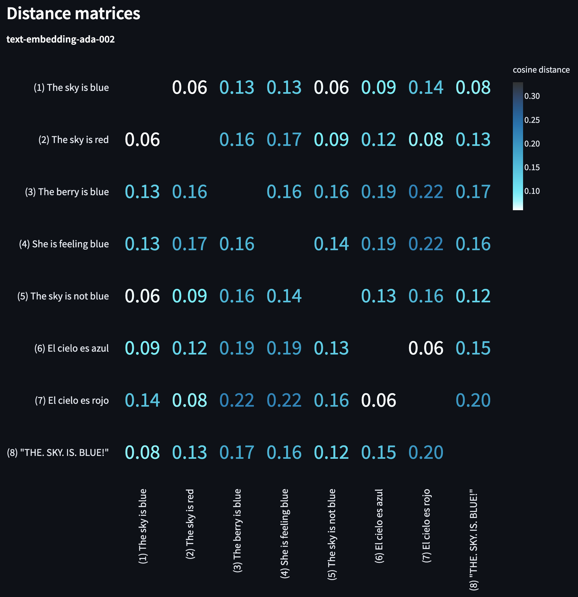

# Embeddings Playground

[`embeddings_playground.py`](embeddings_playground.py) is a single-page streamlit app for experimenting with OpenAI embeddings.

## Installation

Before running, install required dependencies with:

`pip install -r apps/embeddings-playground/requirements.txt`

(You may need to change the path to match your local path.)

Verify installation of streamlit with `streamlit hello`.

## Usage

Run the script with:

`streamlit run apps/embeddings-playground/embeddings_playground.py`

(Again, you may need to change the path to match your local path.)

In the app, first select your choice of:
- distance metric (we recommend cosine)
- embedding model (we recommend `text-embedding-ada-002` for most use cases, as of May 2023)

Then, enter a variable number of strings to compare. Click `rank` to see:
- the ranked list of strings, sorted by distance from the first string
- a heatmap showing the distance between each pair of strings

## Example

Here's an example distance matrix for 8 example strings related to `The sky is blue`:

From these distance pairs, you can see:
- embeddings measure topical similarity more than logical similarity (e.g., `The sky is blue` is very close to `The sky is not blue`)
- punctuation affects embeddings (e.g., `"THE. SKY. IS. BLUE!"` is only third closest to `The sky is blue`)
- within-language pairs are stronger than across-language pairs (e.g., `El cielo as azul` is closer to `El cielo es rojo` than to `The sky is blue`)

Experiment with your own strings to see what you can learn.