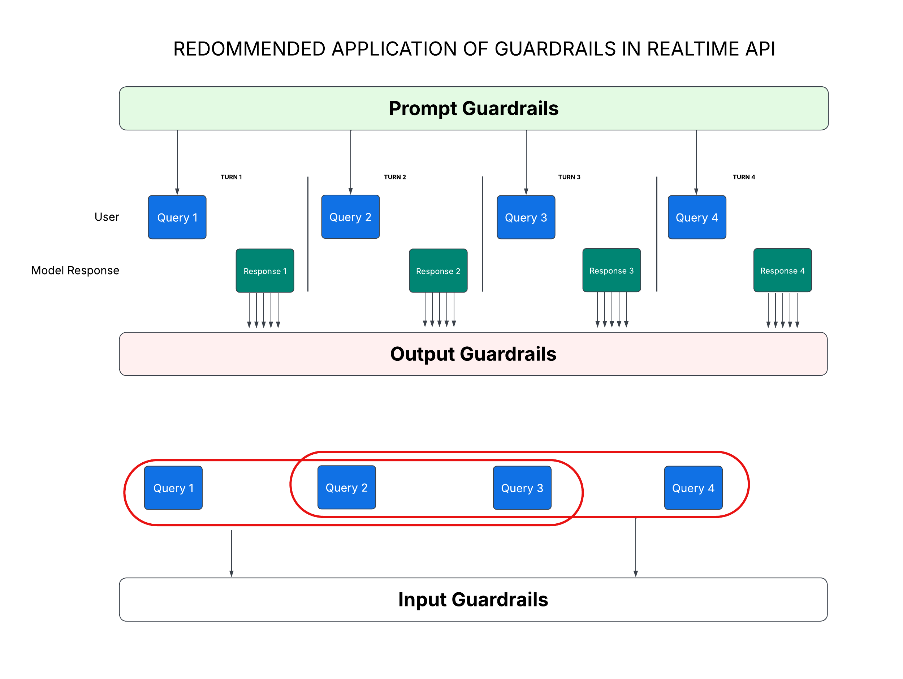
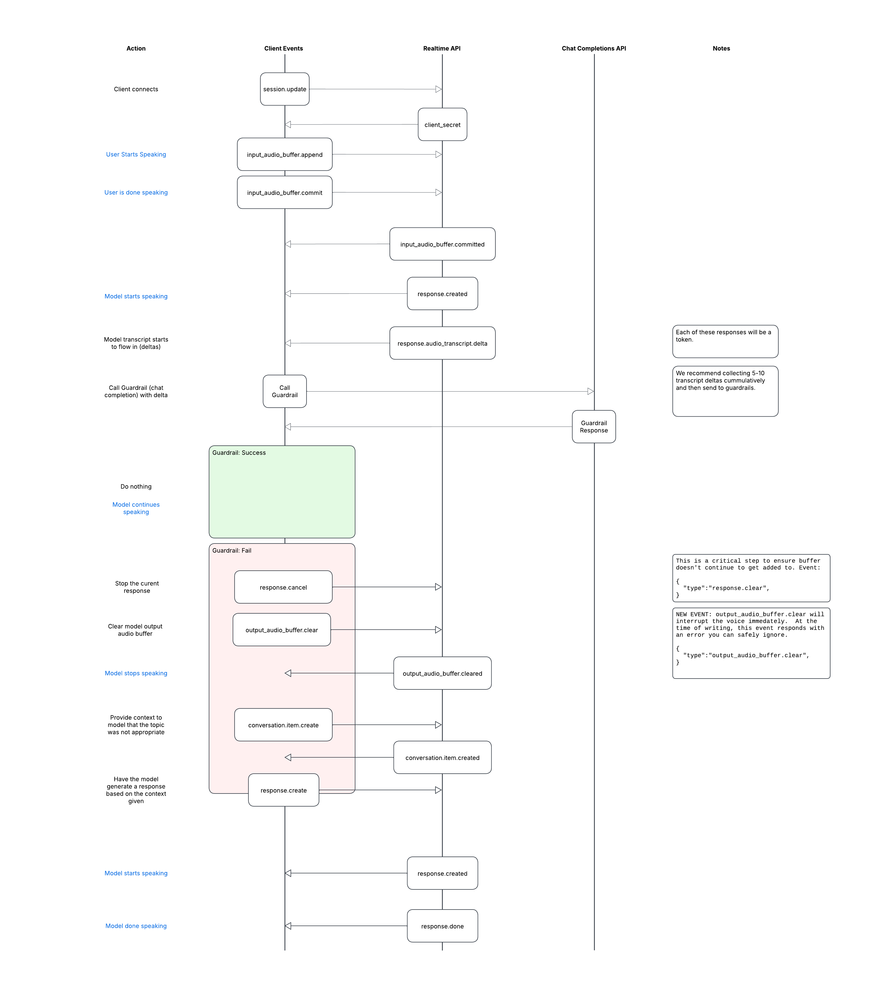
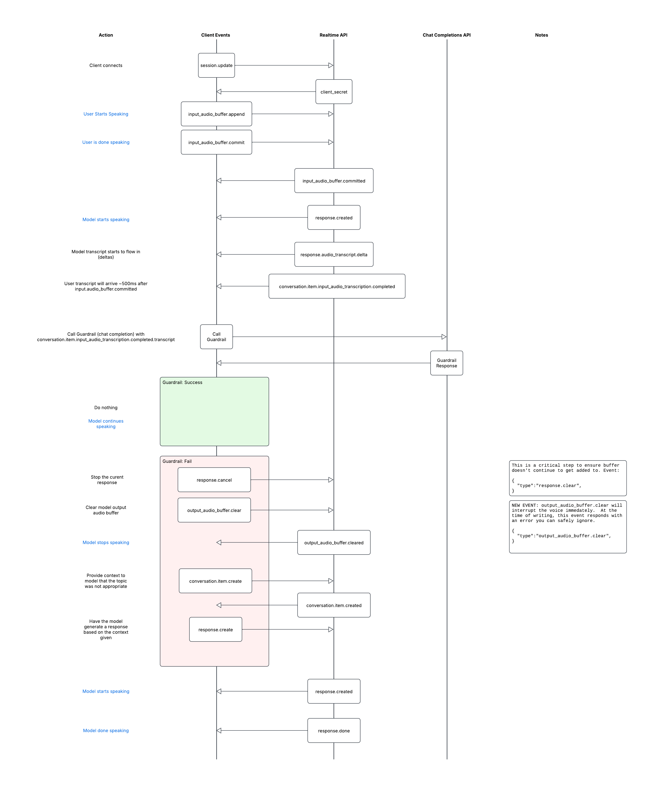

# Recommended architecture for guardrails in Realtime API

## Overview of Approach:

One of the core challenges in Speech-to-Speech (S2S) implementations is that audio is inferred and streamed in real-time. This real-time nature limits the applicability of traditional guardrail techniques, where input guardrails can typically be evaluated in parallel, and output guardrails can be applied before delivering a response. In S2S systems, the process begins with inference directly on the audio input, after which the model immediately begins streaming its response. This document considers an approach for integrating guardrails into real-time S2S applications.

We recommend thinking about guardrails in three categories: Prompt, Output, and Input. Each plays a distinct role in ensuring agent behavior remains aligned with policy and user expectations.

### Prompt Guardrails
**Definition:** Instructions (AKA system prompt, or developer prompt) to constrain and guide the agent’s behavior. These instructions should ideally be in the affirmative, explicitly stating what the agent should do for the user.

**Example:**
>You are a friendly weather assistant. You only provide the user with temperature and visibility for a specified zip code. This is your only function.

**Application:**
Prompt guardrails should be carefully engineered to define and restrict the agent’s scope. In most cases, these will serve as the primary enforcement mechanism for desired agent behavior.

**Frequency:**
These are applied on every turn, as part of the model’s system or developer prompt.

### Output Guardrails
**Definition:** Post-response checks that evaluate whether the model's output adheres to policy and avoids hallucination. These checks are implemented as separate model calls using the transcript of the agent’s spoken response.

**Application:**
Because the S2S model emits audio in real time, the transcript must be streamed and buffered in small batches. These transcripts (e.g., `response.audio_transcript.delta`) can be collected in groups of 5–10 segments and submitted for evaluation by another model (e.g., `gpt-4o` or `gpt-4o-mini`).

**Frequency:**
Guardrails should be applied continuously during the response, evaluating the output in near real-time as it is streamed back to the client.

### Input Guardrails (aka Jailbreak Guardrails)
**Definition:** Checks focused on user intent and behavior over multiple conversational turns. These guardrails aim to detect whether a user is attempting to exploit or jailbreak the agent.

**Application:**
These guardrails aggregate data across 3–4 turns (e.g., `conversation.item.input_audio_transcription.completed`) to assess whether the user's behavior indicates abuse. This can help distinguish between accidental provocations and malicious attempts. When abuse is detected, escalation or termination may be appropriate.

**Frequency:**
Evaluate every 3–4 turns to observe broader behavioral trends. Submit accumulated user input transcripts to a model (e.g., `gpt-4o` or `gpt-4o-mini`) for review.

## Implemenation details
For those engineering realtime guardrails, we have also provided ladder diagrams and events to look for.

### Output Guardrails:

### Input Guardrails:
