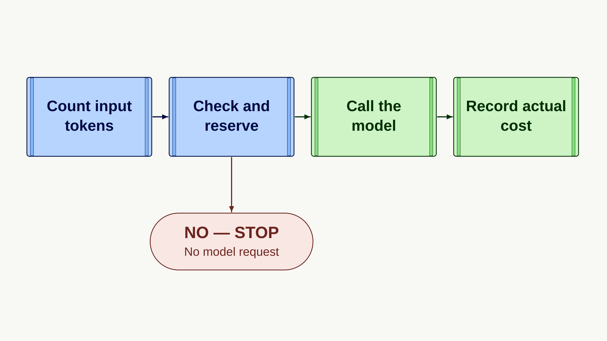
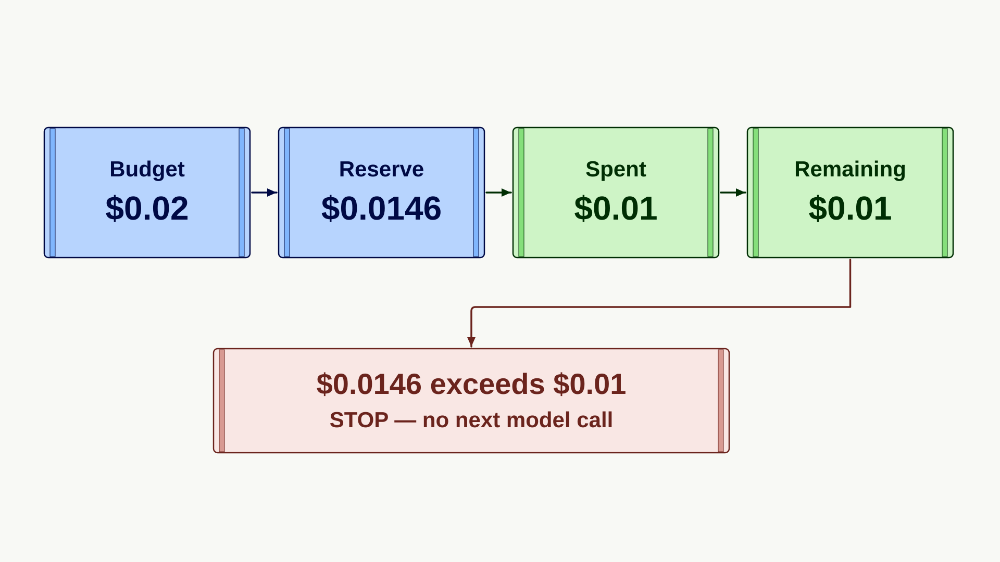

# Build a per-run spending controller with the Responses API

An agent using the Responses API may call a model several times to finish one task. Organization and project spending limits cover overall usage, but they cannot tell you whether that task can afford its next request.

Give each run its own budget. Before each model request, count the input tokens and set aside the most its response could cost. When the response arrives, record its cost and return any unused money to the budget. Stop before a request would exceed the remaining balance.

Suppose support ticket #4821 asks when order ORD-42 will arrive. The order has shipped and is due Friday. Give the ticket a $0.02 budget. The first reply costs $0.01. Another reply could cost up to $0.0146. With only $0.01 left, the application stops.

The controller handles synchronous, non-streaming Responses API requests on the default processing tier. Its budget covers model-token costs only; hosted tools and other charges are excluded. The prices, token counts, model names, and limits below are made up. They are not current OpenAI prices, real model limits, or a guarantee of your final bill.

## Estimate what a Responses API request could cost

The sample prices are in dollars per one million tokens:

| Token type | Example price (USD per 1 million tokens) |
| --- | ---: |
| Ordinary input | $4.00 |
| Cached input | $2.00 |
| Cache writes | $8.00 |
| Output | $20.00 |

Set the application limits to 10,000 input tokens and 250 output tokens per request. These numbers are sample settings, not the limits of a real model. A cache-write price applies only when the chosen model bills cache writes separately.

Ticket #4821 uses 1,200 input tokens. To avoid underestimating the response cost, assume every input token uses the highest input price. Here, separately billed cache writes are the most expensive:

```text
(1,200 x $8.00 + 250 x $20.00) / 1,000,000 = $0.0146
```

Use Python's built-in `Fraction` type to keep dollar amounts exact. Before making a real request, check the model, default processing tier, token limits, and prices. The `verified_at` date records when those prices were checked; it does not prove they are still current. See [current API pricing](https://developers.openai.com/api/docs/pricing) and [model documentation](https://developers.openai.com/api/docs/models).



## Keep each run within its budget

### Define the model and prices

You need Python 3.12 or later and `openai>=2.28.0`. Configure the model, default processing tier, token prices, and request limits together. Use a fixed model ID that the API returns unchanged in `response.model`. This example does not support model aliases. Set `cache_write_usd_per_million` to `None` only when the model does not bill cache writes separately. The sample prices work only with the offline client.

```python
from dataclasses import dataclass, field
from datetime import date
from fractions import Fraction
from threading import Lock
from types import SimpleNamespace
from typing import Any
from openai.types.responses import Response

@dataclass(frozen=True)
class RateCard:
    model: str
    service_tier: str
    input_usd_per_million: Fraction
    cached_usd_per_million: Fraction
    cache_write_usd_per_million: Fraction | None
    output_usd_per_million: Fraction
    max_input_tokens: int
    max_output_tokens: int
    example_only: bool = True
    verified: bool = False
    verified_at: date | None = None

    def __post_init__(self) -> None:
        if not all(type(value) is str and value.strip()
                   for value in (self.model, self.service_tier)):
            raise ValueError("Model and service tier must be nonempty strings")
        if self.service_tier != "default":
            raise ValueError("Only the default service tier is supported")
        for name in (
            "input_usd_per_million", "cached_usd_per_million",
            "output_usd_per_million",
        ):
            value = getattr(self, name)
            if type(value) is not Fraction or value <= 0:
                raise ValueError(f"{name} price must be a positive exact dollar amount")
        if self.cache_write_usd_per_million is not None and (
            type(self.cache_write_usd_per_million) is not Fraction
            or self.cache_write_usd_per_million <= 0
        ):
            raise ValueError("Cache-write price must be a positive exact dollar amount")
        if type(self.max_input_tokens) is not int or self.max_input_tokens <= 0:
            raise ValueError("Maximum input tokens must be a positive integer")
        if type(self.max_output_tokens) is not int or self.max_output_tokens < 16:
            raise ValueError("Maximum output tokens must be an integer of at least 16")
        if type(self.example_only) is not bool or type(self.verified) is not bool:
            raise ValueError("Pricing verification flags must be boolean")
        if self.example_only and self.verified:
            raise ValueError("Example pricing cannot be marked verified")
        if self.verified_at is not None and type(self.verified_at) is not date:
            raise ValueError("Pricing verification date must be a date")
        if self.verified and self.verified_at is None:
            raise ValueError("Record when you checked the model pricing")
        if self.example_only and self.verified_at is not None:
            raise ValueError("Example pricing cannot have a verification date")
        if not self.example_only and self.model == "example-model":
            raise ValueError("Replace the example model with your verified model")

EXAMPLE_RATE_CARD = RateCard(
    model="example-model",
    service_tier="default",
    input_usd_per_million=Fraction("4.00"),
    cached_usd_per_million=Fraction("2.00"),
    cache_write_usd_per_million=Fraction("8.00"),
    output_usd_per_million=Fraction("20.00"),
    max_input_tokens=10_000,
    max_output_tokens=250,
    example_only=True,
)
```

### Track the run's budget

`RunBudget` tracks money already spent and money temporarily set aside. Its lock prevents two requests in the same Python process from reserving the same funds. When cache writes have a separate price, the response must include a cache-write token count.

```python
class BudgetExceeded(RuntimeError):
    pass

class UncertainCharge(RuntimeError):
    pass

@dataclass
class RunBudget:
    maximum: Fraction
    spent: Fraction = field(default_factory=Fraction, init=False)
    pending: Fraction = field(default_factory=Fraction, init=False)
    blocked: bool = field(default=False, init=False)
    _holds: dict[object, Fraction] = field(default_factory=dict, init=False, repr=False)
    _lock: Lock = field(default_factory=Lock, init=False, repr=False)

    def __post_init__(self) -> None:
        if type(self.maximum) is not Fraction or self.maximum <= 0:
            raise ValueError("Budget must be a positive exact dollar amount")

    def ensure_active(self, minimum: Fraction) -> None:
        if type(minimum) is not Fraction or minimum < 0:
            raise ValueError("Minimum must be a nonnegative exact dollar amount")
        with self._lock:
            if self.blocked or self.spent + self.pending + minimum > self.maximum:
                raise BudgetExceeded("The remaining run budget is insufficient")

    def reserve(self, amount: Fraction) -> object:
        if type(amount) is not Fraction or amount <= 0:
            raise ValueError("Reservation must be a positive exact dollar amount")
        with self._lock:
            if self.blocked or self.spent + self.pending + amount > self.maximum:
                raise BudgetExceeded("The remaining run budget is insufficient")
            handle = object()
            self._holds[handle] = amount
            self.pending += amount
            return handle

    def settle(self, handle: object, actual: Fraction) -> None:
        if type(handle) is not object or type(actual) is not Fraction or actual < 0:
            raise ValueError("Invalid spend settlement")
        with self._lock:
            held = self._holds.get(handle)
            if held is None or held > self.pending:
                raise ValueError("Reservation is unknown or already settled")
            del self._holds[handle]
            self.pending -= held
            self.spent += actual
            if actual > held:
                self.blocked = True
                raise UncertainCharge("Actual spend exceeded the amount reserved")

    def block(self) -> None:
        with self._lock:
            self.blocked = True

def _tokens(value: Any, name: str) -> int:
    if type(value) is not int or value < 0:
        raise UncertainCharge(f"Invalid {name} token count")
    return value

def actual_cost(usage: Any, rates: RateCard) -> Fraction:
    if usage is None:
        raise UncertainCharge("Token usage is missing")
    details = getattr(usage, "input_tokens_details", None)
    if details is None:
        raise UncertainCharge("Input token details are missing")
    input_tokens = _tokens(getattr(usage, "input_tokens", None), "input")
    output_tokens = _tokens(getattr(usage, "output_tokens", None), "output")
    total_tokens = _tokens(getattr(usage, "total_tokens", None), "total")
    if total_tokens != input_tokens + output_tokens:
        raise UncertainCharge("Total tokens do not match input and output")
    cached = _tokens(getattr(details, "cached_tokens", None), "cached")
    if rates.cache_write_usd_per_million is not None:
        if not hasattr(details, "cache_write_tokens"):
            raise UncertainCharge("Cache-write token accounting is missing")
        written = _tokens(details.cache_write_tokens, "cache-write")
    else:
        observed = _tokens(getattr(details, "cache_write_tokens", 0), "cache-write")
        if observed:
            raise UncertainCharge("Cache writes require a verified cache-write price")
        written = 0
    ordinary = input_tokens - cached - written
    if (
        input_tokens > rates.max_input_tokens
        or output_tokens > rates.max_output_tokens or ordinary < 0
    ):
        raise UncertainCharge("Usage exceeds the configured request bounds")
    return (
        ordinary * rates.input_usd_per_million
        + cached * rates.cached_usd_per_million
        + written * (rates.cache_write_usd_per_million or Fraction())
        + output_tokens * rates.output_usd_per_million
    ) / 1_000_000
```

### Check the budget before each request

Use the same `model` and `input` when counting tokens and generating a response. Instructions, tool schemas, images, files, and conversation history also use input tokens. If you add any of them, pass the same supported fields to both requests. Send `max_output_tokens`, `service_tier`, and `store` only with the response request.

```python
def response_with_budget(
    client: Any, prompt: str, budget: RunBudget, rates: RateCard,
    *, allow_example: bool = False,
) -> Response | SimpleNamespace:
    if type(prompt) is not str or not prompt.strip():
        raise ValueError("Only nonempty text prompts are supported")
    if type(allow_example) is not bool:
        raise ValueError("Example authorization must be a boolean")
    if (rates.example_only or not rates.verified) and not (
        allow_example and type(client) is OfflineClient
    ):
        raise ValueError("API requests require explicitly verified pricing")
    if client.max_retries != 0:
        raise ValueError("Initialize the OpenAI client with max_retries=0")
    budget.ensure_active(
        rates.max_output_tokens * rates.output_usd_per_million / 1_000_000
    )
    request = {"model": rates.model, "input": prompt}
    count = _tokens(client.responses.input_tokens.count(**request).input_tokens, "input")
    if count > rates.max_input_tokens:
        raise BudgetExceeded("Request exceeds the configured input limit")
    worst_input_price = max(
        price for price in (
            rates.input_usd_per_million, rates.cached_usd_per_million,
            rates.cache_write_usd_per_million,
        )
        if price is not None
    )
    reservation = budget.reserve(
        (
            count * worst_input_price
            + rates.max_output_tokens * rates.output_usd_per_million
        ) / 1_000_000
    )
    try:
        response = client.responses.create(
            **request, max_output_tokens=rates.max_output_tokens,
            service_tier=rates.service_tier, store=False,
        )
        if response.model != rates.model:
            raise UncertainCharge("Response used an unexpected model")
        if response.service_tier != rates.service_tier:
            raise UncertainCharge("Unexpected service tier")
        cost = actual_cost(response.usage, rates)
    except BaseException:
        # An interruption after submission may still incur a charge.
        budget.block()
        raise
    if response.status != "completed":
        budget.block()
    budget.settle(reservation, cost)
    if response.status != "completed":
        raise UncertainCharge(f"Response ended with status: {response.status}")
    return response

def format_dollars(amount: Fraction) -> str:
    return "$" + f"{amount:.9f}".rstrip("0").rstrip(".")
```

`response_with_budget` returns the full response, including `response.output_text` and `response.output`. It checks that the API used the configured model and processing tier. If a request is interrupted or its cost cannot be confirmed, the run stops permanently and its reserved budget remains unavailable. If an incomplete response reports its usage, the controller records that cost and keeps the run blocked.

To use a real client, import `OpenAI` with `from openai import OpenAI`, check the current prices, and set `OPENAI_API_KEY`. Then create the client with `client = OpenAI(max_retries=0, timeout=60.0)`. A request may still run after its client times out, so keep its reservation in place.

## Example: set a budget for a support ticket

The first response to ticket #4821 reports 1,200 input tokens: 400 cached and 500 separately billed cache-write tokens. The remaining 300 are ordinary input tokens. It also reports 200 output tokens:

```text
(300 x $4.00 + 400 x $2.00 + 500 x $8.00 + 200 x $20.00)
/ 1,000,000 = $0.0100
```

The first response costs $0.01, leaving $0.01. The next response could cost $0.0146, so the controller stops before sending another model request.



Save the three code blocks above and the offline example below, in order, as `controller.py`. Install the SDK and run:

```bash
python -m pip install "openai>=2.28.0"
python controller.py
```

The ticket and order are fictional, and the offline client sends no network requests:

```python
class OfflineClient:
    __slots__ = ("model_calls",)
    max_retries = 0

    def __init__(self) -> None:
        self.model_calls = 0

    @property
    def responses(self) -> "OfflineClient":
        return self

    @property
    def input_tokens(self) -> "OfflineClient":
        return self

    def count(self, **_: Any) -> SimpleNamespace:
        return SimpleNamespace(input_tokens=1200)

    def create(self, **request: Any) -> SimpleNamespace:
        self.model_calls += 1
        return SimpleNamespace(
            model=request["model"], service_tier="default", status="completed",
            output_text="Order ORD-42 has shipped and should arrive Friday.",
            usage=SimpleNamespace(
                input_tokens=1200, output_tokens=200, total_tokens=1400,
                input_tokens_details=SimpleNamespace(
                    cached_tokens=400, cache_write_tokens=500
                ),
            ),
        )


if __name__ == "__main__":
    client = OfflineClient()
    budget = RunBudget(Fraction("0.02"))
    ticket = "Ticket #4821: order ORD-42 shipped and arrives Friday."
    print(response_with_budget(
        client, ticket + " Draft a support reply.", budget,
        EXAMPLE_RATE_CARD, allow_example=True,
    ).output_text)
    try:
        response_with_budget(
            client, ticket + " Write a second version.", budget,
            EXAMPLE_RATE_CARD, allow_example=True,
        )
    except BudgetExceeded:
        print("Ticket #4821 stopped: the next step would exceed its budget.")
    print("Spent: " + format_dollars(budget.spent))
    print("Reserved: " + format_dollars(budget.pending))
    print(f"Model calls: {client.model_calls}")
```

**Expected output:**

```text
Order ORD-42 has shipped and should arrive Friday.
Ticket #4821 stopped: the next step would exceed its budget.
Spent: $0.01
Reserved: $0
Model calls: 1
```

## Limits and other costs

Count ordinary input, cached input, separately billed cache writes, and output only once. When a model does not bill cache writes separately, charge non-cached input at the ordinary rate. Unexpected positive cache-write counts stop the run. Check the model's [prompt caching guidance](https://developers.openai.com/api/docs/guides/prompt-caching). Reasoning tokens are already included in the output total.

The lock protects one Python process. When several workers share a budget, use a shared store that checks and reserves the budget in one operation, so they cannot reserve the same money. If a request's final cost is unknown, abandon that run and keep its reservation. Review [Python SDK retry behavior](https://github.com/openai/openai-python#retries) before enabling retries.

Hosted tools can add separate charges. Web search, for example, can charge for each call and for related model tokens. The budget also excludes storage, non-default processing tiers, regional prices, long-context rates, streaming, background requests, server-managed agent runs, and account-specific charges. A background request may first return `queued` or `in_progress`, so it needs separate rules for tracking final usage. Setting `store=False` does not guarantee Zero Data Retention; see [data controls](https://developers.openai.com/api/docs/guides/your-data).

[Project spending limits](https://developers.openai.com/api/docs/guides/spend-limits) cover total project spending and may not take effect immediately. Alerts do not stop requests. The [Costs API reference](https://developers.openai.com/api/reference/resources/admin/subresources/organization/subresources/usage/methods/costs) shows daily totals; it cannot tell you whether one task can afford its next request.
