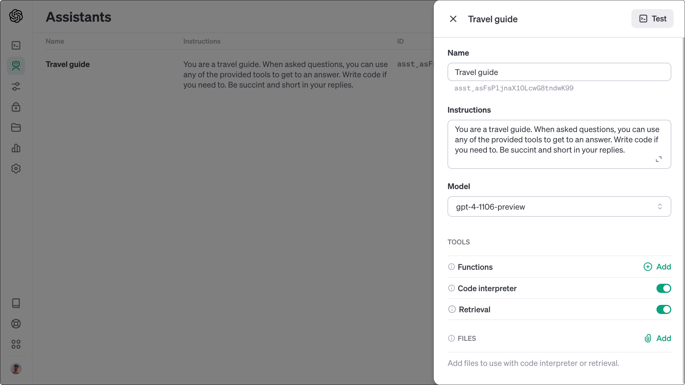
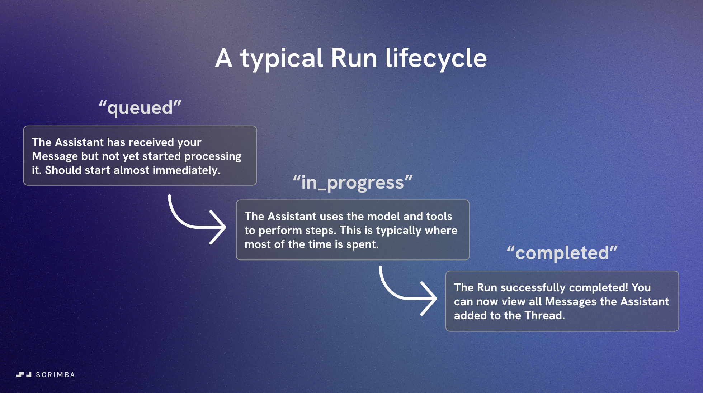
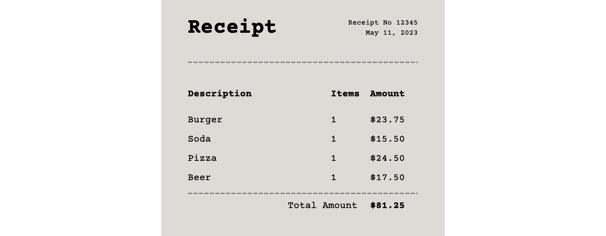
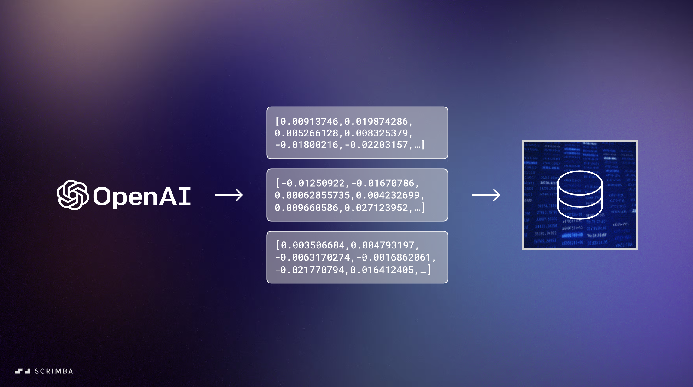

# Getting started with the Assistants API using Node.js

The Assistants API makes it easy for developers to create AI agents with features such as knowledge retrieval, memory, function calling, and code execution. It abstracts away complexities that you would normally have to write code for, such as creating text embeddings, interacting with vector databases, storing message history, and converting API responses into function calls.

In this article, you will learn how to use the Assistants API via OpenAI's Node.js SDK. You will build a travel agent that helps users with their vacations by reading their PDFs (e.g., tickets) and performing calculations (e.g., splitting a bill).

If you prefer watching screencasts instead of reading, you can [check out this scrim](https://scrimba.com/scrim/crk9aZCd), which walks through this article. Alternatively, you can enroll in [this free Assistants API crash course.](https://scrimba.com/learn/openaiassistants)

<ScrimPlayer scrimId="cJ9nQeHv" />

## Creating an Assistant

The first thing we need to do is to set up our Assistant. This is done by invoking the `openai.beta.assistants.create()` method and passing in an object where we specify its name, how it should behave, which tools it should have access to, and what model we'll use:

```js
const newAssistant = await openai.beta.assistants.create({
	instructions: "You are a travel guide. When asked questions, you can use any of the provided tools to get to an answer.",
	name: "Travel Guide",
	model: "gpt-4-1106-preview",
	tools: [{ type: "code_interpreter", type: "retrieval"],
});
```

We only need to run the above code once, as OpenAI will save our Assistant on their backend. Once created, it will be listed under the Assistants tab in [the OpenAI developer platform](https://platform.openai.com/assistants), where you can also edit it if you need to.



Let's copy the `id` of our Assistant and store it in a variable, and then use the `openai.beta.assistants.retrieve()` method to get hold of our Assistant in our app.

```js
const assistantId = "asst_asFsPljnaX10LcwG8tndwK99";
const assistant = openai.beta.assistants.retrieve(assistantId);
```

Please note that you can also get access to the id of our Assistant via `newAssistant.id`, as the API returns an object with data about your Assistant when you run `assistants.create()`. Or you could simply call `assistants.list()`, as that returns data about all of the Assistants you have created.

## Setting up a Thread

The next step is to set up a Thread, as conversations between users and the Assistant are always facilitated through Threads. They contain all the Messages from both parties, and there is no limit to how much history they can store.

The hierarchy of Assistants, Threads, and Messages is as follows:


As you can see, one Assistant can have multiple Threads, and each of these Threads represents a conversation.

Let’s create a Thread by invoking the `openai.beta.threads.create()` method.

```js
const thread = await openai.beta.threads.create();

console.log(thread);
```

If we log out out the `thread` variable, we’ll see the following in our console:

```js
{
	id: "thread_dofkr9g3vI4LsUwpueHt5EWA", 
	object: "thread", 
	created_at: 1700809443, 
	metadata: {}
}
```

In a real-world app, we would typically save the ID of this thread in our database and somehow relate it to the user who is interacting with the Assistant. 

## Creating a Message

Now that we have our Thread in place, we'll need to add a user message to it, which is done via the `openai.beta.threads.messages.create()` function. The first argument is the ID of our Thread, and the second is an object that describes the Message.

```js
await openai.beta.threads.messages.create(
	threadId,
	{ 
		role: "user", 
		content: "Our football team of 17 people have a shared hotel bill of $5632.34 in total. How much should each of us pay exactly?"
	}
);
```

The `role:"user"` means that this is a Message from a user, as opposed to `role:"assistant"`. 

In this particular question, the user asks for something that would require the Assistant to write and execute code to figure out the answer to.

## Executing a Run

We're finally ready to send the Thread to our Assistant so that it can act upon the Message from the user. This is done through a so-called Run, which we create by calling the `openai.beta.threads.runs.create()` method. We pass in both the `assistantId` and the `threadId` as arguments.

```js
let run = await openai.beta.threads.runs.create(
	threadId,
	{assistant_id: assistantId}
);

console.log(run);
```

Let’s log out the `run` variable to see what the API returns to us.

```js
{
	id: "run_gI73sTtRVxjSU0ywuyWrq5mB", 
	object: "thread.run", 
	created_at: 1700894356, 
	assistant_id: "asst_RQw6fHFvdlsolw8bxI5WgF6l", 
	thread_id: "thread_G1qaPqYitUse5tlIqSDEYeZS", 
	status: "queued", 
	started_at: null, 
	expires_at: 1700894956, 
	cancelled_at: null, 
	failed_at: null, 
	completed_at: null, 
	last_error: null, 
	model: "gpt-4-1106-preview", 
	instructions: "You are a travel guide. When asked questions, you can use any of the provided tools to get to an answer.",
	tools: [{type: "code_interpreter"}, {type: "retrieval"}] 
	file_ids: [], 
	metadata: {}
}
```

Notice that the API response doesn't include a response from the Assistant. If you're familiar with OpenAI's ChatCompletions API, you might have expected an answer to be provided here.

This is one of the few instances where the Assistant API is less straightforward than the ChatCompletions API. Instead of automatically receiving the Assistant's message in the API response, we need to monitor the Run process to determine when it's ready to be retrieved. This brings us to the Run lifecycle.

### The Run lifecycle

As you can see from log above, the `status` of the Run is currently set to `"queued"`. This means it hasn’t yet been processed by GPT. Unless any errors arise, the Run should should proceed from `queued` to `in_progress` before it is finally `completed`.



The `completed` state indicates that our Assistant has an answer ready for us. However, the API does not provide a notification when it reaches the `completed` state. Instead, we need to set up a while loop where we periodically check the API for updates. Here is an example:

```js
while (run.status !== 'completed') {
	await new Promise(resolve => setTimeout(resolve, 1500));
	console.log(run.status);
	run = await openai.beta.threads.runs.retrieve(threadId, run.id);
}
```

This might seem like a hack, and that's because it is! OpenAI plans to introduce support for streaming in the future. However, until then, this is the best option available. Check out [this scrim](https://scrimba.com/learn/openaiassistants/run-your-assistant-coe3849d1abb4a909a1d388d6) from the OpenAI Assistants course if you’d to learn more about Runs and the polling technique above.

Once the run has completed, the while loop will cancel, and we can use the `openai.beta.threads.messages.list()` method to retrieve all the Messages in our thread, including the response from our Assistant.

```js
const messages = await openai.beta.threads.messages.list(threadId);
console.log(messages.data[0]);
```

Here’s what we see in the console:

```js
{
	id: "msg_syZURNs3XGfwZlOoTrf1vxPh", 
	object: "thread.message", 
	created_at: 1700897031, 
	thread_id: "thread_Feuaxrse7fUcsWpm9Urdybbz", 
	role: "assistant", 
	content: [{
		type: "text", 
		text: {
			value: "Each person should pay exactly $331.31 for the shared hotel bill.", 
			annotations: []}}], 
			file_ids: [], 
			assistant_id: "asst_RQw6fHFvdlsolw8bxI5WgF6l", 
			run_id: "run_2xf8UsZK9nvDPwMgovClY1sG", 
			metadata: {}
	},{
	id: "msg_h2pHfWven2xkT34P1Me1sPqG", 
	object: "thread.message", 
	created_at: 1700897030, 
	thread_id: "thread_Feuaxrse7fUcsWpm9Urdybbz", 
	role: "user", 
	content: [{
		type: "text", 
		text: {
			value: "Our football team of 17 people have a shared hotel bill of $5632.34 in total. How much should each of us pay exactly?",
			annotations: []}}], 
		file_ids: [], 
		assistant_id: null, 
		run_id: null, 
		metadata: {}
}
```

As you can see, our Assistant has calculated that each person should pay $331.31 for the stay, which is correct. To get at this answer, it has used the code interpreter tool under the hood.

Let’s see how we also can include knowledge retrieval in our app.

## Adding knowledge retrieval

Our user has been at a restaurant with a friend and is left with a receipt as a PDF file. Once again, we want to determine how much each person should pay without manually performing the calculations.

However, this time, we won't include the prices in our prompt. Instead, we will simply attach our receipt and leave it to the API to extract the relevant information.



We start by loading the receipt into our app using Node’s File System module and its `fs.createReadStream()` method. 

```js
import * as fs from 'fs';

const receipt = fs.createReadStream("receipt.pdf");
```

Then we need to send the file to the API. This is done via the `openai.files.create()` method, passing in our `receipt` as the `file` and also specifying that the `purpose` is `"assistants"`. Both of these are required.

```js
const uploadedFile = await openai.files.create({
	file: receipt,
	purpose: "assistants",
});
```

OpenAI will automatically divide the document into chunks, index, and store the embeddings. 




Let's log out the `uploadedFile` variable to see what we got back:

```js
{
	object: "file", 
	id: "file-k0Irhj9A6BVEz9kQT6wV7jUz", 
	purpose: "assistants", 
	filename: "receipt.pdf", 
	bytes: 6176, 
	created_at: 
	1699718655, 
	status: "processed", 
	status_details: null
}
```

The only data we need from this object is the `id`, as this is how we reference our receipt next time we send a Message to the Assistant. It is added to the `file_ids` array alongside our question, which asks for the total price for the burger and the soda:

```js
await openai.beta.threads.messages.create(
	threadId,
	{
		role: "user", 
		content: "I had the burger and soda, how much should I pay for this meal?",
		file_ids: [file.id]    
	}
);
```

Next, we’ll execute a Run and perform the same polling technique I explained under the “Run lifecycle” section. Once that is done, we’ll fetch all Messages in our Thread using the `openai.beta.threads.messages.list()` method. 

Here's the message that our Assistant added to the thread:

```js
"The cost of the burger is $23.75 and the soda is $15.50. Therefore, the total amount you should pay for the meal consisting of a burger and soda is $23.75 + $15.50 = $39.25."
```

The message correctly states that the user should pay $39.25 for their meal.

This means that our Assistant has read the PDF and extracted the relevant data, all without us having to create text embeddings or set up a vector database, which is the typical approach developers take for knowledge retrieval.

It's worth mentioning that the API sometimes passes the entire file into the prompt if the document is short enough, bypassing the need to do a vector search. However, your documents might also contain too much data to be passed into a single prompt, as they can be up to 512 MB large. So at some point, OpenAI will start using vector search for the retrievals under the hood.

## Next steps

Now that you have built your very first Assistants app, I recommend that you continue building on the code. This is the best way to keep learning.

You can, for example, add function calling to the app so that the Assistant can perform tasks for the users, such as searching for information online or triggering actions.

If you're still a bit confused about how the Assistants API works, I would recommend enrolling in [this crash course by Scrimba.](https://scrimba.com/learn/openaiassistants)

Happy coding!


<details>
<summary>Complete code</summary>

```js
import OpenAI from "openai";
import * as fs from 'fs';

const openai = new OpenAI({
    apiKey: process.env.OPENAI_API_KEY,
});

// You only need to do this once
const assistant = await openai.beta.assistants.create({
    instructions:
        "You are a travel guide. When asked questions, you can use any of the provided tools to get to an answer. Write code if you need to. Be succint and short in your replies.",
    name: "Travel guide",
    tools: [{ "type": "code_interpreter", "type": "retrieval" }],
    model: "gpt-4-1106-preview",
});

const receipt = await fetch("receipt.pdf"); 
const file = await openai.files.create({
  file: receipt, 
  purpose: "assistants",
});

const assistantId = "asst_asFsPljnaX10LcwG8tndwK99";
const assistant = await openai.beta.assistants.retrieve(assistantId);

const thread = await openai.beta.threads.create();

await openai.beta.threads.messages.create(
    thread.id,
    { 
        role: "user", 
        content: "I had the burger and soda, how much should I pay for this meal?",
        file_ids: []
    }
);

let run = await openai.beta.threads.runs.create(
    thread.id,
    { assistant_id: assistantId }
);

while (run.status !== 'failed' && run.status !== 'completed') {
  await new Promise(resolve => setTimeout(resolve, 1500));
  console.log(run.status);
  run = await openai.beta.threads.runs.retrieve(thread.id, run.id);
}

const messages = await openai.beta.threads.messages.list(thread.id);

```

</details>
