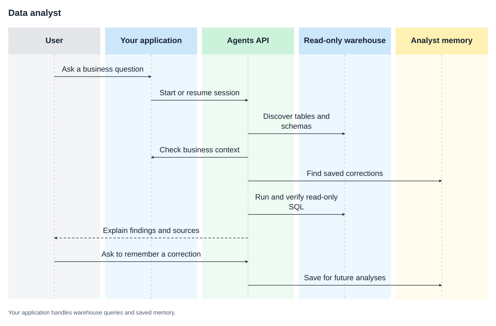

# Build a data analyst with the Agents API

Ask questions about your own business data. The agent finds relevant warehouse tables, checks metric definitions and past analyses, runs read-only SQL, and remembers useful corrections for future investigations.

## Why use the Agents API?

A useful investigation usually takes several queries and follow-up questions.
The Agents API keeps that work in one session and lets the model call your
application's tools. Your application owns database access and decides which
context and saved corrections the analyst can see.

This example draws on [OpenAI's in-house data agent](https://openai.com/index/inside-our-in-house-data-agent/):
ground the analysis in real schemas, supply business context, expose the SQL,
and reuse corrections the team has explicitly saved.



## What you need

- Python 3.14+ and `uv`.
- An OpenAI API key.
- Read-only access to a PostgreSQL-compatible warehouse.

No execution sandbox is required. The agent uses an Agents API session without an environment, and your application controls every warehouse query.

## Connect your warehouse

From the repository root:

```bash
cp examples/agents_api/apps/data_analyst/.env.example examples/agents_api/apps/data_analyst/.env
```

Add your OpenAI API key and read-only `WAREHOUSE_URL` to `examples/agents_api/apps/data_analyst/.env`. The application loads this file automatically.

Optionally, uncomment `DATA_AGENT_CONTEXT` in `.env` and adapt the example context file with your team's table descriptions, metric definitions, previous queries, and company documents. Saved analyst corrections are stored in `examples/agents_api/apps/data_analyst/memories.json`.

## Run the data agent

```bash
uv run examples/agents_api/apps/data_analyst/main.py
```

Open [http://127.0.0.1:8000](http://127.0.0.1:8000) and ask:

```text
Why did paid conversions drop last week?
```

Then continue the same investigation:

```text
Only include enterprise customers.
```

Or ask a single question from the terminal:

```bash
uv run examples/agents_api/apps/data_analyst/main.py --prompt \
  "Why did paid conversions drop last week?"
```

## How it works

The agent has four focused tools:

- `search_tables` finds relevant tables and reads their actual columns.
- `search_context` retrieves metric definitions, prior queries, documents, and saved corrections.
- `query_warehouse` executes one read-only query and returns at most 100 rows.
- `save_memory` stores an explicitly requested correction for later.

The `save_memory` tool is discovered on demand with `tool_search`. Programmatic tool calling lets the agent combine metadata, business context, saved corrections, and multiple verified queries before responding.

Use a read-only warehouse role. The application also starts PostgreSQL connections in read-only mode, applies a query timeout, and shows every executed query. The included browser interface represents one local analyst. In a multi-user application, derive analyst identity from your authentication layer, not a request body or query parameter.

## Follow the implementation

The following excerpts explain [agent.py](https://github.com/openai/openai-cookbook/blob/main/examples/agents_api/apps/data_analyst/agent.py) and [warehouse.py](https://github.com/openai/openai-cookbook/blob/main/examples/agents_api/apps/data_analyst/warehouse.py).
The application above includes the tool-dispatch loop, error handling, and cleanup.

### 1. Discover tables before writing SQL

Load the example's environment, then create the warehouse adapter. Discovery
returns actual table columns, along with any ownership and freshness notes you
have supplied in the context file.

```python
from dotenv import load_dotenv
from examples.agents_api.apps.data_analyst.warehouse import Warehouse

load_dotenv("examples/agents_api/apps/data_analyst/.env")
warehouse = Warehouse()
tables = warehouse.search_tables({"query": "paid conversion"})
for table in tables["tables"]:
    print(table["columns"])
```

### 2. Add definitions and trusted queries

Use `DATA_AGENT_CONTEXT` to point to a JSON file containing `tables`, `metrics`,
`documents`, and `query_history`. For example, a metric record can define both
the calculation and the filters your team expects:

```json
{
  "metrics": [{
    "name": "paid_conversion_rate",
    "definition": "Paid subscriptions divided by eligible signups.",
    "filters": [
      "Exclude employees and test accounts.",
      "Exclude the current incomplete day."
    ]
  }],
  "documents": [{
    "title": "Checkout tracking migration",
    "text": "Mobile checkout tracking changed on August 18."
  }]
}
```

Replace those illustrative definitions with your team's reviewed definitions.
`query_history` records pair a `description` with a reviewed `sql` query, so the
agent can reuse established joins. A prior all-time query still needs an
explicit date range before it can answer a weekly question.

### 3. Register four tools

[agent.py](https://github.com/openai/openai-cookbook/blob/main/examples/agents_api/apps/data_analyst/agent.py) defines a schema for each tool, then enables tool search and
programmatic tool calling. Memory writing is deferred until the agent needs it:

```python
from examples.agents_api.apps.data_analyst.agent import define_tool

tools = [
    define_tool("search_tables", "Find tables and inspect schemas.",
                {"query": {"type": "string"}}),
    define_tool("search_context", "Find definitions, previous queries, and memories.",
                {"query": {"type": "string"}}),
    define_tool("query_warehouse", "Run read-only SQL.",
                {"sql": {"type": "string"}}),
    define_tool("save_memory", "Save a correction only when explicitly requested.",
                {"note": {"type": "string"},
                 "scope": {"type": "string", "enum": ["personal", "team"]}},
                defer_loading=True),
    {"type": "tool_search"},
    {"type": "programmatic_tool_calling", "enabled": True},
]

handlers = {
    "search_tables": warehouse.search_tables,
    "search_context": warehouse.search_context,
    "query_warehouse": warehouse.query,
    "save_memory": warehouse.memory.save,
}
```

The model can combine discovery, context, and several queries before answering.
It never receives `WAREHOUSE_URL`. Query execution stays in your application,
under the read-only database role.

### 4. Start an investigation without a sandbox

A conversation-only session starts with input in the creation request:

```python
from openai import AsyncOpenAI

client = AsyncOpenAI()
instructions = """\
Find relevant tables and metric definitions.
Check previous analyses and saved corrections.
Run read-only queries and explain your findings, assumptions, and SQL.
Save memory only when the user explicitly asks.
"""

events = await client.beta.agents.sessions.create(
    agent={
        "model": "gpt-5.6-luna",
        "instructions": instructions,
        "reasoning": {"effort": "high"},
        "tools": tools,
    },
    environment={"type": "none"},
    input="Why did paid conversions drop last week?",
    stream=True,
)
```

Read `agent.session.created` to save `event.session.id`. When the creation
stream emits `agent.session.requires_action`, dispatch each pending function
call to its handler and return a result:

```python
import json

arguments = action.arguments
if isinstance(arguments, str):
    arguments = json.loads(arguments)
output = handlers[action.name](arguments)
await client.beta.agents.sessions.events.create(
    session_id,
    events=[{
        "type": "agent.session.input.tool_result",
        "turn_id": action.turn_id,
        "call_id": action.call_id,
        "success": True,
        "output": json.dumps(output),
    }],
)
```

Continue consuming the stream until the coordinator's turn completes. The
application deduplicates calls by turn and call ID, returns a generic error on
tool failure, and records every executed SQL query alongside the answer.

To use that complete loop without rebuilding it:

```python
from examples.agents_api.apps.data_analyst.agent import DataAnalyst

analyst = DataAnalyst(client, warehouse)
result = await analyst.answer("Why did paid conversions drop last week?")
print(result["answer"])
print(result["queries"])
```

Use either the low-level flow or `DataAnalyst`, not both for the same request.

### 5. Continue the same investigation

The application maps `conversation_id` to the saved API session. Pass it back
for the follow-up:

```python
follow_up = await analyst.answer(
    "Only include enterprise customers.",
    conversation_id=result["conversation_id"],
)
print(follow_up["answer"])
```

Internally, follow-ups use `client.beta.agents.sessions.stream(session_id,
input=question, tool_handlers=handlers)`. Unlike the creation stream, this SDK
helper dispatches the function handlers for you.

### 6. Save an explicit correction

Ask the agent to remember a rule, for example: "Remember that enterprise
conversion excludes manually provisioned accounts." The `save_memory` tool
writes the note with a personal or team scope:

```python
warehouse.memory.save({
    "note": "Enterprise conversion excludes manually provisioned accounts.",
    "scope": "team",
})
remembered = warehouse.search_context({"query": "enterprise conversion"})
print(remembered["memories"])
```

Session history retains the current conversation. Cross-session memory is
application-owned: [memory.py](https://github.com/openai/openai-cookbook/blob/main/examples/agents_api/apps/data_analyst/memory.py) saves corrections in `memories.json`.
Move that store to your application database when serving multiple users.

### 7. Inspect the evidence and clean up

A useful answer includes the result, the tables queried, the SQL, and any
assumptions. Treat the narrative as a conclusion to verify against those records,
not as a substitute for them. Results depend on your warehouse; this example
does not ship a fixed business dataset.

Delete the sessions and close the warehouse when the analyst is done:

```python
try:
    await analyst.close()
finally:
    await client.close()
```

The browser application performs this cleanup on shutdown. It keeps active
conversation mappings in memory, while saved corrections survive restarts.

## Files

- [main.py](https://github.com/openai/openai-cookbook/blob/main/examples/agents_api/apps/data_analyst/main.py): Web routes, UI, and the command-line entrypoint.
- [agent.py](https://github.com/openai/openai-cookbook/blob/main/examples/agents_api/apps/data_analyst/agent.py): Agent configuration, tools, and conversation flow.
- [warehouse.py](https://github.com/openai/openai-cookbook/blob/main/examples/agents_api/apps/data_analyst/warehouse.py): Read-only queries, schemas, and business context.
- [memory.py](https://github.com/openai/openai-cookbook/blob/main/examples/agents_api/apps/data_analyst/memory.py): Saved personal and team corrections.
