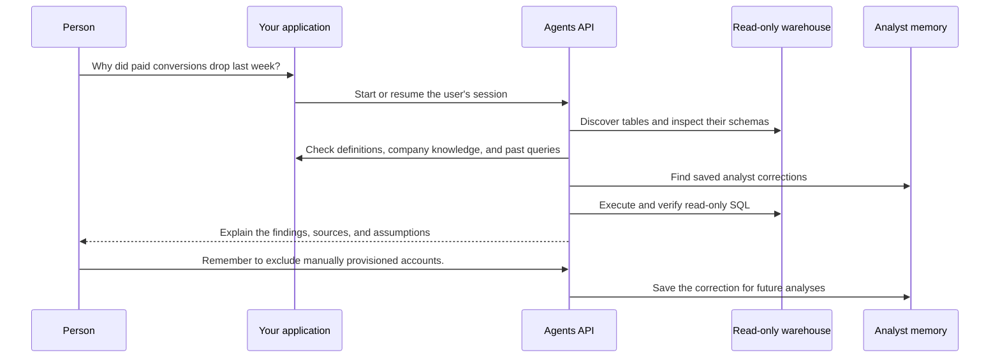

# Data agent

Ask questions about your own business data. The agent finds relevant warehouse tables, checks metric definitions and past analyses, runs read-only SQL, and remembers useful corrections for future investigations.



## What you need

- Python 3.14+ and `uv`.
- An OpenAI API key.
- Read-only access to a PostgreSQL-compatible warehouse.

No execution sandbox is required. The agent uses an Agents API session without an environment, and your application controls every warehouse query.

## Connect your warehouse

From the repository root:

```bash
cp examples/agents_api/apps/data_analyst/.env.example examples/agents_api/apps/data_analyst/.env
```

Add your OpenAI API key and read-only `WAREHOUSE_URL` to `examples/agents_api/apps/data_analyst/.env`. The application loads this file automatically.

Optionally, uncomment `DATA_AGENT_CONTEXT` in `.env` and adapt the example context file with your team's table descriptions, metric definitions, previous queries, and company documents. Saved analyst corrections are stored in `examples/agents_api/apps/data_analyst/memories.json`.

## Run the data agent

```bash
uv run examples/agents_api/apps/data_analyst/main.py
```

Open [http://127.0.0.1:8000](http://127.0.0.1:8000) and ask:

```text
Why did paid conversions drop last week?
```

Then continue the same investigation:

```text
Only include enterprise customers.
```

Or ask a single question from the terminal:

```bash
uv run examples/agents_api/apps/data_analyst/main.py --prompt \
  "Why did paid conversions drop last week?"
```

## How it works

The agent has four focused tools:

- `search_tables` finds relevant tables and reads their actual columns.
- `search_context` retrieves metric definitions, prior queries, documents, and saved corrections.
- `query_warehouse` executes one read-only query and returns at most 100 rows.
- `save_memory` stores an explicitly requested correction for later.

The `save_memory` tool is discovered on demand with `tool_search`. Programmatic tool calling lets the agent combine metadata, business context, saved corrections, and multiple verified queries before responding.

Use a read-only warehouse role. The application also starts PostgreSQL connections in read-only mode, applies a query timeout, and shows every executed query. The included browser interface represents one local analyst. In a multi-user application, derive analyst identity from your authentication layer, not a request body or query parameter.

## Files

- [main.py](main.py): Web routes, UI, and the command-line entrypoint.
- [agent.py](agent.py): Agent configuration, tools, and conversation flow.
- [warehouse.py](warehouse.py): Read-only queries, schemas, and business context.
- [memory.py](memory.py): Saved personal and team corrections.
