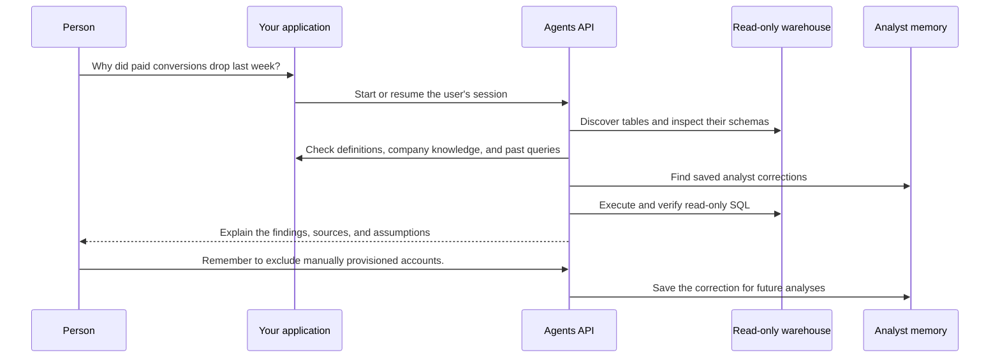
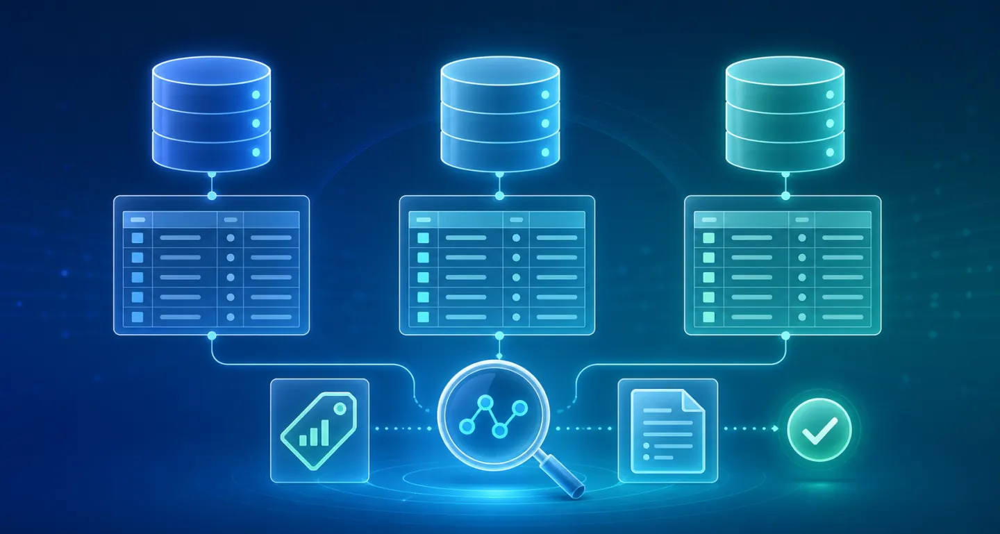
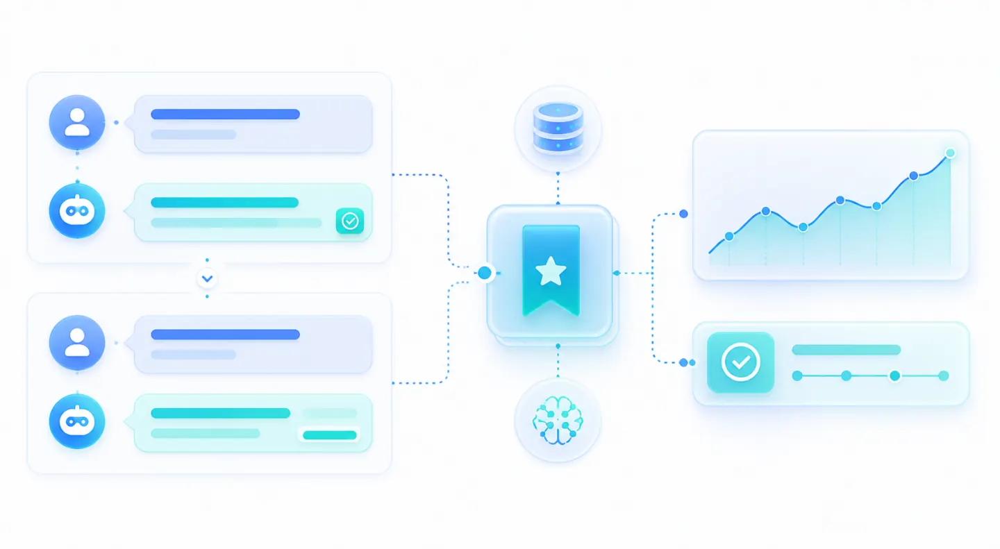

# Data agent

Ask questions about your own business data. The agent finds relevant warehouse tables, checks metric definitions and past analyses, runs read-only SQL, and remembers useful corrections for future investigations.



## Agents API capabilities

Function tools, Tool search, Programmatic tool calling, Persistent sessions, Streaming.

### Find the right data

The agent discovers available tables and inspects real schemas instead of assuming where business data lives.

### Use business context

Metric definitions, trusted previous queries, and company documents explain what the numbers actually mean.

### Verify every answer

Your application owns the warehouse connection, enforces read-only access, and exposes every executed query.

### Continue the investigation

A persistent session keeps the original question, findings, and follow-ups connected.

### Remember what the team learns

Explicit corrections can be saved as personal or shared team memory and reused in future analyses.

## Application flow

1. Business question.
2. Warehouse catalog.
3. Business context.
4. Agent session.
5. Read-only SQL.
6. Verified answer.
7. Saved memory.

## What you need

- Python 3.14+ and `uv`.
- An OpenAI API key.
- Read-only access to a PostgreSQL-compatible warehouse.

No execution sandbox is required. The agent uses an Agents API session without an environment, and your application controls every warehouse query.

## Connect your warehouse

From the repository root:

```bash
cp examples/agents_api/apps/data_analyst/.env.example examples/agents_api/apps/data_analyst/.env
```

Add your OpenAI API key and read-only `WAREHOUSE_URL` to `examples/agents_api/apps/data_analyst/.env`. The application loads this file automatically.

Optionally, uncomment `DATA_AGENT_CONTEXT` in `.env` and adapt the example context file with your team's table descriptions, metric definitions, previous queries, and company documents. Saved analyst corrections are stored in `examples/agents_api/apps/data_analyst/memories.json`.

## Run the data agent

```bash
uv run examples/agents_api/apps/data_analyst/main.py
```

Open [http://127.0.0.1:8000](http://127.0.0.1:8000) and ask:

```text
Why did paid conversions drop last week?
```

Then continue the same investigation:

```text
Only include enterprise customers.
```

Or ask a single question from the terminal:

```bash
uv run examples/agents_api/apps/data_analyst/main.py --prompt \
  "Why did paid conversions drop last week?"
```

## How it works

The agent has four focused tools:

- `search_tables` finds relevant tables and reads their actual columns.
- `search_context` retrieves metric definitions, prior queries, documents, and saved corrections.
- `query_warehouse` executes one read-only query and returns at most 100 rows.
- `save_memory` stores an explicitly requested correction for later.

The `save_memory` tool is discovered on demand with `tool_search`. Programmatic tool calling lets the agent combine metadata, business context, saved corrections, and multiple verified queries before responding.

Use a read-only warehouse role. The application also starts PostgreSQL connections in read-only mode, applies a query timeout, and shows every executed query. The included browser interface represents one local analyst. In a multi-user application, derive analyst identity from your authentication layer, not a request body or query parameter.

## Implementation walkthrough

This walkthrough covers warehouse discovery, read-only SQL, business context, persistent sessions, and explicit analyst memory.

Follow the setup instructions above, then use the source links below to explore each part of the application.

### 1. Connect your warehouse

Clone the repository, copy the example's environment template, and configure a read-only warehouse account in its .env file.

Customize the optional context file to match your warehouse. The application does not download or create a fixed dataset.

Read the implementation in [main.py](https://github.com/openai/openai-cookbook/blob/main/examples/agents_api/apps/data_analyst/main.py).

### 2. Discover the right tables

Give the agent one discovery tool that finds relevant tables and returns their actual columns, along with any ownership and freshness metadata supplied in your context file.



Read the implementation in [warehouse.py](https://github.com/openai/openai-cookbook/blob/main/examples/agents_api/apps/data_analyst/warehouse.py).

### 3. Add the context behind the numbers

A column name rarely tells the full story. Give the agent metric definitions, trusted filters, and company notes that explain how your team interprets the data.

Read the implementation in [warehouse.py](https://github.com/openai/openai-cookbook/blob/main/examples/agents_api/apps/data_analyst/warehouse.py).

### 4. Reuse trusted previous analyses

Previous reviewed queries help the agent find established joins and familiar calculation patterns instead of reinventing a business metric.

Match these example tables and columns to your warehouse. Add an explicit signup date range for weekly comparisons.

Read the implementation in [warehouse.py](https://github.com/openai/openai-cookbook/blob/main/examples/agents_api/apps/data_analyst/warehouse.py).

### 5. Keep warehouse access read-only

The agent never receives database credentials. Your application runs each approved query using a read-only warehouse account, blocks write statements, applies a timeout, and returns at most 100 rows.

Use a read-only warehouse role as the security boundary. The application also configures the PostgreSQL connection as read-only.


Read the implementation in [warehouse.py](https://github.com/openai/openai-cookbook/blob/main/examples/agents_api/apps/data_analyst/warehouse.py).

### 6. Register four focused tools

Keep the application-owned tool surface small. Discovery returns real schemas, context includes prior work and memories, and memory writing is loaded only when needed.

Read the implementation in [agent.py](https://github.com/openai/openai-cookbook/blob/main/examples/agents_api/apps/data_analyst/agent.py).

### 7. Start an investigation

Create an Agents API session without a sandbox. The model uses your application-owned tools to discover context, check the data, and return a verified answer.

Read the implementation in [agent.py](https://github.com/openai/openai-cookbook/blob/main/examples/agents_api/apps/data_analyst/agent.py).

### 8. Continue the same conversation

Retrieve the original session when the user asks a follow-up. The agent keeps the investigation context and can narrow the answer without starting over.

Read the implementation in [agent.py](https://github.com/openai/openai-cookbook/blob/main/examples/agents_api/apps/data_analyst/agent.py).

### 9. Remember useful analyst corrections

When someone explicitly asks the agent to remember a rule, save it as personal or shared team memory. Later investigations can retrieve that correction before querying the warehouse.



Read the implementation in [memory.py](https://github.com/openai/openai-cookbook/blob/main/examples/agents_api/apps/data_analyst/memory.py).

### 10. Run the data agent

Start the browser interface to investigate interactively, or run one question directly from the terminal.

Read the implementation in [main.py](https://github.com/openai/openai-cookbook/blob/main/examples/agents_api/apps/data_analyst/main.py).

### 11. Close completed investigations

Delete the session and close the warehouse connection when the investigation is complete or the application shuts down.

Read the implementation in [agent.py](https://github.com/openai/openai-cookbook/blob/main/examples/agents_api/apps/data_analyst/agent.py).

## Example result

An illustrative answer is shown below. Your results come from your warehouse, with assumptions and executed SQL available for review.

The following illustrates a possible result; model-generated findings depend on the inputs and connected sources.

```text
Paid conversion fell from 12.8% to 10.1% last week.

Primary driver:
Mobile checkout conversion declined after the August 18 release.

Sources:
analytics.signups
analytics.subscriptions
Checkout tracking migration notes

Assumptions:
Internal and test accounts excluded.
Incomplete current-day data excluded.

SQL:
SELECT signup_week, channel, COUNT(*) AS signups, ...
```

## Next steps

- Connect your approved warehouse, semantic layer, or analytics catalog.
- Add the metric definitions, trusted queries, and business documents your team already uses.
- Derive analyst identity from authentication, then apply warehouse and tenant permissions.
- Store shared analyst memories in your existing application database.

## Related documentation

- [Inside OpenAI's in-house data agent](https://openai.com/index/inside-our-in-house-data-agent/): How OpenAI combines warehouse metadata, business context, analyst memory, and transparent data investigations.


## Files

- [main.py](https://github.com/openai/openai-cookbook/blob/main/examples/agents_api/apps/data_analyst/main.py): Web routes, UI, and the command-line entrypoint.
- [agent.py](https://github.com/openai/openai-cookbook/blob/main/examples/agents_api/apps/data_analyst/agent.py): Agent configuration, tools, and conversation flow.
- [warehouse.py](https://github.com/openai/openai-cookbook/blob/main/examples/agents_api/apps/data_analyst/warehouse.py): Read-only queries, schemas, and business context.
- [memory.py](https://github.com/openai/openai-cookbook/blob/main/examples/agents_api/apps/data_analyst/memory.py): Saved personal and team corrections.
