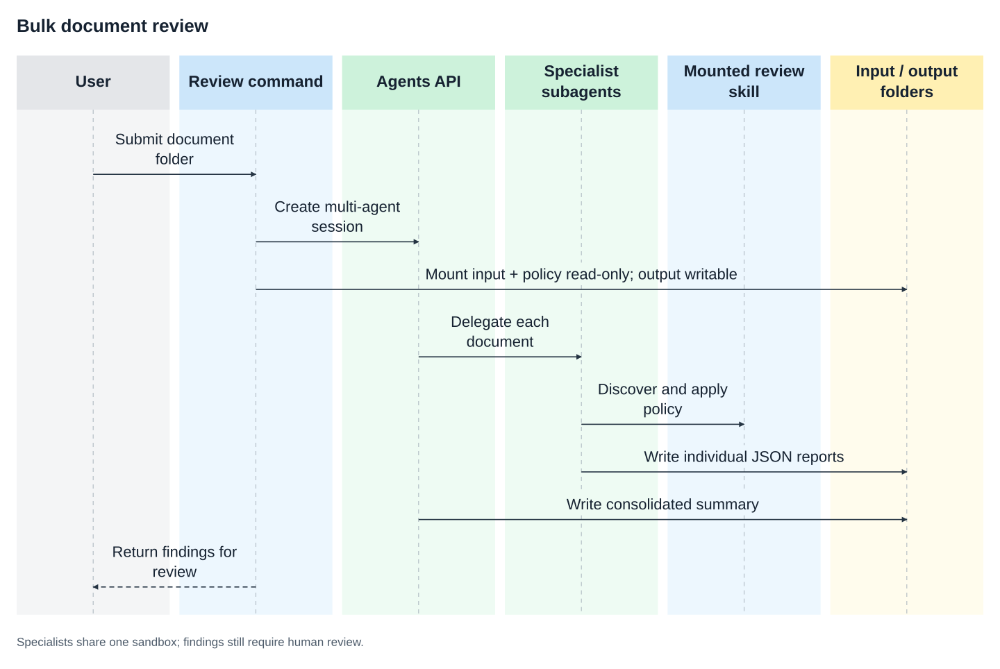

# Bulk invoice and contract review

Mount a folder of invoices and contracts alongside a reusable accounts-payable policy skill. A `gpt-5.6-luna` agent delegates each document to a specialist subagent, applies the discovered skill, writes individual reports plus a consolidated summary, and leaves every approval to a person.

## Why use the Agents API?

A batch review needs more than one answer in a chat. The Agents API coordinates
specialist agents against a shared workspace and retains their command activity.
Mounted files keep inputs separate from outputs, and a discovered skill gives
each reviewer the same policy. Your application validates the reports and
decides what happens next.



## What you need

- Python 3.14+ and `uv`.
- A sandbox: self-hosted Docker or a [third-party provider](https://developers.openai.com/api/docs/guides/agents-api/environments/self-hosted#sandbox-providers).
- An OpenAI API key and a separate restricted executor key.

## 1. Set up the workspace

From the repository root:

```bash
cp examples/agents_api/apps/document_review/.env.example examples/agents_api/apps/document_review/.env
docker build -t agent-api-sandbox:latest examples/agents_api/sandboxes/docker/application_managed
```

Set `OPENAI_API_KEY` and `OPENAI_EXECUTOR_API_KEY` in `examples/agents_api/apps/document_review/.env`. Use keys with the same owner, organization, and project. Only the executor key enters the sandbox. It needs `api.agents.environments.connect` and IP restrictions that allow the sandbox's outbound network. The application loads this file automatically.

To create an executor key with the required permission, open [Agents > Environments > Keys](https://platform.openai.com/agents?tab=environments&environment_view=keys) and select **Create**.

You can replace local Docker with any compatible [sandbox provider](https://developers.openai.com/api/docs/guides/agents-api/environments/self-hosted#sandbox-providers).

## 2. Review the document batch

```bash
uv run examples/agents_api/apps/document_review/main.py \
  --input examples/agents_api/apps/document_review/sample_documents \
  --output ./review-output
```

The input folder contains an invoice with a $900 overcharge and a contract with automatic renewal, unilateral price increases, unlimited liability, and unrestricted customer-data sharing. Specialist subagents apply the mounted policy to each document and write:

```text
review-output/
  contract.json
  invoice.json
  summary.json
  review-activity.json
```

The source folder and policy skill are mounted read-only; reports are written to `/workspace/output` and remain available on the host after the sandbox exits. With Docker Desktop, keep input and output directories under your home directory; system temporary directories may not be shared.

The command logs the session, sandbox, mounted directories, specialist subagents, and generated artifacts as the review progresses.

Invoice reports include extracted line items and a calculation. The application
checks the arithmetic before returning a report. A person must still verify that
the extracted amounts match the source document and review the recommendation.

Use an empty output folder for each run and unique document stems, such as `invoice-104.txt` and `contract-208.txt`. The names `summary` and `review-activity` are reserved.

## Follow the implementation

The excerpts below follow [agent.py](https://github.com/openai/openai-cookbook/blob/main/examples/agents_api/apps/document_review/agent.py) and [sandbox.py](https://github.com/openai/openai-cookbook/blob/main/examples/agents_api/apps/document_review/sandbox.py).
Run the command above for the complete validation, activity export, and cleanup.

### 1. Create a multi-agent review session

The coordinator delegates documents to specialists. All reviewers discover the
same mounted policy through `capability_directories`.

```python
from openai import AsyncOpenAI

client = AsyncOpenAI()
instructions = """\
Coordinate a batch review of invoices and contracts in /workspace/input.
Delegate documents to specialist subagents before reviewing them.
Each specialist must apply $expense-review-policy and write its JSON report
to /workspace/output/<document-stem>.json.
Wait for all reviewers, then write /workspace/output/summary.json.
Never approve a payment or sign a contract.
"""
session = await client.beta.agents.sessions.create(
    agent={
        "model": "gpt-5.6-luna",
        "instructions": instructions,
        "reasoning": {"effort": "high"},
        "multi_agent": {"enabled": True, "max_concurrent_subagents": 4},
    },
    environment={
        "type": "self_hosted",
        "workspace_directory": "/workspace",
        "capability_directories": ["/workspace/skills"],
    },
)
```

### 2. Mount inputs, policy, and outputs separately

`start_executor` mounts the input folder and `skills/` read-only. Only the output
folder is writable. The output directory stays on the host after cleanup.

```python
import asyncio
from pathlib import Path
from examples.agents_api.apps.document_review.sandbox import start_executor

input_directory = Path("examples/agents_api/apps/document_review/sample_documents")
output_directory = Path("review-output")
output_directory.mkdir(exist_ok=True)

environment = session.environment
assert environment.type == "self_hosted"
container = await asyncio.to_thread(
    start_executor,
    input_directory,
    output_directory,
    environment.id,
    environment.remote_url,
)
```

The helper runs `codex exec-server` with the returned connection values and
injects `OPENAI_EXECUTOR_API_KEY` as `CODEX_API_KEY`. Replacing the mounted policy
does not require rebuilding the image.

### 3. Delegate the batch and follow progress

Send the review task and watch for specialist creation and output events:

```python
prompt = """\
Review every document in /workspace/input using specialist subagents.
Each specialist must apply $expense-review-policy and include its policy_id
and decision in the report. Wait for every review, write the consolidated
summary, and explain the findings to the human approver.
"""
async with client.beta.agents.sessions.stream(session.id, input=prompt) as events:
    async for event in events:
        if event.type == "agent.session.subagent.created":
            print(f"Specialist started: {event.subagent.id}")
        elif event.type == "agent.session.turn.output_text.delta":
            print(event.delta, end="", flush=True)
        elif event.type in {
            "agent.session.failed", "agent.session.turn.failed", "error",
            "agent.session.turn.cancelled",
        }:
            raise RuntimeError(f"Review did not finish: {event.to_dict()}")
```

The app checks that specialists were created and that every source document has
a report. Enabling multi-agent execution is not, by itself, proof that work was
delegated.

### 4. Validate the reports before presenting them

Load the generated JSON and apply the application's validation:

```python
import json
from examples.agents_api.apps.document_review.agent import validate_review

reviews = []
for document in sorted(input_directory.iterdir()):
    if not document.is_file():
        continue
    report = json.loads((output_directory / f"{document.stem}.json").read_text())
    validate_review(report, document.name)
    reviews.append({"report": report, "status": "awaiting_approval"})

summary = json.loads((output_directory / "summary.json").read_text())
```

For invoices, validation recomputes the total from extracted line items and
shipping. It cannot establish that extraction matched the original document;
that still needs review. The included invoice should flag a $900 overcharge,
a missing purchase order, and changed bank details.

### 5. Keep the artifacts and release compute

Export retained command activity before deleting the session, as shown below.
Then attempt both cleanup operations:

```python
try:
    await client.beta.agents.sessions.delete(session.id)
finally:
    await asyncio.to_thread(container.remove, force=True)
```

Close the OpenAI client after cleanup. Reports remain in `review-output`; a
person reviews them before any payment or contract decision.

## Inspect retained command activity

Before deleting the session, the app exports retained commands from the coordinator
and each specialist to `review-activity.json`. A `null` subagent ID identifies the
coordinator. Specialist commands come from their own item histories:

```python
async for subagent in client.beta.agents.sessions.subagents.list(session.id):
    async for item in client.beta.agents.sessions.subagents.items.list(
        subagent.id, session_id=session.id
    ):
        if item.type == "command_execution":
            print(subagent.id, item.command)
```

These records come from retained API history, not model-written reviewer names.
They are not a complete security audit. Protect this file like the reports:
commands can contain document content.

## How the policy skill works

The included policy lives at:

```text
skills/expense-review-policy/SKILL.md
```

It is mounted at `/workspace/skills/expense-review-policy/SKILL.md` and discovered through the session's capability root:

```python
environment = {
    "type": "self_hosted",
    "workspace_directory": "/workspace",
    "capability_directories": ["/workspace/skills"],
}
```

Each specialist applies `$expense-review-policy` and includes its `policy_id` and `decision` in the generated report. Replace `SKILL.md` with your own review policy without rebuilding the sandbox image.

## Make it yours

Replace the included skill with your team's own accounts-payable or contract-review policy, and use your preferred sandbox provider when you deploy the application. Keep approval in your application: the agent can recommend a decision, but it should never make payments or accept contracts on its own.

## Files

- [main.py](https://github.com/openai/openai-cookbook/blob/main/examples/agents_api/apps/document_review/main.py): Command-line arguments and the batch summary.
- [agent.py](https://github.com/openai/openai-cookbook/blob/main/examples/agents_api/apps/document_review/agent.py): Specialist reviews, report validation, and activity export.
- [sandbox.py](https://github.com/openai/openai-cookbook/blob/main/examples/agents_api/apps/document_review/sandbox.py): Document, artifact, and skill mounts.
