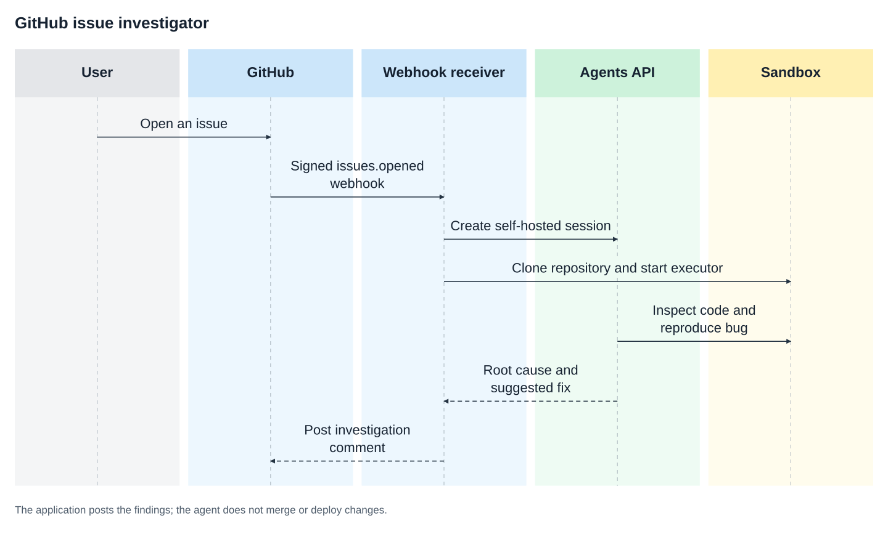

# Turn a new GitHub issue into an investigation

Someone opens an issue. Your agent checks out the repository, reproduces the problem in an isolated sandbox, and posts a useful investigation back to GitHub.

## Why use the Agents API?

The issue webhook starts the investigation without a developer opening a chat.
An Agents API session gives the agent access to the checked-out repository and
test commands. Your application verifies the trigger, posts the report, and
releases the workspace. Each issue gets its own sandbox.



## What you need

- Python 3.14+ and `uv`.
- A sandbox: self-hosted Docker or a [third-party provider](https://developers.openai.com/api/docs/guides/agents-api/environments/self-hosted#sandbox-providers).
- An OpenAI API key and a separate restricted executor key.
- A GitHub token and webhook secret when you connect a real repository.

## 1. Set up the investigator

From the repository root:

```bash
cp examples/agents_api/apps/github_issues/.env.example examples/agents_api/apps/github_issues/.env
docker build -t agent-api-sandbox:latest examples/agents_api/sandboxes/docker/application_managed
```

Set `OPENAI_API_KEY` and `OPENAI_EXECUTOR_API_KEY` in `examples/agents_api/apps/github_issues/.env`. Use keys with the same owner, organization, and project. Only the executor key enters the sandbox. It needs `api.agents.environments.connect` and IP restrictions that allow the sandbox's outbound network. You can also replace Docker with a compatible [sandbox provider](https://developers.openai.com/api/docs/guides/agents-api/environments/self-hosted#sandbox-providers).

To create an executor key with the required permission, open [Agents > Environments > Keys](https://platform.openai.com/agents?tab=environments&environment_view=keys) and select **Create**.

## 2. Investigate the included issue

```bash
uv run examples/agents_api/apps/github_issues/main.py --issue
```

The sample repository contains a real failing shipping test. The agent should identify why express orders accidentally qualify for free shipping and explain the smallest safe fix.

## 3. Connect a real repository

Set `GITHUB_WEBHOOK_SECRET` and `GITHUB_TOKEN` in `examples/agents_api/apps/github_issues/.env`, then start the receiver. The token needs repository read access and permission to post issue comments; it also authenticates private repository clones without appearing in the Git command:

```bash
uv run examples/agents_api/apps/github_issues/main.py
```

Expose the application through your normal hosting provider. In your GitHub repository's webhook settings:

1. Set the payload URL to `https://your-app.example/webhooks/github`.
2. Select `application/json` and enter the same webhook secret.
3. Subscribe to **Issues** events.
4. Open an issue and wait for the agent's investigation comment.

The receiver verifies GitHub signatures, ignores duplicate deliveries, and releases the sandbox after each investigation. The agent is instructed to inspect without editing; the application only posts an investigation comment and never opens a pull request.

For deployment, persist delivery IDs and use a durable job queue so failed investigations can be retried after a restart.

## Follow the implementation

These excerpts follow [main.py](https://github.com/openai/openai-cookbook/blob/main/examples/agents_api/apps/github_issues/main.py), [agent.py](https://github.com/openai/openai-cookbook/blob/main/examples/agents_api/apps/github_issues/agent.py), and
[github.py](https://github.com/openai/openai-cookbook/blob/main/examples/agents_api/apps/github_issues/github.py). Use the runnable application for complete webhook
verification, background processing, and cleanup.

### 1. Accept the webhook and check out the repository

Verify GitHub's signature and deduplicate `X-GitHub-Delivery` before scheduling
work. The receiver accepts `issues.opened` events and acknowledges them while
the investigation runs in the background.

The worker clones the repository into a temporary directory:

```python
import asyncio
import tempfile
from pathlib import Path
from examples.agents_api.apps.github_issues.github import clone_repository
from examples.agents_api.apps.github_issues.agent import investigate_issue

app_directory = Path("examples/agents_api/apps/github_issues").resolve()
with tempfile.TemporaryDirectory(dir=app_directory) as directory:
    workspace = Path(directory) / "repository"
    await asyncio.to_thread(
        clone_repository, event["repository"]["clone_url"], workspace,
    )
    result = await investigate_issue(event["issue"], workspace)
```

`clone_repository` uses `GITHUB_TOKEN` for private repositories through the
subprocess environment, not a token embedded in the command or URL. Validate
repository access before processing untrusted issue content.

### 2. Create a session and attach the checkout

Inside `investigate_issue`, create a session with instructions to investigate,
not change, the repository:

```python
from openai import AsyncOpenAI

client = AsyncOpenAI()
instructions = """\
Investigate the reported bug and inspect the repository.
Run relevant tests and identify the likely root cause.
Write /workspace/investigation.md without modifying source files.
"""
session = await client.beta.agents.sessions.create(
    agent={
        "model": "gpt-5.6-sol",
        "instructions": instructions,
        "reasoning": {"effort": "high"},
    },
    environment={"type": "self_hosted", "workspace_directory": "/workspace"},
)
```

The Docker executor mounts the checkout at `/workspace` with write access so
tests and the report can create files. Instructions not to edit source are not
a filesystem permission boundary; use a disposable clone.

```python
from examples.agents_api.apps.github_issues.agent import start_executor

environment = session.environment
assert environment.type == "self_hosted"
container = await asyncio.to_thread(
    start_executor, workspace, environment.id, environment.remote_url,
)
```

The executor receives the restricted `OPENAI_EXECUTOR_API_KEY`; GitHub posting
credentials stay in the application.

### 3. Stream the investigation and read the report

Pass the issue title and body as input, then read the report from the mounted
directory after the turn succeeds:

```python
issue = event["issue"]
prompt = f"""\
Investigate issue #{issue['number']}: {issue['title']}

{issue.get('body', '')}

Run the relevant tests and write /workspace/investigation.md.
"""
async with client.beta.agents.sessions.stream(session.id, input=prompt) as events:
    async for stream_event in events:
        if stream_event.type == "agent.session.turn.output_text.delta":
            print(stream_event.delta, end="", flush=True)
        elif stream_event.type in {
            "agent.session.failed", "agent.session.turn.failed", "error",
            "agent.session.turn.cancelled",
        }:
            raise RuntimeError(f"Investigation did not finish: {stream_event.to_dict()}")

report = (workspace / "investigation.md").read_text()
```

The included issue should lead to findings like these:

```text
Express shipping becomes free for orders over $100.
Reproduction: shipping_cost(125, express=True) returns 0; expected 15.
Cause: the free-shipping condition runs before the express-shipping check.
Suggested fix: check express shipping first, then apply the standard discount.
```

Check the actual test output in the report before accepting the diagnosis.

### 4. Return the findings to GitHub and clean up

The application posts the report to the issue's comments endpoint, not through
an agent tool:

```python
from examples.agents_api.apps.github_issues.github import post_findings

await post_findings(issue, result["findings"])
```

`post_findings` sends credentials only to `https://api.github.com/` URLs.
The investigation's `finally` block removes the container and deletes its
session even if reporting fails. The temporary-directory context removes the
checkout after the report has been read into memory.

To extend this into a fix agent, add a separate, explicit approval step before
applying changes or opening a pull request. This example only posts findings.

## Files

- [main.py](https://github.com/openai/openai-cookbook/blob/main/examples/agents_api/apps/github_issues/main.py): Webhook handling and the included-issue entrypoint.
- [agent.py](https://github.com/openai/openai-cookbook/blob/main/examples/agents_api/apps/github_issues/agent.py): Sandbox investigation and report collection.
- [github.py](https://github.com/openai/openai-cookbook/blob/main/examples/agents_api/apps/github_issues/github.py): Signature verification, repository cloning, and comments.
