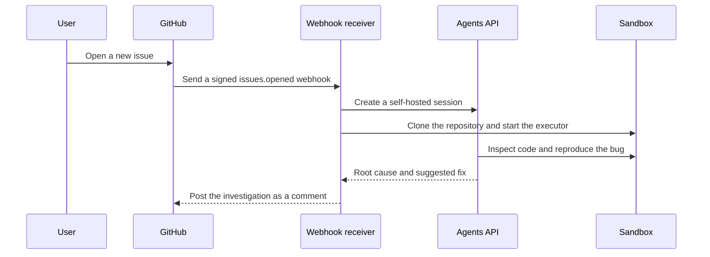

# Turn a new GitHub issue into an investigation

Someone opens an issue. Your agent checks out the repository, reproduces the problem in an isolated sandbox, and posts a useful investigation back to GitHub.



## What you need

- Python 3.14+ and `uv`.
- A sandbox: self-hosted Docker or a [third-party provider](https://developers.openai.com/api/docs/guides/agents-api/environments/self-hosted#sandbox-providers).
- An OpenAI API key and a separate restricted executor key.
- A GitHub token and webhook secret when you connect a real repository.

## 1. Set up the investigator

From the repository root:

```bash
cp examples/agents_api/apps/github_issues/.env.example examples/agents_api/apps/github_issues/.env
docker build -t agent-api-sandbox:latest examples/agents_api/sandboxes/application_managed/docker
```

Set `OPENAI_API_KEY` and `OPENAI_EXECUTOR_API_KEY` in `examples/agents_api/apps/github_issues/.env`. Use keys with the same owner, organization, and project. Only the executor key enters the sandbox. It needs `api.agents.environments.connect` and IP restrictions that allow the sandbox's outbound network. You can also replace Docker with a compatible [sandbox provider](https://developers.openai.com/api/docs/guides/agents-api/environments/self-hosted#sandbox-providers).

To create an executor key with the required permission, open [Agents > Environments > Keys](https://platform.openai.com/agents?tab=environments&environment_view=keys) and select **Create**.

## 2. Investigate the included issue

```bash
uv run examples/agents_api/apps/github_issues/main.py --issue
```

The sample repository contains a real failing shipping test. The agent should identify why express orders accidentally qualify for free shipping and explain the smallest safe fix.

## 3. Connect a real repository

Set `GITHUB_WEBHOOK_SECRET` and `GITHUB_TOKEN` in `examples/agents_api/apps/github_issues/.env`, then start the receiver. The token needs repository read access and permission to post issue comments; it also authenticates private repository clones without appearing in the Git command:

```bash
uv run examples/agents_api/apps/github_issues/main.py
```

Expose the application through your normal hosting provider. In your GitHub repository's webhook settings:

1. Set the payload URL to `https://your-app.example/webhooks/github`.
2. Select `application/json` and enter the same webhook secret.
3. Subscribe to **Issues** events.
4. Open an issue and wait for the agent's investigation comment.

The receiver verifies GitHub signatures, ignores duplicate deliveries, and releases the sandbox after each investigation. The agent is instructed to inspect without editing; the application only posts an investigation comment and never opens a pull request.

For deployment, persist delivery IDs and use a durable job queue so failed investigations can be retried after a restart.

## Files

- [main.py](main.py): Webhook handling and the included-issue entrypoint.
- [agent.py](agent.py): Sandbox investigation and report collection.
- [github.py](github.py): Signature verification, repository cloning, and comments.
