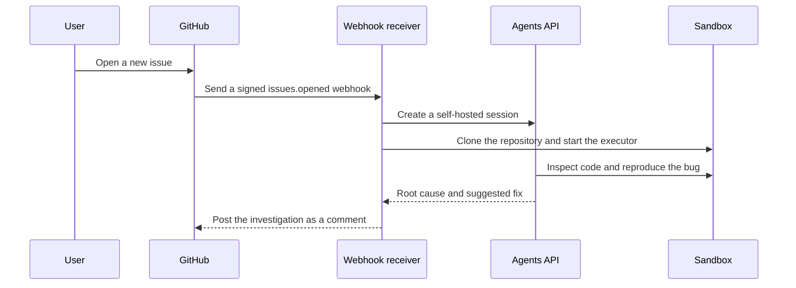

# Turn a new GitHub issue into an investigation

Someone opens an issue. Your agent checks out the repository, reproduces the problem in an isolated sandbox, and posts a useful investigation back to GitHub.



## Agents API capabilities

Sandbox, Workspace files, Streaming.

### Start from a real product event

A signed GitHub webhook triggers the investigation automatically, without asking a developer to open a separate chat or manually restate the issue.

### Give the agent a real repository

A self-hosted environment lets the agent inspect checked-out files, run the project's tests, and write a concrete investigation.

### Keep each investigation isolated

Every issue receives a fresh workspace and sandbox, which are removed when the investigation finishes.

### Return the answer to GitHub

Your application posts the agent's report back to the issue, where the people who reported the bug can act on it.

## Application flow

1. GitHub issue.
2. Signed webhook.
3. Agent session.
4. Isolated checkout.
5. Issue comment.

## What you need

- Python 3.14+ and `uv`.
- A sandbox: self-hosted Docker or a [third-party provider](https://developers.openai.com/api/docs/guides/agents-api/environments/self-hosted#sandbox-providers).
- An OpenAI API key and a separate restricted executor key.
- A GitHub token and webhook secret when you connect a real repository.

## 1. Set up the investigator

From the repository root:

```bash
cp examples/agents_api/apps/github_issues/.env.example examples/agents_api/apps/github_issues/.env
docker build -t agent-api-sandbox:latest examples/agents_api/sandboxes/application_managed/docker
```

Set `OPENAI_API_KEY` and `OPENAI_EXECUTOR_API_KEY` in `examples/agents_api/apps/github_issues/.env`. Use keys with the same owner, organization, and project. Only the executor key enters the sandbox. It needs `api.agents.environments.connect` and IP restrictions that allow the sandbox's outbound network. You can also replace Docker with a compatible [sandbox provider](https://developers.openai.com/api/docs/guides/agents-api/environments/self-hosted#sandbox-providers).

To create an executor key with the required permission, open [Agents > Environments > Keys](https://platform.openai.com/agents?tab=environments&environment_view=keys) and select **Create**.

## 2. Investigate the included issue

```bash
uv run examples/agents_api/apps/github_issues/main.py --issue
```

The sample repository contains a real failing shipping test. The agent should identify why express orders accidentally qualify for free shipping and explain the smallest safe fix.

## 3. Connect a real repository

Set `GITHUB_WEBHOOK_SECRET` and `GITHUB_TOKEN` in `examples/agents_api/apps/github_issues/.env`, then start the receiver. The token needs repository read access and permission to post issue comments; it also authenticates private repository clones without appearing in the Git command:

```bash
uv run examples/agents_api/apps/github_issues/main.py
```

Expose the application through your normal hosting provider. In your GitHub repository's webhook settings:

1. Set the payload URL to `https://your-app.example/webhooks/github`.
2. Select `application/json` and enter the same webhook secret.
3. Subscribe to **Issues** events.
4. Open an issue and wait for the agent's investigation comment.

The receiver verifies GitHub signatures, ignores duplicate deliveries, and releases the sandbox after each investigation. The agent is instructed to inspect without editing; the application only posts an investigation comment and never opens a pull request.

For deployment, persist delivery IDs and use a durable job queue so failed investigations can be retried after a restart.

## Implementation walkthrough

This walkthrough covers GitHub webhooks, authenticated repository checkouts, isolated coding sandboxes, test execution, and issue comments.

Follow the setup instructions above, then use the source links below to explore each part of the application.

### 1. Set up the investigator and build its sandbox

Clone the repository, copy the example's environment template, and build the Docker image containing Git, Python, and the Codex executor.

### 2. Receive a GitHub issue webhook

When an issue arrives, verify its signature, skip duplicate deliveries, and start the longer investigation in the background. The runnable example implements these checks.

Always implement signature verification and delivery deduplication in production. The included application already includes both.

Read the implementation in [main.py](https://github.com/openai/openai-cookbook/blob/main/examples/agents_api/apps/github_issues/main.py).

### 3. Check out the repository in a fresh workspace

Read the repository clone URL from the verified webhook and create a shallow checkout in a separate temporary directory for each investigation.

The runnable example authenticates private clones using Git configuration passed through the subprocess environment, not a token embedded in the URL or command.

Read the implementation in [github.py](https://github.com/openai/openai-cookbook/blob/main/examples/agents_api/apps/github_issues/github.py).

### 4. Create an agent session for the issue

Tell the agent to reproduce the problem and explain the smallest likely fix. Ask it to write an investigation file rather than modifying source code or opening a pull request.

Read the implementation in [agent.py](https://github.com/openai/openai-cookbook/blob/main/examples/agents_api/apps/github_issues/agent.py).

### 5. Attach the coding sandbox

Mount the checked-out repository into Docker and run the Codex executor with the session's environment ID. The executor connects outbound to the Agents API.

Read the implementation in [agent.py](https://github.com/openai/openai-cookbook/blob/main/examples/agents_api/apps/github_issues/agent.py).

### 6. Stream the investigation and read its report

Send the issue title and body as input. The agent can inspect source files, run tests, and write a concise Markdown report in the shared workspace.

Read the implementation in [agent.py](https://github.com/openai/openai-cookbook/blob/main/examples/agents_api/apps/github_issues/agent.py).

### 7. Post the findings back to the GitHub issue

Publish the generated report through the GitHub Issues API. The report appears in the original conversation, so the reporter and maintainers can immediately see the diagnosis.

Only send credentials to trusted github.com API URLs and grant the GitHub token the minimum issue-comment permissions it needs.

Read the implementation in [github.py](https://github.com/openai/openai-cookbook/blob/main/examples/agents_api/apps/github_issues/github.py).

### 8. Release the sandbox and session

Always remove the Docker container and delete the agent session after the investigation. The temporary workspace is deleted when its surrounding context exits.

Read the implementation in [agent.py](https://github.com/openai/openai-cookbook/blob/main/examples/agents_api/apps/github_issues/agent.py).

### 9. Try the sample issue or connect GitHub

The included sample reproduces a real failing shipping test without requiring GitHub credentials. Add a webhook secret and an issue-comment token when you are ready to connect a repository.

When connecting a real repository, configure its webhook to send Issues events to https://your-app.example/webhooks/github.

## Example result

A real issue produces a test-backed investigation in the same place your team already tracks the bug.

The following illustrates a possible result; model-generated findings depend on the inputs and connected sources.

```text
Issue #42: Express shipping becomes free for orders over $100

Reproduction:
shipping_cost(125, express=True) returned 0; expected 15.

Root cause:
The free-shipping condition runs before the express-shipping check.

Suggested fix:
Check express shipping first, then apply the standard-order discount.
```

## Next steps

- Replace local Docker with an isolated hosted sandbox provider when deploying the webhook receiver.
- Persist delivery IDs and session references so retries remain safe across application restarts.
- Add an explicit human approval step before applying code changes or opening a pull request.

## Related documentation

- [Sandbox providers](https://developers.openai.com/api/docs/guides/agents-api/environments/self-hosted#sandbox-providers): Choose a local or hosted sandbox for isolated repository investigations.


## Files

- [main.py](https://github.com/openai/openai-cookbook/blob/main/examples/agents_api/apps/github_issues/main.py): Webhook handling and the included-issue entrypoint.
- [agent.py](https://github.com/openai/openai-cookbook/blob/main/examples/agents_api/apps/github_issues/agent.py): Sandbox investigation and report collection.
- [github.py](https://github.com/openai/openai-cookbook/blob/main/examples/agents_api/apps/github_issues/github.py): Signature verification, repository cloning, and comments.
