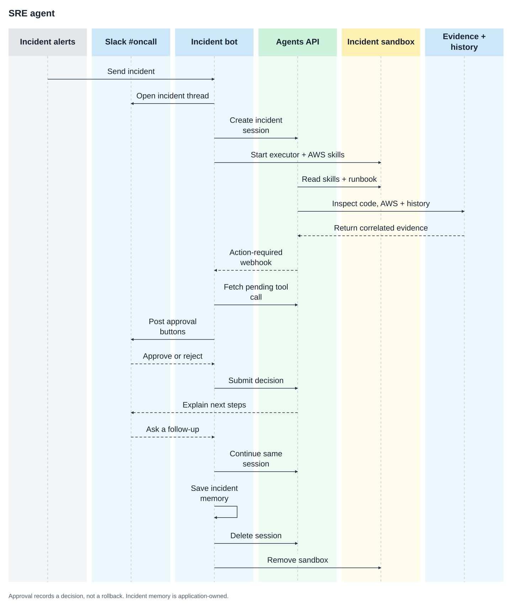

# Build an SRE agent for incident response

An incident alert opens a Slack thread in `#oncall`. The agent investigates production telemetry, GitHub pull requests and commits, AWS infrastructure, and similar past incidents. It posts its findings and asks a responder to approve any rollback.

## Why use the Agents API?

An incident webhook starts the work; responders continue it in Slack. The Agents
API keeps the investigation in a persistent session, connects operational tools,
and pauses for application-owned decisions. Your application manages alert
deduplication, responder permissions, historical incident records, and cleanup.

This example records rollback approval but never executes a deployment.



## What you need

- Python 3.14+ and `uv`.
- A sandbox: self-hosted Docker or a [third-party provider](https://developers.openai.com/api/docs/guides/agents-api/environments/self-hosted#sandbox-providers).
- An OpenAI API key and a separate restricted executor key.
- A Slack app installed in `#oncall`, with a bot token, signing secret, and message event subscriptions.
- PagerDuty, incident.io, or an Alertmanager-compatible monitoring system.
- Read access to the affected GitHub repository.
- AWS DevOps Agent credentials or another read-only AWS operational integration.

The first run uses bundled metrics, logs, deployments, GitHub changes, AWS telemetry, and incident history for `checkout-api`. Tool results label this sample data; it is not a live production diagnosis. Slack delivery is real. Replace the evidence tools when connecting your own incidents.

## Configure the Slack bot

Clone the Cookbook, or run the remaining commands from your existing checkout:

```bash
git clone https://github.com/openai/openai-cookbook.git
cd openai-cookbook
cp examples/agents_api/apps/sev_bot/.env.example examples/agents_api/apps/sev_bot/.env
docker build -t agent-api-sev-sandbox:latest examples/agents_api/apps/sev_bot
```

Create the Slack app from [`slack-app-manifest.yaml`](https://github.com/openai/openai-cookbook/blob/main/examples/agents_api/apps/sev_bot/slack-app-manifest.yaml). Replace `https://your-app.example` with your application's HTTPS address, install the app, and invite it to `#oncall`.

Add `OPENAI_API_KEY`, `OPENAI_EXECUTOR_API_KEY`, `SLACK_BOT_TOKEN`, and `SLACK_SIGNING_SECRET` to `examples/agents_api/apps/sev_bot/.env`. Use OpenAI keys with the same owner, organization, and project.

The manifest subscribes to `message.channels` and `message.groups` at `/slack/events`, and sends approval actions to `/slack/actions`. Slack must be able to reach both URLs over HTTPS. Posting the initial investigation only needs the bot token; follow-ups and approval buttons also require these callbacks.

Each incident gets a self-hosted sandbox running `codex exec-server`. The app passes only `OPENAI_EXECUTOR_API_KEY` as `CODEX_API_KEY`; the application, Slack, GitHub, and AWS credentials stay outside the sandbox. The executor key needs `api.agents.environments.connect` and IP restrictions that allow the sandbox's outbound network. Follow-ups reuse the sandbox, and resolution or application shutdown deletes it.

To create an executor key with the required permission, open [Agents > Environments > Keys](https://platform.openai.com/agents?tab=environments&environment_view=keys) and select **Create**.

The app mounts [`runbooks/`](https://github.com/openai/openai-cookbook/tree/main/examples/agents_api/apps/sev_bot/runbooks) read-only at `/workspace/runbooks`. The agent reads `checkout-api.md` for mitigation steps and recovery checks. Add a runbook named after each service when connecting your own incidents.

## Connect Agents API approval webhooks

In [Project settings > Webhooks](https://platform.openai.com/settings/project/webhooks), register `https://your-app.example/webhooks/openai`, subscribe to `agent.session.action_required`, and add its signing secret as `OPENAI_WEBHOOK_SECRET` in `.env`.

With these credentials configured, start the receiver:

```bash
uv run examples/agents_api/apps/sev_bot/main.py
```

The app verifies OpenAI's signature, retrieves the session's `required_actions`, and posts Slack buttons for `propose_rollback`. It saves the pending `turn_id` and `call_id` and ignores repeated deliveries for the same proposal. Read-only tools still run through the streaming handler; `propose_rollback` deliberately has no automatic handler.

The Slack callback returns the decision to the waiting call:

```python
import json

await client.beta.agents.sessions.events.create(
    session.id,
    events=[
        {
            "type": "agent.session.input.tool_result",
            "turn_id": action["turn_id"],
            "call_id": action["call_id"],
            "success": True,
            "output": json.dumps({"decision": "approved", "executed": False}),
        }
    ],
)
```

The agent continues after approval or rejection. Approval is not execution: the example never contacts a deployment system. Keep the app running to receive callbacks and stream the final update. OpenAI and Slack callbacks both require a reachable HTTPS address. Persist pending actions and use a durable worker when deploying beyond this single-process example.

## Send a sample incident

From another terminal, send the included alert to the receiver:

```bash
curl -X POST http://127.0.0.1:8003/webhooks/alerts \
  -H 'Content-Type: application/json' \
  --data-binary @examples/agents_api/apps/sev_bot/sample_alert.json
```

The agent posts its sample investigation to `#oncall`, tracing the outage to the fixture's pull request #418 and Redis pool exhaustion. Approve or reject the proposed rollback using the buttons in the Slack thread. Approval records a decision; it does not execute a deployment.

To inspect a real repository, configure GitHub MCP below.

## Follow the implementation

These excerpts show the incident flow in [main.py](https://github.com/openai/openai-cookbook/blob/main/examples/agents_api/apps/sev_bot/main.py), [alerts.py](https://github.com/openai/openai-cookbook/blob/main/examples/agents_api/apps/sev_bot/alerts.py),
and [agent.py](https://github.com/openai/openai-cookbook/blob/main/examples/agents_api/apps/sev_bot/agent.py). Run the receiver above for the complete signature checks,
deduplication, approval handling, and cleanup.

### 1. Turn an alert into one investigation

The receiver normalizes provider payloads and queues investigations in the
background. An active alert fingerprint maps to one incident, Slack thread, and
agent session.

```python
from fastapi import BackgroundTasks, Request
from examples.agents_api.apps.sev_bot.alerts import queue_alerts

@app.post("/webhooks/alerts")
async def receive_alert(request: Request, tasks: BackgroundTasks):
    # Authenticate the sender before accepting the payload.
    payload = await request.json()
    return queue_alerts(app.state.bot, payload, tasks)
```

`queue_alerts` also handles resolution events. The runnable receiver checks
`ALERT_WEBHOOK_TOKEN`; native PagerDuty or incident.io signatures must be verified
at your ingress before forwarding.

### 2. Create the incident session

The agent gets read-only evidence tools and a separate function for proposing
a rollback. GitHub and AWS MCP tools are added only when configured in `.env`.

```python
from openai import AsyncOpenAI
from examples.agents_api.apps.sev_bot.tools import configured_tools

client = AsyncOpenAI()
instructions = """\
Investigate the incident using service evidence, GitHub, AWS, and past incidents.
Consult /workspace/runbooks/<service>.md and explain impact, likely cause, and next steps.
Use read-only tools and distinguish sample data from live findings.
If a rollout caused the incident, propose a rollback to the previous healthy version.
Approval records a decision; it does not execute a rollback.
"""

session = await client.beta.agents.sessions.create(
    agent={
        "model": "gpt-5.6-sol",
        "instructions": instructions,
        "reasoning": {"effort": "high"},
        "multi_agent": {"enabled": True, "max_concurrent_subagents": 3},
        "tools": configured_tools(),
    },
    environment={"type": "self_hosted", "workspace_directory": "/workspace"},
)
incident.session_id = session.id
```

The app opens a message in `#oncall` and stores its timestamp on the incident.
All findings and follow-ups use that thread.

### 3. Attach the incident sandbox

The sandbox image contains the Codex CLI and AWS skills. `start_executor` mounts
the runbooks read-only and passes only `OPENAI_EXECUTOR_API_KEY` as
`CODEX_API_KEY`. Use the connection values returned by the session:

```python
import asyncio
from examples.agents_api.apps.sev_bot.agent import start_executor

environment = session.environment
assert environment.type == "self_hosted"
container = await asyncio.to_thread(
    start_executor, environment.id, environment.remote_url,
)
incident.sandbox = container
```

Skills supply investigation instructions; they do not grant AWS access. Live
GitHub and AWS credentials remain with the service-connected MCP tools.

### 4. Stream evidence and wait for approval

Only read-only tools have automatic handlers. Keep `propose_rollback` out of
the handler map so the function call remains pending until a responder decides.

```python
handlers = {
    "get_service_evidence": bot.get_service_evidence,
    "recall_incidents": bot.recall_incidents,
}
prompt = """\
Investigate the checkout-api error spike.
Correlate service metrics, deployments, code changes, and past incidents.
Explain customer impact and cite the evidence for your proposed next steps.
"""

async with client.beta.agents.sessions.stream(
    session.id, input=prompt, tool_handlers=handlers,
) as events:
    async for event in events:
        if event.type == "agent.session.turn.output_text.delta":
            print(event.delta, end="", flush=True)
        elif event.type in {"agent.session.failed", "agent.session.turn.failed", "error"}:
            raise RuntimeError(f"Investigation failed: {event.to_dict()}")
```

The application collects the answer and posts it to the incident's Slack thread.
If the agent proposes a rollback, the `agent.session.action_required` webhook
tells the receiver to retrieve the pending function call and show approval
buttons. The [approval callback](#connect-agents-api-approval-webhooks) returns
the decision using the pending turn and call IDs. Keep the stream and receiver
running while waiting for that decision.

### 5. Continue the incident, then save the resolution

A Slack follow-up retrieves `incident.session_id` and starts another turn with
the same tools and workspace. For example:

```text
Did this Redis connection-pool failure happen before?
What should we check after the rollback?
```

When a resolved alert arrives, the app saves the report through
[memory.py](https://github.com/openai/openai-cookbook/blob/main/examples/agents_api/apps/sev_bot/memory.py), posts a final update, and closes the runtime. The next
incident can find that report through `recall_incidents`.

Cleanup must attempt both resources even if one operation fails:

```python
try:
    await client.beta.agents.sessions.delete(session.id)
finally:
    await asyncio.to_thread(container.remove, force=True)
```

The app also attempts cleanup after investigation failures and on shutdown.
Close the OpenAI client after all incident runtimes have been released.

### Expected result

The bundled alert supplies evidence for a report like this; wording will vary:

```text
SEV-1: Checkout API error rate reached 18.7%
Evidence: bundled sample telemetry, not a live production diagnosis.

GitHub: PR #418 reduced the Redis connection pool from 64 to 8.
AWS: ElastiCache shows 143 waiting requests.
History: INC-0931 recorded a similar pool exhaustion incident.
Proposal: Roll back to 2026.08.26.3, pending responder approval.
```

Check that the findings cite the sample evidence and that approval records a
decision without contacting a deployment system.

## Connect incident alerts

Send incident webhooks through your authenticated ingress to:

```text
https://your-app.example/webhooks/alerts
```

For Alertmanager:

```yaml
receivers:
  - name: incident-bot
    webhook_configs:
      - url: https://your-app.example/webhooks/alerts
        http_config:
          authorization:
            credentials: your-shared-token
```

Set `ALERT_WEBHOOK_TOKEN` to the same value. Alertmanager sends it as a bearer token. Alert fingerprints deduplicate active incidents; a later alert can start a new investigation after the earlier incident is resolved.

For PagerDuty, subscribe to `incident.triggered` and `incident.resolved`, and match the PagerDuty service name to an entry in `operations.json`. For incident.io, subscribe to `public_incident.incident_created_v2` and `public_incident.incident_status_updated_v2`; set `INCIDENT_SERVICE` to the affected service for that subscription. Adapt this mapping for multi-service incidents.

The example parses these provider payloads but does not verify their native signatures. Your ingress must verify PagerDuty or incident.io signatures before forwarding them with `ALERT_WEBHOOK_TOKEN`. Slack signatures are verified by the application.

## Use AWS skills

The [Dockerfile](https://github.com/openai/openai-cookbook/blob/main/examples/agents_api/apps/sev_bot/Dockerfile) installs the Codex CLI and all [AWS Agent Toolkit skills](https://github.com/aws/agent-toolkit-for-aws/tree/main/skills) during the image build. From `/workspace`, it runs:

```bash
npx --yes skills add aws/agent-toolkit-for-aws/skills \
  --agent codex --copy --yes
```

The skills are copied to `/workspace/.agents/skills` for automatic discovery. The agent selects relevant skills and loads their instructions as needed. Ask in the incident's Slack thread: "List the installed AWS skills and explain which ones help investigate Redis connection exhaustion."

Skills provide instructions, not AWS access. No cloud credentials are needed to read them. The sample evidence tools stay in the application; use read-only integrations for live AWS evidence. Rebuild the image to refresh its skills, and review third-party instructions before granting production access.

## Connect GitHub

Set `GITHUB_TOKEN` and `GITHUB_REPOSITORY` in `.env`. Use a fine-grained token limited to the affected repository, with read access to **Contents** and **Pull requests**.

The app connects to [GitHub MCP](https://github.com/github/github-mcp-server) through its read-only endpoint, `https://api.githubcopilot.com/mcp/readonly`. Its allowlist contains five tools: `list_commits`, `get_commit`, `list_pull_requests`, `pull_request_read`, and `get_file_contents`. Agents API calls these directly; no application handler or GitHub CLI installation is needed.

GitHub credentials stay outside the sandbox. If the configured MCP server cannot connect, the session fails rather than silently skipping repository inspection. Without `GITHUB_TOKEN`, `get_service_evidence` returns the bundled sample PRs and commits instead.

## Connect AWS

The [AWS Agent Toolkit](https://github.com/aws/agent-toolkit-for-aws) includes observability skills and an AWS DevOps Agent MCP server for infrastructure investigations. Uncomment `DEVOPS_AGENT_REGION` and `DEVOPS_AGENT_TOKEN` in `examples/agents_api/apps/sev_bot/.env`:

```text
DEVOPS_AGENT_REGION=us-east-1
DEVOPS_AGENT_TOKEN=...
```

The application registers the service-connected MCP server automatically:

```python
{
    "type": "mcp",
    "server_label": "aws_devops",
    "connection_origin": "service",
    "transport": {
        "type": "http",
        "server_url": "https://connect.aidevops.us-east-1.api.aws/mcp",
        "authorization": f"Bearer {token}",
    },
}
```

Without AWS MCP configured, `get_service_evidence` includes bundled CloudWatch, ECS, and ElastiCache telemetry. With `DEVOPS_AGENT_TOKEN` set, it omits that sample AWS data so the agent uses the MCP server for AWS evidence. The service metrics, logs, and deployments remain sample data until you connect your monitoring system.

## Incident memory

Memory works at two levels:

- **Within an incident:** The alert fingerprint and Slack thread map to one Agents API session and sandbox. Follow-up questions retain previous evidence, tool results, investigation context, and workspace files.
- **Across incidents:** `recall_incidents` searches prior reports for related symptoms, root causes, and resolutions. A resolved alert saves findings to `examples/agents_api/apps/sev_bot/incident_memory.json` before the session closes. The app reloads this file on startup, or starts with `incident_history.json` when no saved file exists.

The generated memory file is ignored by Git and replaced atomically on each save. Deleting it resets history to the bundled samples. Run one app process against this file; it is not a shared database.

Only resolved-incident history survives restarts. Active Slack threads, session IDs, pending approvals, and sandbox handles still live in memory. Approving a rollback records the decision; this example never deploys or changes production infrastructure.

## Investigation tools

- `get_service_evidence` returns metrics, recent error logs, and deployments together.
- `recall_incidents` retrieves relevant incident history and prior mitigations.
- `propose_rollback` requests human approval without changing production.

Only the first two have automatic handlers. The webhook and Slack callback complete `propose_rollback` after a responder decides. GitHub and AWS use MCP integrations; runbooks are files in the sandbox.

## Files

- [main.py](https://github.com/openai/openai-cookbook/blob/main/examples/agents_api/apps/sev_bot/main.py): Webhook routes and application startup.
- [agent.py](https://github.com/openai/openai-cookbook/blob/main/examples/agents_api/apps/sev_bot/agent.py): Incident investigation, approval, resolution, and cleanup.
- [alerts.py](https://github.com/openai/openai-cookbook/blob/main/examples/agents_api/apps/sev_bot/alerts.py): Alert normalization and background task scheduling.
- [tools.py](https://github.com/openai/openai-cookbook/blob/main/examples/agents_api/apps/sev_bot/tools.py): Service evidence and GitHub/AWS MCP tools.
- [slack.py](https://github.com/openai/openai-cookbook/blob/main/examples/agents_api/apps/sev_bot/slack.py): Slack messages, buttons, and callback verification.
- [memory.py](https://github.com/openai/openai-cookbook/blob/main/examples/agents_api/apps/sev_bot/memory.py): Incident history loading, search, and atomic saves.
