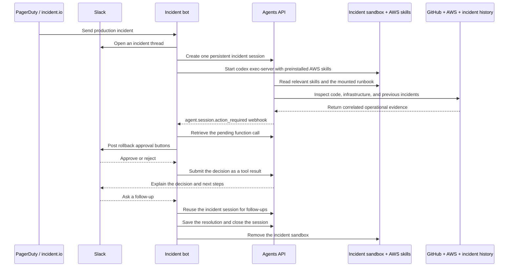

# SRE agent for incident response

An incident alert opens a Slack thread in `#oncall`. The agent investigates production telemetry, GitHub pull requests and commits, AWS infrastructure, and similar past incidents. It posts its findings and asks a responder to approve any rollback.



## What you need

- Python 3.14+ and `uv`.
- A sandbox: self-hosted Docker or a [third-party provider](https://developers.openai.com/api/docs/guides/agents-api/environments/self-hosted#sandbox-providers).
- An OpenAI API key and a separate restricted executor key.
- A Slack app installed in `#oncall`, with a bot token, signing secret, and message event subscriptions.
- PagerDuty, incident.io, or an Alertmanager-compatible monitoring system.
- Read access to the affected GitHub repository.
- AWS DevOps Agent credentials or another read-only AWS operational integration.

The first run uses bundled metrics, logs, deployments, GitHub changes, AWS telemetry, and incident history for `checkout-api`. Tool results label this sample data; it is not a live production diagnosis. Slack delivery is real. Replace the evidence tools when connecting your own incidents.

## Configure the Slack bot

From the repository root:

```bash
cp examples/agents_api/apps/sev_bot/.env.example examples/agents_api/apps/sev_bot/.env
docker build -t agent-api-sev-sandbox:latest examples/agents_api/apps/sev_bot
```

Create the Slack app from [`slack-app-manifest.yaml`](slack-app-manifest.yaml). Replace `https://your-app.example` with your application's HTTPS address, install the app, and invite it to `#oncall`.

Add `OPENAI_API_KEY`, `OPENAI_EXECUTOR_API_KEY`, `SLACK_BOT_TOKEN`, and `SLACK_SIGNING_SECRET` to `examples/agents_api/apps/sev_bot/.env`. Use OpenAI keys with the same owner, organization, and project.

The manifest subscribes to `message.channels` and `message.groups` at `/slack/events`, and sends approval actions to `/slack/actions`. Slack must be able to reach both URLs over HTTPS. Posting the initial investigation only needs the bot token; follow-ups and approval buttons also require these callbacks.

Each incident gets a self-hosted sandbox running `codex exec-server`. The app passes only `OPENAI_EXECUTOR_API_KEY` as `CODEX_API_KEY`; the application, Slack, GitHub, and AWS credentials stay outside the sandbox. The executor key needs `api.agents.environments.connect` and IP restrictions that allow the sandbox's outbound network. Follow-ups reuse the sandbox, and resolution or application shutdown deletes it.

To create an executor key with the required permission, open [Agents > Environments > Keys](https://platform.openai.com/agents?tab=environments&environment_view=keys) and select **Create**.

The app mounts [`runbooks/`](runbooks/) read-only at `/workspace/runbooks`. The agent reads `checkout-api.md` for mitigation steps and recovery checks. Add a runbook named after each service when connecting your own incidents.

## Connect Agents API approval webhooks

In [Project settings > Webhooks](https://platform.openai.com/settings/project/webhooks), register `https://your-app.example/webhooks/openai`, subscribe to `agent.session.action_required`, and add its signing secret as `OPENAI_WEBHOOK_SECRET` in `.env`.

With these credentials configured, start the receiver:

```bash
uv run examples/agents_api/apps/sev_bot/main.py
```

The app verifies OpenAI's signature, retrieves the session's `required_actions`, and posts Slack buttons for `propose_rollback`. It saves the pending `turn_id` and `call_id` and ignores repeated deliveries for the same proposal. Read-only tools still run through the streaming handler; `propose_rollback` deliberately has no automatic handler.

The Slack callback returns the decision to the waiting call:

```python
import json

await client.beta.agents.sessions.events.create(
    session.id,
    events=[
        {
            "type": "agent.session.input.tool_result",
            "turn_id": action["turn_id"],
            "call_id": action["call_id"],
            "success": True,
            "output": json.dumps({"decision": "approved", "executed": False}),
        }
    ],
)
```

The agent continues after approval or rejection. Approval is not execution: the example never contacts a deployment system. Keep the app running to receive callbacks and stream the final update. OpenAI and Slack callbacks both require a reachable HTTPS address. Persist pending actions and use a durable worker when deploying beyond this single-process example.

## Send a sample incident

From another terminal, send the included alert to the receiver:

```bash
curl -X POST http://127.0.0.1:8003/webhooks/alerts \
  -H 'Content-Type: application/json' \
  --data-binary @examples/agents_api/apps/sev_bot/sample_alert.json
```

The agent posts its sample investigation to `#oncall`, tracing the outage to the fixture's pull request #418 and Redis pool exhaustion. Approve or reject the proposed rollback using the buttons in the Slack thread. Approval records a decision; it does not execute a deployment.

To inspect a real repository, configure GitHub MCP below.

## Connect incident alerts

Send incident webhooks through your authenticated ingress to:

```text
https://your-app.example/webhooks/alerts
```

For Alertmanager:

```yaml
receivers:
  - name: incident-bot
    webhook_configs:
      - url: https://your-app.example/webhooks/alerts
        http_config:
          authorization:
            credentials: your-shared-token
```

Set `ALERT_WEBHOOK_TOKEN` to the same value. Alertmanager sends it as a bearer token. Alert fingerprints deduplicate active incidents; a later alert can start a new investigation after the earlier incident is resolved.

For PagerDuty, subscribe to `incident.triggered` and `incident.resolved`, and match the PagerDuty service name to an entry in `operations.json`. For incident.io, subscribe to `public_incident.incident_created_v2` and `public_incident.incident_status_updated_v2`; set `INCIDENT_SERVICE` to the affected service for that subscription. Adapt this mapping for multi-service incidents.

The example parses these provider payloads but does not verify their native signatures. Your ingress must verify PagerDuty or incident.io signatures before forwarding them with `ALERT_WEBHOOK_TOKEN`. Slack signatures are verified by the application.

## Use AWS skills

The [Dockerfile](Dockerfile) installs the Codex CLI and all [AWS Agent Toolkit skills](https://github.com/aws/agent-toolkit-for-aws/tree/main/skills) during the image build. From `/workspace`, it runs:

```bash
npx --yes skills add aws/agent-toolkit-for-aws/skills \
  --agent codex --copy --yes
```

The skills are copied to `/workspace/.agents/skills` for automatic discovery. The agent selects relevant skills and loads their instructions as needed. Ask in the incident's Slack thread: "List the installed AWS skills and explain which ones help investigate Redis connection exhaustion."

Skills provide instructions, not AWS access. No cloud credentials are needed to read them. The sample evidence tools stay in the application; use read-only integrations for live AWS evidence. Rebuild the image to refresh its skills, and review third-party instructions before granting production access.

## Connect GitHub

Set `GITHUB_TOKEN` and `GITHUB_REPOSITORY` in `.env`. Use a fine-grained token limited to the affected repository, with read access to **Contents** and **Pull requests**.

The app connects to [GitHub MCP](https://github.com/github/github-mcp-server) through its read-only endpoint, `https://api.githubcopilot.com/mcp/readonly`. Its allowlist contains five tools: `list_commits`, `get_commit`, `list_pull_requests`, `pull_request_read`, and `get_file_contents`. Agents API calls these directly; no application handler or GitHub CLI installation is needed.

GitHub credentials stay outside the sandbox. If the configured MCP server cannot connect, the session fails rather than silently skipping repository inspection. Without `GITHUB_TOKEN`, `get_service_evidence` returns the bundled sample PRs and commits instead.

## Connect AWS

The [AWS Agent Toolkit](https://github.com/aws/agent-toolkit-for-aws) includes observability skills and an AWS DevOps Agent MCP server for infrastructure investigations. Uncomment `DEVOPS_AGENT_REGION` and `DEVOPS_AGENT_TOKEN` in `examples/agents_api/apps/sev_bot/.env`:

```text
DEVOPS_AGENT_REGION=us-east-1
DEVOPS_AGENT_TOKEN=...
```

The application registers the service-connected MCP server automatically:

```python
{
    "type": "mcp",
    "server_label": "aws_devops",
    "connection_origin": "service",
    "transport": {
        "type": "http",
        "server_url": "https://connect.aidevops.us-east-1.api.aws/mcp",
        "authorization": f"Bearer {token}",
    },
}
```

Without AWS MCP configured, `get_service_evidence` includes bundled CloudWatch, ECS, and ElastiCache telemetry. With `DEVOPS_AGENT_TOKEN` set, it omits that sample AWS data so the agent uses the MCP server for AWS evidence. The service metrics, logs, and deployments remain sample data until you connect your monitoring system.

## Incident memory

Memory works at two levels:

- **Within an incident:** The alert fingerprint and Slack thread map to one Agents API session and sandbox. Follow-up questions retain previous evidence, tool results, investigation context, and workspace files.
- **Across incidents:** `recall_incidents` searches prior reports for related symptoms, root causes, and resolutions. A resolved alert saves findings to `examples/agents_api/apps/sev_bot/incident_memory.json` before the session closes. The app reloads this file on startup, or starts with `incident_history.json` when no saved file exists.

The generated memory file is ignored by Git and replaced atomically on each save. Deleting it resets history to the bundled samples. Run one app process against this file; it is not a shared database.

Only resolved-incident history survives restarts. Active Slack threads, session IDs, pending approvals, and sandbox handles still live in memory. Approving a rollback records the decision; this example never deploys or changes production infrastructure.

## Investigation tools

- `get_service_evidence` returns metrics, recent error logs, and deployments together.
- `recall_incidents` retrieves relevant incident history and prior mitigations.
- `propose_rollback` requests human approval without changing production.

Only the first two have automatic handlers. The webhook and Slack callback complete `propose_rollback` after a responder decides. GitHub and AWS use MCP integrations; runbooks are files in the sandbox.

## Files

- [main.py](main.py): Webhook routes and application startup.
- [agent.py](agent.py): Incident investigation, approval, resolution, and cleanup.
- [alerts.py](alerts.py): Alert normalization and background task scheduling.
- [tools.py](tools.py): Service evidence and GitHub/AWS MCP tools.
- [slack.py](slack.py): Slack messages, buttons, and callback verification.
- [memory.py](memory.py): Incident history loading, search, and atomic saves.
