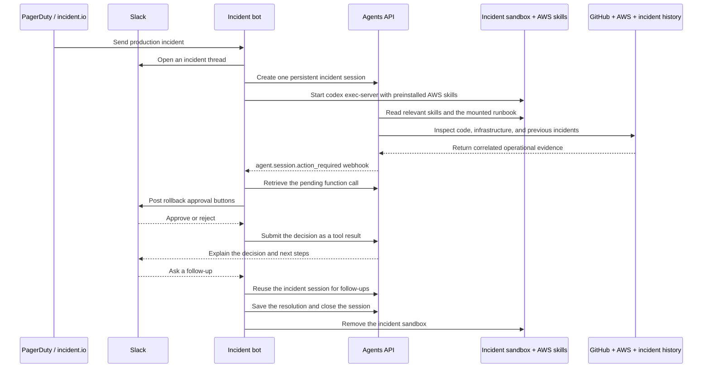

# SRE agent for incident response

An incident alert opens a Slack thread in `#oncall`. The agent investigates production telemetry, GitHub pull requests and commits, AWS infrastructure, and similar past incidents. It posts its findings and asks a responder to approve any rollback.



## Agents API capabilities

Function tools, Skills, Sandbox, Webhooks, Persistent sessions, Streaming.

### Incident-triggered execution

A PagerDuty, incident.io, or Alertmanager webhook starts the investigation automatically, without waiting for a responder to restate the symptoms.

### Persistent incident memory

One agent session retains the current incident's findings and follow-ups; a separate incident-history tool brings relevant past outages and mitigations into the investigation.

### Operational tools

Your application supplies service evidence and incident records. Service-connected MCP servers provide GitHub and AWS access, and the sandbox holds the runbook.

### Human-approved changes

The agent posts its findings and proposed rollback to #oncall, but only a responder can approve a production change.

## Application flow

1. PagerDuty / incident.io.
2. Slack #oncall.
3. Agents API session.
4. Sandbox + AWS skills.
5. GitHub / AWS / memory.
6. Approved recovery.

## What you need

- Python 3.14+ and `uv`.
- A sandbox: self-hosted Docker or a [third-party provider](https://developers.openai.com/api/docs/guides/agents-api/environments/self-hosted#sandbox-providers).
- An OpenAI API key and a separate restricted executor key.
- A Slack app installed in `#oncall`, with a bot token, signing secret, and message event subscriptions.
- PagerDuty, incident.io, or an Alertmanager-compatible monitoring system.
- Read access to the affected GitHub repository.
- AWS DevOps Agent credentials or another read-only AWS operational integration.

The first run uses bundled metrics, logs, deployments, GitHub changes, AWS telemetry, and incident history for `checkout-api`. Tool results label this sample data; it is not a live production diagnosis. Slack delivery is real. Replace the evidence tools when connecting your own incidents.

## Configure the Slack bot

From the repository root:

```bash
cp examples/agents_api/apps/sev_bot/.env.example examples/agents_api/apps/sev_bot/.env
docker build -t agent-api-sev-sandbox:latest examples/agents_api/apps/sev_bot
```

Create the Slack app from [`slack-app-manifest.yaml`](https://github.com/openai/openai-cookbook/blob/main/examples/agents_api/apps/sev_bot/slack-app-manifest.yaml). Replace `https://your-app.example` with your application's HTTPS address, install the app, and invite it to `#oncall`.

Add `OPENAI_API_KEY`, `OPENAI_EXECUTOR_API_KEY`, `SLACK_BOT_TOKEN`, and `SLACK_SIGNING_SECRET` to `examples/agents_api/apps/sev_bot/.env`. Use OpenAI keys with the same owner, organization, and project.

The manifest subscribes to `message.channels` and `message.groups` at `/slack/events`, and sends approval actions to `/slack/actions`. Slack must be able to reach both URLs over HTTPS. Posting the initial investigation only needs the bot token; follow-ups and approval buttons also require these callbacks.

Each incident gets a self-hosted sandbox running `codex exec-server`. The app passes only `OPENAI_EXECUTOR_API_KEY` as `CODEX_API_KEY`; the application, Slack, GitHub, and AWS credentials stay outside the sandbox. The executor key needs `api.agents.environments.connect` and IP restrictions that allow the sandbox's outbound network. Follow-ups reuse the sandbox, and resolution or application shutdown deletes it.

To create an executor key with the required permission, open [Agents > Environments > Keys](https://platform.openai.com/agents?tab=environments&environment_view=keys) and select **Create**.

The app mounts [`runbooks/`](https://github.com/openai/openai-cookbook/tree/main/examples/agents_api/apps/sev_bot/runbooks) read-only at `/workspace/runbooks`. The agent reads `checkout-api.md` for mitigation steps and recovery checks. Add a runbook named after each service when connecting your own incidents.

## Connect Agents API approval webhooks

In [Project settings > Webhooks](https://platform.openai.com/settings/project/webhooks), register `https://your-app.example/webhooks/openai`, subscribe to `agent.session.action_required`, and add its signing secret as `OPENAI_WEBHOOK_SECRET` in `.env`.

With these credentials configured, start the receiver:

```bash
uv run examples/agents_api/apps/sev_bot/main.py
```

The app verifies OpenAI's signature, retrieves the session's `required_actions`, and posts Slack buttons for `propose_rollback`. It saves the pending `turn_id` and `call_id` and ignores repeated deliveries for the same proposal. Read-only tools still run through the streaming handler; `propose_rollback` deliberately has no automatic handler.

The Slack callback returns the decision to the waiting call:

```python
import json

await client.beta.agents.sessions.events.create(
    session.id,
    events=[
        {
            "type": "agent.session.input.tool_result",
            "turn_id": action["turn_id"],
            "call_id": action["call_id"],
            "success": True,
            "output": json.dumps({"decision": "approved", "executed": False}),
        }
    ],
)
```

The agent continues after approval or rejection. Approval is not execution: the example never contacts a deployment system. Keep the app running to receive callbacks and stream the final update. OpenAI and Slack callbacks both require a reachable HTTPS address. Persist pending actions and use a durable worker when deploying beyond this single-process example.

## Send a sample incident

From another terminal, send the included alert to the receiver:

```bash
curl -X POST http://127.0.0.1:8003/webhooks/alerts \
  -H 'Content-Type: application/json' \
  --data-binary @examples/agents_api/apps/sev_bot/sample_alert.json
```

The agent posts its sample investigation to `#oncall`, tracing the outage to the fixture's pull request #418 and Redis pool exhaustion. Approve or reject the proposed rollback using the buttons in the Slack thread. Approval records a decision; it does not execute a deployment.

To inspect a real repository, configure GitHub MCP below.

## Connect incident alerts

Send incident webhooks through your authenticated ingress to:

```text
https://your-app.example/webhooks/alerts
```

For Alertmanager:

```yaml
receivers:
  - name: incident-bot
    webhook_configs:
      - url: https://your-app.example/webhooks/alerts
        http_config:
          authorization:
            credentials: your-shared-token
```

Set `ALERT_WEBHOOK_TOKEN` to the same value. Alertmanager sends it as a bearer token. Alert fingerprints deduplicate active incidents; a later alert can start a new investigation after the earlier incident is resolved.

For PagerDuty, subscribe to `incident.triggered` and `incident.resolved`, and match the PagerDuty service name to an entry in `operations.json`. For incident.io, subscribe to `public_incident.incident_created_v2` and `public_incident.incident_status_updated_v2`; set `INCIDENT_SERVICE` to the affected service for that subscription. Adapt this mapping for multi-service incidents.

The example parses these provider payloads but does not verify their native signatures. Your ingress must verify PagerDuty or incident.io signatures before forwarding them with `ALERT_WEBHOOK_TOKEN`. Slack signatures are verified by the application.

## Use AWS skills

The [Dockerfile](https://github.com/openai/openai-cookbook/blob/main/examples/agents_api/apps/sev_bot/Dockerfile) installs the Codex CLI and all [AWS Agent Toolkit skills](https://github.com/aws/agent-toolkit-for-aws/tree/main/skills) during the image build. From `/workspace`, it runs:

```bash
npx --yes skills add aws/agent-toolkit-for-aws/skills \
  --agent codex --copy --yes
```

The skills are copied to `/workspace/.agents/skills` for automatic discovery. The agent selects relevant skills and loads their instructions as needed. Ask in the incident's Slack thread: "List the installed AWS skills and explain which ones help investigate Redis connection exhaustion."

Skills provide instructions, not AWS access. No cloud credentials are needed to read them. The sample evidence tools stay in the application; use read-only integrations for live AWS evidence. Rebuild the image to refresh its skills, and review third-party instructions before granting production access.

## Connect GitHub

Set `GITHUB_TOKEN` and `GITHUB_REPOSITORY` in `.env`. Use a fine-grained token limited to the affected repository, with read access to **Contents** and **Pull requests**.

The app connects to [GitHub MCP](https://github.com/github/github-mcp-server) through its read-only endpoint, `https://api.githubcopilot.com/mcp/readonly`. Its allowlist contains five tools: `list_commits`, `get_commit`, `list_pull_requests`, `pull_request_read`, and `get_file_contents`. Agents API calls these directly; no application handler or GitHub CLI installation is needed.

GitHub credentials stay outside the sandbox. If the configured MCP server cannot connect, the session fails rather than silently skipping repository inspection. Without `GITHUB_TOKEN`, `get_service_evidence` returns the bundled sample PRs and commits instead.

## Connect AWS

The [AWS Agent Toolkit](https://github.com/aws/agent-toolkit-for-aws) includes observability skills and an AWS DevOps Agent MCP server for infrastructure investigations. Uncomment `DEVOPS_AGENT_REGION` and `DEVOPS_AGENT_TOKEN` in `examples/agents_api/apps/sev_bot/.env`:

```text
DEVOPS_AGENT_REGION=us-east-1
DEVOPS_AGENT_TOKEN=...
```

The application registers the service-connected MCP server automatically:

```python
{
    "type": "mcp",
    "server_label": "aws_devops",
    "connection_origin": "service",
    "transport": {
        "type": "http",
        "server_url": "https://connect.aidevops.us-east-1.api.aws/mcp",
        "authorization": f"Bearer {token}",
    },
}
```

Without AWS MCP configured, `get_service_evidence` includes bundled CloudWatch, ECS, and ElastiCache telemetry. With `DEVOPS_AGENT_TOKEN` set, it omits that sample AWS data so the agent uses the MCP server for AWS evidence. The service metrics, logs, and deployments remain sample data until you connect your monitoring system.

## Incident memory

Memory works at two levels:

- **Within an incident:** The alert fingerprint and Slack thread map to one Agents API session and sandbox. Follow-up questions retain previous evidence, tool results, investigation context, and workspace files.
- **Across incidents:** `recall_incidents` searches prior reports for related symptoms, root causes, and resolutions. A resolved alert saves findings to `examples/agents_api/apps/sev_bot/incident_memory.json` before the session closes. The app reloads this file on startup, or starts with `incident_history.json` when no saved file exists.

The generated memory file is ignored by Git and replaced atomically on each save. Deleting it resets history to the bundled samples. Run one app process against this file; it is not a shared database.

Only resolved-incident history survives restarts. Active Slack threads, session IDs, pending approvals, and sandbox handles still live in memory. Approving a rollback records the decision; this example never deploys or changes production infrastructure.

## Investigation tools

- `get_service_evidence` returns metrics, recent error logs, and deployments together.
- `recall_incidents` retrieves relevant incident history and prior mitigations.
- `propose_rollback` requests human approval without changing production.

Only the first two have automatic handlers. The webhook and Slack callback complete `propose_rollback` after a responder decides. GitHub and AWS use MCP integrations; runbooks are files in the sandbox.

## Implementation walkthrough

This walkthrough covers incident webhooks, Slack updates, GitHub and AWS investigation tools, persistent incident memory, and human-approved recovery.

Follow the setup instructions above, then use the source links below to explore each part of the application.

### 1. Set up

Clone the repository, configure your OpenAI API key, separate restricted executor key, and Slack app credentials, and build the incident sandbox image.

Create the Slack app from examples/agents_api/apps/sev_bot/slack-app-manifest.yaml. Set its HTTPS URLs to your host, install it, and invite it to `#oncall`. The manifest routes message.channels and message.groups to /slack/events and approval buttons to /slack/actions.

### 2. Install AWS skills in the sandbox

The sandbox image contains Python, the Codex CLI, and AWS Agent Toolkit skills. Install the skills once at build time so every incident starts with the same guidance.

This copies all skills into /workspace/.agents/skills for automatic discovery.

Read the implementation in [Dockerfile](https://github.com/openai/openai-cookbook/blob/main/examples/agents_api/apps/sev_bot/Dockerfile).

### 3. Receive incident alerts

Accept webhooks from PagerDuty, incident.io, or Alertmanager and normalize them into a common incident shape. Start the investigation in the background and reuse the alert fingerprint to avoid duplicate incidents.

The complete example's `queue_alerts` helper normalizes payloads, deduplicates active alerts, retries failed investigations, and handles resolved incidents.

Read the implementation in [alerts.py](https://github.com/openai/openai-cookbook/blob/main/examples/agents_api/apps/sev_bot/alerts.py).

### 4. Inspect the alert

The normalized alert identifies the affected service, severity, and customer-visible symptom. Its fingerprint becomes the stable key for both the agent session and the Slack incident thread.

Read the implementation in [alerts.py](https://github.com/openai/openai-cookbook/blob/main/examples/agents_api/apps/sev_bot/alerts.py).

### 5. Open the Slack incident thread

Post the incoming incident to `#oncall` and keep the returned thread timestamp. Investigation findings, follow-up questions, and rollback approvals all stay in this thread.

Read the implementation in [slack.py](https://github.com/openai/openai-cookbook/blob/main/examples/agents_api/apps/sev_bot/slack.py).

### 6. Define the application tools

Combine metrics, logs, and deployments in `get_service_evidence`. Use `recall_incidents` for past outages and `propose_rollback` to request approval. Only the two read-only functions run automatically; GitHub and AWS use MCP.

Keep `propose_rollback` out of handlers so its call stays pending until Slack approval. The first run uses bundled sample telemetry; connect `get_service_evidence` to your monitoring system before diagnosing real incidents.

Read the implementation in [tools.py](https://github.com/openai/openai-cookbook/blob/main/examples/agents_api/apps/sev_bot/tools.py).

### 7. Connect GitHub MCP

Set `GITHUB_TOKEN` and `GITHUB_REPOSITORY` in .env. Use a fine-grained token scoped to the affected repository, with read access to Contents and Pull requests. Agents API calls GitHub directly, without a custom handler or sandbox credentials.

The read-only endpoint and allowlist expose only repository inspection tools. `GITHUB_REPOSITORY` tells the agent where to look; token permissions enforce access. Without `GITHUB_TOKEN`, the runnable example skips MCP and includes bundled sample PRs and commits in `get_service_evidence`.

Read the implementation in [tools.py](https://github.com/openai/openai-cookbook/blob/main/examples/agents_api/apps/sev_bot/tools.py).

### 8. Connect the AWS DevOps Agent

The AWS Agent Toolkit includes an incident-response MCP server. Configure it as a service-connected tool so the agent can investigate AWS infrastructure without moving cloud credentials into a sandbox.

Without AWS MCP configured, `get_service_evidence` includes bundled CloudWatch, ECS, and ElastiCache telemetry. Setting `DEVOPS_AGENT_TOKEN` omits that sample AWS data and enables the MCP server.

Read the implementation in [tools.py](https://github.com/openai/openai-cookbook/blob/main/examples/agents_api/apps/sev_bot/tools.py).

### 9. Create an incident session

Create one self-hosted Agents API session per alert fingerprint. Have the agent correlate evidence and request approval before recovery.

Read the implementation in [agent.py](https://github.com/openai/openai-cookbook/blob/main/examples/agents_api/apps/sev_bot/agent.py).

### 10. Connect the incident sandbox

Mount examples/agents_api/apps/sev_bot/runbooks read-only at /workspace/runbooks. Start codex exec-server with the session's environment ID, then submit the investigation. Keep the container alive for follow-ups.

Inject `OPENAI_EXECUTOR_API_KEY` as `CODEX_API_KEY` at runtime, never during the image build. The example keeps application, Slack, GitHub, and AWS credentials outside the sandbox.

Read the implementation in [agent.py](https://github.com/openai/openai-cookbook/blob/main/examples/agents_api/apps/sev_bot/agent.py).

### 11. Receive approval requests from Agents API

Register /webhooks/openai in your OpenAI project's webhook settings, subscribe to agent.session.action_required, and set `OPENAI_WEBHOOK_SECRET`. Retrieve the pending call before asking for a Slack decision.

The runnable receiver verifies signatures, validates the proposed service and version, and handles repeated deliveries. Do not register an automatic handler for `propose_rollback`: the function call must remain pending until a person decides.

Read the implementation in [main.py](https://github.com/openai/openai-cookbook/blob/main/examples/agents_api/apps/sev_bot/main.py).

### 12. Post findings to `#oncall`

Save the session ID, track tool activity, and publish the completed investigation into the original Slack thread. The diagnosis can cite a pull request, commit, CloudWatch alarm, and related prior incident.

Read the implementation in [slack.py](https://github.com/openai/openai-cookbook/blob/main/examples/agents_api/apps/sev_bot/slack.py).

### 13. Use incident memory

The incident session retains its conversation. Across incidents, `recall_incidents` searches history loaded from a local JSON file. On the first run, load the bundled sample history instead.

Resolved-incident history survives restarts in `incident_memory.json`, which is ignored by Git. Active Slack threads, approvals, session IDs, and sandbox handles still live in memory. Use one app process per file.

Read the implementation in [memory.py](https://github.com/openai/openai-cookbook/blob/main/examples/agents_api/apps/sev_bot/memory.py).

### 14. Return the human decision to the agent

The Slack callback submits approval or rejection as the pending function's result. The agent continues the same turn and explains the next steps. No deployment is executed.

The runnable callback acknowledges Slack immediately and submits the result in the background. Both OpenAI and Slack callbacks need reachable HTTPS URLs. The original stream stays open for progress and resumed output; approval is driven by the webhook.

Read the implementation in [agent.py](https://github.com/openai/openai-cookbook/blob/main/examples/agents_api/apps/sev_bot/agent.py).

### 15. Start the Slack incident bot

Start the webhook receiver, then send the included alert from another terminal. Investigation updates, follow-ups, and approval buttons appear in `#oncall`.

### 16. Connect your incident provider

Forward authenticated incident events to the receiver. For PagerDuty, subscribe to incident.triggered and incident.resolved and match its service name to operations.json. For incident.io, subscribe to public incident-created and status-updated v2 events and set `INCIDENT_SERVICE` for the subscription.

Set `ALERT_WEBHOOK_TOKEN` to the same value. For PagerDuty or incident.io, your ingress must verify the provider's native signature and forward a bearer token; the example does not implement that signature verification.

Read the implementation in [alerts.py](https://github.com/openai/openai-cookbook/blob/main/examples/agents_api/apps/sev_bot/alerts.py).

### 17. Resolve the incident

A resolved alert saves the findings, posts a final Slack update, and deletes the session and sandbox. Write a temporary file, then replace the saved history atomically. Approval alone does not mean a rollback ran.

The runnable example also cleans up the sandbox after failed investigations and on application shutdown.

Read the implementation in [agent.py](https://github.com/openai/openai-cookbook/blob/main/examples/agents_api/apps/sev_bot/agent.py).

## Example result

The included checkout alert produces an investigation like this, using bundled telemetry and real Slack delivery.

The following illustrates a possible result; model-generated findings depend on the inputs and connected sources.

```text
SEV-1 Checkout API error rate reached 18.7%
Slack: #oncall
Evidence: bundled sample telemetry, not a live production diagnosis.

Customer impact: approximately 782 failed checkouts per minute.
GitHub: PR #418 / commit 8c41f2e reduced max_connections from 64 to 8.
AWS: CloudWatch alarm firing; ElastiCache has 143 waiting requests.
Memory: INC-0931 recorded the same Redis pool failure and recovery.
Action: Roll back checkout-api to 2026.08.26.3, pending approval.
```

## Next steps

- Connect the Slack app to `#oncall` and configure incident notifications from PagerDuty, incident.io, or Alertmanager.
- Replace fixture-backed evidence with your GitHub repository, AWS resources, production telemetry, and historical incident store.
- Persist incident fingerprints, Slack thread IDs, agent session IDs, and approved remediation decisions.
- Verify responder identity and production access before executing an approved rollback.

## Related documentation

- [Sandbox providers](https://developers.openai.com/api/docs/guides/agents-api/environments/self-hosted#sandbox-providers): Replace local Docker with a third-party sandbox running the same image and executor.
- [GitHub MCP](https://github.com/github/github-mcp-server/blob/main/docs/remote-server.md): Configure GitHub's hosted MCP server, read-only mode, and tool selection.
- [AWS skills](https://github.com/aws/agent-toolkit-for-aws/tree/main/skills): Skill instructions for AWS observability, compute, databases, and incident investigation.
- [AWS Agent Toolkit](https://github.com/aws/agent-toolkit-for-aws): Official AWS agent skills, MCP servers, and operational integrations.
- [AWS DevOps Agent integration](https://github.com/aws/agent-toolkit-for-aws/tree/main/plugins/aws-agents-for-devsecops): AWS incident investigation, service inspection, and remediation recommendations through MCP.
- [Slack chat.postMessage](https://docs.slack.dev/reference/methods/chat.postMessage/): Send incident updates and follow-up messages to a Slack thread.


## Files

- [main.py](https://github.com/openai/openai-cookbook/blob/main/examples/agents_api/apps/sev_bot/main.py): Webhook routes and application startup.
- [agent.py](https://github.com/openai/openai-cookbook/blob/main/examples/agents_api/apps/sev_bot/agent.py): Incident investigation, approval, resolution, and cleanup.
- [alerts.py](https://github.com/openai/openai-cookbook/blob/main/examples/agents_api/apps/sev_bot/alerts.py): Alert normalization and background task scheduling.
- [tools.py](https://github.com/openai/openai-cookbook/blob/main/examples/agents_api/apps/sev_bot/tools.py): Service evidence and GitHub/AWS MCP tools.
- [slack.py](https://github.com/openai/openai-cookbook/blob/main/examples/agents_api/apps/sev_bot/slack.py): Slack messages, buttons, and callback verification.
- [memory.py](https://github.com/openai/openai-cookbook/blob/main/examples/agents_api/apps/sev_bot/memory.py): Incident history loading, search, and atomic saves.
