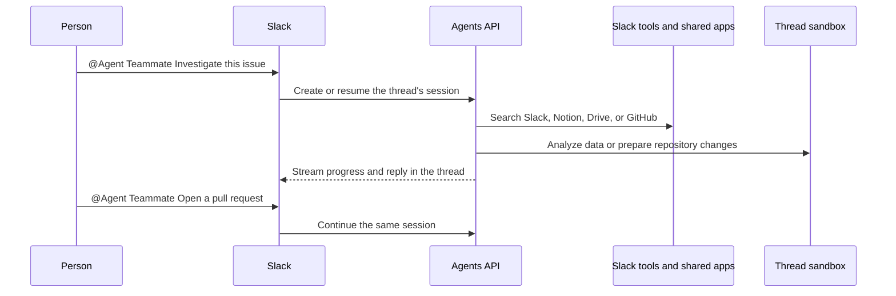
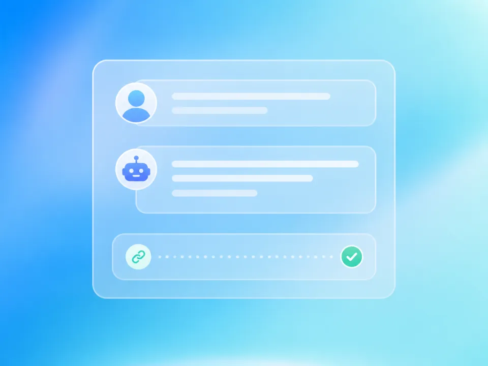
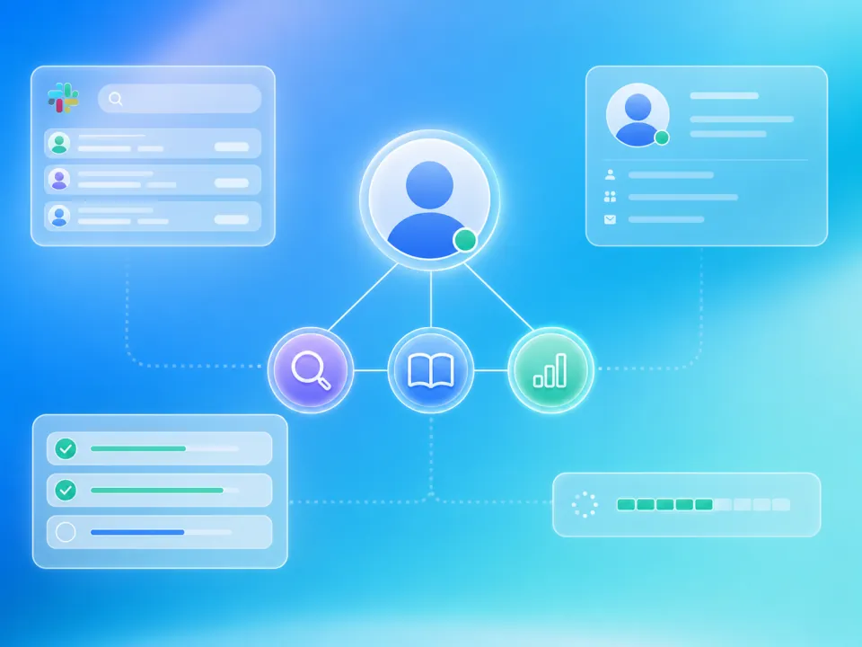

# Build an AI teammate for Slack

Tag your bot in Slack to search conversations, investigate projects, analyze data,
or prepare a GitHub pull request. Each Slack thread gets its own Agents API
session and isolated workspace.



## Agents API capabilities

Sandbox, Persistent sessions, MCP, Vaults and OAuth, Multi-agent, Streaming.

### Every Slack thread keeps its own context

One persistent session per Slack thread remembers earlier questions, findings, and files between follow-ups.

### One bot connects your workplace tools

Bot-scoped Slack tools and an optional shared vault connect Notion, Google Drive, and GitHub without requiring each person to authorize every app.

### A sandbox makes the bot capable

Each thread gets an isolated workspace where the agent can run code, analyze data, inspect repositories, and prepare pull requests.

### Users stay informed while work is running

Session events surface tool activity, specialist handoffs, and answers directly in the original Slack conversation.

## Application flow

1. Slack mention.
2. Slack bot tools.
3. Shared workplace apps.
4. Thread sandbox.
5. Agent progress.
6. Reply + follow-up.

## What you need

- Python 3.14+ and `uv`.
- A sandbox: self-hosted Docker or a [third-party provider](https://developers.openai.com/api/docs/guides/agents-api/environments/self-hosted#sandbox-providers).
- An OpenAI API key and a separate restricted executor key.
- A Slack workspace where you can install an internal application.

## 1. Build the sandbox image

From the repository root:

```bash
cp examples/agents_api/apps/slack_bot/.env.example examples/agents_api/apps/slack_bot/.env
docker build -t agent-api-sandbox:latest examples/agents_api/sandboxes/application_managed/docker
```

Set `OPENAI_API_KEY` and `OPENAI_EXECUTOR_API_KEY` in `examples/agents_api/apps/slack_bot/.env`. Use keys with the same owner, organization, and project. Only the executor key enters the sandbox. It needs `api.agents.environments.connect` and IP restrictions that allow the sandbox's outbound network. The application loads this file automatically.

To create an executor key with the required permission, open [Agents > Environments > Keys](https://platform.openai.com/agents?tab=environments&environment_view=keys) and select **Create**.

For production, you can replace Docker with a hosted [sandbox provider](https://developers.openai.com/api/docs/guides/agents-api/environments/self-hosted#sandbox-providers).

## 2. Create the Slack app

1. Create an app using `examples/agents_api/apps/slack_bot/slack-app-manifest.yaml`.
2. Install it in your workspace and copy the **Bot User OAuth Token**.
3. Create an app-level token with the `connections:write` scope.

Add both tokens to `examples/agents_api/apps/slack_bot/.env`:

```bash
SLACK_BOT_TOKEN=xoxb-...
SLACK_APP_TOKEN=xapp-...
```

Start the bot:

```bash
uv run examples/agents_api/apps/slack_bot/main.py
```

Socket Mode receives messages without a public webhook or OAuth callback. The
bot can read only conversations it belongs to.

## 3. Tag the bot in Slack

Invite the bot to a channel, then mention it:

```text
@Agent Teammate Summarize this week's launch decisions and find the owner.
```

Follow up in the same Slack thread:

```text
Find the related GitHub issue and explain the likely cause.

Reproduce the problem, prepare a fix, and open a pull request.

Only include customer-facing changes.
```

The first message creates a `self_hosted` Agents API session and starts a Docker
container running `codex exec-server`. Replies reuse the same session and
workspace. Send `stop` to cancel an active request.

## Connect shared workplace tools

The bot already has tools for searching the current Slack channel, reading recent
messages, finding teammates, and listing shared files. Add any optional shared
workplace credentials to `.env`:

```bash
NOTION_TOKEN=...
GOOGLE_DRIVE_TOKEN=...
GITHUB_TOKEN=...
```

The application stores configured credentials in one shared vault for the Slack
workspace and connects the corresponding MCP servers:

- Notion: `https://mcp.notion.com/mcp`
- Google Drive: `https://drivemcp.googleapis.com/mcp/v1`
- GitHub: `https://api.githubcopilot.com/mcp/`

Notion and Google Drive require OAuth access tokens for the shared account;
Notion's hosted MCP server does not accept internal integration secrets. GitHub
accepts an appropriately scoped personal access token. Everyone who can use the
bot shares these connections, so grant the account access only to documents and
repositories intended for that audience. Opening a pull request also requires a
GitHub credential with the necessary repository permissions.

### Let Agents API refresh Google Drive access

Obtain a grant through your [Google OAuth app](https://developers.google.com/identity/protocols/oauth2/web-server#offline), requesting offline access and only the Drive scopes your bot needs. Add the grant to `.env`:

```bash
GOOGLE_DRIVE_TOKEN=...
GOOGLE_DRIVE_REFRESH_TOKEN=...
GOOGLE_DRIVE_CLIENT_ID=...
GOOGLE_DRIVE_CLIENT_SECRET=...
GOOGLE_DRIVE_TOKEN_EXPIRES_AT=2026-09-01T12:00:00Z
```

Use the access token's actual expiration, or leave that field empty if unknown. The bot creates a `mcp_oauth` vault credential with Google's token endpoint and refresh configuration. Agents API refreshes the access token when needed; your application owns the initial consent flow.

Restarting the bot reuses the stored OAuth credential instead of replacing refreshed tokens with old `.env` values. If this workspace already has a static Google Drive credential, archive it once before switching to OAuth refresh. Renew or revoke an existing grant through the vault credential APIs; editing `.env` does not replace it.

## Implementation walkthrough

This walkthrough connects Slack events to shared tools, one sandbox per thread, and streamed updates.

Follow the setup instructions above, then use the source links below to explore each part of the application.

### 1. Set up the bot and sandbox

Clone the repository, copy the example's environment template, and build the Docker image that runs one Codex executor for each Slack thread.

### 2. Connect the Slack bot

Create and install the Slack app using the example manifest. Its bot token reads channels the bot belongs to and posts replies; the app token receives events through Socket Mode.

Socket Mode requires no public webhook, OAuth callback, or individual Slack user tokens.

Read the implementation in [main.py](https://github.com/openai/openai-cookbook/blob/main/examples/agents_api/apps/slack_bot/main.py).

### 3. Start when someone tags the bot

A Slack mention starts the journey. Use the channel and thread timestamp as the session key, then continue the same Agents API session when teammates follow up.



Read the implementation in [main.py](https://github.com/openai/openai-cookbook/blob/main/examples/agents_api/apps/slack_bot/main.py).

### 4. Give the agent scoped Slack tools

Run Slack tools inside your application with the bot token. Bind message and file access to the conversation that triggered the request, keeping the token out of the model and sandbox.

The complete example also reads recent messages, finds teammates, and lists files shared in the current channel.

Read the implementation in [tools.py](https://github.com/openai/openai-cookbook/blob/main/examples/agents_api/apps/slack_bot/tools.py).

### 5. Add optional shared workplace credentials

Store shared workplace credentials in a vault. For Google Drive, add an OAuth refresh grant so Agents API can renew access without asking for a new token on every run.

Your Google OAuth app obtains consent and the initial tokens. Add the refresh token, client ID, client secret, and actual access-token expiration to .env. The runnable example reuses existing OAuth credentials without resetting refreshed tokens on restart. Archive an existing static Drive credential before switching auth types. Shared connections must contain only content intended for everyone who can use the bot.

Read the implementation in [connections.py](https://github.com/openai/openai-cookbook/blob/main/examples/agents_api/apps/slack_bot/connections.py).

### 6. Connect workplace apps through MCP

Add only the integrations configured for the bot. Slack remains an application tool; Notion, Google Drive, and GitHub are service-connected MCP tools.

Google Drive's hosted MCP server is in developer preview.

Read the implementation in [connections.py](https://github.com/openai/openai-cookbook/blob/main/examples/agents_api/apps/slack_bot/connections.py).

### 7. Create a self-hosted session for the thread

A persistent Agents API session owns the conversation, connected tools, and workspace. Specialist agents can divide a larger investigation when needed.



Read the implementation in [agent.py](https://github.com/openai/openai-cookbook/blob/main/examples/agents_api/apps/slack_bot/agent.py).

### 8. Start the thread's sandbox

Launch a Docker container for the session's environment ID. The Codex executor connects back to the Agents API and stays available for later messages in the same Slack thread.

Read the implementation in [agent.py](https://github.com/openai/openai-cookbook/blob/main/examples/agents_api/apps/slack_bot/agent.py).

### 9. Stream progress back into Slack

Once the executor is connected, start a turn and update one Slack message as the agent checks MCP tools, delegates research, or prepares a result.

Read the implementation in [agent.py](https://github.com/openai/openai-cookbook/blob/main/examples/agents_api/apps/slack_bot/agent.py).

### 10. Keep follow-ups in the same thread

Reuse the original session and sandbox for each follow-up. A message received during an active turn can steer the investigation or cancel it.

Everyone in the thread shares the bot's configured permissions. Repository changes require a GitHub credential with write access.

Read the implementation in [agent.py](https://github.com/openai/openai-cookbook/blob/main/examples/agents_api/apps/slack_bot/agent.py).

### 11. Start the bot

Set the bot token and app token, then start receiving Slack events through Socket Mode.

### 12. Try the complete journey in Slack

Invite the bot to a Slack channel and tag it. Continue the conversation in the same thread to research a problem and ask for a real change.

### 13. Clean up when the application shuts down

Keep the thread's session and sandbox alive for follow-ups. The example deletes sessions and stops their Docker containers when the application shuts down. Add an inactive-thread expiration policy when deploying a long-running bot.

Read the implementation in [agent.py](https://github.com/openai/openai-cookbook/blob/main/examples/agents_api/apps/slack_bot/agent.py).

## Example result

A Slack mention now starts a persistent investigation using shared workplace tools and an isolated workspace for completing the task.

The following illustrates a possible result; model-generated findings depend on the inputs and connected sources.

```text
You: @Agent Teammate What is blocking the Phoenix launch?
Bot: Searching Slack conversations...
Bot: Checking GitHub...
Bot: The checkout accessibility issue is blocking sign-off.
     Priya owns the launch and Maya is reviewing the fix.

You: Reproduce the issue and prepare a patch.
Bot: Checking the repository and running the relevant tests...
Bot: I reproduced the missing focus state and prepared a fix.

You: Open a pull request.
Bot: Opened a pull request with the fix and test coverage.
```

## Next steps

- Connect Notion, Google Drive, or GitHub using a dedicated shared account with limited access.
- Persist thread-to-session mappings so conversations survive application restarts.
- Replace local Docker with your preferred hosted sandbox provider.

## Related documentation

- [Sandbox providers](https://developers.openai.com/api/docs/guides/agents-api/environments/self-hosted#sandbox-providers): Choose a local or hosted sandbox provider for your agent's isolated workspace.


## Files

- [main.py](https://github.com/openai/openai-cookbook/blob/main/examples/agents_api/apps/slack_bot/main.py): Slack events and application startup.
- [agent.py](https://github.com/openai/openai-cookbook/blob/main/examples/agents_api/apps/slack_bot/agent.py): Agent sessions, sandboxes, streaming, and cleanup.
- [tools.py](https://github.com/openai/openai-cookbook/blob/main/examples/agents_api/apps/slack_bot/tools.py): Slack search, channel, teammate, and file tools.
- [connections.py](https://github.com/openai/openai-cookbook/blob/main/examples/agents_api/apps/slack_bot/connections.py): MCP connections and vault credentials.
