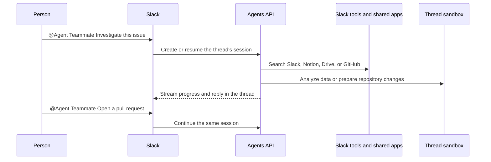

# Build a Slack bot with the Agents API

Tag your bot in Slack to search conversations, investigate projects, analyze data,
or prepare a GitHub pull request. Each Slack thread gets its own Agents API
session and isolated workspace.

## Why use the Agents API?

Slack supplies the trigger and interface. The Agents API keeps the conversation
and tool results in a session, runs the agent, and streams its progress. Your
application controls Slack access, workplace credentials, and the sandbox
lifecycle. A follow-up can continue the investigation without repeating the
original context.



## What you need

- Python 3.14+ and `uv`.
- A sandbox: self-hosted Docker or a [third-party provider](https://developers.openai.com/api/docs/guides/agents-api/environments/self-hosted#sandbox-providers).
- An OpenAI API key and a separate restricted executor key.
- A Slack workspace where you can install an internal application.

## 1. Build the sandbox image

From the repository root:

```bash
cp examples/agents_api/apps/slack_bot/.env.example examples/agents_api/apps/slack_bot/.env
docker build -t agent-api-sandbox:latest examples/agents_api/sandboxes/application_managed/docker
```

Set `OPENAI_API_KEY` and `OPENAI_EXECUTOR_API_KEY` in `examples/agents_api/apps/slack_bot/.env`. Use keys with the same owner, organization, and project. Only the executor key enters the sandbox. It needs `api.agents.environments.connect` and IP restrictions that allow the sandbox's outbound network. The application loads this file automatically.

To create an executor key with the required permission, open [Agents > Environments > Keys](https://platform.openai.com/agents?tab=environments&environment_view=keys) and select **Create**.

For production, you can replace Docker with a hosted [sandbox provider](https://developers.openai.com/api/docs/guides/agents-api/environments/self-hosted#sandbox-providers).

## 2. Create the Slack app

1. Create an app using `examples/agents_api/apps/slack_bot/slack-app-manifest.yaml`.
2. Install it in your workspace and copy the **Bot User OAuth Token**.
3. Create an app-level token with the `connections:write` scope.

Add both tokens to `examples/agents_api/apps/slack_bot/.env`:

```bash
SLACK_BOT_TOKEN=xoxb-...
SLACK_APP_TOKEN=xapp-...
```

Start the bot:

```bash
uv run examples/agents_api/apps/slack_bot/main.py
```

Socket Mode receives messages without a public webhook or OAuth callback. The
bot can read only conversations it belongs to.

## 3. Tag the bot in Slack

Invite the bot to a channel, then mention it:

```text
@Agent Teammate Summarize this week's launch decisions and find the owner.
```

Follow up in the same Slack thread:

```text
Find the related GitHub issue and explain the likely cause.

Reproduce the problem, prepare a fix, and open a pull request.

Only include customer-facing changes.
```

The first message creates a `self_hosted` Agents API session and starts a Docker
container running `codex exec-server`. Replies reuse the same session and
workspace. Send `stop` to cancel an active request.

## Follow the implementation

The snippets below show the main steps in [main.py](https://github.com/openai/openai-cookbook/blob/main/examples/agents_api/apps/slack_bot/main.py), [agent.py](https://github.com/openai/openai-cookbook/blob/main/examples/agents_api/apps/slack_bot/agent.py),
and [connections.py](https://github.com/openai/openai-cookbook/blob/main/examples/agents_api/apps/slack_bot/connections.py). Run the application above for the complete
event handling and cleanup; the snippets are not a second application.

### 1. Map each Slack thread to a session

Use the workspace, channel, and original message timestamp as the conversation
key. Follow-up mentions in the same thread reuse that key.

```python
@app.event("app_mention")
async def on_mention(event, context, say):
    thread_ts = event.get("thread_ts") or event["ts"]
    thread_id = f"{context.team_id}:{event['channel']}:{thread_ts}"
    answer = await bot.answer(
        event["text"],
        thread_id=thread_id,
        team_id=context.team_id,
        channel_id=event["channel"],
    )
    await say(text=answer, thread_ts=thread_ts)
```

The runnable handler also removes the bot's own mention, ignores duplicate
deliveries, and routes messages received during an active request to steering
or cancellation.

### 2. Give the agent scoped tools

Slack tools run in your application with the bot token. [tools.py](https://github.com/openai/openai-cookbook/blob/main/examples/agents_api/apps/slack_bot/tools.py)
provides four functions: `search_slack_messages`, `read_slack_channel`,
`find_teammate`, and `list_slack_files`. Message and file access is bound to the
channel that triggered the request, not a model-selected channel.

For example, the search tool filters recent channel messages:

```python
async def search_slack_messages(arguments):
    response = await slack.conversations_history(channel=channel_id, limit=100)
    query = arguments["query"].casefold()
    return {
        "messages": [
            message for message in response["messages"]
            if query in message.get("text", "").casefold()
        ][:20]
    }
```

This searches recent history, not the entire Slack workspace. Optional Notion,
Google Drive, and GitHub connections use service-connected MCP tools instead.
See [Connect shared workplace tools](#connect-shared-workplace-tools) for setup.

### 3. Create the session and attach its sandbox

`Connections.get()` returns the tool definitions and optional vault for the
workspace. Create the session once, then save its ID under the thread key.

```python
from openai import AsyncOpenAI
from examples.agents_api.apps.slack_bot.connections import Connections

client = AsyncOpenAI()
connections = Connections(client)
vault_id, tools = await connections.get(team_id)

instructions = """\
Search connected tools and cite the records behind your answer.
Use your workspace to analyze data, inspect repositories, and prepare changes.
Change external systems only when the user explicitly asks.
Delegate complex investigations when helpful.
"""

session = await client.beta.agents.sessions.create(
    agent={
        "model": "gpt-5.6-sol",
        "instructions": instructions,
        "reasoning": {"effort": "medium"},
        "multi_agent": {"enabled": True, "max_concurrent_subagents": 3},
        "tools": tools,
    },
    environment={"type": "self_hosted", "workspace_directory": "/workspace"},
    vault_ids=[vault_id] if vault_id is not None else [],
)
sessions[thread_id] = session.id
```

Start `codex exec-server` using the returned connection URL and environment ID.
Only the restricted executor key enters the container.

```python
import asyncio
import os
import docker

environment = session.environment
assert environment.type == "self_hosted"
container = await asyncio.to_thread(
    docker.from_env().containers.run,
    "agent-api-sandbox:latest",
    [
        "codex", "exec-server",
        "--remote", environment.remote_url,
        "--environment-id", environment.id,
    ],
    environment={"CODEX_API_KEY": os.environ["OPENAI_EXECUTOR_API_KEY"]},
    detach=True,
    auto_remove=True,
    init=True,
)
```

### 4. Stream the investigation into Slack

Pass the application handlers when starting a turn. The SDK runs those handlers
for function calls; Agents API handles the service-connected MCP tools.

```python
from examples.agents_api.apps.slack_bot.tools import slack_handlers

parts = []
async with client.beta.agents.sessions.stream(
    session.id,
    input=question,
    tool_handlers=slack_handlers(slack, channel_id),
) as events:
    async for event in events:
        if event.type == "agent.session.turn.output_text.delta":
            parts.append(event.delta)
        elif event.type in {"agent.session.failed", "agent.session.turn.failed", "error"}:
            raise RuntimeError(f"Investigation failed: {event.to_dict()}")

await slack.chat_postMessage(
    channel=channel_id, thread_ts=thread_ts, text="".join(parts),
)
```

The app also uses `agent.session.turn.item.added` and
`agent.session.subagent.created` to update one progress message while tools and
specialists work. It does not post every text delta as a new Slack message.

### 5. Continue, steer, or cancel

When the thread is idle, start another stream with the saved session ID. During
an active turn, send a message event to steer the existing work:

```python
await client.beta.agents.sessions.events.create(
    sessions[thread_id],
    events=[{
        "type": "agent.session.input.message",
        "input": [{
            "role": "user",
            "content": [{"type": "input_text", "text": "Only include launch blockers."}],
        }],
    }],
)
```

For `stop`, send `{"type": "agent.session.input.cancel"}` instead. Cancellation
ends the active turn, not the conversation; later requests reuse the session
and workspace.

### 6. Release the conversation's resources

Keep the sandbox for follow-ups, then delete the session and remove the
container when the conversation expires. [SlackBot.close()](https://github.com/openai/openai-cookbook/blob/main/examples/agents_api/apps/slack_bot/agent.py) does this
on application shutdown. Add an expiry policy when deploying a long-running bot.

```python
try:
    await client.beta.agents.sessions.delete(session.id)
finally:
    await asyncio.to_thread(container.remove, force=True)
```

Close the OpenAI client after cleaning up all conversations. Session IDs,
sandbox handles, and thread mappings are kept in memory in this example. Persist
them if conversations must survive application restarts.

## Connect shared workplace tools

The bot already has tools for searching the current Slack channel, reading recent
messages, finding teammates, and listing shared files. Add any optional shared
workplace credentials to `.env`:

```bash
NOTION_TOKEN=...
GOOGLE_DRIVE_TOKEN=...
GITHUB_TOKEN=...
```

The application stores configured credentials in one shared vault for the Slack
workspace and connects the corresponding MCP servers:

- Notion: `https://mcp.notion.com/mcp`
- Google Drive: `https://drivemcp.googleapis.com/mcp/v1`
- GitHub: `https://api.githubcopilot.com/mcp/`

For example, the vault holds a GitHub token while the tool definition contains
only the server URL. Attach the vault ID to the session's `vault_ids`:

```python
vault = await client.beta.agents.vaults.create(
    name="Slack integrations",
    metadata={"slack_team_id": team_id, "owner": "slack_bot"},
)
await client.beta.agents.vaults.credentials.create(
    vault.id,
    name="GitHub",
    auth={
        "type": "static_bearer",
        "mcp_server_url": "https://api.githubcopilot.com/mcp/",
        "token": os.environ["GITHUB_TOKEN"],
    },
)
github_tool = {
    "type": "mcp",
    "server_label": "github",
    "connection_origin": "service",
    "transport": {"type": "http", "server_url": "https://api.githubcopilot.com/mcp/"},
}
```

Add `github_tool` to the agent's tools. The runnable app finds and reuses its
workspace vault rather than creating one for every thread.

Notion and Google Drive require OAuth access tokens for the shared account;
Notion's hosted MCP server does not accept internal integration secrets. GitHub
accepts an appropriately scoped personal access token. Everyone who can use the
bot shares these connections, so grant the account access only to documents and
repositories intended for that audience. Opening a pull request also requires a
GitHub credential with the necessary repository permissions.

### Let Agents API refresh Google Drive access

Obtain a grant through your [Google OAuth app](https://developers.google.com/identity/protocols/oauth2/web-server#offline), requesting offline access and only the Drive scopes your bot needs. Add the grant to `.env`:

```bash
GOOGLE_DRIVE_TOKEN=...
GOOGLE_DRIVE_REFRESH_TOKEN=...
GOOGLE_DRIVE_CLIENT_ID=...
GOOGLE_DRIVE_CLIENT_SECRET=...
GOOGLE_DRIVE_TOKEN_EXPIRES_AT=2026-09-01T12:00:00Z
```

Use the access token's actual expiration, or leave that field empty if unknown. The bot creates a `mcp_oauth` vault credential with Google's token endpoint and refresh configuration. Agents API refreshes the access token when needed; your application owns the initial consent flow.

Restarting the bot reuses the stored OAuth credential instead of replacing refreshed tokens with old `.env` values. If this workspace already has a static Google Drive credential, archive it once before switching to OAuth refresh. Renew or revoke an existing grant through the vault credential APIs; editing `.env` does not replace it.

## Files

- [main.py](https://github.com/openai/openai-cookbook/blob/main/examples/agents_api/apps/slack_bot/main.py): Slack events and application startup.
- [agent.py](https://github.com/openai/openai-cookbook/blob/main/examples/agents_api/apps/slack_bot/agent.py): Agent sessions, sandboxes, streaming, and cleanup.
- [tools.py](https://github.com/openai/openai-cookbook/blob/main/examples/agents_api/apps/slack_bot/tools.py): Slack search, channel, teammate, and file tools.
- [connections.py](https://github.com/openai/openai-cookbook/blob/main/examples/agents_api/apps/slack_bot/connections.py): MCP connections and vault credentials.
