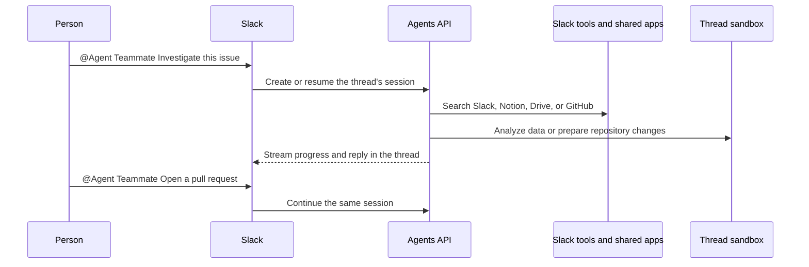

# Build an AI teammate for Slack

Tag your bot in Slack to search conversations, investigate projects, analyze data,
or prepare a GitHub pull request. Each Slack thread gets its own Agents API
session and isolated workspace.



## What you need

- Python 3.14+ and `uv`.
- A sandbox: self-hosted Docker or a [third-party provider](https://developers.openai.com/api/docs/guides/agents-api/environments/self-hosted#sandbox-providers).
- An OpenAI API key and a separate restricted executor key.
- A Slack workspace where you can install an internal application.

## 1. Build the sandbox image

From the repository root:

```bash
cp examples/agents_api/apps/slack_bot/.env.example examples/agents_api/apps/slack_bot/.env
docker build -t agent-api-sandbox:latest examples/agents_api/sandboxes/application_managed/docker
```

Set `OPENAI_API_KEY` and `OPENAI_EXECUTOR_API_KEY` in `examples/agents_api/apps/slack_bot/.env`. Use keys with the same owner, organization, and project. Only the executor key enters the sandbox. It needs `api.agents.environments.connect` and IP restrictions that allow the sandbox's outbound network. The application loads this file automatically.

To create an executor key with the required permission, open [Agents > Environments > Keys](https://platform.openai.com/agents?tab=environments&environment_view=keys) and select **Create**.

For production, you can replace Docker with a hosted [sandbox provider](https://developers.openai.com/api/docs/guides/agents-api/environments/self-hosted#sandbox-providers).

## 2. Create the Slack app

1. Create an app using `examples/agents_api/apps/slack_bot/slack-app-manifest.yaml`.
2. Install it in your workspace and copy the **Bot User OAuth Token**.
3. Create an app-level token with the `connections:write` scope.

Add both tokens to `examples/agents_api/apps/slack_bot/.env`:

```bash
SLACK_BOT_TOKEN=xoxb-...
SLACK_APP_TOKEN=xapp-...
```

Start the bot:

```bash
uv run examples/agents_api/apps/slack_bot/main.py
```

Socket Mode receives messages without a public webhook or OAuth callback. The
bot can read only conversations it belongs to.

## 3. Tag the bot in Slack

Invite the bot to a channel, then mention it:

```text
@Agent Teammate Summarize this week's launch decisions and find the owner.
```

Follow up in the same Slack thread:

```text
Find the related GitHub issue and explain the likely cause.

Reproduce the problem, prepare a fix, and open a pull request.

Only include customer-facing changes.
```

The first message creates a `self_hosted` Agents API session and starts a Docker
container running `codex exec-server`. Replies reuse the same session and
workspace. Send `stop` to cancel an active request.

## Connect shared workplace tools

The bot already has tools for searching the current Slack channel, reading recent
messages, finding teammates, and listing shared files. Add any optional shared
workplace credentials to `.env`:

```bash
NOTION_TOKEN=...
GOOGLE_DRIVE_TOKEN=...
GITHUB_TOKEN=...
```

The application stores configured credentials in one shared vault for the Slack
workspace and connects the corresponding MCP servers:

- Notion: `https://mcp.notion.com/mcp`
- Google Drive: `https://drivemcp.googleapis.com/mcp/v1`
- GitHub: `https://api.githubcopilot.com/mcp/`

Notion and Google Drive require OAuth access tokens for the shared account;
Notion's hosted MCP server does not accept internal integration secrets. GitHub
accepts an appropriately scoped personal access token. Everyone who can use the
bot shares these connections, so grant the account access only to documents and
repositories intended for that audience. Opening a pull request also requires a
GitHub credential with the necessary repository permissions.

### Let Agents API refresh Google Drive access

Obtain a grant through your [Google OAuth app](https://developers.google.com/identity/protocols/oauth2/web-server#offline), requesting offline access and only the Drive scopes your bot needs. Add the grant to `.env`:

```bash
GOOGLE_DRIVE_TOKEN=...
GOOGLE_DRIVE_REFRESH_TOKEN=...
GOOGLE_DRIVE_CLIENT_ID=...
GOOGLE_DRIVE_CLIENT_SECRET=...
GOOGLE_DRIVE_TOKEN_EXPIRES_AT=2026-09-01T12:00:00Z
```

Use the access token's actual expiration, or leave that field empty if unknown. The bot creates a `mcp_oauth` vault credential with Google's token endpoint and refresh configuration. Agents API refreshes the access token when needed; your application owns the initial consent flow.

Restarting the bot reuses the stored OAuth credential instead of replacing refreshed tokens with old `.env` values. If this workspace already has a static Google Drive credential, archive it once before switching to OAuth refresh. Renew or revoke an existing grant through the vault credential APIs; editing `.env` does not replace it.

## Files

- [main.py](main.py): Slack events and application startup.
- [agent.py](agent.py): Agent sessions, sandboxes, streaming, and cleanup.
- [tools.py](tools.py): Slack search, channel, teammate, and file tools.
- [connections.py](connections.py): MCP connections and vault credentials.
