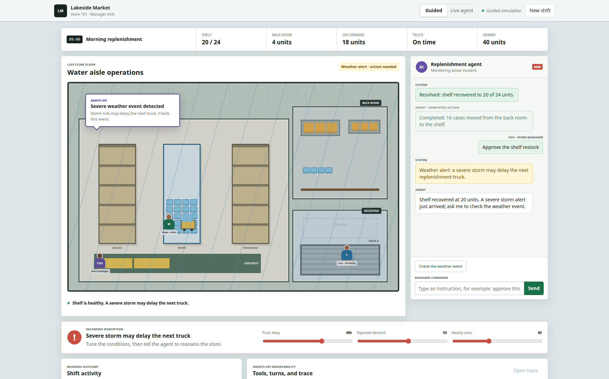
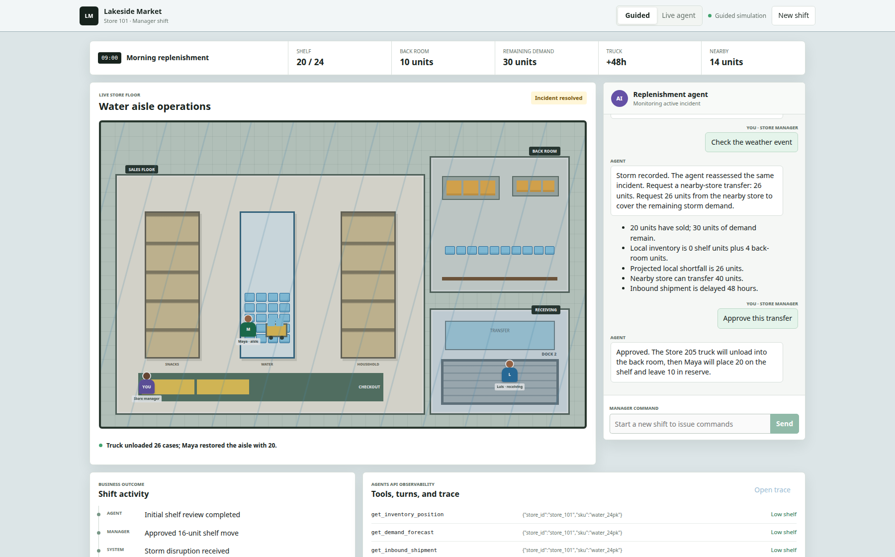

# Build an observable store replenishment agent with the Agents API

A store has four cases of bottled water on the shelf and twenty in the back
room. The agent recommends moving sixteen cases to the shelf. Later, a storm
delays the inbound truck and raises expected demand. The same agent session now
recommends transferring twenty-six cases from a nearby store.

```text
low shelf alert -> restock from back room
        |
storm delays truck -> request nearby-store transfer
```

This example uses one incident to show how a production backend can use the
Agents API: keep work in a managed session, expose business data through
application functions, continue when a new event arrives, and trace the result.

## What you will build

The runnable example includes:

- [A notebook](https://github.com/openai/openai-cookbook/blob/main/examples/agents_api/build-observable-store-replenishment.ipynb)
  that keeps the Agents API calls and output visible.
- [A deterministic synthetic dataset](https://github.com/openai/openai-cookbook/tree/main/examples/agents_api/build-observable-store-replenishment/data)
  with inventory, demand, shipment, weather, and policy data.
- [A reusable Python worker](https://github.com/openai/openai-cookbook/blob/main/examples/agents_api/build-observable-store-replenishment/replenishment_agent.py)
  that runs the same two-turn incident.
- [A GitHub Actions template](https://github.com/openai/openai-cookbook/blob/main/examples/agents_api/build-observable-store-replenishment/github-actions/store-replenishment-canary.yml)
  for offline tests and an approved live canary.

The example calls the hosted Agents API through the standard OpenAI Python SDK:

```python
from openai import OpenAI

client = OpenAI()
client.beta.agents.sessions.create(...)
```

It does not use the separate `openai-agents` package.

## Start with a small synthetic dataset

Public retail datasets provide useful parts of this problem, but not the entire
operational event. For example, [FreshRetailNet-50K](https://huggingface.co/datasets/gujixian/FreshRetailNet-50K)
contains hourly sales, stockout annotations, and weather covariates. The
[M5 dataset](https://www.kaggle.com/c/m5-forecasting-accuracy/data) provides
historical item sales, prices, and calendar events. Neither supplies the complete
shelf/back-room split, individual inbound truck, weather delay, inter-store
inventory, and decision policy needed for this example.

The included generator therefore produces six small files:

| File | Production system represented |
| --- | --- |
| `inventory.json` | Shelf and back-room inventory |
| `demand_forecast.json` | Demand forecasting service |
| `inbound_shipments.json` | Warehouse or transportation system |
| `weather_events.json` | External disruption feed |
| `nearby_store_inventory.json` | Store network inventory |
| `replenishment_policy.md` | Retailer's decision policy |

The generator and generated files are committed together. Tests regenerate the
dataset and compare every file, which keeps the notebook and worker reproducible.

## Keep operational systems behind function tools

The model does not receive database credentials or direct access to the
retailer's systems. The application defines six function tools:

```text
get_inventory_position
get_demand_forecast
get_inbound_shipment
get_weather_alert
get_nearby_inventory
get_replenishment_policy
```

Each definition contains a name, description, and JSON Schema for its arguments:

```python
{
    "type": "function",
    "name": "get_inventory_position",
    "description": "Return current shelf and back-room inventory for a store SKU.",
    "parameters": {
        "type": "object",
        "properties": {
            "store_id": {"type": "string"},
            "sku": {"type": "string"},
        },
        "required": ["store_id", "sku"],
        "additionalProperties": False,
    },
}
```

The tools are read-only. The agent recommends an action; it cannot change
inventory or approve a transfer.

## Handle a requested function

When the agent needs application data, the stream emits
`agent.session.requires_action`. The application reads the pending function
call, runs its own code, and submits the result:

`required_actions` contains only the calls currently selected by the agent and
waiting for results. It does not list every available tool; those are supplied
separately in the agent's `tools` configuration.

```python
for pending in event.session.required_actions:
    action = pending.to_dict()
    print(f"Function requested: {action['name']}")
    print("Arguments:", json.dumps(action["arguments"], indent=2))

    output = scenario.call(action["name"], action["arguments"])
    print("Result returned by the store application:")
    print(json.dumps(output, indent=2))

    client.beta.agents.sessions.events.create(
        session_id,
        events=[
            {
                "type": "agent.session.input.tool_result",
                "turn_id": action["turn_id"],
                "call_id": action["call_id"],
                "success": True,
                "output": json.dumps(output),
            }
        ],
    )
```

`scenario` is not an OpenAI object. It is the example application's small
adapter over the synthetic inventory, forecast, shipment, weather, nearby-store,
and policy files. For example, if the pending action is
`get_inventory_position`, this line:

```python
output = scenario.call(
    "get_inventory_position",
    {"store_id": "store_101", "sku": "water_24pk"},
)
```

returns application-owned data:

```json
{
  "store_id": "store_101",
  "store_name": "Lakeside Market",
  "sku": "water_24pk",
  "shelf_units": 4,
  "shelf_capacity": 24,
  "backroom_units": 20
}
```

The model requested those facts, but Python performed the lookup. The next SDK
call sends that JSON back as `agent.session.input.tool_result` so the waiting
turn can continue.

The `turn_id` and `call_id` connect the result to the exact pending request. The
Agents API continues the turn after receiving the result. This is the core
application boundary:

```text
agent requests a function
-> application reads its system
-> application returns tool_result
-> agent continues with grounded evidence
```

Because the session is durable, a closed HTTP stream does not discard a pending
function call. The example collector retrieves the saved session when a stream
ends before the root turn completes. If the saved status is `requires_action`, it
subscribes with `sessions.events.stream(session_id)` before submitting the saved
tool results, then continues collecting the same turn. This recovery path avoids
treating a temporary observer disconnect as an agent failure.

## Turn 1: respond to low shelf inventory

The scenario begins at Lakeside Market. The shelf has 4 bottled-water cases, the
back room has 20, baseline 24-hour demand is 18, and policy sets a 20-unit shelf
presentation target. A low-shelf alert asks the agent what the store should do
now. No storm is active yet, and the agent can recommend but cannot move stock.
The synthetic incident is anchored at `2026-09-18T08:15:00Z`, so records
generated at 08:00 are current regardless of the real date when the reader runs
the example.

Here, the **business event** is the low-shelf alert sent as `INITIAL_INPUT`.
Events such as `agent.session.created`, `agent.session.requires_action`, and
`agent.session.turn.completed` are different: they are Agents API stream events
that report progress and tell the application when it must supply a tool result.

The backend creates one session with the function definitions and sends that
initial alert:

```python
with client.beta.agents.sessions.create(
    agent={
        "model": MODEL,
        "instructions": AGENT_INSTRUCTIONS,
        "tools": TOOL_DEFINITIONS,
    },
    environment={"type": "none"},
    input=INITIAL_INPUT,
    stream=True,
) as events:
    first_turn = collect_turn(client, events, scenario)
```

`environment.type="none"` is intentional. This workflow needs application
functions, not a Linux sandbox. The model queries inventory, demand, the inbound
shipment, and policy before returning a JSON recommendation:

```json
{
  "decision": "restock_from_backroom",
  "quantity": 16,
  "approval_required": false
}
```

The application saves the returned session ID beside the replenishment incident.

### Apply the manager's approval

The manager approves the recommendation, and the retail application performs
the inventory update:

```python
before_approval = scenario.get_inventory_position("store_101", "water_24pk")
scenario.apply_approved_restock(first_turn.decision.quantity)
after_approval = scenario.get_inventory_position("store_101", "water_24pk")
```

| Inventory location | Before | After | Change |
| --- | ---: | ---: | ---: |
| Sales-floor shelf | 4 | 20 | +16 |
| Back room | 20 | 4 | -16 |

The agent recommended the move; the manager approved it; the application changed
the inventory. Keeping those responsibilities separate is important in a
production workflow.

## Turn 2: continue after a storm

Assume the first recommendation is approved and completed. The shelf now has
twenty units and the back room has four. A storm then delays the inbound truck by
48 hours and raises expected demand to fifty units.

Before starting another agent turn, the application can state the changed
business problem plainly:

| Operational fact | Value |
| --- | ---: |
| Shelf after approved refill | 20 units |
| Back room after approved refill | 4 units |
| Total local inventory | 24 units |
| Revised 24-hour demand | 50 units |
| Inbound delay | 48 hours |
| Projected shortfall | 26 units |
| Nearby inventory available | 40 units |

The backend updates its own source data and continues the saved session:

```python
scenario.activate_storm()

with client.beta.agents.sessions.stream(
    first_turn.session_id,
    input=FOLLOW_UP_INPUT,
) as events:
    storm_turn = collect_turn(
        client,
        events,
        scenario,
        session_id=first_turn.session_id,
    )
```

The agent can now query the weather alert, revised shipment, demand, local
inventory, nearby inventory, and policy. The projected local shortfall is
twenty-six units (`50 demand - 24 local inventory`), so the expected
recommendation is:

```json
{
  "decision": "request_store_transfer",
  "quantity": 26,
  "approval_required": true
}
```

### Apply the transfer approval

The manager approves the recommendation, and the application reserves 26 units
at Hilltop Market:

```python
approved_transfer = scenario.apply_approved_transfer(26)
```

| Operational state | Before approval | After approval |
| --- | ---: | ---: |
| Transfer approved for dispatch | 0 | 26 |
| Hilltop inventory still available | 40 | 14 |
| Lakeside shelf inventory | 20 | 20 |
| Lakeside back-room inventory | 4 | 4 |

Approval does not pretend that inventory teleports between stores. Lakeside
remains at 24 local units until the transfer arrives; the application records an
approved dispatch and reserves the source inventory.

The browser demo then makes the physical follow-through visible. When the truck
arrives, all 26 transferred cases enter Lakeside's back room. An associate moves
20 cases to the shelf, leaving 10 in the back room:

| Inventory location | Before truck | After unloading | After shelf refill |
| --- | ---: | ---: | ---: |
| Sales-floor shelf | 0 | 0 | 20 |
| Lakeside back room | 4 | 30 | 10 |
| Hilltop inventory available | 40 | 14 | 14 |

This covers the 30 cases of demand that remain after 20 of the original 50 have
already sold. The shelf still holds at most its 20-case presentation target;
forecast demand is not the same thing as shelf capacity.

The session is the same; the turn is new. That lets the backend preserve one
incident while recording each cycle of work separately.

## Make the workflow observable

The notebook presents a business-readable timeline:

| Event | Tools used | Recommendation | Quantity |
| --- | --- | --- | ---: |
| Low shelf alert | Inventory, demand, shipment, policy | `restock_from_backroom` | 16 |
| Storm delays truck | Weather, inventory, demand, shipment, nearby inventory, policy | `request_store_transfer` | 26 |

It also prints the session ID and both turn IDs. Open [OpenAI Platform
Logs](https://platform.openai.com/logs?api=agents), select **Agents**, and search
for the session ID. Expand a turn to inspect recorded model responses, function
calls, arguments and results, timing, status, and token usage.

The two observability views serve different audiences:

- `trace_summary.json` is the application's compact business and audit record.
- Platform Logs contains the detailed Agents API trace and spans.

The event stream shows live progress. The completed trace can appear shortly
after the final response.

## Let customers change the incident

The notebook includes an `ipywidgets` playground with three controls:

- Storm delay in hours.
- Revised 24-hour demand.
- Units available at the nearby store.

Selecting **Run scenario** creates a fresh session, runs both turns, displays the
recommendations, and prints the session ID for trace inspection. After reviewing
the traces, **Delete demo sessions** removes the playground sessions. This keeps
the demo real without requiring a separate frontend or external retail
integration.

## Share the manager experience

The companion [store-manager demo](build-observable-store-replenishment/demo/README.md)
uses the same synthetic data, tools, and decisions in a browser application. Run
it from the example directory:

```bash
uv run demo/main.py --port 8010
```

Open `http://127.0.0.1:8010`, approve the initial shelf move, and adjust the
storm delay, expected demand, and nearby inventory. **Guided** mode reproduces
the scenario locally for a reliable presentation. **Live agent** mode runs the
same workflow with the Agents API, keeps both turns in one session, and exposes
the session and turn IDs for Platform Logs. After transfer approval, the demo
animates the truck unloading into the back room and the associate refilling the
aisle. The API key remains on the Python server and is never sent to the browser.

After the manager approves the first recommendation, the shelf reaches its
20-case target and the low-shelf alert closes. The storm alert then becomes the
next decision for the same incident:



After the manager approves the nearby-store transfer, the demo shows the
physical outcome: the truck has unloaded 26 cases, the shelf contains 20, the
back room contains 10, and Hilltop has 14 cases still available:



## Test and govern the workflow

The GitHub Actions template has two jobs:

```text
pull request -> offline dataset, tool, and session tests
approved main run -> live Agents API canary -> recommendations + trace
```

The pull-request job uses mocks and has no API key. It verifies deterministic
data generation, tool dispatch, required-action handling, session reuse, output
validation, and trace generation.

The live job runs only through `workflow_dispatch` from `main` and uses the
protected `agents-api-canary` environment. It expects the scenario to change
from `restock_from_backroom` to `request_store_transfer`, then uploads:

```text
initial_recommendation.json
storm_recommendation.json
trace_summary.json
```

## Extend to long-running production events

The notebook streams events because a reader is watching. A deployed service can
start work, store the session ID, and return control to the caller. Signed session
webhooks can notify the backend as work changes state. Carrier and weather
webhooks can similarly locate the saved incident and submit another message to
the same session.

An idle session does not prove its last turn succeeded. Retrieve the relevant
turn, verify its outcome and tool results, and retain final approval in the
inventory application.

## Conclusion

This example keeps ownership boundaries clear. The retail application owns
inventory, forecasts, shipment events, policy, credentials, and approvals. The
Agents API owns the managed session, turns, event stream, and trace. Function
tools connect those two sides.

The story remains simple enough to demonstrate live: create a session, respond
to low stock, continue after one storm event, and inspect exactly which evidence
produced the revised recommendation.

For the API behavior used here, see the official [sessions](https://developers.openai.com/api/docs/guides/agents-api/sessions),
[function tools](https://developers.openai.com/api/docs/guides/agents-api/tools/functions),
[observability](https://developers.openai.com/api/docs/guides/agents-api/observability),
[tracing](https://developers.openai.com/api/docs/guides/agents-api/tracing), and
[session webhooks](https://developers.openai.com/api/docs/guides/agents-api/sessions/webhooks)
guides.
