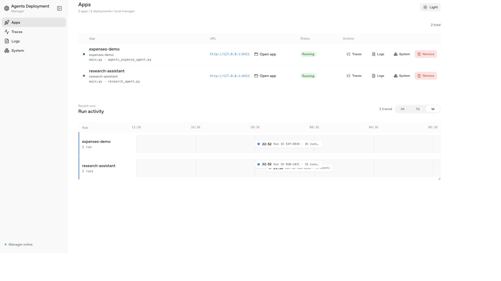
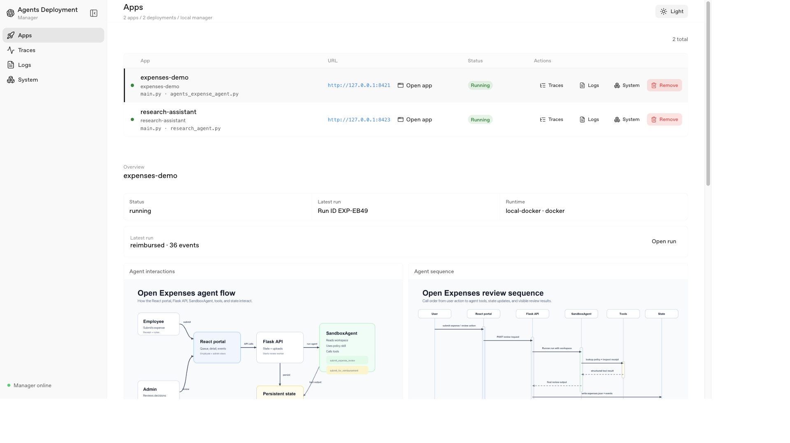
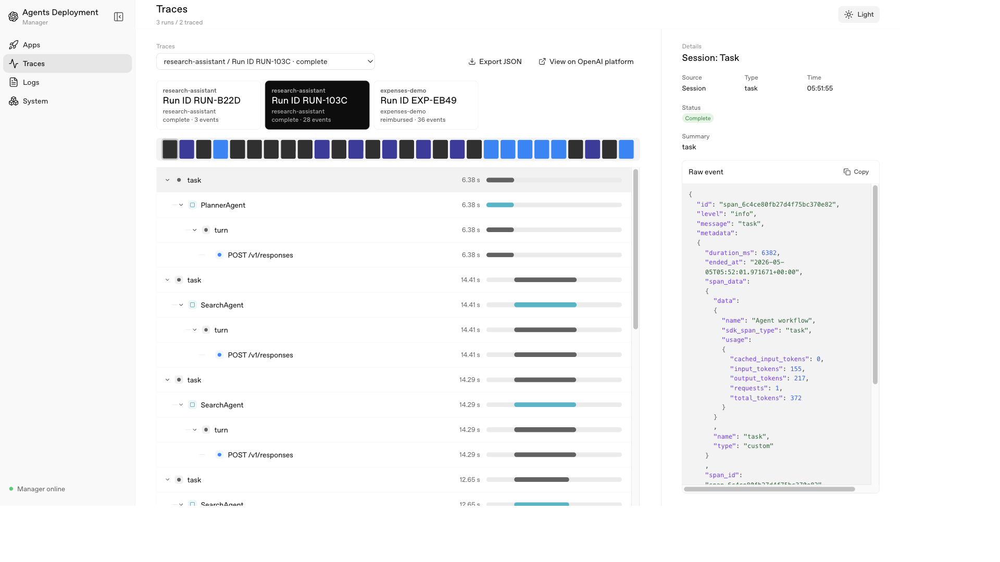

# Agents SDK Deployment Manager

Local control-plane app for running and observing Agents SDK demo projects.

## Prerequisites

- `uv`
- `npm`
- Docker, when using the default `local-docker` target

## Run

```bash
make run
```

Open:

```text
http://127.0.0.1:8732
```

Vite builds the React UI from `frontend/` into `dist/`, and the Flask backend
serves `dist/` plus `/api/*`.

## Screenshots

### Deployments



### App details



### Traces



## Scope

- Import a local Agents SDK project.
- Inspect entrypoints, dependencies, env vars, and sandbox usage.
- Create a local deployment record.
- Start and stop the app/orchestrator as a labeled Docker container by default.
- Generate or reuse an app-level Dockerfile for containerized deployment.
- Show deployment logs, traces, app events, and Docker container activity.
- Label sandbox containers with `agents-sdk.*` metadata so the manager can map a
  Docker container back to its deployment and run.

For Docker deployments, the default target builds an app Dockerfile and runs the
orchestrator with:

```bash
docker run -p 127.0.0.1:<app-port>:<app-port> -v /var/run/docker.sock:/var/run/docker.sock ...
```

The Docker socket mount lets `SandboxAgent` create sandbox containers through Docker.

The manager sets `AGENTS_SDK_MANAGER`, `AGENTS_SDK_PROJECT`,
`AGENTS_SDK_DEPLOYMENT_DATA_DIR`, and `AGENTS_SDK_MANAGER_TRACE_ENDPOINT` on the
app process. Trace capture is posted back to the manager and stored in the
manager-owned SQLite database.

## Deployable App Contract

Apps deployed through this manager should have:

- `pyproject.toml` with `openai-agents` in the dependencies.
- `main.py` as the app entrypoint.
- `PORT` support for local startup.
- `uv run python main.py` starting the HTTP service when `PORT` is set.
- A `/health` readiness endpoint.

Keep CLI-only smoke behavior behind explicit arguments or the no-`PORT` path so
the generated Dockerfile can start the service reliably.

## Tracing

Tracing is captured locally through the manager's HTTP ingestion endpoint while
the Agents SDK still streams traces to the OpenAI Platform through its default
processor.

When the manager starts an app it adds `runtime/trace_capture` to `PYTHONPATH`
and sets:

```text
AGENTS_SDK_MANAGER_TRACE_ENDPOINT=http://<manager-host>:8732/api/traces/ingest
AGENTS_SDK_DEPLOYMENT_ID=<deployment-id>
AGENTS_SDK_PROJECT_ID=<project-id>
```

For local-process deployments `<manager-host>` is `127.0.0.1`. For Docker
deployments it is `host.docker.internal` so the container can reach the manager
running on the host.

The runtime package uses `sitecustomize.py` to install a lightweight Agents SDK
trace processor inside the app process with `add_trace_processor()`. That adds a
second local destination without replacing the SDK's default OpenAI Platform
exporter. The local processor posts exported trace records to the manager:

- `trace_start`
- `trace_end`
- `span_start`
- `span_end`

The manager stores traces in `state/traces.sqlite3`. The backend reads that
SQLite store in `app/timeline.py`, groups records by `trace_id`, derives the run
key from trace metadata (`expense_id`, `run_id`, or `session_id`), then falls
back to `group_id` and finally the `trace_id`. The UI uses those reconstructed
records for the Traces view, nested span list, event detail pane, trace deep
links via `?trace_id=...`, and JSON export.

This means local tracing keeps working without bind-mounting trace files into app
containers and without fetching spans from the OpenAI Platform dashboard API.

## Make Targets

```bash
make start
make health
make deploy PROJECT_PATH=/path/to/agents-sdk-app APP_PORT=8421 SANDBOX_BACKEND=docker
make deploy PROJECT_PATH=/path/to/agents-sdk-app APP_PORT=8421 TARGET=local-process
make stop
```
