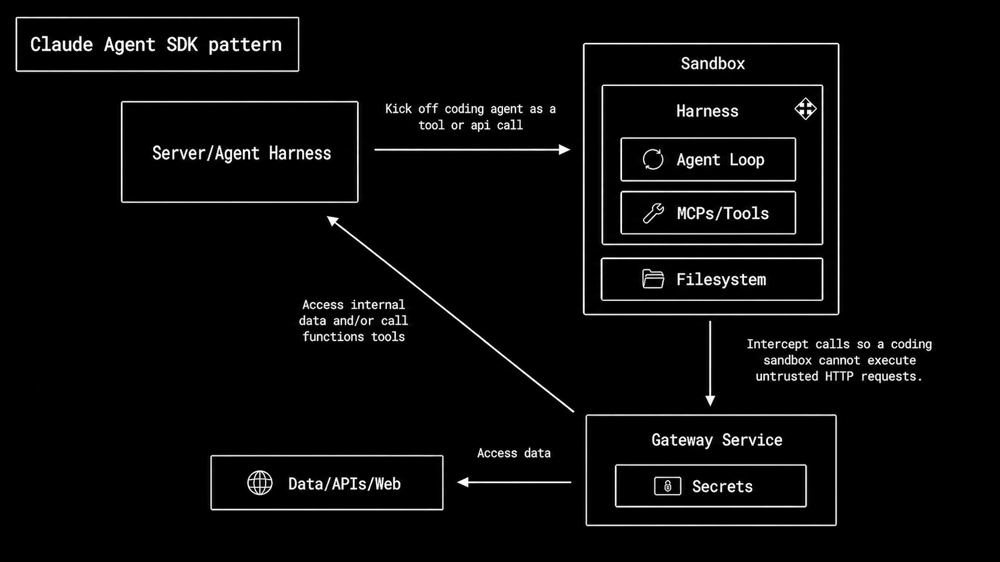
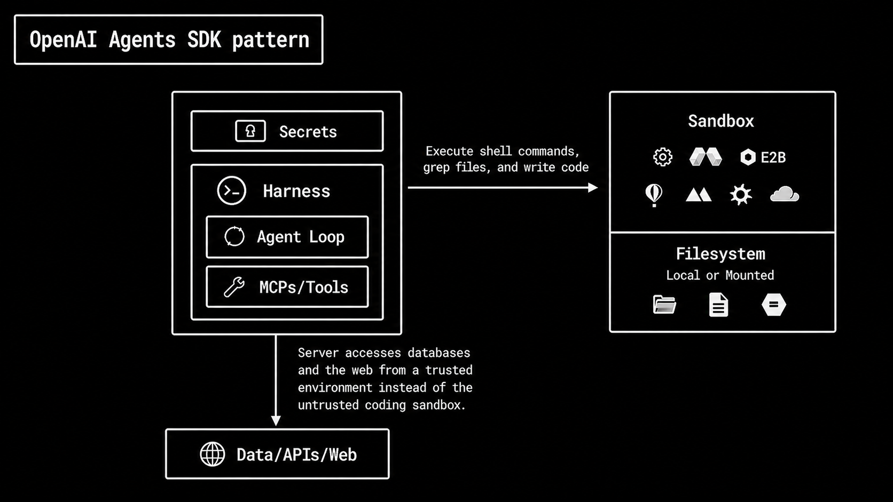

# Migrate from the Claude Agent SDK to the OpenAI Agents SDK

## Why migrate

The updated [OpenAI Agents SDK](https://developers.openai.com/api/docs/guides/agents) gives teams a model-native harness for building agents that can coordinate across tools, files, memory, approvals, and sandbox compute. It's open source, so teams can inspect and customize runtime behavior. Instead of rebuilding these pieces around each model integration, you can use a standard SDK that keeps the core agent loop visible and customizable.

Many Claude Agent SDK applications follow the Claude Code operating model: load project instructions, load skills, expose file/shell/web tools, optionally define subagents, and let the Claude harness operate inside a workspace. The new OpenAI Agents SDK gives teams a more explicit split between the agent harness and the compute environment.

The most important architectural difference:

- **Claude Agent SDK pattern:** the harness runs inside the sandbox. The sandbox contains the agent loop, MCP/tools, filesystem access, and the execution environment.
- **New OpenAI Agents SDK pattern:** the harness is separate from compute. The trusted application runtime owns the agent loop, tools, approvals, secrets, guardrails, tracing, and business-system access.

By the end of the guide, you should have a migrated app that preserves the original Claude app behavior while making execution, safety, state, and ownership explicit.

## Architecture

### Sandbox as a tool

Claude Agent SDK applications follow the Claude Code operating model: the sandbox is the agent's main workspace. The agent loop, tools, filesystem, and execution environment often live together. A gateway may sit between the sandbox and internal systems so the sandbox can make controlled requests without directly holding sensitive credentials.

<figure>
  
  <figcaption>
    Claude Agent SDK apps often put the harness and execution environment in the
    same sandbox boundary.
  </figcaption>
</figure>

In the OpenAI Agents SDK pattern, the harness is separate from the compute (sandbox). The sandbox is a tool the harness can call when the agent needs scoped compute, filesystem access, code execution, artifacts, or executable skills.

<figure>
  
  <figcaption>
    OpenAI Agents SDK apps keep orchestration in the trusted runtime and use the
    sandbox as an execution surface.
  </figcaption>
</figure>

Keep trusted control in the host application, and use the sandbox only for workspace-centric execution.

This is safer and easier to operate because secrets, approval decisions, and business-system access stay outside the execution environment. The app controls the inputs, outputs, and approvals for the sandbox.

### Skills and instruction files

When migrating Claude Agent SDK projects, split instruction and skill files by responsibility.

| Claude                                 | OpenAI                            | Migration rule                                                                                 |
| -------------------------------------- | --------------------------------- | ---------------------------------------------------------------------------------------------- |
| `CLAUDE.md` product behavior           | `Agent.instructions`              | Keep the agent role, task policy, tool-use rules, and response format here.                    |
| `CLAUDE.md` repo or workspace guidance | `AGENTS.md`                       | Keep repo-wide conventions, test commands, output paths, and non-default workspace rules here. |
| `.claude/skills/*/SKILL.md`            | `.agents/skills/*/SKILL.md`       | Convert reusable workflows into OpenAI skills.                                                 |
| Skill references, templates, examples  | `references/` or `assets/`        | Keep reference material out of the main prompt.                                                |
| Skill scripts or executables           | Sandbox-backed skill execution    | Run executable skill logic in a sandbox.                                                       |
| `.claude/agents/*.md`                  | Explicit `Agent(...)` definitions | For each Claude subagent, create a named `Agent(...)` and clear instructions.                  |

Separate the agent identity, reusable workflows, reference material, executable logic, and runtime configuration.

### Lifecycle callbacks and permissions

A Claude lifecycle callback can inspect a tool call, decide whether it should continue, block it, or ask for permission. OpenAI lifecycle callbacks work differently. They tell your application what's happening during a run, but they're not the main place for approvals and permissions.

Migrate read-only Claude callbacks (for example, logging or telemetry) to OpenAI callbacks. Migrate Claude callbacks that approve, or reshape execution to OpenAI guardrails or approvals.

| Use of callback              | Claude pattern                     | Migration to OpenAI                    |
| ---------------------------- | ---------------------------------- | -------------------------------------- |
| Log a tool call              | `PreToolUse` / `PostToolUse`       | `RunHooks` or `AgentHooks`             |
| Block a risky tool call      | Callback returns a blocking result | Tool guardrail or approval             |
| Ask a human before an action | Permission callback                | `needs_approval` and `RunState` resume |

### Subagents and ownership

The OpenAI Agents SDK makes agent-ownership explicit.

Use `agent.as_tool(...)` when the lead agent should stay in control, call specialists, combine their outputs, and produce the final answer.

Use `handoffs=[...]` when the specialist should take over the conversation and own the final response.

### What you migrate

Most migrations come down to ten decisions:

| Claude concept            | Migration                                                                                                        |
| ------------------------- | ---------------------------------------------------------------------------------------------------------------- |
| Sandbox boundary          | Decide what to run in isolated compute vs trusted runtime                                                        |
| Instructions and skills   | Map `CLAUDE.md` / agent instructions to `Agent.instructions`; convert reusable workflows into OpenAI skills.     |
| Custom tools              | Convert business/domain actions into typed `@function_tool` functions                                            |
| Built-in tools            | Choose the right execution surface: hosted, local/runtime, or sandbox-based                                      |
| Guardrails                | Add guardrails at input, output, and tool boundaries                                                             |
| Agent loop                | Use `Runner.run(...)`                                                                                            |
| Multi-agent ownership     | Use `agent.as_tool(...)` to keep the orchestrator in control, or pass control to specialist via `handoffs=[...]` |
| Conversation continuation | Choose separate strategies for conversation context, paused-run resume, and sandbox-session resume               |
| Approvals                 | Gate side effects behind human approval and resume from interruptions                                            |

Start by identifying the behavior each Claude capability provided, then choose the OpenAI surface that preserves that behavior with the right execution and safety boundary.

## Running example: Flight booking assistant

This guide uses a sample flight-booking assistant as a running example.

The baseline Claude app:

- Searches available flights.
- Checks travel policy.
- Recommends a compliant option when available.
- Recommends escalation when options are outside policy.

Example user request:

```text
Book SFO to JFK on 2026-05-10 under $700.
```

### Shared domain behavior

The Claude and OpenAI examples below use this data and policy rule.

```python
from dataclasses import asdict, dataclass


@dataclass
class Flight:
    flight_id: str
    origin: str
    destination: str
    date: str
    departure_time: str
    arrival_time: str
    price_usd: int
    refundable: bool


FLIGHTS = [
    Flight("AS-301", "SFO", "JFK", "2026-05-10", "08:10", "16:45", 642, True),
    Flight("UA-882", "SFO", "JFK", "2026-05-10", "11:20", "19:58", 735, True),
    Flight("DL-441", "SFO", "JFK", "2026-05-10", "13:05", "21:35", 689, False),
]


def flight_to_dict(flight: Flight) -> dict:
    return asdict(flight)


def find_flight(flight_id: str) -> Flight | None:
    return next((flight for flight in FLIGHTS if flight.flight_id == flight_id), None)


def policy_verdict(flight: Flight, max_price_usd: int) -> dict:
    within_budget = flight.price_usd <= max_price_usd
    compliant = within_budget and flight.refundable
    reasons = []

    if not within_budget:
        reasons.append(f"price_usd exceeds max_price_usd={max_price_usd}")
    if not flight.refundable:
        reasons.append("flight is non-refundable")

    return {
        "flight_id": flight.flight_id,
        "compliant": compliant,
        "reasons": reasons or ["within budget and refundable"],
    }
```

## Baseline Claude Agent SDK implementation

In the Claude Agent SDK, `ClaudeAgentOptions` configures agent behavior.

Tool exposure and tool approval are separate controls. `tools` selects the base set of built-in Claude Code tools, and `mcp_servers` adds MCP server tools to the session. `allowed_tools` is a permission allowlist: matching tool calls are automatically approved, but unlisted tools aren't removed from Claude's tool set.

For this example, the Claude app adds one in-process MCP server with two custom business tools, then automatically approves those two tool calls so the demo can run without approval prompts:

- `search_flights` - retrieves candidate flights by route, date, and budget.
- `check_travel_policy` - evaluates a candidate flight against the budget and refund policy.

### Claude custom tools

```python
from typing import Any
import asyncio
import json

from claude_agent_sdk import (
    AssistantMessage,
    ClaudeAgentOptions,
    ClaudeSDKClient,
    ResultMessage,
    TextBlock,
    create_sdk_mcp_server,
    tool,
)


@tool(
    "search_flights",
    "Search flights for a route and date under a maximum budget.",
    {
        "type": "object",
        "properties": {
            "origin": {"type": "string"},
            "destination": {"type": "string"},
            "date": {"type": "string"},
            "max_price_usd": {"type": "integer"},
        },
        "required": ["origin", "destination", "date"],
    },
)
async def search_flights(args: dict[str, Any]) -> dict[str, Any]:
    max_price_usd = args.get("max_price_usd", 9999)
    matches = [
        flight_to_dict(flight)
        for flight in FLIGHTS
        if flight.origin == args["origin"]
        and flight.destination == args["destination"]
        and flight.date == args["date"]
        and flight.price_usd <= max_price_usd
    ]
    return {
        "content": [
            {"type": "text", "text": json.dumps({"flights": matches})}
        ]
    }


@tool(
    "check_travel_policy",
    "Check whether a flight is compliant with travel policy.",
    {
        "type": "object",
        "properties": {
            "flight_id": {"type": "string"},
            "max_price_usd": {"type": "integer"},
        },
        "required": ["flight_id", "max_price_usd"],
    },
)
async def check_travel_policy(args: dict[str, Any]) -> dict[str, Any]:
    flight = find_flight(args["flight_id"])
    if flight is None:
        return {
            "content": [
                {
                    "type": "text",
                    "text": json.dumps(
                        {"flight_id": args["flight_id"], "error": "not_found"}
                    ),
                }
            ],
            "is_error": True,
        }

    verdict = policy_verdict(flight, args["max_price_usd"])
    return {"content": [{"type": "text", "text": json.dumps(verdict)}]}
```

### Claude run loop

```python
travel_tools = create_sdk_mcp_server(
    name="travel",
    version="1.0.0",
    tools=[search_flights, check_travel_policy],
)

options = ClaudeAgentOptions(
    system_prompt=(
        "You help users evaluate flight options. "
        "Always search flights and check travel policy before recommending. "
        "Recommend a compliant option when one exists. "
        "If no compliant option exists, recommend escalation instead. "
        "Do not purchase tickets or charge a card."
    ),
    mcp_servers={"travel": travel_tools},
    # Pre-approve these travel MCP tools so the demo runs without
    # permission prompts. This does not hide or disable other tools.
    # Use `tools` and/or `disallowed_tools` for hard availability limits.
    allowed_tools=[
        "mcp__travel__search_flights",
        "mcp__travel__check_travel_policy",
    ],
)


async def main() -> None:
    async with ClaudeSDKClient(options=options) as client:
        await client.query("Book SFO to JFK on 2026-05-10 under $700.")

        async for message in client.receive_response():
            if isinstance(message, AssistantMessage):
                for block in message.content:
                    if isinstance(block, TextBlock):
                        print(block.text)

            if isinstance(message, ResultMessage) and message.subtype == "success":
                print("FINAL:", message.result)


asyncio.run(main())
```

Expected result: The assistant should recommend AS-301 because it's SFO to JFK on the requested date, costs $642, and is refundable. It shouldn't recommend DL-441 even though it's under $700 because the policy requires refundable fares.

### What the Claude baseline establishes

| Behavior                      | Claude implementation                                                                                                                                                                                     | Migration implementation                                                                                                                                                                             |
| ----------------------------- | --------------------------------------------------------------------------------------------------------------------------------------------------------------------------------------------------------- | ---------------------------------------------------------------------------------------------------------------------------------------------------------------------------------------------------- |
| Agent instruction hierarchy   | `ClaudeAgentOptions(system_prompt=...)`                                                                                                                                                                   | Move the instructions into `Agent(..., instructions=...)`.                                                                                                                                           |
| Custom business tools         | `@tool(...)` functions registered in `create_sdk_mcp_server(...)`                                                                                                                                         | Move each business action to `@function_tool` with typed parameters and structured return values.                                                                                                    |
| Tool exposure and permissions | `mcp_servers={...}` exposes the custom travel MCP tools. `tools=[...]` would select built-in Claude Code tools if needed. `allowed_tools=[...]` pre-approves matching calls; it doesn't hide other tools. | Put only the OpenAI tools the agent should see in `Agent.tools`. Use approval for side effects. Treat Claude automatic approval as a permission-policy decision, rather than tool-exposure decision. |
| Agent loop                    | `ClaudeSDKClient.query(...)` and `receive_response()`                                                                                                                                                     | Use `Runner.run(...)` and preserve the built-in model/tool loop.                                                                                                                                     |

## Migration path: Claude baseline to OpenAI

Use the [Claude to OpenAI Agents migrator skill](https://skillbook.app.openai.org/hillarydanan/claude-to-openai-agents-migrator) to generate a dry-run migration plan before applying this guide manually. The migrator analyzes a local repository and produces a migration plan, including targeted file-by-file edits to make.

| Claude Agent SDK                          | OpenAI Agents SDK                                                         | Migration-safe rule                                                                                                                                                                            |
| ----------------------------------------- | ------------------------------------------------------------------------- | ---------------------------------------------------------------------------------------------------------------------------------------------------------------------------------------------- |
| `ClaudeAgentOptions` + `system_prompt`    | `Agent(name, instructions, model, tools)`                                 | Define one responsibility per agent.                                                                                                                                                           |
| `CLAUDE.md`, `.claude/skills/*/SKILL.md`  | `AGENTS.md`, OpenAI skills, agent instructions                            | Map workspace guidance to `AGENTS.md`, reusable procedures to skills, and agent behavior to instructions.                                                                                      |
| `@tool` schema + handler                  | `@function_tool`                                                          | Map business behavior. Use typed parameters and structured return values for business actions.                                                                                                 |
| `tools`, `mcp_servers`, `allowed_tools`   | `Agent.tools` plus approvals where needed                                 | Map tool exposure and approval. Tools and `mcp_servers` expose Claude tools. Expose callable tools through `Agent.tools` and add approval gates for sensitive actions.                         |
| Built-in Read/Edit/Bash/WebSearch         | Hosted tools, `ShellTool`, `ApplyPatchTool`, or sandbox                   | Choose based on execution boundary.                                                                                                                                                            |
| Lifecycle callbacks and permission checks | Callbacks, guardrails, approvals, and filters                             | In OpenAI, `RunHooks` and `AgentHooks` are mainly for lifecycle side effects like logging and tracing. Use guardrails, approvals, or filters when the app needs to block or approve execution. |
| Subagents                                 | `agent.as_tool(...)` or `handoffs=[...]`                                  | Use `agent.as_tool(...)` when the main agent keeps control. Use handoffs when the specialist agent takes over.                                                                                 |
| `query(...)` or `ClaudeSDKClient`         | `Runner.run(...)`                                                         | Keep the built-in SDK loop.                                                                                                                                                                    |
| Claude sessions / client continuity       | `Session`, `previous_response_id`, `conversation_id`, or explicit history | Choose one continuation strategy per conversation.                                                                                                                                             |

### OpenAI migrated custom tools

The business actions become Python functions. The function name, type hints, documentation string, and return value become the model-facing tool contract.

```python
from agents import Agent, Runner, function_tool


@function_tool
def search_flights(
    origin: str,
    destination: str,
    date: str,
    max_price_usd: int = 9999,
) -> list[dict]:
    """Search flights for a route and date under a maximum budget."""
    return [
        flight_to_dict(flight)
        for flight in FLIGHTS
        if flight.origin == origin
        and flight.destination == destination
        and flight.date == date
        and flight.price_usd <= max_price_usd
    ]


@function_tool
def check_travel_policy(flight_id: str, max_price_usd: int) -> dict:
    """Check whether a flight is compliant with travel policy."""
    flight = find_flight(flight_id)
    if flight is None:
        return {"flight_id": flight_id, "error": "not_found"}
    return policy_verdict(flight, max_price_usd)
```

### OpenAI migrated agent and run loop

```python
agent = Agent(
    name="Flight Booking Assistant",
    model="gpt-5.5",
    instructions=(
        "You help users evaluate flight options. "
        "Always search flights and check travel policy before recommending. "
        "Recommend a compliant option when one exists. "
        "If no compliant option exists, recommend escalation instead. "
        "Do not purchase tickets or charge a card."
    ),
    tools=[search_flights, check_travel_policy],
)

result = await Runner.run(
    agent,
    "Book SFO to JFK on 2026-05-10 under $700.",
)
print(result.final_output)
```

Expected result: The final response should still recommend AS-301 or explain escalation if the request changes so no compliant option exists.

## Step-by-step migration

### Step 1: Define the first OpenAI agent

If one Claude agent handled a single task end to end, that often maps to one OpenAI Agent.

For the flight booking example:

- **Agent:** Flight Booking Assistant
- **Responsibility:** Search flights, check policy, and recommend booking or escalation.

### Step 2: Port custom tools

Port custom tools in this order:

1. Keep the business action unchanged.
2. Tighten the function signature.
3. Write function documentation that explains when to use the tool.
4. Return structured data the agent can inspect.

Default rule:

Map custom tools by behavior. Domain actions such as `search_flights` or `check_travel_policy` become `@function_tool` functions. Don't port generic file or shell primitives as custom business tools.

### Step 3: Map built-in tools by execution boundary

Claude apps often expose file/bash tools. While migrating, don't create them as custom business tools.

Use `@function_tool` for business or domain actions. Use hosted tools for OpenAI-managed retrieval or execution. Use `ShellTool` or `ApplyPatchTool` for occasional local/runtime actions. Use `SandboxAgent` with sandbox capabilities when the task needs an isolated workspace.

| Claude capability                              | OpenAI migration                                                                                                                                                |
| ---------------------------------------------- | --------------------------------------------------------------------------------------------------------------------------------------------------------------- |
| Web search or external lookup                  | Use `WebSearchTool` for web search, `HostedMCPTool` for remote MCP tools, or a typed `@function_tool` when the lookup is a business-system action.              |
| Retrieval over indexed files or knowledge base | Use `FileSearchTool` for retrieval over OpenAI vector stores.                                                                                                   |
| Business system call                           | Use `@function_tool` or MCP in the trusted runtime.                                                                                                             |
| Shell command or script                        | Use hosted/local `ShellTool` for occasional shell access. Use `SandboxAgent` with `Shell()` when commands should run inside an isolated or resumable workspace. |
| File read, edit, or search                     | Use `SandboxAgent` with `Shell()` and, when needed, `Filesystem()` for workspace file inspection, search, or generated artifacts.                               |
| Patch or code edit                             | Use `SandboxAgent` with `ApplyPatch()` and `Shell()` for sandbox code edits and validation. Use `ApplyPatchTool` when implementing outside a sandbox.           |

Note: if the Claude app defines custom helpers such as `read_file`, `write_file`, `grep_files`, or `run_bash`, avoid porting them 1:1. Map file reads, edits, search, and shell commands to the closest built-in OpenAI tool with a sandbox workspace.

### Step 4: Move validation to the right guardrail boundary

If your Claude app relies on hooks to block actions, require approval, or change execution behavior, map that logic to the right OpenAI pattern: guardrails, approvals, or hooks.

Use guardrails for validation that should happen before the run starts, the tool executes, or the final answer returns.

| Need                                                   | OpenAI boundary                |
| ------------------------------------------------------ | ------------------------------ |
| Incoming request must contain route, date, and budget  | Input guardrail.               |
| Final answer must include recommendation or escalation | Output guardrail.              |
| Tool call must obey parameter constraints              | Tool guardrail.                |
| Action changes production state or spends money        | Approval and run-state resume. |

Example: require core booking fields before tools run.

Define the guardrail first, then attach it to the flight-booking agent. Setting the guardrail to run in blocking mode checks the request before the main agent can call any tools.

```python
from pydantic import BaseModel
from agents import (
    Agent,
    GuardrailFunctionOutput,
    RunContextWrapper,
    Runner,
    TResponseInputItem,
    input_guardrail,
)


class BookingRequestCheck(BaseModel):
    is_flight_booking_request: bool
    has_route: bool
    has_date: bool
    has_budget: bool
    reasoning: str


booking_guardrail_agent = Agent(
    name="Booking request guardrail",
    model="gpt-5.5-mini",
    instructions=(
        "Decide whether the user is asking for a flight-booking recommendation. "
        "The request is ready only if it includes a route, travel date, and budget."
    ),
    output_type=BookingRequestCheck,
)


@input_guardrail(run_in_parallel=False)
async def require_ready_booking_request(
    ctx: RunContextWrapper[None],
    agent: Agent,
    user_input: str | list[TResponseInputItem],
) -> GuardrailFunctionOutput:
    result = await Runner.run(
        booking_guardrail_agent,
        user_input,
        context=ctx.context,
    )
    check = result.final_output
    ready = (
        check.is_flight_booking_request
        and check.has_route
        and check.has_date
        and check.has_budget
    )
    return GuardrailFunctionOutput(
        output_info=check,
        tripwire_triggered=not ready,
    )


agent = Agent(
    name="Flight Booking Assistant",
    model="gpt-5.5",
    instructions=(
        "You help users evaluate flight options. "
        "Always search flights and check travel policy before recommending. "
        "Recommend a compliant option when one exists. "
        "If no compliant option exists, recommend escalation instead. "
        "Do not purchase tickets or charge a card."
    ),
    tools=[search_flights, check_travel_policy],
    input_guardrails=[require_ready_booking_request],
)
```

### Step 5: Choose multi-agent ownership

Two canonical patterns:

- Use `agent.as_tool(...)` when the manager agent should remain the final-response owner.
- Use `handoffs=[...]` when the specialist should take over and own the final response.

The key question is ownership.

#### Pattern A: Specialist as a tool

Use this pattern when the main orchestrator agent should stay in control. The specialist runs as a tool, returns a narrow result, and lets the orchestrator decide what to do next and how to answer the user.

```python
from agents import Agent, ModelSettings, Runner


pricing_specialist = Agent(
    name="Pricing Specialist",
    model="gpt-5.5",
    instructions="Analyze candidate flights and return a short pricing verdict.",
)

manager = Agent(
    name="Travel Manager",
    model="gpt-5.5",
    instructions=(
        "Call pricing_tool first, then give the final customer-facing recommendation yourself."
    ),
    tools=[
        pricing_specialist.as_tool(
            tool_name="pricing_tool",
            tool_description="Analyze flight pricing and policy fit.",
        )
    ],
    model_settings=ModelSettings(tool_choice="required"),
)

# Expected final owner: Travel Manager.
```

#### Pattern B: Handoff to specialist

Use this pattern when the specialist agent should take over. The orchestrator hands off the conversation, and the specialist becomes responsible for the next steps and the final response.

```python
booking_specialist = Agent(
    name="Booking Specialist",
    model="gpt-5.5",
    instructions="You own final flight-booking recommendations once transferred.",
)

triage = Agent(
    name="Travel Triage",
    model="gpt-5.5",
    instructions="Always hand off flight-booking tasks to Booking Specialist.",
    handoffs=[booking_specialist],
    model_settings=ModelSettings(tool_choice="required"),
)

# Expected final owner: Booking Specialist.
```

### Step 6: Choose one conversation-state strategy

| Strategy               | Use when                                                                 |
| ---------------------- | ------------------------------------------------------------------------ |
| `session`              | You want to persist local conversation history.                          |
| `previous_response_id` | You continue from the immediate previous response.                       |
| `conversation_id`      | You want server-managed durable conversation state.                      |
| Explicit input history | You want your application to fully control which prior items to include. |

Important distinction: conversation continuation carries context into new turns; run-state resume continues the same paused run after interruption.

### Step 7: Add approvals for side effects with human review

Use approvals when an action should require human approval, such as charging a card, deleting data, or changing production state.

Approval lifecycle:

1. Run reaches an approval point.
2. Run pauses.
3. Interruptions surface for review.
4. App approves or rejects.
5. Same run resumes from RunState.

```python
@function_tool(needs_approval=True)
async def add_checked_bag(booking_id: str, bags: int) -> dict:
    """Add checked bags to an existing booking after human approval."""
    return {
        "booking_id": booking_id,
        "bags_added": bags,
        "status": "submitted",
    }


# `agent` should include `add_checked_bag` in its `tools` list.
first = await Runner.run(agent, "Add one checked bag to booking AS-301.")
state = first.to_state()

for interruption in first.interruptions:
    state.approve(interruption)  # or state.reject(interruption)

resumed = await Runner.run(agent, state)
print("FINAL:", resumed.final_output)
```

## Final validation checklist

Check the migration one building block at a time before composing the full app.

| Area                  | Pass condition                                                                                                                                                              |
| --------------------- | --------------------------------------------------------------------------------------------------------------------------------------------------------------------------- |
| Agent boundary        | One clear responsibility maps to one OpenAI agent.                                                                                                                          |
| Custom tools          | Typed parameters, clear function documentation, structured returns; generic file/shell primitives map to `ShellTool` / `ApplyPatchTool` (or sandbox), not 1:1 custom tools. |
| Built-in tool mapping | Each tool has an explicit execution boundary.                                                                                                                               |
| Built-in loop         | `Runner.run(...)` handles the normal model/tool loop.                                                                                                                       |
| Guardrails            | Complete requests pass; incomplete inputs trigger the expected guardrail.                                                                                                   |
| Multi-agent ownership | `agent.as_tool(...)` preserves parent ownership; handoff transfers ownership.                                                                                               |
| Continuation          | Prior turns carry through the chosen strategy consistently.                                                                                                                 |
| Approvals             | Approval-gated actions pause, surface interruptions, then resume or reject cleanly.                                                                                         |
| Sandbox               | Agent access stays limited to the intended workspace and execution surface.                                                                                                 |
| Lifecycle callbacks   | Logging and tracking callbacks map to `RunHooks` or `AgentHooks`. Callbacks that block, approve, or reshape execution map to guardrails, approvals, or filters.             |
| Subagents             | Each subagent maps to `agent.as_tool(...)` or `handoffs=[...]` with explicit ownership.                                                                                     |
| End-to-end behavior   | The migrated app preserves original Claude business behavior.                                                                                                               |

## Recommended test order

1. Run the baseline agent with migrated custom tools.
2. Add input and output guardrails.
3. Add tool-level checks only where needed.
4. Add specialist agents.
5. Check ownership with `agent.as_tool(...)` or `handoffs=[...]`.
6. Add conversation continuation.
7. Add side-effect approvals.
8. Add sandboxing if the workflow needs isolation.
9. Run Claude and OpenAI scenarios side by side.
10. Compare the final answer quality, tool calls, safety behavior, and state handling.

## Conclusion

A successful migration preserves the business task and updates the execution model.

- **Start with the migration skill.**
  Before applying this guide manually, use the [Claude to OpenAI Agents migrator skill](https://skillbook.app.openai.org/hillarydanan/claude-to-openai-agents-migrator) to generate a dry-run plan.

- **Add sandboxing where isolation matters.**
  OpenAI's Agents SDK separates the trusted application from the workspace where risky or stateful work happens. Use the sandbox when the agent needs scoped files, command execution, artifacts, or resumable workspace state.

- **Migrate business actions as explicit tools.**
  Actions such as searching flights or creating tickets should become clear business tools with typed inputs and predictable outputs. Don't rebuild generic shell or file access as business tools.

- **Keep tool access and approvals separate.**
  In Claude, tool selection and pre-approval can look related. In the OpenAI model, first decide which tools the agent can see. Then add approval checks for actions that need human review.

- **Use guardrails and approvals appropriately.**
  Use guardrails to check requests and outputs. Use approvals to pause risky side effects. Use lifecycle callbacks for logging, tracing, and audit events.

- **For multi-agent ownership, use `agent.as_tool(...)` when the main agent should stay in charge.**
  Use `handoffs=[...]` when a specialist should own the final response.
