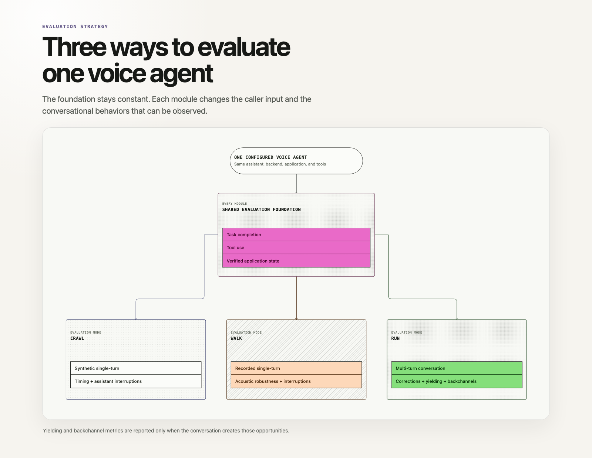

# Evaluating full-duplex voice agents

This repository contains three independently usable evaluation harnesses for the same GPT Live voice assistant:
1. CRAWL: synthetic single-turn requests.
2. WALK: recorded single-turn requests.
3. RUN: simulated multi-turn conversations.

Each harness measures whether the assistant achieves the intended outcome, uses tools appropriately, and handles the spoken interaction.

Use them independently or together to progress from repeatable synthetic checks to recorded-audio robustness and full multi-turn behavior.

RUN uses a **GPT Live simulated caller with a managed Responses backend**. This caller
continuously listens and speaks alongside the evaluated assistant. The exchange
is not turn based. The caller can delegate to independent `gpt-5.6-luna`
reasoning at low effort to support its private goal and agenda; it has no application tools.

An independent semantic observer recognizes when live conversations are
resolved or terminally refused and drains remaining audio and pending work without
controlling either participant.

Caller intent and some voice-interaction metrics are inferred from the
recorded audio and transcript after the conversation.



Yielding and backchannel metrics are reported only when the conversation
creates those opportunities. See the [interaction metric v2 contract](docs/metrics-contract.md)
for exact timing, response deadlines and denominators, caller-validity gates,
and compatibility with historical results.

## Contents

1. [The evaluation strategy](#1-the-evaluation-strategy)
2. [Choose an evaluation module](#2-choose-an-evaluation-module)
3. [Set up and run](#3-set-up-and-run)
4. [What each module evaluates](#4-what-each-module-evaluates)
5. [Results and metrics](#5-results-and-metrics)
6. [Bring your own agent](#6-bring-your-own-agent)
7. [Configuration and architecture](#7-configuration-and-architecture)
8. [Current scope and limitations](#8-current-scope-and-limitations)
9. [Verification](#9-verification)

## 1. The evaluation strategy

Voice-agent evaluations vary along two independent dimensions:

- **Task complexity:** one spoken request versus an interactive conversation.
- **Audio source:** synthetically generated speech versus a saved caller recording.

| Task complexity | Synthetic or simulated audio | Saved human or generated recording |
| --- | --- | --- |
| Single-turn | **CRAWL:** synthesize one request and grade the response. | **WALK:** replay one WAV and grade the response. |
| Multi-turn | **RUN:** simulate a caller across a continuous conversation. | Human-led conversation; out of scope for this harness. |

All three modules use the same GPT Live frontend and can select either
delegation architecture while keeping the same application, scenarios, and
result schema. Managed versus client-owned delegation is therefore a controlled
comparison rather than a change in the underlying business task.

Audio realism is a separate dimension, not another evaluation module. WALK evaluates the acoustic conditions already present in a saved recording, while RUN can apply reproducible conditions to simulated caller audio as the conversation unfolds. Available presets are `clean`, `noisy`, `telephony`, `background_speech`, `echo`, `packet_loss`, and `realistic`. The bundled WALK WAVs are
generated demonstration fixtures; use approved human recordings to evaluate
genuine accents, devices, and environments. Approved human recordings are
strongly preferred; synthetic WALK fixtures are a fallback.

### Choose an assistant implementation

- `--assistant responses` uses GPT Live's OpenAI-managed Responses backend and
  remains the default.
- `--assistant client` uses application-managed delegation, including
  conversation context, a customer-selected backend, application tools, and
  result injection through `session.commentary.append`.

The delegation mode is fixed for each session; switching implementations
starts a new session.

Both implementations use the same authorized instructions and application
tools. Private scenario expectations, grading criteria, and caller agenda never
enter either assistant. Client delegation prefers actual transcript events,
passes incremental timestamped conversation to the backend, and keeps backend
history under application control regardless of model provider.

```bash
# Compare the same frontend against both delegation architectures.
uv run run-eval --scenario restaurant_booking_complete --assistant responses
uv run run-eval --scenario restaurant_booking_complete --assistant client
```

Bring an existing application or backend provider through
`OPENAI_CLIENT_ASSISTANT_ENDPOINT`, or replace the bundled OpenAI reference
adapter. See [assistant implementations](assistants/README.md).


## 2. Choose an evaluation module

| Module | Input data | Ground truth | What it evaluates |
| --- | --- | --- | --- |
| [CRAWL](crawl_harness/README.md) | Text scenarios; the harness generates caller audio. | Expected answer, tool arguments, and final application state. | One synthetic spoken request and response. |
| [WALK](walk_harness/README.md) | Existing or generated WAVs and reference transcripts. | Expected answer, tool arguments, and final application state. | One recorded spoken request and response. |
| [RUN](run_harness/README.md) | An opening request, caller persona, follow-ups, and initial state. | Expected outcome, authorized actions, and final application state. | A continuous, full-duplex conversation. |

Use CRAWL for broad functional coverage, WALK for audio robustness, and RUN
for interactive behavior. The modules are independently runnable; a customer
does not need a conversation simulator to run a useful single-turn evaluation.
CRAWL and WALK retain separate execution lifecycles.

### Data requirements

Each module owns its dataset and can be used independently:

- **CRAWL:** provide JSON scenarios containing the caller's text, expected
  answer, expected tools, and expected final state. No existing recordings
  are required. See [the synthetic example dataset](crawl_harness/data/scenarios.json).
- **WALK:** provide the same JSON scenario structure, attaching one WAV to
  each scenario. `input.text` is the reviewed reference transcript; only the
  recording's decoded PCM samples, never its WAV container or reference text,
  are streamed to the assistant. If human audio is unavailable, generate
  reusable synthetic WAVs with controlled acoustic conditions before running
  WALK. Recording condition and metadata such as language, accent, and
  microphone are preserved in the results. See
  [the recorded-audio example dataset](walk_harness/data/scenarios.json).
- **RUN:** provide JSON scenarios describing the opening request, initial
  application state, caller persona, possible follow-ups, expected outcome,
  required tools, and optional procedure. The harness generates and paces the
  caller's speech. See
  [the multi-turn example dataset](run_harness/data/scenarios.json).

Expected answers, reference transcripts, expected tools, and grading criteria
are **evaluator-owned ground truth**. The RUN caller separately owns its goal,
private facts, and conditional conversation objectives. Neither evaluator-only
ground truth nor the caller's private brief is injected into the assistant's
instructions. The caller can disclose its own facts through the spoken conversation.

### Common scenario format

All three modules use the same versioned JSON contract:

```json
{
  "schema_version": "1.0",
  "scenarios": [
    {
      "id": "customer_booking",
      "title": "Book a table",
      "type": "booking",
      "interaction": "single_turn",
      "tags": ["booking"],
      "input": {
        "text": "Book a table for Maya on August 7 at 7 p.m. for two."
      },
      "application": {
        "initial_state": {}
      },
      "expected": {
        "answer": "Confirm Maya's reservation.",
        "criteria": ["Book and confirm the requested table."],
        "delegation": "required",
        "tools": {
          "required": [
            {
              "name": "create_reservation",
              "arguments": { "guest_name": "Maya", "party_size": 2 }
            }
          ]
        },
        "state": { "reservation_created": true },
        "golden_path": { "turns": 2 }
      }
    }
  ]
}
```
#### Scenario fields
Every module uses the same top-level `id`, `title`, `type`, `interaction`,
`tags`, `input`, `application`, and `expected` fields. `type` explicitly
classifies the business task independently of tag ordering; shared types
include `booking`, `availability`, `cancellation`, `clarification`,
`information`, and `refusal`.

#### Tool expectations
One caller request can require multiple ordered application tools. List each
expected call in `expected.tools.required`. CRAWL and WALK enforce those calls as an ordered tool contract. RUN treats them as preferred-tool diagnostics and, when present, uses `expected.procedure` for diagnostic procedure and order checks. Delegation can be `required`,
`forbidden`, or `optional`.

#### Tier-specific fields
WALK adds `input.recordings`; RUN uses `"interaction": "multi_turn"`, adds an
optional evaluator-owned `expected.procedure`, and adds caller-owned
`simulation_parameters`:

```json
{
  "simulation_parameters": {
    "goal": "Book the table for Maya at 7 p.m.",
    "known_facts": { "guest_name": "Maya", "time": "19:00" },
    "agenda": [
      {
        "id": "provide_name",
        "commitment": "Give the caller's name when the assistant needs it.",
        "trigger_condition": "The assistant asks who the reservation should be under.",
        "completion_condition": "The caller provides Maya as the reservation name.",
        "action": "answer",
        "facts": ["guest_name"],
        "response_hint": "Under Maya, please."
      }
    ]
  }
}
```
> **Note:** The preceding `simulation_parameters` fragment is abbreviated, not a complete valid RUN scenario. A valid RUN scenario requires at least two substantive agenda objectives, caller-owned known facts, and a golden path of at least seven turns as a scenario-quality guard. These requirements do not guarantee that a live conversation will take seven turns.

The caller model interprets objectives against the actual conversation; response
hints do not prescribe exact wording. All modules support authorized prior context
through `input.context`: `summary` extends assistant instructions, while structured
`history` becomes text-only GPT Live `input`. Startup history supports at
most 128 ordered messages and 8,192 rendered tokens; it restores text context,
not historical audio, interruptions, pending work, or hidden session state. RUN requires at least two substantive caller objectives,
caller-owned facts, and a golden path of at least seven turns; procedures are optional.

One JSON file may contain several kinds of scenarios. CRAWL selects
single-turn requests, WALK selects single-turn requests with attached
recordings, and RUN selects multi-turn conversations. Alternatively, keep a
separate dataset per independently deployed module, as the bundled examples
do. Pass either layout through the common `--data` argument.

## 3. Set up and run

### Requirements

- Python 3.12 or later and `uv`.
- An OpenAI API key for a project with access to GPT Live and the
  configured supporting models.
- Outbound HTTPS and WebSocket access to the configured OpenAI endpoint.
- An audio output device only when using `--listen`; WALK recordings must be
  mono, 16-bit PCM WAV files at 24 kHz.

The harness uses the GPT Live v3 WebSocket endpoint `/v1/live/sessions` with
Bearer authentication. It sends `session.start` with the model and
configuration in `session`, then waits for `session.started` before streaming
audio. The endpoint has no model query parameter.

Audio is raw mono signed 16-bit little-endian PCM at 24 kHz. The v3 API also
supports 16 kHz PCM and 8 kHz G.711, but this harness implements only the 24 kHz
PCM path. The `telephony` preset simulates telephone-band acoustics within it.

The assistant and evaluation models have built-in defaults. Override them in
your local `.env` when necessary; [.env.example](.env.example) is only a
template and is never loaded at runtime:

| Purpose | Default model | Required for |
| --- | --- | --- |
| Target voice assistant | `gpt-live-1` | All live evaluations. |
| Delegated reasoning and tools | `gpt-5.6-terra` | Scenarios requiring backend delegation. |
| Caller speech generation | `gpt-4o-mini-tts` | CRAWL and optional synthetic WALK fixture generation. |
| Simulated caller | `gpt-live-1` | RUN's GPT Live caller frontend. |
| Caller reasoning | `gpt-5.6-luna` (low effort) | RUN caller Responses delegation; configured independently in `run_harness/config.toml`. |
| Conversation completion | `gpt-5.6-terra` | RUN's independent completion observer, enabled by default. |
| Semantic grading | `gpt-5.6-terra` | Live semantic evaluation; RUN can disable it with `--no-judge`. |

The configured models must be enabled for your API project; installing this
package does not grant model access. Verify the selected models and their
supported settings before a live run.

Clone the Cookbook and enter the harness directory:

```bash
git clone https://github.com/openai/openai-cookbook.git
cd openai-cookbook/examples/audio/duplex_voice_agent_evaluation
```

From this directory, install the locked dependencies:

```bash
uv sync --locked
```

For optional `--listen` playback, run `uv sync --locked --extra playback`. A normal
wheel installation is also supported. See [installation and path rules](#installed-package-and-paths)
for writable output/cache defaults, explicit environment-file selection, and
installed-package usage.

First verify one example per module without an API key or model calls:

```bash
uv run crawl-eval --offline --no-real-time --example restaurant_003
uv run walk-eval --offline --no-real-time --example restaurant_003
uv run run-eval --offline --scenario restaurant_booking_complete --visualize
```

Offline audio is a deterministic test fixture, not natural speech or evidence
of live model quality. For live runs, copy `.env.example` to `.env` if you do
not already have one, then set `OPENAI_API_KEY` there or in your shell. Existing
shell values take precedence. See [environment-file selection](#environment-file-selection)
for the working-directory and explicit-file rules.

Live evaluation incurs API usage for the voice sessions and applicable TTS,
backend, observer, and judge calls. Start with one scenario and concurrency 1.
RUN's `--no-judge` disables post-run grading only; it does not disable the
completion observer or either voice participant's backend. Budgeting should
include those calls even though they are excluded from target-agent metrics.

Run one representative scenario from each module:

```bash
# Synthetic single-turn request.
uv run crawl-eval --example restaurant_003

# Existing single-turn WAV.
uv run walk-eval --example restaurant_003

# Simulated multi-turn date correction using the GPT Live caller.
uv run run-eval --scenario restaurant_date_correction

# Optional assistant-first call-center opening from an editable instruction file.
uv run run-eval --scenario restaurant_booking_complete \
  --assistant-opening-prompt assistants/frontend/prompts/assistant_first.txt

# Save an interactive viewer for one booking conversation.
uv run run-eval --scenario restaurant_booking_complete --visualize
```

All three evaluation commands accept either `--example` or `--scenario` to
select a single task.

When approved human recordings are unavailable, create a reusable synthetic
WALK recording before evaluation:

```bash
uv run walk-generate-audio \
  --data crawl_harness/data/scenarios.json \
  --example restaurant_003 \
  --output-data /tmp/walk-noisy/scenarios.json \
  --condition noisy

uv run walk-eval --data /tmp/walk-noisy/scenarios.json
```

Generation is separate from evaluation; `walk-eval` always streams the saved
WAV unchanged.

The bundled WALK catalog also includes one acoustic-preset variant for each
CRAWL scenario, alongside five clean baselines. The seven existing presets
cycle through the examples. Generate missing recordings for the pack with:

```bash
uv run walk-generate-audio \
  --data crawl_harness/data/scenarios.json \
  --output-data walk_harness/data/scenarios.json \
  --vary-conditions \
  --append \
  --seed 41
```

Existing WAVs are reused. Add `--force` to replace them; this may require new TTS calls.

Runs are quiet by default: the terminal shows only final pass/fail counts and
the saved results directory. Add `--verbose` to print protocol events,
per-scenario results, and RUN conversation events:

```bash
uv run crawl-eval --example restaurant_003 --verbose
uv run walk-eval --example restaurant_003 --verbose
uv run run-eval --scenario restaurant_date_correction --verbose
```

Set `[execution].verbose = true` in a module's `config.toml` to enable logs by
default. Protocol events are always saved as artifacts, regardless of terminal
verbosity.

Add `--listen` to hear the caller and assistant live in stereo:

```bash
uv run walk-eval --example restaurant_003 --listen
uv run run-eval --scenario restaurant_date_correction --listen
```

Listening and terminal events are independent; combine `--listen --verbose`
when both are useful.

Run independent scenarios concurrently:

```bash
uv run crawl-eval --concurrency 4
uv run walk-eval --concurrency 4
uv run run-eval --concurrency 4
```

Concurrency runs **different isolated scenarios in parallel**; it does not
pause a conversation, repeat a scenario automatically, or mix audio sessions.
Live listening requires `--concurrency 1`.

Check the pipeline without calling a model:

```bash
uv run crawl-eval --offline --no-real-time
uv run walk-eval --offline --no-real-time
uv run run-eval --offline --concurrency 4
```

Offline mode validates transport, tools, artifacts, and deterministic grading.
It is not a measurement of live model or semantic-judge quality.

### Installed package and paths

README commands assume the harness directory. For an installed package,
build with `uv build`, then install the wheel into a Python 3.12+ virtual
environment using `python -m pip install /path/to/gpt_live_evals-0.1.0-py3-none-any.whl`.
Obtain source or wheels through your approved distribution channel; this filename
does not imply a public package release. The source lockfile uses public PyPI.
Use the installed console commands without `uv run`, or their `python -m`
equivalents. Direct execution of individual Python files and ZIP imports are
not supported.

Bundled configuration and data are discovered automatically. Paths explicitly
shown in README examples assume a checkout; supply your own config, data, and
prompt paths when using a wheel. Installed assets are read-only inputs.

| Output | Source checkout | Installed package |
| --- | --- | --- |
| Results | `<phase>_harness/results/` | `./results/<phase>/` |
| CRAWL audio cache | `crawl_harness/.audio_cache/` | `<user-cache>/gpt-live-evals/crawl-audio/` |
| WALK generation from bundled inputs | Source dataset directory | `./data/walk/`, with a generated scenario file and `audio/` directory |

`<phase>` is `crawl`, `walk`, or `run`. The user cache follows an absolute
`XDG_CACHE_HOME`, otherwise the platform's normal cache directory.
`--results-dir`, `--audio-cache-dir`, and WALK's `--output-data` select explicit
destinations. Relative CLI paths use the working directory; relative TOML
paths use that TOML file's directory. Installed runs reject output paths inside
their package directories. Existing results and caches are not moved automatically.

For wheel playback, install `'/path/to/gpt_live_evals-0.1.0-py3-none-any.whl[playback]'`.
`--listen` also needs a working output device and PortAudio; headless evaluation,
recording, grading, and viewer export do not require playback support.

### Environment-file selection

If `GPT_LIVE_EVALS_ENV_FILE` is set, it selects one exact file; a blank or
missing path is an error, but an existing empty file is valid for offline use.
Otherwise, the working-directory `.env` is selected when present, with the
harness directory `.env` as a fallback. Installed packages do not search
parent directories or `site-packages`. Only one file is loaded, and
`.env.example` is never loaded. Existing shell values win over file values;
explicit CLI options override corresponding configuration defaults.

### Troubleshooting

For authentication or model-access errors, check the API project and selected
environment file, including older shell values that may override it. For rate
limits, reduce concurrency and retry after the service's suggested delay;
quota/billing errors need separate attention. Interrupted conversations are
not resumed. A rate limit is an infrastructure error, not a failed assistant task.

A successful process exit does not mean every scenario passed. Check a nonzero
`summary.total`, `summary.failed`, and `summary.infrastructure_errors` in
`results.json`, plus each scenario's `status` and `error.stage`. Invalid input
can fail before creating a result directory. Missing WAVs or viewers may follow
a provider error; inspect the result and event trace. An audio-free trace cannot
recover a recording that was never saved.

## 4. What each module evaluates

All three modules evaluate the same configured voice agent, delegated backend,
application, and tools. They share the same task and application checks while
changing the caller input and the conversational behaviors that can be
observed.

<details>
<summary>Detailed capability matrix</summary>

| Capability | CRAWL | WALK | RUN |
| --- | --- | --- | --- |
| Answer one spoken request. | Yes | Yes | Yes, across a conversation |
| Select the correct tool and arguments. | Yes | Yes | Yes |
| Verify the actual final application state. | Yes | Yes | Yes |
| Ask for missing information without guessing. | Ask only | Ask only | Ask and continue the conversation |
| Honor a correction. | Correction inside one request | Correction inside one recording | Correction supplied in a later turn |
| Refuse unauthorized actions. | One request | One recording | Repeated caller pressure |
| Test an existing recording. | No | Yes | No |
| Follow an ordered multi-step procedure. | No | No | Yes |
| Measure inappropriate assistant interruption. | During the synthetic caller request | During the recorded caller request | Across response-eligible caller turns |
| Measure yielding to a caller interruption. | Not exercised | Not exercised | When a genuine caller interruption occurs |
| Measure backchannel handling. | Not exercised | Not exercised | When a backchannel occurs |
| Evaluate noise, echo, or telephone conditions. | Not built in | Generate or provide a conditioned WAV | `--condition <preset>` |

</details>

The restaurant is an example domain. Its application exposes
`check_availability`, `create_reservation`, and `cancel_reservation`.
Replace the assistant-owned prompts, tools, and phase-owned scenarios when
adapting the harness to another domain.

## 5. Results and metrics

Every module writes one timestamped directory with the same customer-facing
`results.json` report and supporting conversation evidence:

```text
<harness>/results/<phase>_<live-or-offline>_<timestamp>/
├── audio/
│   └── <scenario>/
│       ├── conversation.wav
│       └── conversation.transcript.txt
├── events/
│   └── <scenario>.jsonl
├── transcripts/
│   └── <scenario>.json
└── results.json
```

These are the artifacts for completed scenario results, not a guarantee for
every failed attempt. A provider or connection error can leave only a failure
entry in `results.json` and an event trace. RUN writes `viewer.html` with
`--visualize` when at least one supported conversation is available.

CRAWL additionally caches synthesized caller WAVs between runs; CRAWL and WALK
both save `input.wav` and `output.wav` per run. RUN additionally
saves `conversation.result.json` and can emit tick-level and turn-level
diagnostics with `--debug-artifacts`.

- `results.json`: run configuration, pass/fail totals, and one result per
  scenario with task, audio, and consumption metrics plus the same
  evidence-backed `assessment` and phase-appropriate `observability` summary.
- `conversation.wav`: aligned stereo conversation; caller left, assistant
  right.
- `conversation.transcript.txt`: human-readable conversation.
- `events/*.jsonl`: GPT Live, audio-timing, delegation, tool, and evaluator
  verdict events; RUN also records caller objectives and completion decisions.
- `transcripts/*.json`: detailed per-scenario evidence and grades.

Event logs remove raw audio and redact common credential fields. Transcripts,
tool arguments, and application data may remain; handle all artifacts as sensitive
customer data. See [security and artifact handling](#artifact-and-connection-safety) for custom
redaction, endpoint restrictions, permissions, retention, and safe sharing.

### Artifact and connection safety

Use HTTPS/WSS and authorization headers, never credentials in URLs. Connections
reject URL credentials, query strings, fragments, and redirects, with certificate
verification enabled. For an intentionally local service only,
`OPENAI_LIVE_ALLOW_INSECURE_LOOPBACK=true` or
`OPENAI_CLIENT_ASSISTANT_ALLOW_INSECURE_LOOPBACK=true` permits plaintext on
localhost or a literal loopback address. These flags do not disable authentication.
The separate client service needs its own random bearer token and Origin allowlist;
do not reuse an API key or send production credentials to an untrusted proxy.

Event-log redaction is best effort, not anonymization. Add field names with
`GPT_LIVE_EVALS_REDACT_FIELDS=customer_email,phone_number,reservation_code`;
matching ignores case, hyphens, underscores, and spaces. Redaction does not
rewrite audio, transcripts, results, application state, or standalone viewers,
and free-form customer information can remain.

On POSIX systems, new artifact directories use `0700` and files use `0600`;
existing parents and historical files are not recursively changed. Review ACLs,
backups, cloud sync, and Windows access controls separately. Keep output roots
private and protected against concurrent modification. There is no automatic
expiry: manage retention for results, recordings, generated datasets, caches,
and viewers. Before sharing, prepare a reviewed copy, remove unnecessary
customer data, and restrict access. Viewers can embed audio and transcripts;
do not publish them anonymously. Ordinary deletion does not guarantee secure erasure.

### Visualize a RUN conversation

Add `--visualize` to a RUN evaluation to save detailed timing traces and create
an interactive, standalone `viewer.html` beside `results.json`:

```bash
# Start with one conversation before evaluating the full dataset.
uv run run-eval --scenario restaurant_booking_complete --visualize

# Use your own application, tools, prompts, and conversation scenarios.
uv run run-eval \
  --data ./customer/conversations.json \
  --visualize

# Configure the independent GPT Live caller's voice.
uv run run-eval \
  --data ./customer/conversations.json \
  --simulator-voice cedar \
  --visualize
```

The viewer is domain-independent: scenario names, conversation text, tools,
and outcomes come from your configured dataset and assistant implementation. The
bundled restaurant is only an example.

Open the printed `Viewer:` path directly in a browser. The viewer synchronizes
caller and assistant audio, the transcript, overlap, delegations, tool events,
and evaluation evidence without a web server or additional dependencies.
Each delegation can show its final backend response text and associated
application tools. Click its timeline marker to jump to the details. A backend
can answer or ask for clarification without making a tool call.
Scenarios that end in infrastructure errors are omitted. If optional
visualization fails, `results.json` is still saved and the evaluator prints
`Viewer unavailable:` without changing the evaluation outcome.

To visualize a historical RUN result, use:

```bash
uv run run-view --results /path/to/run/results.json
```

Detailed debug traces are optional for historical results: when they are
missing, the viewer reconstructs speaker timing from the saved stereo audio
and loads turn summaries from the existing scenario result. Missing or deleted
audio cannot be recovered. The exported HTML embeds conversation audio,
transcripts, delegation targets, final backend response text, and tool
names/statuses, but not delegated
request contents, structured tool arguments, raw tool results, call
identifiers, private session instructions, reasoning content, or raw event logs. Conversation
content may still be sensitive, so share the HTML only with
authorized recipients. Artifacts must remain inside their evaluation run
directory. Offline fixtures are labeled and contain synthetic tones, not live
speech.

The abbreviated report below comes from a deterministic offline RUN fixture.
Its audio and usage values are test data, not live model measurements; semantic
quality is unassessed. The [illustrative result report](docs/examples/run-results.json)
also includes configuration, assessment, and tool diagnostics. Regenerate both
examples with `uv run python -m crawl_harness.tests.readme_example`.

<!-- generated-run-results:start -->
```json
{
  "schema_version": "2.0",
  "run": {
    "id": "run_offline_20260818_000000_000Z",
    "module": "run",
    "execution_mode": "offline_fixture",
    "interaction": "multi_turn",
    "dataset": "/path/to/scenarios.json",
    "configuration": {}
  },
  "summary": {
    "total": 1,
    "passed": 1,
    "failed": 0,
    "infrastructure_errors": 0
  },
  "results": [
    {
      "scenario_id": "restaurant_date_correction",
      "status": "passed",
      "metrics": {
        "task": {
          "task_completed": true,
          "semantic_quality": {
            "score": null,
            "dimensions": {}
          },
          "tool_accuracy": 1.0,
          "tool_calls": {
            "actual": 2,
            "expected": 2
          },
          "delegation_accuracy": 1.0,
          "delegations": {
            "actual": 1,
            "expected": 1
          },
          "turns": {
            "actual": 7,
            "expected": 7
          }
        },
        "audio": {
          "response_rate": 1.0,
          "response_latency_ms": 466.667,
          "interruption_rate": 0.0,
          "speaking_duration_ms": {
            "cumulative": 7060,
            "maximum": 2860
          },
          "floor_hold_silence_ms": {
            "cumulative": 3180,
            "maximum": 2220
          },
          "metrics_version": "2.0",
          "response_deadline_ms": 5000,
          "response_opportunities": {
            "caller_turn_count": 4,
            "response_eligible_count": 3,
            "response_censored_count": 0,
            "response_excluded_count": 1,
            "response_late_count": 0,
            "response_total": 3,
            "response_count": 3,
            "no_response_count": 0
          },
          "response_exclusion_reasons": {
            "caller_closing": 1
          }
        },
        "consumption": {
          "frontend": {
            "audio_duration_ms": 16800
          },
          "backend": {
            "total_tokens": 72,
            "input": {
              "total_tokens": 48,
              "text_tokens": 48
            },
            "output": {
              "total_tokens": 24,
              "text_tokens": 24
            }
          }
        }
      },
      "artifacts": {
        "conversation_audio": "audio/restaurant_date_correction/conversation.wav",
        "conversation_transcript": "audio/restaurant_date_correction/conversation.transcript.txt",
        "events": "events/restaurant_date_correction.jsonl",
        "details": "audio/restaurant_date_correction/conversation.result.json"
      },
      "error": null,
      "observability": {
        "agenda": {
          "total": 3,
          "completed": [
            "correct_date_and_provide_name",
            "provide_time"
          ],
          "skipped": [],
          "bypassed": [],
          "pending_required": []
        },
        "interaction": {
          "mode": "multi_turn",
          "audio_source": "dual_gpt_live",
          "caller_mode": "offline_fixture",
          "caller_actions": {
            "OPENING": 1,
            "SPEAK": 2,
            "STOP": 1
          },
          "attribution": "post_hoc_audio_and_transcript",
          "assistant_turns": 4,
          "caller_turns": 4,
          "delegations": 1
        },
        "completion": {
          "termination_reason": "response_completed",
          "policy": "caller_finish_tool_or_verified_outcome",
          "passed": true
        }
      },
      "validity": {
        "scope": "frontend_only_caller_delegation",
        "status": "valid",
        "target_metrics_eligible": true,
        "reason": null,
        "unexpected_delegation_count": 0,
        "delegation_ids": []
      }
    }
  ]
}
```
<!-- generated-run-results:end -->

V3 reports cumulative frontend `usage.seconds`; the harness converts the final
`session.closed.usage.seconds` to `metrics.consumption.frontend.audio_duration_ms`.
The API does not provide frontend token counts, and the harness does not infer
them from duration. Historical results can retain legacy frontend token fields.
Backend usage comes from Responses completion events and includes available
input/output, cached-input, cache-write, and reasoning tokens. Cached and
cache-write counts are subsets of input tokens, not additional tokens.
Unavailable fields are omitted; model breakdowns appear only when more than
one backend model actually contributed.

All three modules use the same core outcome assessment: agent response,
delegation policy, verified application state, authorized actions, completed
tool evidence, grounded responses, and optional semantic judging. Single-turn
CRAWL/WALK additionally enforce the expected tool contract; RUN keeps
preferred tool sequences and procedures diagnostic when the final outcome is
correct. Single-turn observability summarizes recorded or synthetic input,
tool execution, and deterministic/semantic grades. RUN additionally reports
caller-objective progress, inferred caller actions, tool evidence, and
completion decisions. Schema 2.0 stores these inferred observations under
`observability.interaction` and omits retired controller state. See
[historical viewer support](#visualize-a-run-conversation) for older results.

### Core metrics

The primary set of metrics is deliberately small and can be extended using the
saved transcript, audio, protocol events, tool calls, and application state.

| Group | Metric | What it means | Applies to |
| --- | --- | --- | --- |
| Task | `task_completed` | Whether the agent achieved the expected answer, action, and application outcome. | All modules. |
| Task | `semantic_quality` | Mean of applicable independent semantic-judge scores from 0 to 1; includes dimension-level diagnostics and supports partial credit without changing pass/fail. | Live evaluations with an assessed judge. |
| Task | `tool_accuracy` | Deterministic one-to-one matching of completed tool names and recursively normalized argument subsets, divided by the larger of expected or actual calls; missing, extra, failed, and prohibited calls lower the score. No LLM is used. | All scenarios. |
| Task | `tool_calls` | Actual versus expected tool calls, recorded as `{ "actual": 2, "expected": 2 }`. | All scenarios. |
| Task | `delegation_accuracy` | Binary correctness of the delegation decision: 1 when the agent delegates if required, refrains if forbidden, or makes either choice when optional; otherwise 0. No LLM is used. | All scenarios. |
| Task | `delegations` | Actual versus expected unique `session.delegation.created` IDs, using the same actual/expected count-pair structure. | All scenarios. |
| Task | `turns` | Actual versus expected substantive turns, using the same count-pair structure; backchannels are excluded. | Primarily RUN. |
| Audio | `response_rate` | Fraction of completed, acoustically eligible response opportunities answered by the declared first-audio deadline; censored and excluded requests have separate counts. | All modules; see the metric v2 contract. |
| Audio | `response_latency_ms` | Mean milliseconds from caller speech end to the first qualifying, deadline-timely assistant audio. Late responses remain separate evidence. | Timely answered requests. |
| Audio | `interruption_rate` | Inappropriate agent interruptions per response-eligible caller turn; lower is better. | Scenarios with observed response-eligible turns. |
| Audio | `speaking_duration_ms` | Cumulative audible agent speech and the largest audible-speech total within one agent turn, reported as `{ "cumulative": 4200, "maximum": 1600 }`; silence is excluded. | All scenarios. |
| Audio | `floor_hold_silence_ms` | Cumulative silent time and longest uninterrupted silent episode in milliseconds while an agent delegation is active, reported as `{ "cumulative": 360, "maximum": 210 }`; caller and agent speech are excluded. | All scenarios, including zero for both values when no delegation holds the floor. |
| Consumption | `frontend.audio_duration_ms` | Final cumulative GPT Live `usage.seconds`, converted to milliseconds. Legacy results may also contain frontend token fields. | All modules. |
| Consumption | `backend.total_tokens`, `backend.input`, `backend.output` | Delegated reasoning usage including available cached, text, and reasoning token breakdowns; a `models` breakdown appears only for multiple backend models. | Delegated scenarios. |

For valid attempts, task completion determines pass/fail: the assistant must achieve the
caller’s goal, reach the correct application state, avoid unauthorized
actions, satisfy explicitly `critical` procedure steps and their critical
ordering dependencies, and satisfy the independent task-understanding verdict
when a judge is enabled. The shared semantic rubric scores `task_understanding`,
`context_fidelity`, `clarification_quality`, `grounded_communication`, and
`conversational_coherence` when applicable. Under `voice-semantic-v2`, each
individual judge score is exactly **0, 0.25, 0.5, 0.75, or 1**, with explicit
severity anchors for unmet, minimally, partially, mostly, and fully satisfied
behavior. These scores provide partial-credit diagnostics without overriding
the binary outcome or adding a numeric pass threshold. Rubric definitions
are unchanged. Averages may fall between quarter points; historical scores
remain unchanged. See the [semantic scoring contract](docs/metrics-contract.md#semantic-judge-scoring)
for the anchors and version metadata.
Every judge receives the scenario's private success criteria and completed
tool executions, including returned outputs. Each scenario reports its
applicable dimension scores under `metrics.task.semantic_quality.dimensions`.
RUN attempts with unsupported caller delegation, failed or incomplete caller
Responses work, or caller reasoning still pending at the duration limit retain
diagnostic task evidence
but are excluded from target pass/fail counts as `infrastructure_error` with
`error.stage: "caller_simulation"` and an explicit `validity` object.
Supported caller Responses delegation is valid and never counts as target-assistant work.
The run summary contains only execution counts. Offline
evaluations report `null`, because no judge was called. RUN treats preferred
procedures and tool order as diagnostics; CRAWL and WALK enforce the expected
tool contract. Backchannels
and the caller's final closing are excluded from response and interruption
metrics. Audio measurements use speech detected in actual caller and
assistant PCM on the shared timeline, not transcript
timestamps, `turn.done`, or delayed protocol-event arrival. Simulator action
labels distinguish interruptions and backchannels but cannot create speech
where no audio was observed. Inapplicable metrics are `null`, not zero;
infrastructure errors are reported separately. Detailed per-turn artifacts
retain audio overlap and other diagnostic evidence outside the compact
four-metric interaction panel. RUN also retains exact speech-derived response,
yield, interruption, and backchannel evidence. Caller intent is inferred from
audio and transcripts; there are no active-control decisions explaining why
the simulated caller acted.

Live CRAWL/WALK scenarios make 1–3 semantic-judge calls; RUN makes one call
per applicable dimension and configured repetition. Judge and simulated-caller
usage is tracked separately and excluded from assistant consumption metrics.
Live session usage snapshots are cumulative: the evaluator waits for the final
assistant `session.closed` event and counts only that final snapshot,
while backend token usage is collected separately from Responses completions,
including tool continuations, and deduplicated by response ID. A socket close
alone does not establish finalization or supply final usage.
Application tools execute exactly once from completed
`response.output_item.done` function items; argument-stream completion is
observational only, and one `response.completed` may be followed by another
Responses invocation for the same delegated task.


## 6. Bring your own agent

The restaurant is a replaceable example. Customize the assistant through files,
configure models and endpoints in `.env`, and select only the delegation mode
when running an evaluation.
Keep speaking and delegation guidance in the frontend prompt; keep detailed
business procedures and tool instructions in the selected backend prompt.

```text
assistants/
  config.py                       assistant configuration and prompt loading
  resources.py                    assistant-owned prompts, tools, and fixtures
  runtime.py                      shared tool contracts and nonblocking execution
  frontend/
    transport.py                  GPT Live session protocol and WebSocket transport
    prompts/voice.txt             shared GPT Live voice-agent instructions
  responses/
    prompts/backend.txt           OpenAI-managed backend instructions
    tools/definitions.json        Responses-owned application tool schema
    tools/restaurant.py           Responses-owned application tool implementation
    tools/restaurant_facts.json   Responses-owned authorized application facts
  client/
    prompts/backend.txt           client-managed backend instructions
    tools/definitions.json        client-owned application tool schema
    tools/restaurant.py           client-owned application tool implementation
    tools/restaurant_facts.json   client-owned authorized application facts
    memory.py                     conversation context and transcript history
```

### Responses-managed delegation

Edit the shared voice prompt and the files under `assistants/responses/`,
including its own backend prompt, tool definitions, implementations, and facts.
GPT Live manages backend invocation, conversation continuity, and result
injection; your application provides the authorized tools and their execution.
Delegated Responses events arrive inside `response.event`; the adapter unwraps its `event`
and preserves the outer `delegation_id`. It collects completed function items,
returns each result with `response.item.create` and the original `call_id`, then
sends `response.create` after all required outputs. That command continues
backend work, not a voice turn. A compact `response.completed.response.output`
can be empty even when functions were requested; it is not the pending-call list.

```bash
uv run run-eval --assistant responses --data ./customer/conversations.json
```

### Client-managed delegation

Edit the shared voice prompt and the files under `assistants/client/`,
including its own backend prompt, tool definitions, implementations, and facts. Your
application receives `session.delegation.created` metadata, assembles the task
from retained caller/assistant transcripts and verified state, invokes its
backend, executes tools, and returns the result through `session.commentary.append`.
The delegation event itself contains no task text or transcript.

V3 separates context intent:

| Event | Use |
| --- | --- |
| `session.thinking.append` | Silent context that can inform later responses. |
| `session.commentary.append` | Speakable context; the model may paraphrase it. |
| `session.instructions.append` | Additional guidance for the live model. |

Each append requires plain-string `content` of at most 500 tokens and
`delegation_id`: use the original client delegation ID, or `null` for general
session context. The v2 silent `channel: "commentary"` maps to v3 **thinking**.
Silent context is not a secrecy boundary. An `*.appended` acknowledgment means
accepted context, not spoken completion or a successful application action.

GPT Live does not manage this backend conversation for you. The application
owns its conversation history, task state, and tool execution, and may use any
model provider or existing agent framework. The bundled OpenAI Responses
adapter is only one reference implementation and replays application-owned
history with `store: false`.

```bash
uv run run-eval --assistant client --data ./customer/conversations.json
```

To connect a separately deployed application, configure its endpoint in `.env`:

```dotenv
OPENAI_CLIENT_ASSISTANT_ENDPOINT=wss://agent.example.com/ws/assistant
# Same dedicated random secret configured on the remote service.
OPENAI_CLIENT_ASSISTANT_TOKEN=<your-service-token>
```

The application must authenticate the connector's bearer token before accepting
the WebSocket upgrade. Do not reuse your OpenAI API key. See the
[service setup and limits](assistants/README.md#existing-application-endpoint).
The application must implement the reference WebSocket event contract in
`assistants/client/remote.py`. It owns its prompts, backend, tools, application
state, and tool execution. The evaluator observes reported tool events and
state snapshots but never executes remote application tools. Configure any
required initial state inside the remote application; scenario fixtures and
business facts are not automatically sent to external endpoints.

All three modules accept their own scenario dataset. Replace the files under
`assistants/` to evaluate a different application; no additional profile or
configuration manifest is required.

## 7. Configuration and architecture

Each module owns one TOML file:

```text
crawl_harness/config.toml
walk_harness/config.toml
run_harness/config.toml
```

Use module configuration for dataset paths, concurrency, audio pacing, and
simulation policy. Use the selected `.env` file or shell for credentials and the shared
assistant, voice, model, delegated backend, and optional judge settings.
RUN's `[simulation]` settings `simulator_backend_model` and
`simulator_backend_reasoning_effort` configure the caller backend separately;
they do not inherit the target assistant's backend overrides.

The distribution name is `gpt-live-evals`; the console commands are unchanged.
Use `OPENAI_LIVE_*` settings and `LiveAgentSettings` in new integrations.
The old configuration keys and settings-class alias have been removed.
See [`.env.example`](.env.example) for the current configuration keys.
Command-line flags override the selected module configuration:

```bash
uv run crawl-eval --max-examples 5 --concurrency 2
uv run walk-eval --config /path/to/walk-config.toml
uv run run-eval --condition noisy --scenario restaurant_booking_complete
uv run run-eval --assistant-opening-prompt assistants/frontend/prompts/assistant_first.txt
uv run run-eval --condition realistic --noise-rms 75 --packet-loss-rate 0.05
```

Relative dataset paths are resolved from the selected TOML file.

```text
crawl_harness/
  evaluate.py       synthetic single-turn evaluation
walk_harness/
  evaluate.py       recorded single-turn evaluation
  generate_audio.py reusable synthetic recordings when human audio is unavailable
run_harness/
  evaluate.py       simulated full-duplex multi-turn evaluation
  simulation/       GPT Live caller, completion observer, and conversation relay
assistants/
  config.py          assistant settings, prompt loading, and session selection
  resources.py       assistant-owned prompts, tools, fixtures, and application behavior
  runtime.py         shared execution contracts, tool observation, and protocol helpers
  frontend/          one GPT Live voice session and shared frontend instructions
  responses/         OpenAI-managed backend, prompt, tools, and business facts
  client/            application-managed backend, memory, prompt, tools, and business facts
shared/
  audio/             PCM, acoustic effects, conversation playback, pacing, and assets
  grading/           evaluator-owned outcomes, semantic rubrics, and task scoring
  metrics/           observed interaction, latency, evidence, and token metrics
  observability/     conversation timelines and sanitized protocol traces
  reporting/         comparable JSON reports, artifacts, and run names
  single_turn/       CRAWL/WALK execution, grading, result types, and diagnostics
  testing/           deterministic offline GPT Live protocol fixtures
  config.py          evaluation-harness configuration
  scenarios.py       common portable evaluation-scenario contract
```

Expected answers, grading criteria, preferred tools, and expected final state
belong only to the evaluator. The simulated caller separately owns its private
goal, persona, and possible follow-up replies. The evaluated assistant receives
only spoken caller audio, its configured instructions, authorized application
context, and available tools; it never receives caller-private information or
evaluation answers.

## 8. Current scope and limitations

- Live runs require approved project access to the configured models; a passing
  offline check does not establish access, live caller realism, or judge calibration.
- Existing recordings are supported for single-turn WALK evaluations; real
  human-led multi-turn conversations are not supported by this toolkit.
- The bundled WALK recordings are demonstration fixtures. Replace them with
  approved human recordings to assess accents, devices, and
  environments, or generate deterministic conditioned synthetic fixtures.
- Telephone conditions model an 8 kHz G.711 μ-law channel but do not emulate
  every SIP endpoint or carrier; echo is synthetic rather than a measured room
  response.
- Endpoint overrides require GPT Live-compatible streaming semantics.
- These harnesses use the primary WebSocket transport; WebRTC, SIP, and
  sideband integration are outside their current scope.
- V3 emits untimed audio chunks and coarse transcript frames, not `turn.done`
  or an audio-done event. The harness derives revisable turns from observed
  audio and captions; transcript frame boundaries are not exact word timings.
  See [single-turn completion](crawl_harness/README.md#response-completion)
  for the CRAWL/WALK timeout policy.
- The GPT Live caller produces continuous full-duplex conversations
  with both participants independently active. Interruption and backchannel
  intent is inferred rather than directly controlled.

## 9. Verification

Evaluation runs measure assistant behavior. The project tests verify the
harness implementation; they are not additional model evaluations.
Run these commands from a source checkout. Node.js is needed for the optional
viewer DOM tests, but not for evaluation or viewing exported HTML.

```bash
uv run ruff format --check .
uv run ruff check .
uv run pytest -q
```

For operational details, see the
[CRAWL guide](crawl_harness/README.md),
[WALK guide](walk_harness/README.md),
[RUN guide](run_harness/README.md),
and the [shared infrastructure guide](shared/README.md).
The RUN guide explains the continuous timeline, completion policy, caller models,
and assistant configuration.

See [troubleshooting](#troubleshooting) for model access,
rate limits, missing audio, and result-status interpretation. In automation,
check `results.json`: a command can exit successfully while individual scenarios
have failed or encountered infrastructure errors.
