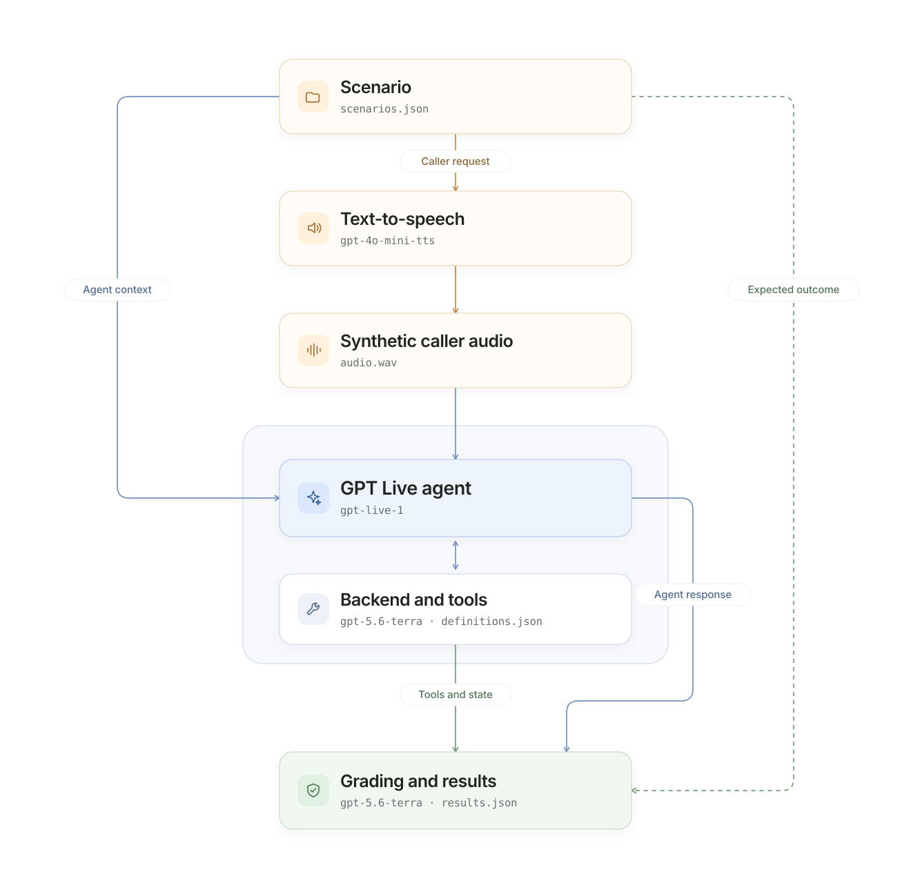

# Crawl harness
*Synthetic single-turn evaluations*

CRAWL is a repeatable single-turn evaluation harness for GPT Live voice
agents. It turns scenario text into reusable caller audio, sends one spoken
request to the assistant, and grades the spoken response, delegation and
tool behavior, and final application state.

Use CRAWL to catch regressions and compare prompts, tools, models, or
configurations with consistent inputs. It provides broad functional coverage
without requiring recorded audio or a multi-turn caller simulator.
Its CLI, input preparation, session lifecycle, and batch execution remain owned
by CRAWL; it does not import WALK.

For setup, model access, and source-versus-wheel commands, see
[setup](../README.md#3-set-up-and-run). The commands below run from the
harness directory. Live commands incur API usage; start with one example.

## What you can evaluate

CRAWL evaluates how a voice agent handles one spoken request, including:

- Whether it gives a correct and relevant spoken response.
- Whether it delegates appropriately and selects the correct tools and
  arguments.
- Whether tools execute in the expected order and produce the correct final
  application state.
- Whether it handles prior context, in-request corrections, missing
  information, and unauthorized actions appropriately.
- Whether it confirms an action only after the underlying tool succeeds.
- Response timing and interruption behavior during the caller's request.

A single-turn evaluation does not establish multi-turn behaviors such as
yielding, backchannels, follow-up clarification, or procedure adherence. Use
RUN for those conversational behaviors.

## How it works

1. The harness loads a scenario containing a caller request and evaluator-only
   expectations.
2. A text-to-speech model synthesizes the request into reusable caller audio.
3. The audio is streamed in paced PCM chunks to the GPT Live assistant.
4. The assistant can delegate to its reasoning backend, which selects tools;
   application code executes its functions and returns their results.
5. The harness captures the assistant response, tool activity, and final
   application state, grades the observed outcome, and saves the supporting
   artifacts.



*Model identifiers shown are repository defaults and can be overridden at runtime. Expected outcomes from `scenarios.json` remain evaluator-only.*

### Response completion

V3 has no authoritative turn or audio-done event. CRAWL waits for caller input
to finish, delegated work to complete, settled speech-backed transcript turns,
and the quiet tail. Continuously queued silent audio does not block completion.

After delegation, a new spoken turn must start after returned content becomes
available. An acknowledgment already underway or captioned at that point does
not qualify; a valid answer sharing its caption group can therefore time out.
Backend completion and context-append acknowledgments alone are insufficient.
`--response-timeout-seconds` defaults to 30 seconds from caller-input completion
and does not restart for delegation or returned content. A timeout is recorded
as `response_timeout`, with available audio and events retained.

## Inputs

CRAWL reads versioned JSON scenarios from
[data/scenarios.json](data/scenarios.json). Each scenario can provide:

- The caller request text that will be synthesized into audio.
- Optional authorized context from earlier text turns.
- The authorized initial application state.
- Evaluator-owned expectations for the answer, delegation, tool calls, and
  final state.

Only the synthesized caller audio and authorized context are provided to the
assistant. Expected answers, tool arguments, and golden state remain private
to the evaluator. See [Data](#data) for the complete scenario structure.

## Outputs

The paths below describe a source checkout. Installed wheels write to
`./results/crawl/` by default. See [installation and path rules](../README.md#installed-package-and-paths)
for overrides, environment-file selection, and optional playback.

A completed scenario produces the following supporting artifacts:

```text
crawl_harness/results/crawl_live_<timestamp>/
├── audio/
│   └── restaurant_003/
│       ├── input.wav
│       ├── output.wav
│       ├── conversation.wav
│       └── conversation.transcript.txt
├── events/
│   └── restaurant_003.jsonl
├── transcripts/
│   └── restaurant_003.json
└── results.json
```

| File | Contents |
| --- | --- |
| `results.json` | Task, audio, and consumption metrics plus the shared outcome assessment and single-turn observability summary. |
| `input.wav` | Exact synthetic caller audio sent to GPT Live. |
| `output.wav` | Captured assistant audio. |
| `conversation.wav` | Timeline-aligned stereo conversation. |
| `conversation.transcript.txt` | Readable caller/assistant transcript. |
| `events/*.jsonl` | Session, audio-timing, delegation, tool, and evaluator events; raw audio payloads are removed. |
| `transcripts/*.json` | Detailed tool execution, final state, deterministic checks, and semantic grades. |

Transcripts, tool arguments, and application state are not privacy-redacted.
Provider, input, or grading failures can leave only some of these artifacts.
Check the per-scenario status and error in `results.json`; do not infer success
from the process exit code or an existing recording.

## Run the evaluation

Start with one representative scenario:

```bash
uv run crawl-eval --example restaurant_003
```

After verifying it, run the complete dataset (additional API usage):

```bash
uv run crawl-eval
```

Common options:

- `--max-examples 5` limits the number of scenarios.
- `--verbose` prints audio events, transcripts, tool calls, and individual
  results.
- `--listen` plays the caller on the left stereo channel and the assistant on
  the right.
- `--refresh-audio` regenerates cached caller speech.
- `--concurrency 4` runs independent scenarios in parallel.
- `--assistant client` evaluates the application-managed assistant instead of
  the default OpenAI-managed Responses assistant.
- `--assistant-endpoint wss://agent.example.com/ws/assistant` selects a
  separately running client service when combined with `--assistant client`;
  it requires a dedicated service token. See [service setup](../assistants/README.md#existing-application-endpoint).
- `--offline --no-real-time` checks the pipeline without calling a model.

CRAWL saves generated caller speech under `.audio_cache/` and reuses the same
WAV on later runs. Changing the scenario text, TTS model, voice, or sample
rate automatically creates a new recording.

Each concurrent worker receives a separate GPT Live session, application
executor, initial state, and artifact directory. Concurrency is limited to
1–8; begin with a low value appropriate for your API project’s rate limits. Do not
combine `--listen` with concurrency greater than one.

### Verify offline

For a quick deterministic offline check of one scenario:

```bash
uv run crawl-eval \
  --offline \
  --no-real-time \
  --example restaurant_003
```

Offline results exercise audio handling, tool execution, artifacts, and
deterministic checks for the supplied fixtures. They do not measure a live model or a real semantic
judge.

Use `uv run crawl-eval --help` for all options.

## Metrics and grading

CRAWL exports the same metric groups as WALK and RUN:

| Group | Metrics |
| --- | --- |
| Task | `task_completed`, `semantic_quality`, `tool_accuracy`, `tool_calls`, `delegation_accuracy`, `delegations`, `turns`. |
| Audio | `response_rate`, `response_latency_ms`, `interruption_rate`, `speaking_duration_ms`, `floor_hold_silence_ms`. |
| Consumption | Frontend Live duration and the available backend token breakdown. |

Detailed artifacts retain yielding and backchannel diagnostics without adding
them to the primary single-run metric contract. Assistant interruption can
still be measured during the single caller utterance.

Deterministic dimensions include:

```text
run_validity
delegation_decision
tool_selection
parameter_accuracy
tool_execution
final_state
clarification_behavior
grounded_relay_order
```

Applicable live semantic rubrics use the same definitions as WALK and RUN:
`task_understanding`, `context_fidelity`, `clarification_quality`, and
`grounded_communication`. `conversational_coherence` applies only to
multi-turn scenarios. Inapplicable rubrics remain unscored. Live evaluation
makes one to three semantic-judge calls per scenario.

Each applicable dimension receives a binary verdict and an individual score
of `0`, `0.25`, `0.5`, `0.75`, or `1` reflecting error severity.
`metrics.task.semantic_quality` reports its
mean `score` and applicable `dimensions` for each scenario. The run summary
contains only execution counts. Only task understanding contributes to the semantic
task-completion decision; other dimension verdicts remain diagnostic. Partial
credit never overrides task completion, authorized actions, expected tool
behavior, or verified application state. Offline runs leave semantic-quality
scores `null`.

Every result uses the same outcome-assessment contract as WALK and RUN:
assistant response, verified application state, delegation, authorized
actions, tool-backed state changes, grounded relay, and optional semantic
completion. Because CRAWL evaluates one specific capability, its expected
tool name, arguments, and execution form an explicit required check.
Observability reports synthetic audio input, delegation, actual tool calls,
and deterministic/semantic grade statuses; it does not invent multi-turn
floor or agenda diagnostics.

A single request does not demonstrate yielding, backchannel behavior, or
multi-turn procedure adherence. Detailed deterministic checks, semantic
verdicts, fractional dimension scores, and supporting rationales remain
available in the transcript artifacts alongside the compact semantic-quality summary.

## Adapt the harness

### Configuration

[config.toml](config.toml) controls the module:

```toml
[dataset]
path = "data/scenarios.json"

[execution]
concurrency = 1
max_examples = 0
verbose = false
response_timeout_seconds = 30.0

[audio]
chunk_ms = 20
sample_rate_hz = 24000
real_time = true

[assistant]
mode = "responses"
endpoint = ""
```

`max_examples = 0` means all examples. Set `verbose = true` for detailed output
by default. Command-line arguments override
configuration. Use `--config` to select another TOML file, `--data`
to override the dataset, and `--results-dir` to change the output location:

```bash
uv run crawl-eval \
  --config /path/to/crawl-config.toml \
  --results-dir /path/to/results \
  --run-name synthetic-baseline
```

Use `uv run crawl-eval --help` for all options. Credentials and assistant
configuration use the selected `.env` file or shell, following the shared
[environment-file rules](../README.md#environment-file-selection).

### Data

[data/scenarios.json](data/scenarios.json) uses the same JSON contract as
WALK and RUN:

```json
{
  "schema_version": "1.0",
  "scenarios": [
    {
      "id": "restaurant_003",
      "title": "Correct the requested booking date",
      "type": "booking",
      "interaction": "single_turn",
      "tags": ["booking", "correction"],
      "input": {
        "text": "Book a table for Maya on August 7—sorry, August 6—at 7 p.m. for two."
      },
      "application": { "initial_state": {} },
      "expected": {
        "answer": "Confirm August 6 rather than August 7.",
        "delegation": "required",
        "tools": {
          "required": [
            {
              "name": "create_reservation",
              "arguments": { "guest_name": "Maya", "date": "2026-08-06" }
            }
          ]
        },
        "state": { "reservation_created": true, "date": "2026-08-06" }
      }
    }
  ]
}
```

For `restaurant_003`, the request corrects August 7 to August 6. The expected
behavior is one `create_reservation` call for the corrected date and an
audible confirmation after successful execution.

A single caller request can require multiple tools. Add them in execution
order to `expected.tools.required`; names, argument subsets, order, final
state, and grounded confirmation are graded together. Delegation can be
`required`, `forbidden`, or `optional`.

`type` is the portable business-task category; tags describe additional
properties such as correction, prior context, or authorization. WALK uses
the same definition with an attached recording; RUN uses the same core
fields with multi-turn simulation parameters.

Use `input.context.history` to hydrate prior text turns without replaying their
audio. Only `input.text` is synthesized and evaluated as the current turn:

```json
{
  "input": {
    "text": "Please make it 7 p.m.",
    "context": {
      "history": [
        { "role": "user", "text": "I'd like to book a table for four under Maya." },
        { "role": "assistant", "text": "Which date would you like?" },
        { "role": "user", "text": "August 7, please." },
        { "role": "assistant", "text": "What time works best?" }
      ]
    }
  }
}
```

The harness passes these turns as GPT Live `input`; the historical
conversation remains text-only and cannot recreate prior audio, interruptions,
or pending application work. Startup history is limited to 128 messages and
8,192 rendered tokens. Try the included example with
`uv run crawl-eval --example restaurant_021 --verbose`.

## Test the harness

```bash
uv run pytest -q crawl_harness/tests
```
