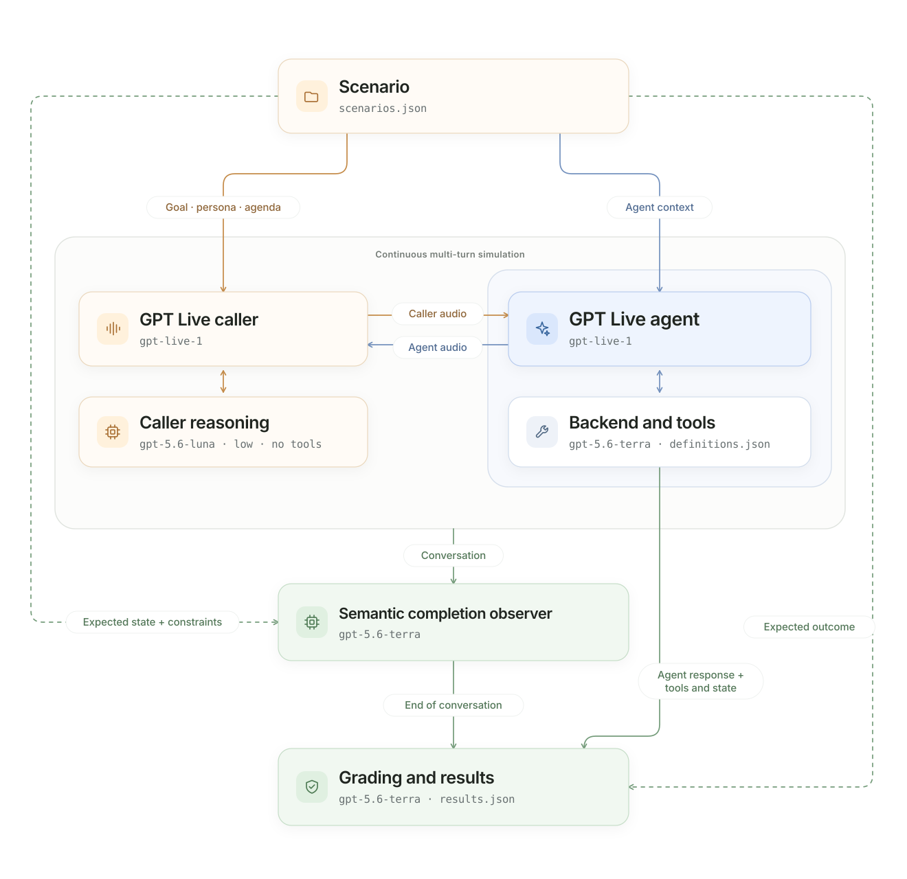

# Run harness
*Simulated full-duplex conversation evaluations*

RUN evaluates a GPT Live voice agent through a complete, continuously paced
conversation. A simulated caller follows a private goal and agenda while the
assistant answers, delegates, uses tools, and changes application state.
The bundled restaurant scenarios are examples, not a product constraint;
customers can replace the assistant implementation, tools, and datasets.

> **Simulator:** A GPT Live caller creates continuously full-duplex conversations
> with an independent managed Responses reasoning backend (`gpt-5.6-luna`, low
> effort) and no caller-owned application tools.

Use RUN for behaviors that cannot be established from one request:
clarification, conversational memory, corrections, interruptions,
backchannels, authorization, and verified task completion.

For setup, model access, and source-versus-wheel commands, see
[setup](../README.md#3-set-up-and-run). The commands below run from the
harness directory. Start with one scenario; live runs incur usage for both
voice sessions and any backend, observer, or judge calls.

## What you can evaluate

RUN evaluates how a voice agent handles an interactive conversation,
including:

- Whether it completes the caller's task and reaches the correct final state.
- Whether it asks for missing details instead of guessing.
- Whether it remembers preferences and honors corrections across turns.
- Whether it chooses authorized tools and grounds confirmations in actual
  results.
- Whether it yields appropriately, handles interruptions, and recognizes
  backchannels.
- Response timing, overlapping speech, frontend audio duration,
  model-attributed backend usage, and assistant-side latency.

Use CRAWL or WALK when a single spoken request is sufficient.

## How it works

1. The harness loads a scenario containing a caller goal, persona, agenda,
   authorized application state, and evaluator-only expectations.
2. A GPT Live caller decides naturally when to speak,
   acknowledge, interrupt, or wait.
3. The caller generates audio and can delegate to its own Responses backend
   for help following its private goal and agenda.
4. Caller and assistant audio stream continuously along one shared timeline.
5. The evaluated assistant delegates reasoning and tool selection; application
   code executes the authorized functions.
6. The harness grades the conversation, tool behavior, and final application
   state against the hidden expected outcome.

The target assistant is selectable independently of the simulated caller:

```bash
uv run run-eval --scenario restaurant_booking_complete --assistant responses
uv run run-eval --scenario restaurant_booking_complete --assistant client
```

`--assistant` selects the evaluated application architecture independently of
the simulated caller and its Responses backend.



The caller's reasoning backend has no application tools. Only the evaluated
agent owns application tools and state; expected outcomes remain evaluator-only.

The GPT Live caller reacts continuously to assistant audio. Both participants
remain independently active on the shared timeline.

### Implementation layout

The RUN package keeps customer-facing evaluation files separate from the
continuous-conversation simulator:

```text
run_harness/
├── evaluate.py          public evaluation entry point
├── graders.py           task, procedure, and semantic quality grading
├── observability.py     evaluator diagnostics and event traces
├── scenarios.py         RUN scenario loading and validation
├── simulation/          GPT Live participants and synchronized audio relay
└── visualization/       domain-independent interactive conversation viewer
```

## Inputs

RUN reads versioned JSON scenarios from
[data/scenarios.json](data/scenarios.json). Each scenario can provide:

- The caller's opening request, goal, persona, known facts, and agenda.
- Authorized application context and initial state.
- Evaluator-owned expectations for the answer, tools, final state, and
  optional procedure.
- A preferred golden path for diagnostics.

The simulated caller receives its private goal, persona, and agenda. The
assistant receives only caller audio and authorized application context.
Expected outcomes, future caller actions, and grading criteria remain hidden
from the assistant. See [Data](#data) for the complete scenario structure.

## Outputs

The paths below describe a source checkout. Installed wheels write to
`./results/run/` by default. See [installation and path rules](../README.md#installed-package-and-paths)
for overrides, environment-file selection, and optional playback.

A run with completed conversation artifacts produces:

```text
run_harness/results/run_live_<timestamp>/
├── audio/
│   └── <scenario-id>/
│       ├── conversation.wav
│       ├── conversation.transcript.txt
│       └── conversation.result.json
├── events/
│   └── <scenario-id>.jsonl
├── transcripts/
│   └── <scenario-id>.json
├── results.json
└── viewer.html                      # with --visualize
```

| File | Contents |
| --- | --- |
| `results.json` | Task, audio, and consumption metrics; outcome assessment and simulation diagnostics. |
| `conversation.wav` | Timeline-aligned stereo: caller left, assistant right. |
| `conversation.transcript.txt` | Readable conversation and projected event evidence. |
| `conversation.result.json` | Detailed scenario result, interaction, and tool activity. |
| `events/*.jsonl` | Audio timing, caller objectives, completion decisions, tools, and evaluator events; raw audio payloads are removed. |
| `transcripts/*.json` | Detailed transcript, procedure diagnostics, verified state, and metadata. |
| `viewer.html` | Self-contained interactive conversation timeline when `--visualize` is supplied. |

Use `--debug-artifacts` to additionally save per-tick and per-turn JSONL.
The `--visualize` option enables those detailed artifacts automatically.
Transcripts, tool arguments, and application state are not privacy-redacted.
Details also retain minimal correlated lifecycle records and relay clock/queue
metadata. Send completion is not evidence of physical speaker playback.

A provider or connection error can interrupt a conversation before its WAV,
transcript, and detailed result are saved. `results.json` still records the
scenario as an `infrastructure_error`; an event trace may be available, but
its removed audio payloads cannot reconstruct a missing recording. Partial
audio recovery is not built into the runner. This differs from a conversation
that reaches result generation but is marked invalid by the caller-validity
checks: those attempts retain diagnostic artifacts.

### Interactive conversation viewer

Add `--visualize` to any RUN evaluation to create an interactive,
self-contained conversation timeline automatically:

```bash
# Start with one conversation before evaluating the full dataset.
uv run run-eval --scenario restaurant_booking_complete --visualize

# Evaluate and visualize a customer-owned application and scenario dataset.
uv run run-eval \
  --data ./customer/conversations.json \
  --visualize

# Configure the independent GPT Live caller's voice.
uv run run-eval \
  --data ./customer/conversations.json \
  --simulator-voice cedar \
  --visualize
```

Scenario names, conversation text, application tools, and task outcomes come
from the selected customer dataset and assistant implementation. The visualization
contains no restaurant-specific logic.

The evaluator saves detailed timing traces automatically and prints the path
to `viewer.html` beside `results.json`. Infrastructure failures, which do not
produce a complete conversation, are omitted from the viewer. If optional
visualization cannot be generated, the saved evaluation remains valid and the
command prints `Viewer unavailable:` with the reason.

Open the HTML directly in a browser; no web server, external assets, or frontend
dependencies are required. The viewer includes:

- Independent caller and assistant waveforms synchronized to the stereo WAV.
- A shared playback clock, click-to-seek controls, and linked conversation
  transcript.
- Audio overlap, individually labeled response-latency intervals, assistant
  delegations, and application tool calls.
- Final backend response text, backend-response counts, and associated tool
  names/statuses for each delegation. Click a delegation marker to jump to its
  details. A clarification-only delegation may have no application tool calls.
- Per-response latency beside the corresponding assistant transcript, plus
  the average response latency and response count for the scenario.
- Scenario selection, task status, voice metrics, and verified outcome
  evidence.
- Contextual explanations when no interruption or backchannel occurred, and
  the number of expected application tools that were actually matched.
- Explicit labeling when GPT Live caller interruptions and backchannels were
  inferred from recorded audio and transcripts after the conversation.

Visualize an existing RUN evaluation, including historical runs that were not
created with `--visualize` or `--debug-artifacts`:

```bash
uv run run-view \
  --results /path/to/run/results.json

# Optionally select one scenario and choose the output destination.
uv run run-view \
  --results /path/to/run/results.json \
  --scenario your_scenario_id \
  --output /path/to/conversation.html
```

Replace placeholder paths and `your_scenario_id` with values from your saved run.

When detailed tick or turn files are unavailable, `run-view` reconstructs the
timeline from the saved stereo WAV and standard scenario result. Historical
reconstruction is labeled in the viewer; it cannot recover artifacts that
were deleted or never saved.

Delegation response details are correlated by IDs in the assistant's saved
protocol trace. If that trace or its correlation data is unavailable, the
viewer keeps any recorded delegation markers and labels missing evidence;
it does not guess which overlapping delegation produced an answer.

The HTML embeds conversation audio, transcripts, delegation targets, final
backend response text, tool names
and statuses, and evaluation evidence. Delegated request contents, structured
tool arguments, raw tool results, call identifiers, private session
instructions, reasoning content, and raw protocol event logs are not copied into the viewer;
spoken conversations and transcripts can still contain sensitive customer
information. Treat the HTML as sensitive evaluation output
and share it only with authorized recipients. Artifacts must be located inside
the evaluation's run directory. Offline fixture runs are labeled explicitly and
contain synthetic audio tones rather than live model speech.

## Run the evaluation

Run the complete evaluation:

```bash
uv run run-eval
```

Run one representative scenario:

```bash
uv run run-eval --scenario restaurant_date_correction
```

`--example restaurant_date_correction` is an equivalent selector shared with
the CRAWL and WALK commands.

Common options:

- `--verbose` prints protocol events, transcripts, and
  individual results.
- `--listen` plays the caller on the left stereo channel and the assistant on
  the right.
- `--max-examples 3` limits the number of scenarios.
- `--concurrency 4` runs independent conversations in parallel.
- `--condition noisy`, `telephony`, `background_speech`, `echo`,
  `packet_loss`, or `realistic` applies a deterministic caller-audio preset.
- The GPT Live caller speaks the scenario opening after
  `session.commentary.append`; interruption and backchannel intent are inferred
  after the run.
- `--completion-model MODEL` selects the independent observer that recognizes
  when a GPT Live conversation has actually ended.
- `--no-semantic-drain` disables that observer and restores the deterministic
  verified-state-plus-closing fallback.
- `--assistant-opening-prompt PATH` sends the selected file through
  `session.commentary.append` so the evaluated assistant speaks before the caller.
  Without this flag, RUN remains caller-first.
- `--seed 7` fixes harness randomness; live model responses remain
  nondeterministic.
- `--visualize` saves detailed traces and creates `viewer.html` after the run.
- `--offline` verifies the pipeline without calling a model.

Each concurrent worker receives an independent GPT Live session, caller,
application executor, state, and result directory. Concurrency is limited to
1–8. Do not combine `--listen` with concurrency greater than one.

### Verify offline

For a quick deterministic check of one conversation:

```bash
uv run run-eval --offline --scenario restaurant_date_correction
```

Offline mode verifies pacing, conversation completion, application tools, grading,
and saved artifacts. It does not evaluate a live model or semantic judge.

Use `uv run run-eval --help` for all options.

### Assistant-first call-center openings

Both opening modes support `--assistant responses` (default) and
`--assistant client`:

- **Caller first (default):** omit `--assistant-opening-prompt`. The GPT Live
  caller is prompted to say `scenario.input.text` to begin the conversation.
- **Assistant first:** add `--assistant-opening-prompt PATH`. Use the bundled
  file below or your own editable instructions. The assistant greets the caller,
  who responds naturally with the scenario's opening intent.

```bash
uv run run-eval \
  --scenario restaurant_booking_complete \
  --assistant-opening-prompt assistants/frontend/prompts/assistant_first.txt
```

The file is sent unchanged as string `content` in a `session.commentary.append`
event with `delegation_id: null` after session startup. Keep it within the API's
500-token append limit. The live models choose the spoken wording; the append
acknowledgment confirms acceptance, not speech completion. The caller is instructed to
wait for the greeting. RUN rejects caller speech before the first observed
assistant speech, but does not enforce that the entire greeting finishes before
the caller starts.

A missing, unreadable, or empty file fails before run artifacts are created.
A provider error or no opening speech within 20 seconds fails the run without
falling back to caller-first. Opening metadata records `first_speaker`, not the
prompt's text, path, or hash.

Offline mode emits a deterministic synthetic greeting only to verify ordering,
metadata, audio, and artifacts; it does not validate the live context-append
protocol or model behavior.

### Audio realism

The caller microphone remains open throughout the conversation. Select a
reproducible acoustic condition with `--condition`:

| Condition | Caller-audio behavior |
| --- | --- |
| `clean` | Original caller speech and silence. |
| `noisy` | Clearly audible continuous background noise at 1,200 PCM16 RMS. |
| `telephony` | 300–3,400 Hz telephone-band filtering, 8 kHz sampling, and G.711 μ-law compression. |
| `background_speech` | An audible second speaker from a bundled synthetic conversation or a user-provided WAV. |
| `echo` | Delayed caller-speech echo. |
| `packet_loss` | Seeded dropped frames replaced by same-duration silence. |
| `realistic` | Telephone codec, audible noise, background conversation, echo, moderate packet loss, and distractions. |

Effects are deterministic for a given `--seed` and preserve the continuous
24 kHz PCM16 timeline. Optional controls include `--noise-rms`,
`--background-speech`, `--background-gain`, `--echo-delay-ms`, `--echo-decay`,
`--packet-loss-rate`, `--packet-loss-burst`, `--cough-every-ms`, and
`--non-directed-every-ms`:

```bash
uv run run-eval \
  --scenario restaurant_date_correction \
  --condition realistic \
  --seed 41 \
  --noise-rms 75 \
  --echo-delay-ms 90 \
  --packet-loss-rate 0.05
```

Use `--background-speech /path/to/approved.wav` only with recordings you are
authorized to use. Without a supplied WAV, the background-speech preset uses
the bundled synthetic recording. Effective settings, provenance, and observed frame losses are
included in each conversation's run metadata.

## Metrics and grading

RUN exports the same metric groups as CRAWL and WALK:

| Group | Metrics |
| --- | --- |
| Task | `task_completed`, `semantic_quality`, `tool_accuracy`, `tool_calls`, `delegation_accuracy`, `delegations`, `turns`. |
| Audio | `response_rate`, `response_latency_ms`, `interruption_rate`, `speaking_duration_ms`, `floor_hold_silence_ms`. |
| Consumption | Assistant frontend Live duration; available backend input/output, cache, and reasoning tokens. |

Interaction metric v2 uses exact speech/work intervals and an explicit
first-audio deadline. `--response-deadline-ms` defaults to 5,000 ms; this is
evaluation policy, not a model SLA. The saved report includes answered, missed,
censored, late, and excluded counts beside the response rate. See the
[metric contract](../docs/metrics-contract.md) for eligibility, zero-overlap
yield, invalid-caller handling, and historical-result migration.

Every RUN scenario must set `expected.golden_path.delegations`. This is the
reference number of frontend-to-backend handoffs across the whole conversation,
reported as actual/expected in `metrics.task.delegations`. Count a new
`session.delegation.created`, not each backend response or tool call within that
delegation. For the bundled assistant, clarification stays in the voice
frontend: a booking can need one delegation even when it takes several turns
and calls two tools. Checking an unavailable slot, checking an alternative,
and later booking it are three separate delegated requests. A forbidden
delegation policy requires a reference count of zero; a required policy needs
a positive count. The count remains diagnostic: `delegation_accuracy` checks
the required/optional/forbidden policy, not an exact-count match.

A scenario passes when the assistant completes the task, reaches the expected
application state, and performs no prohibited or unauthorized action. Live
runs additionally use an independent semantic judge unless `--no-judge` is
set.

The judge applies the same semantic rubric as CRAWL and WALK:
`task_understanding`, `context_fidelity`, `clarification_quality`,
`grounded_communication`, and `conversational_coherence`. Only applicable
dimensions are assessed. Each individual score is one of `0`, `0.25`, `0.5`,
`0.75`, or `1`; averages may fall between those values.
`metrics.task.semantic_quality` reports its mean `score` and applicable
`dimensions` for each scenario. The run summary contains only execution counts. Only
task understanding contributes to semantic task completion; other dimension
verdicts, tool choice, and efficiency remain diagnostic. Partial-credit scores
never override verified state or authorization. Offline and `--no-judge` runs
report `null` semantic-quality scores.

Preferred tool order, clarification strategy, procedure adherence, and golden
turn count remain diagnostics; they do not turn an otherwise successful task
into a failure. Procedure steps explicitly marked `critical`, including
authorization, safety refusals, and protected tool ordering, are required for
`task_completed`. Yielding and backchannel diagnostics remain available in
detailed artifacts without appearing among the five primary audio metrics. Judge and
simulator tokens are excluded from agent consumption metrics.
Tool and delegation accuracy are deterministic, not LLM-judged: tools are
matched one-to-one by name, recursively normalized arguments, and execution
status; delegation accuracy checks the binary decision to delegate or not
against the scenario's required, forbidden, or optional policy.
The runner waits for both Live sessions to finalize. The agent's final
`session.closed.usage.seconds` becomes frontend `audio_duration_ms`; backend
tokens come from Responses completions (nested in managed mode), deduplicated
by response ID.
Caller, semantic-completion observer, and judge tokens never enter frontend or
backend product totals. Cached and cache-write tokens are subsets of input
tokens rather than additional billable-token totals.
V3 provides no frontend token breakdown; unavailable fields are omitted rather
than estimated from duration.

## Adapt the harness

### Configuration

[config.toml](config.toml) controls the module:

```toml
[dataset]
path = "data/scenarios.json"

[execution]
concurrency = 1
max_examples = 0
verbose = false

[simulation]
simulator_backend_model = "gpt-5.6-luna"
simulator_backend_reasoning_effort = "low"
tick_ms = 200
response_deadline_ms = 5000
max_duration_seconds = 90.0
semantic_drain = true
completion_model = "gpt-5.6-terra"
completion_timeout_seconds = 8.0
condition = "clean"
seed = 7

[grading]
enabled = true
repetitions = 1

[assistant]
mode = "responses"
endpoint = ""
```

`max_examples = 0` means all scenarios. Command-line arguments override
configuration. Use `--config` to select another TOML file, `--data` to
override the scenario dataset, and `--results-dir` to change the output
location:

```bash
uv run run-eval \
  --condition noisy \
  --concurrency 4 \
  --results-dir /path/to/results \
  --run-name noisy-multi-turn
```

Keep credentials and optional assistant overrides in the selected `.env` file
or shell. The [`.env.example`](../.env.example) file is only a setup template;
see [environment-file selection](../README.md#environment-file-selection).

### Caller models

The evaluated assistant and simulated caller are separate:

| Component | Default | Configuration |
| --- | --- | --- |
| GPT Live assistant | `gpt-live-1` | `OPENAI_LIVE_MODEL` or `--model`. |
| Assistant reasoning and tools | `gpt-5.6-terra` | `OPENAI_LIVE_BACKEND_MODEL` or `--backend-model`. |
| GPT Live caller | Same default model as the assistant; distinct persona voice. | `--simulator-model` and `--simulator-voice`. |
| Caller reasoning | `gpt-5.6-luna`, low effort; no tools. | `[simulation].simulator_backend_model` and `simulator_backend_reasoning_effort` in TOML. |
| Semantic completion observer | `gpt-5.6-terra` | `OPENAI_COMPLETION_MODEL` or `--completion-model`. |
| Independent semantic judge | `gpt-5.6-terra` | `OPENAI_EVAL_JUDGE_MODEL` or `--judge-model`. |

Both participants remain continuously active and decide when to speak independently.

The two GPT Live sessions select and exchange 20 ms audio frames on the same
timeline; `tick_ms` controls reporting rather than live delivery cadence.
Offline fixtures retain tick-sized sends. Live audio effects operate on 20 ms
frames, so old seeded effect results need matched reruns.
V3 output-audio chunks have no timestamps. RUN places them on the relay's local
audio clock and derives revisable turns from observed speech and transcript
fragments; neither caption frames nor backend completion define a finished turn.
The caller's frontend and lightweight backend prompts receive the same private
persona, goal, known facts, and agenda. The backend provides concise caller guidance
through managed Responses delegation; it has no tools or application executor.
Its settings do not inherit target-assistant backend overrides; the output cap
is 1,024 tokens and verbosity is low. These two settings are fixed in the caller
implementation, not exposed as TOML or CLI settings. Simple replies and
backchannels can remain direct; configuring a backend does not guarantee that
the caller will invoke it during a conversation.
The assistant receives only spoken conversation and authorized application context, retaining
its independent application-owned reasoning and tools. The GPT Live caller
decides when to speak, overlap, acknowledge, or interrupt on its own.
Caller backend model and reasoning effort are recorded in the run configuration
(null for offline fixtures). Caller usage remains excluded from target metrics.

To verify that caller reasoning was exercised, inspect `caller_gpt_live` events
for a correlated `session.delegation.created` and terminal backend response. A successful
booking with zero caller delegations validates the observed booking outcome,
not the caller backend's inference compatibility or reasoning quality.

An independent evaluator-owned text model observes settled, locally projected
caller and assistant turns, application state, pending work, and completed tools in the
background. Relevant changes invalidate older assessments; unresolved evidence
also receives a bounded idle recheck. It recognizes a
resolved conversation, an informational answer, or an accepted terminal
refusal without relying on specific goodbye phrases. This observer never
controls the floor, joins either voice session, or exposes evaluator answers
to the caller or assistant. Once it accepts completion, RUN keeps relaying
audio until the configured drain period, quiet tails, and pending-work checks
are satisfied, including completion of any pending caller reasoning. New caller
audio, caller backend work, or a later correction revokes draining. Session
completion does not rewrite the last caller turn's request eligibility.
Observer timeouts and failures fall back to verified application
state plus a natural caller closing. Offline fixtures do not call this model.

Supported caller Responses delegation is valid. Unsupported delegation, failed
or incomplete caller backend work, and caller reasoning still pending at the
duration limit mark the simulation invalid. Such attempts retain diagnostic
artifacts but skip post-run semantic judging and are excluded from target
pass/fail counts; see the [validity contract](../docs/metrics-contract.md#completion-and-simulator-validity-are-separate-gates).

Response timing and overlap come from actual audio, but whether caller
speech was an interruption or a backchannel is inferred after the fact.
The results identify these limitations explicitly. Schema 2.0 removes retired controller
fields; see the [shared results contract](../README.md#5-results-and-metrics). Caller persona voices are
deterministic and distinct from the default `marin` assistant. A live run
rejects any persona or `--simulator-voice` override that matches the resolved
assistant voice. Use `--simulator-model` and `--simulator-voice` to configure
the caller independently; `--listen`,
concurrency, and acoustic conditions remain available.

Verify the dual-GPT Live pipeline without model access:

```bash
uv run run-eval --offline \
  --scenario restaurant_booking_complete
```

### Data

[data/scenarios.json](data/scenarios.json) uses the same portable JSON
contract as CRAWL and WALK, with additional multi-turn caller parameters:

```json
{
  "schema_version": "1.0",
  "scenarios": [
    {
      "id": "restaurant_date_correction",
      "title": "Correct a reservation date during the conversation",
      "type": "booking",
      "interaction": "multi_turn",
      "tags": ["booking", "correction"],
      "input": {
        "text": "Please book a table for two on August 7."
      },
      "application": {
        "initial_state": {}
      },
      "simulation_parameters": {
        "goal": "Correct the reservation to August 8, provide Maya and 7 p.m., and book the corrected date.",
        "known_facts": {
          "guest_name": "Maya",
          "original_date": "2026-08-07",
          "date": "2026-08-08",
          "time": "19:00",
          "party_size": 2
        },
        "agenda": [
          {
            "id": "correct_date_and_provide_name",
            "commitment": "Correct the date to August 8 and provide the name Maya.",
            "trigger_condition": "The assistant asks for booking details or refers to August 7.",
            "completion_condition": "The caller has corrected the date and provided Maya.",
            "action": "correct",
            "facts": ["date", "guest_name"],
            "response_hint": "Actually, make that August 8, under Maya."
          },
          {
            "id": "provide_time",
            "commitment": "Provide the requested reservation time.",
            "trigger_condition": "The assistant asks when the reservation should be scheduled.",
            "completion_condition": "The caller provides 7 p.m.",
            "action": "answer",
            "facts": ["time"],
            "response_hint": "At 7 p.m., please."
          },
          {
            "id": "finish_corrected_booking",
            "commitment": "Finish once the August 8 reservation is confirmed.",
            "trigger_condition": "The assistant confirms the corrected reservation.",
            "completion_condition": "The caller understands that the booking is for August 8.",
            "completion_basis": "live_context",
            "action": "finish",
            "required": false
          }
        ],
        "persona": {
          "id": "pragmatic_diner",
          "description": "A friendly caller who answers directly."
        }
      },
      "expected": {
        "answer": "Confirm the August 8 reservation under Maya.",
        "delegation": "required",
        "golden_path": { "turns": 7, "delegations": 1 },
        "tools": {
          "required": [
            {
              "name": "check_availability",
              "arguments": {
                "date": "2026-08-08",
                "time": "19:00",
                "party_size": 2
              }
            },
            {
              "name": "create_reservation",
              "arguments": {
                "guest_name": "Maya",
                "date": "2026-08-08",
                "time": "19:00",
                "party_size": 2
              }
            }
          ]
        },
        "state": {
          "reservation_created": true,
          "guest_name": "Maya",
          "date": "2026-08-08",
          "time": "19:00",
          "party_size": 2
        }
      }
    }
  ]
}
```

Agenda items are semantic commitments, not scripts or regular expressions.
The caller model evaluates each trigger against the conversation and chooses
a natural response. Express the desired order in `trigger_condition`; this
guides the live caller but does not enforce ordering. Use `required: false`
for optional objectives and `expected.procedure` for optional diagnostics.

The included restaurant scenarios cover missing details, corrected dates and
party sizes, unavailable slots, authorized cancellation, unauthorized
requests, and interruptions.

Golden answers, the caller's private brief, future agenda items, and grading
criteria are not injected into the target assistant. Facts that the caller
chooses to disclose become part of the spoken conversation.

## Test the harness

```bash
uv run pytest -q run_harness/tests
```
