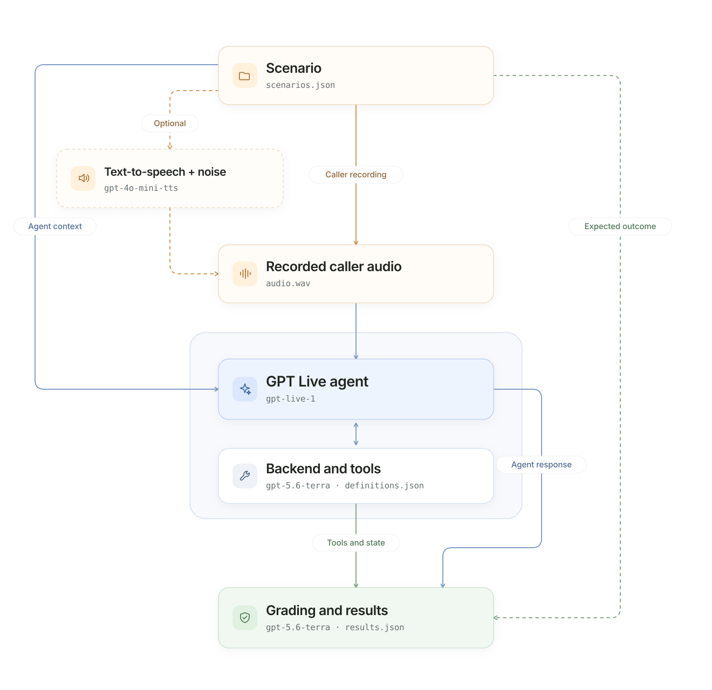

# Walk harness
*Recorded single-turn evaluations*

WALK evaluates a GPT Live voice agent using reusable caller recordings.
Approved human recordings are strongly preferred because they capture real
voices, pronunciation, microphones, and environments. When human audio is
unavailable, separately generated synthetic WAVs can provide a controlled
fallback. Evaluation streams the selected recording's decoded PCM audio, not
the WAV container, to the assistant and
grades the response, tool behavior, and final application state.

Use WALK to check whether correct behavior survives real caller voices,
accents, microphones, pronunciation, and acoustic conditions. Unlike CRAWL,
it never generates or substitutes the caller audio during evaluation.
Its CLI, recorded-input validation, session lifecycle, and batch execution remain
owned by WALK; it does not import CRAWL.

For setup, model access, and source-versus-wheel commands, see
[setup](../README.md#3-set-up-and-run). The commands below run from the
harness directory. Live commands incur API usage; start with one recording.

## What you can evaluate

WALK evaluates how a voice agent handles one recorded request, including:

- Whether it understands the caller and produces a correct spoken response.
- Whether accents, pronunciation, background noise, or recording quality
  affect task completion.
- Whether it selects authorized tools, uses correct arguments, and reaches
  the expected final state.
- Whether it handles spoken corrections, missing information, and
  unauthorized requests.
- Response timing, interruption behavior, Live duration, and backend tokens.

A single recorded request does not establish yielding, backchannels, or
multi-turn clarification. Use RUN for those conversational behaviors.

## How it works

1. The harness loads a scenario containing an attached WAV, reference
   transcript, and evaluator-only expectations.
2. The original caller recording is streamed to GPT Live in paced PCM chunks.
3. The assistant can delegate tool selection to its reasoning backend;
   application code executes the authorized functions.
4. The harness captures assistant audio, tool activity, and application
   state.
5. Deterministic checks and an independent semantic judge compare the
   observed outcome with the hidden reference material.



*Model identifiers shown are repository defaults and can be overridden at runtime. Reference transcripts and expected outcomes remain evaluator-only.*

WALK uses the same [response-completion policy](../crawl_harness/README.md#response-completion)
as CRAWL: observed speech and finished work are required, not just a backend
completion or accepted context append. The default 30-second response budget
starts after the recording finishes streaming; a blended acknowledgment and
answer can time out when they share an excluded caption group.

## Inputs

WALK reads versioned JSON scenarios from
[data/scenarios.json](data/scenarios.json). Each scenario can provide:

- One explicitly attached caller WAV recording.
- A reviewed reference transcript for evaluation.
- Recording metadata such as language, accent, microphone, and acoustic
  condition.
- Authorized application context and initial state.
- Evaluator-owned expectations for the answer, tools, and final state.

Only the recording's audio and authorized context reach the assistant. The
reference transcript, expected answer, and grading criteria remain hidden. See
[Data](#data) for the complete scenario structure.

The included recordings are generated demonstration fixtures. Generate
additional controlled fixtures when human recordings are unavailable; use
approved human recordings to evaluate genuine accents, devices, and
environments.

The bundled catalog contains five clean baseline recordings and 21 additional
recordings covering every CRAWL scenario. Generated examples cycle through the
seven existing presets: `clean`, `noisy`, `telephony`, `background_speech`,
`echo`, `packet_loss`, and `realistic`.

## Outputs

The paths below describe a source checkout. Installed wheels write to
`./results/walk/` by default. See [installation and path rules](../README.md#installed-package-and-paths)
for overrides, environment-file selection, and optional playback.

A completed scenario produces the following supporting artifacts:

```text
walk_harness/results/walk_live_<timestamp>/
├── audio/
│   └── restaurant_003/
│       ├── input.wav
│       ├── output.wav
│       ├── conversation.wav
│       └── conversation.transcript.txt
├── events/
│   └── restaurant_003.jsonl
├── transcripts/
│   └── restaurant_003.json
└── results.json
```

| File | Contents |
| --- | --- |
| `results.json` | Task, audio, and consumption metrics; recording condition and metadata. |
| `input.wav` | Exact caller audio streamed from the original recording. |
| `output.wav` | Captured assistant audio. |
| `conversation.wav` | Timeline-aligned stereo conversation. |
| `conversation.transcript.txt` | Readable caller and assistant transcript. |
| `events/*.jsonl` | Session, audio timing, delegation, tools, and evaluator events; raw audio payloads are removed. |
| `transcripts/*.json` | Reference and recognized transcripts, tool evidence, grading, and final state. |

Transcripts, tool arguments, and application state are not privacy-redacted.
Provider, input, or grading failures can leave only some of these artifacts.
Check the per-scenario status and error in `results.json`; do not infer success
from the process exit code or an existing recording.

## Run the evaluation

Start with one representative recording:

```bash
uv run walk-eval --example restaurant_003
```

After verifying it, run the complete dataset (additional API usage):

```bash
uv run walk-eval
```

Common options:

- `--verbose` prints audio events, transcripts, tools, and individual results.
- `--listen` plays the caller on the left stereo channel and the assistant on
  the right.
- `--max-examples 2` limits the number of recordings.
- `--concurrency 4` runs independent recordings in parallel.
- `--assistant client` evaluates application-managed GPT Live delegation.
- `--assistant-endpoint wss://agent.example.com/ws/assistant` selects a
  separately running client service when combined with `--assistant client`;
  it requires a dedicated service token. See [service setup](../assistants/README.md#existing-application-endpoint).
- `--data /path/to/scenarios.json` selects another recorded-audio dataset.
- `--offline --no-real-time` verifies the pipeline without calling a model.

Each concurrent worker receives an independent GPT Live session, application
executor, state, and artifact directory. Concurrency is limited to 1–8. Do
not combine `--listen` with concurrency greater than one.

### Verify offline

For a quick deterministic check of one recording:

```bash
uv run walk-eval \
  --offline \
  --no-real-time \
  --example restaurant_003
```

Offline mode still reads and streams the original recording. It does not
replace the WAV with text-to-speech or evaluate a live semantic judge.

Use `uv run walk-eval --help` for all options.

## Metrics and grading

WALK exports the same metric groups as CRAWL and RUN:

| Group | Metrics |
| --- | --- |
| Task | `task_completed`, `semantic_quality`, `tool_accuracy`, `tool_calls`, `delegation_accuracy`, `delegations`, `turns`. |
| Audio | `response_rate`, `response_latency_ms`, `interruption_rate`, `speaking_duration_ms`, `floor_hold_silence_ms`. |
| Consumption | Frontend Live duration and the available backend token breakdown. |

A scenario passes when the agent completes the expected task, reaches the
correct application state, and performs no prohibited or unauthorized action.
Live runs add independent semantic grading.

Applicable semantic dimensions use the same shared rubric as CRAWL and RUN:
`task_understanding`, `context_fidelity`, `clarification_quality`, and
`grounded_communication`. Each receives a binary verdict and an individual score
of `0`, `0.25`, `0.5`, `0.75`, or `1` reflecting error severity.
`metrics.task.semantic_quality` reports its
mean `score` and applicable `dimensions` for each scenario. The run summary
contains only execution counts. Task understanding contributes to the binary task
decision; the other semantic dimensions remain diagnostic. Partial credit
never turns an incomplete, unauthorized, or incorrectly executed task into a
pass. Offline recordings do not invent semantic scores.

Recording condition and metadata remain available for filtering results by
noise, language, accent, microphone, or other customer-defined attributes.
Yielding and backchannel metrics remain `null` without a multi-turn
opportunity.

## Adapt the harness

### Configuration

[config.toml](config.toml) controls the module:

```toml
[dataset]
path = "data/scenarios.json"

[execution]
concurrency = 1
max_examples = 0
verbose = false
response_timeout_seconds = 30.0

[audio]
chunk_ms = 20
sample_rate_hz = 24000
real_time = true

[assistant]
mode = "responses"
endpoint = ""
```

`max_examples = 0` means all recordings. Command-line arguments override
configuration. Use `--config` to select another TOML file, `--data` to
override the dataset, and `--results-dir` to change the output location:

```bash
uv run walk-eval \
  --data /path/to/recorded-scenarios.json \
  --results-dir /path/to/results \
  --run-name recorded-baseline
```

Both independent assistants and their reasoning backends can be overridden in
the selected `.env` file or shell; [`.env.example`](../.env.example) is only a
setup template. See [environment-file selection](../README.md#environment-file-selection).
Their built-in defaults are
`gpt-live-1` and `gpt-5.6-terra`; the independent semantic judge
defaults to `gpt-5.6-terra`.

### Data

[data/scenarios.json](data/scenarios.json) uses the same portable JSON
contract as CRAWL and RUN, with one recording attached to each single-turn
scenario:

```json
{
  "schema_version": "1.0",
  "scenarios": [
    {
      "id": "restaurant_003",
      "title": "Correct the requested booking date",
      "type": "booking",
      "interaction": "single_turn",
      "input": {
        "text": "Book a table for Maya on August 7—sorry, August 6—at 7 p.m. for two.",
        "recordings": [
          {
            "id": "caller_recording",
            "path": "audio/restaurant_003.wav",
            "condition": "clean",
            "metadata": { "language": "en" }
          }
        ]
      },
      "application": {
        "initial_state": {}
      },
      "expected": {
        "answer": "Confirm August 6 rather than August 7.",
        "delegation": "required",
        "tools": {
          "required": [
            {
              "name": "create_reservation",
              "arguments": {
                "guest_name": "Maya",
                "date": "2026-08-06",
                "time": "19:00",
                "party_size": 2
              }
            }
          ]
        },
        "state": {
          "reservation_created": true,
          "guest_name": "Maya",
          "date": "2026-08-06",
          "time": "19:00",
          "party_size": 2
        }
      }
    }
  ]
}
```

Recording paths resolve relative to the scenario JSON file. `input.text` is
a reviewed reference transcript; GPT Live receives only the WAV's PCM, never
that transcript or the expected outcome.

Each recording must be a nonempty, mono, signed 16-bit PCM WAV sampled at
24,000 Hz. Review customer recordings for privacy and authorization before
use.

A single request can require multiple ordered tool calls. List them in
`expected.tools.required`; delegation may be `required`, `forbidden`, or
`optional`.

To regenerate the bundled demonstration fixtures:

```bash
uv run walk-generate-audio --force
```

### Generate synthetic acoustic conditions

When human recordings are unavailable, generate reusable WALK fixtures from
any single-turn scenario dataset, including CRAWL's text-only scenarios:

```bash
uv run walk-generate-audio \
  --data crawl_harness/data/scenarios.json \
  --example restaurant_003 \
  --output-data /tmp/walk-noisy/scenarios.json \
  --condition noisy \
  --noise-rms 120 \
  --seed 41

uv run walk-eval --data /tmp/walk-noisy/scenarios.json
```

The generator synthesizes the caller request once, applies the selected
deterministic acoustic condition, saves a mono 24 kHz PCM16 WAV, and writes
a separate scenario dataset with the condition and generation provenance.
Existing clean WAVs are reused when possible, avoiding additional TTS calls.
Existing output WAVs are skipped. Use `--force` to replace those owned by the
same scenario; this may require new TTS calls.
Before synthesis, the generator checks every destination against the source
and existing output datasets. Generated WAVs must stay below the output
dataset's `audio/` directory; traversal, filename collisions, and linked write
targets are rejected. Absolute paths outside that directory remain supported
as read-only source recordings. To derive audio from one, use `--output-data`
or `--condition` instead of overwriting it in place.

To generate missing conditioned recordings while preserving the
five clean WALK baselines:

```bash
uv run walk-generate-audio \
  --data crawl_harness/data/scenarios.json \
  --output-data walk_harness/data/scenarios.json \
  --vary-conditions \
  --append \
  --seed 41
```

Each request receives one of the seven existing presets, cycling in order.
The saved WAV, source scenario, preset, effect settings, and seed remain
attached to the scenario; existing clean recordings are reused without new
TTS calls.

Run or listen to one conditioned example:

```bash
uv run walk-eval --example restaurant_003_telephony --listen
```

Available conditions are `clean`, `noisy`, `telephony`, `background_speech`,
`echo`, `packet_loss`, and `realistic`. Optional controls include
`--background-speech`, `--background-gain`, `--echo-delay-ms`, `--echo-decay`,
`--packet-loss-rate`, `--packet-loss-burst`, `--cough-every-ms`, and
`--non-directed-every-ms`:

```bash
uv run walk-generate-audio \
  --data walk_harness/data/scenarios.json \
  --example restaurant_003 \
  --output-data /tmp/walk-telephony/scenarios.json \
  --condition realistic \
  --seed 41 \
  --noise-rms 75 \
  --echo-delay-ms 90 \
  --packet-loss-rate 0.05
```

The `telephony` preset combines 300–3,400 Hz voice-band filtering, an 8 kHz
channel, and G.711 μ-law compression while preserving the required 24 kHz WAV
format. It simulates telephone-band acoustics over this harness's 24 kHz PCM
transport; it does not test native 8 kHz codec transport. The `noisy` preset defaults to clearly audible 1,200 PCM16 RMS
background noise; adjust its intensity with `--noise-rms`. Background speech
uses an audible bundled synthetic conversation from a second speaker; provide
`--background-speech /path/to/approved.wav` only for recordings you are
authorized to use.

The `realistic` preset combines the telephone effect with audible background
noise, secondary speech, echo, and moderate packet loss.

Fixture generation is separate from evaluation: `walk-eval` always replays
the saved WAV exactly and never replaces or regenerates audio during a run.

## Test the harness

```bash
uv run pytest -q walk_harness/tests
```
