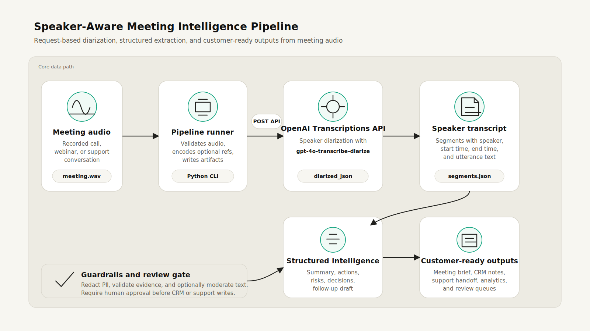

# Build a Speaker-Aware Meeting Intelligence Pipeline with Audio Diarization

Customer-facing teams often have plenty of call recordings and not enough reliable handoff context. A transcript is useful, but a speaker-aware transcript is the unlock: it lets you separate customer pain from seller follow-up, keep evidence next to action items, and route sensitive commitments into a review workflow before they land in a CRM or support system.

This Cookbook shows how to build a production-style, post-call meeting intelligence pipeline with OpenAI audio diarization. You will upload a recorded meeting, optionally provide short known-speaker reference clips, generate a diarized transcript, and extract structured meeting intelligence that downstream systems can trust.

## What you will build

By the end, you will have a runnable pipeline that:

1. Accepts a recorded meeting audio file.
2. Optionally maps known speakers using short reference clips.
3. Calls `gpt-4o-transcribe-diarize` through the Transcriptions API.
4. Produces `diarized_json` transcript segments with speaker labels and timestamps.
5. Converts those segments into a speaker-labeled Markdown transcript.
6. Uses a text model with structured outputs to produce a meeting brief, action items, risks, decisions, open questions, and a follow-up email draft.
7. Writes reviewable JSON and Markdown artifacts for human review or downstream automation.



## Why this pattern

The common first version of meeting intelligence is "send a transcript to a model and summarize it." That works for demos, but it breaks down in customer workflows because it loses who said what. The customer may state a requirement, the seller may make a commitment, and a manager may need the difference to be explicit.

Speaker-aware diarization gives the rest of the application better structure:

- Action items can include the speaker who committed to them.
- Risks can quote the exact customer concern.
- Follow-up email drafts can avoid attributing seller commitments to the customer.
- QA reviewers can spot-check speaker attribution by timestamp.
- CRM sync jobs can store evidence rather than opaque summaries.

## Architecture

This example uses a post-call architecture:

| Layer | Responsibility | Output |
| --- | --- | --- |
| Audio intake | Accepts a call recording and optional known-speaker clips. | `meeting.wav`, `Agent=agent.wav` |
| Pipeline runner | Validates inputs, encodes references as data URLs, calls OpenAI, writes artifacts. | CLI run metadata and output directory |
| Diarization | Calls `gpt-4o-transcribe-diarize` with `response_format="diarized_json"` and `chunking_strategy="auto"`. | Speaker-labeled segments |
| Transcript normalization | Converts API output into consistent JSON and Markdown. | `transcript_segments.json`, `speaker_labeled_transcript.md` |
| Meeting intelligence | Extracts summary, decisions, actions, risks, questions, quotes, and follow-up email. | `meeting_intelligence.json`, `meeting_brief.md` |
| Guardrails and review gate | Redacts sensitive fields, checks evidence anchors, optionally moderates content, and routes risky outputs for review. | `guardrail_report.json` |

This is intentionally request-based. The Realtime API is excellent for live voice experiences, browser capture, or telephony UX. For this pattern, diarization is a post-call enrichment step because `gpt-4o-transcribe-diarize` is available through `/v1/audio/transcriptions` and is not currently supported in the Realtime API. See the [speech-to-text guide](https://developers.openai.com/api/docs/guides/speech-to-text) and [Realtime guide](https://developers.openai.com/api/docs/guides/realtime) for the latest endpoint details.

## Security and guardrails

Treat meeting intelligence as a sensitive-data pipeline, not just a summarization job. The assets include raw audio, known-speaker references, diarized transcripts, extracted meeting notes, and downstream records in CRMs or support tools. Each asset needs a control.

| Risk | Guardrail |
| --- | --- |
| Recording or speaker-reference misuse | Require consent and policy approval before recording, diarization, or reference-clip use. Treat speaker references as sensitive biometric-adjacent data. |
| Over-retention of raw audio | Do not save the raw transcription response by default. Keep raw audio and reference clips only as long as needed. Encrypt and restrict access if retained. |
| Prompt injection inside transcripts | Treat transcript text as untrusted evidence. Keep instructions in the system message and require the model to use only transcript-backed facts. |
| Unsupported action items or decisions | Use strict structured outputs and require evidence fields with speaker or timestamp anchors. |
| Sensitive content in generated notes | Run redaction before summarization where possible, then run post-generation checks on the transcript and brief. |
| Harmful or policy-sensitive content | Optionally call the Moderation API with `omni-moderation-latest` on transcript text and generated brief text. Moderation detects harmful content; it is not a replacement for privacy review. |
| Unsafe downstream writes | Do not write directly to CRM, ticketing, or analytics systems from the model output. Put a human review gate in front of medium/high risks, missing evidence, moderation flags, or raw-response retention. |
| Silent quality drift | Log model versions, prompt versions, schema versions, audio duration, redaction state, moderation state, and reviewer decisions. Sample calls for evals. |

The sample writes a `guardrail_report.json` with local checks for:

- normalized transcript segments;
- basic email and phone PII patterns;
- evidence fields without a timestamp or speaker anchor;
- medium/high risk outputs;
- optional moderation flags;
- raw transcription response storage.

Use `--fail-on-guardrail` in CI or batch jobs when you want review-required output to exit non-zero.

## Prerequisites

- Python 3.10 or later.
- An OpenAI API key in `OPENAI_API_KEY`.
- A meeting recording in a supported audio format.
- Optional: up to four short speaker reference clips. The speech-to-text guide recommends 2-10 second references, encoded as data URLs when sent with multipart form data.

Install dependencies:

```bash
python -m venv .venv
source .venv/bin/activate
pip install -r examples/audio/speaker_aware_meeting_intelligence/requirements.txt
```

## Step 1: Run the demo

Start with the synthetic demo. It does not require an API key and lets reviewers inspect the artifacts and Markdown format.

```bash
python examples/audio/speaker_aware_meeting_intelligence/meeting_intelligence.py \
  --demo \
  --output-dir /tmp/meeting-intelligence-demo
```

The command writes:

```text
/tmp/meeting-intelligence-demo/
  transcript_segments.json
  speaker_labeled_transcript.md
  meeting_intelligence.json
  meeting_brief.md
  guardrail_report.json
```

You can also run the synthetic test suite. It covers the local end-to-end demo path and guardrail cases for clean handoffs, PII, weak evidence, and medium-risk outputs.

```bash
python examples/audio/speaker_aware_meeting_intelligence/test_meeting_intelligence.py
```

## Step 2: Prepare audio and speaker references

For a real recording, keep the first pass simple:

- Use one meeting audio file.
- Use `chunking_strategy="auto"` for long recordings.
- Add known-speaker references only when you have consent and a clear business need.
- Use short, clean reference clips with one speaker and minimal background noise.

Known-speaker references are optional. Without them, diarization can still separate speakers, but labels may be generic, such as `speaker_0` or `speaker_1`. With references, the API can map segments to provided names.

```bash
export OPENAI_API_KEY="..."

python examples/audio/speaker_aware_meeting_intelligence/meeting_intelligence.py \
  --audio-file /path/to/meeting.wav \
  --known-speaker "Agent=/path/to/agent_reference.wav" \
  --known-speaker "Customer=/path/to/customer_reference.wav" \
  --redact \
  --moderate \
  --output-dir /tmp/meeting-intelligence-real
```

The core diarization request is intentionally small:

```python
from openai import OpenAI

client = OpenAI()

with open("meeting.wav", "rb") as audio_file:
    transcript = client.audio.transcriptions.create(
        model="gpt-4o-transcribe-diarize",
        file=audio_file,
        response_format="diarized_json",
        chunking_strategy="auto",
        extra_body={
            "known_speaker_names": ["Agent"],
            "known_speaker_references": [to_data_url("agent_reference.wav")],
        },
    )
```

The important details are:

- Use `response_format="diarized_json"` when you need segment-level speaker metadata.
- Use `chunking_strategy="auto"` for audio longer than 30 seconds.
- Pass known speaker names and references together, in the same order.
- Keep reference clips short and single-speaker.

## Step 3: Normalize the diarized transcript

The sample converts the API response into a stable internal shape:

```json
[
  {
    "speaker": "Customer",
    "start": 38.2,
    "end": 55.0,
    "text": "We also need risks called out, especially compliance-sensitive promises..."
  }
]
```

It also creates a reviewer-friendly transcript:

```md
**Customer [00:38.200-00:55.000]**: We also need risks called out, especially compliance-sensitive promises, and we need to push action items into our CRM.
```

This normalized transcript becomes the contract between audio processing and meeting intelligence. That separation helps you rerun summarization without retranscribing audio, inspect attribution quality, and keep raw audio retention short.

## Step 4: Extract structured meeting intelligence

The sample sends the speaker-labeled transcript to a text model and asks for strict JSON:

- `summary`
- `participants`
- `customer_context`
- `decisions`
- `action_items`
- `risks`
- `open_questions`
- `notable_quotes`
- `follow_up_email`

The system instruction is deliberately conservative:

```text
Use only the transcript as evidence. Do not invent names, dates, decisions, or commitments.
If evidence is missing, leave the relevant array empty.
Include timestamps or speaker evidence in every evidence field.
```

This matters. Meeting intelligence often feeds systems of record. The safest default is to produce empty arrays instead of plausible but unsupported CRM notes.

## Step 5: Review the output

Open `meeting_brief.md` after a run:

```md
# Meeting Brief

## Summary

The customer needs a dependable post-call handoff process...

## Action Items

| Owner | Task | Due date or trigger | Evidence |
| --- | --- | --- | --- |
| Solutions Engineer | Send a prototype... | After the call | Solutions Engineer [00:55.100-01:10.300] |
```

Then open `guardrail_report.json`:

```json
{
  "status": "review_required",
  "recommended_next_step": "Send artifacts to human review before downstream writes."
}
```

Before syncing the result into a CRM, help desk, or analytics warehouse, require review for:

- Speaker attribution errors on the first and last few minutes of the call.
- Action items without clear owner evidence.
- Compliance-sensitive commitments.
- PII that should be redacted before storage.
- Hallucinated deadlines, dates, or named stakeholders.
- Moderation flags from transcript or brief text.
- Medium or high risks in the generated brief.

The sample includes `--redact` for basic email and phone redaction. In production, replace it with your organization's policy-aware redaction pipeline.

## Production hardening

Use this checklist before turning the sample into a customer workflow:

| Concern | Recommendation |
| --- | --- |
| Consent | Make sure call recording, diarization, and known-speaker references are permitted in your product, policy, and region. |
| Raw audio retention | Store raw audio only as long as needed. Persist normalized transcript segments when possible. |
| Speaker references | Treat reference clips as sensitive data. Store minimally, encrypt at rest, and rotate/delete when no longer needed. |
| Evidence | Require timestamps or quotes on decisions, risks, and action items. |
| Human review | Route high-risk summaries, compliance promises, pricing claims, or contractual terms for review. |
| Moderation | Use the Moderation API for harmful-content classification when notes may contain unsafe content. Keep privacy and compliance checks separate. |
| Retry behavior | Retry transient API errors with backoff. Avoid duplicating downstream CRM writes by using idempotency keys. |
| Observability | Log model names, prompt versions, schema versions, audio duration, latency, redaction status, and reviewer decisions. |
| Evaluation | Sample calls weekly. Track speaker attribution accuracy, action-item precision, and unsupported-claim rate. |

## Extending the pattern

You can adapt the same pipeline for:

- Customer success handoffs after quarterly business reviews.
- Support escalations where accountability and exact quotes matter.
- Sales discovery calls that feed MEDDICC, account plans, or CRM next steps.
- Recruiting interview debriefs where each interviewer needs sourced notes.
- Healthcare or financial-services workflows with stronger review and retention controls.

For live scenarios, use Realtime for the in-call experience and still run this post-call diarization pipeline when you need durable, evidence-backed meeting intelligence.

## Troubleshooting

| Symptom | Likely cause | Fix |
| --- | --- | --- |
| Speaker labels are generic | No known-speaker references were provided. | Provide clean 2-10 second reference clips for the speakers you need to name. |
| Speaker mapping is wrong | Reference clip has background noise, multiple speakers, or the wrong person. | Use a cleaner single-speaker reference and spot-check outputs before automation. |
| Long audio fails or segments poorly | Chunking was omitted or recording quality is poor. | Use `chunking_strategy="auto"` and consider pre-processing the audio for volume and silence. |
| Summary invents details | Prompt is not evidence-constrained or schema allows loose prose. | Keep strict JSON output and require evidence fields. |
| Reviewers do not trust the output | The handoff hides source context. | Include speaker, timestamp, and quote evidence next to every action or risk. |

## Full source

See [`meeting_intelligence.py`](meeting_intelligence.py) for the complete runnable sample.

Useful docs:

- [Audio and speech guide](https://developers.openai.com/api/docs/guides/audio)
- [Speech-to-text and speaker diarization](https://developers.openai.com/api/docs/guides/speech-to-text)
- [Structured outputs](https://developers.openai.com/api/docs/guides/structured-outputs)
- [Moderation](https://developers.openai.com/api/docs/guides/moderation)
- [Safety best practices](https://developers.openai.com/api/docs/guides/safety-best-practices)
- [Realtime guide](https://developers.openai.com/api/docs/guides/realtime)
