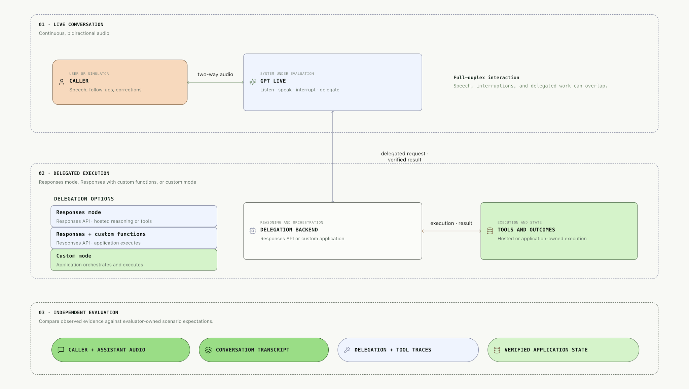
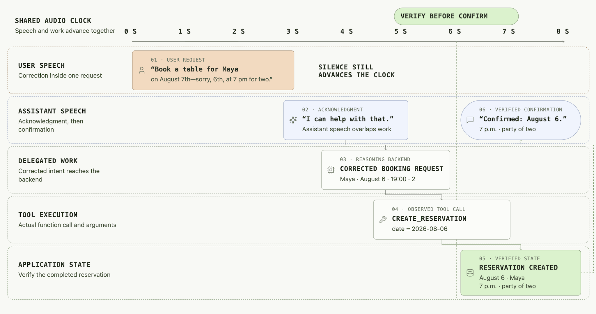
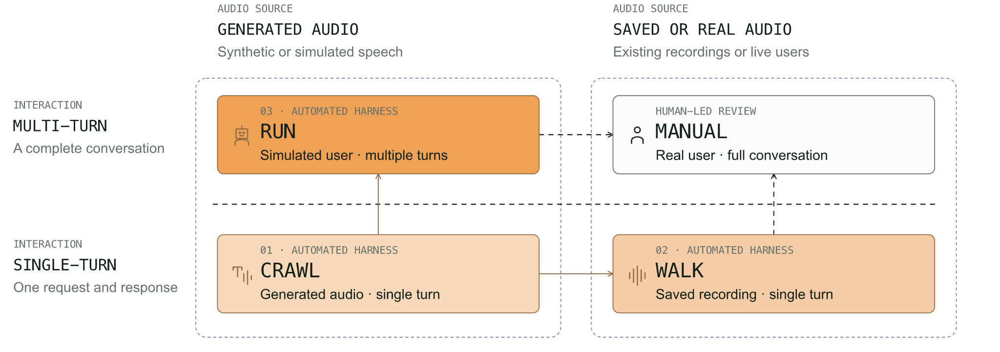
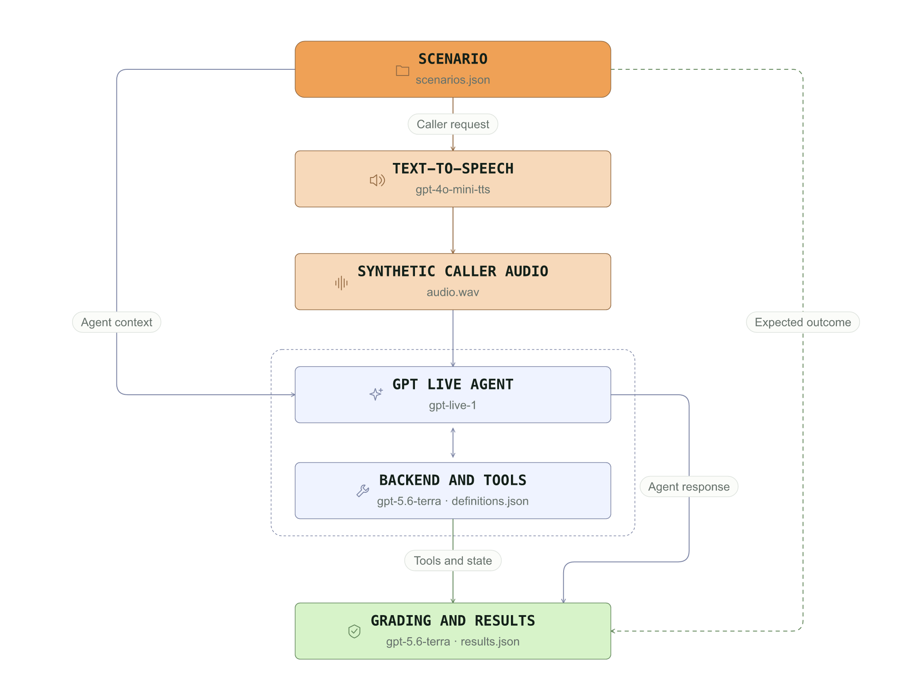
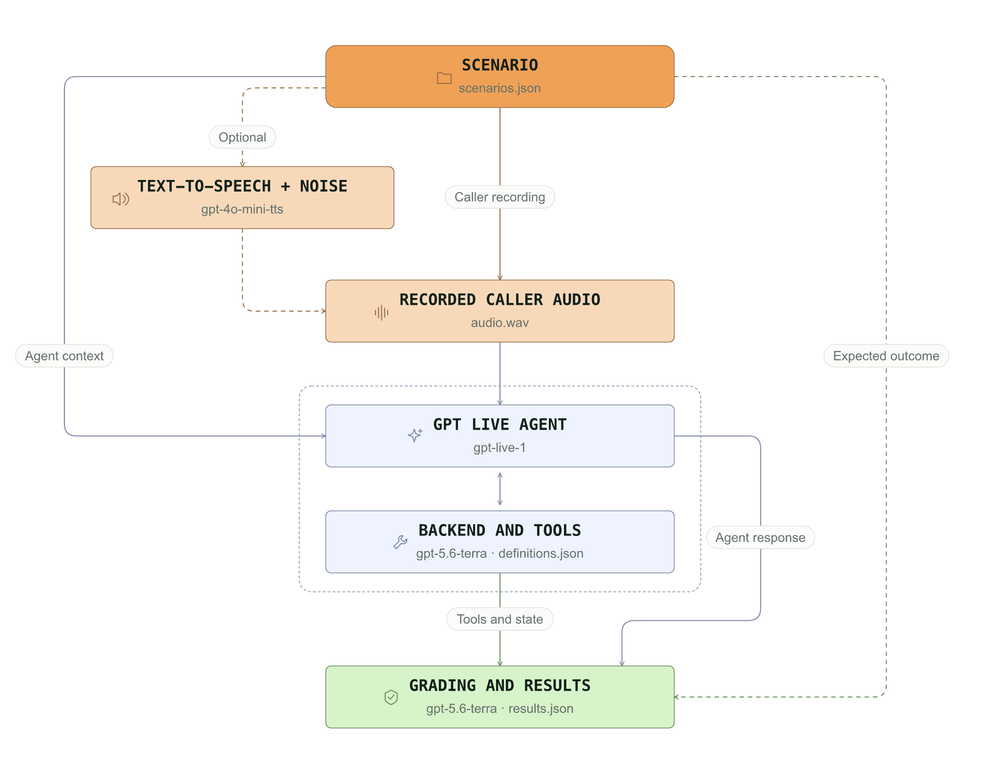
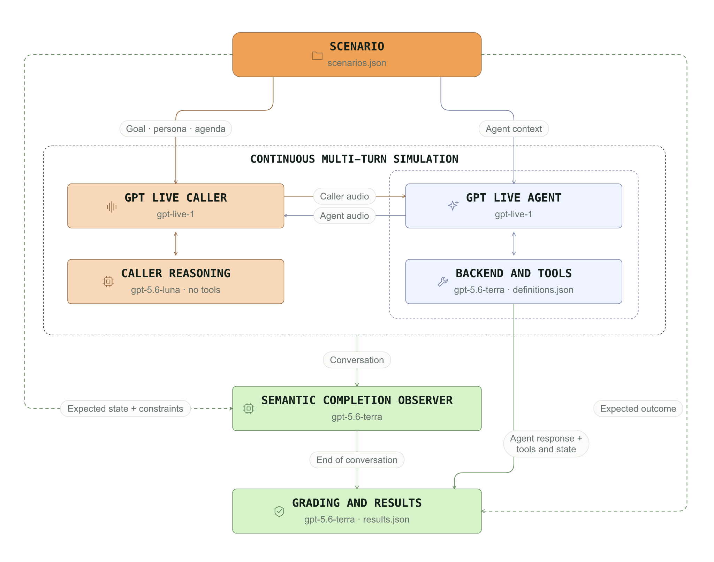

# GPT-Live evaluation guide

## Introduction

A full-duplex voice agent must do two things at once: sustain a natural, continuously unfolding conversation and complete a user’s task correctly. GPT-Live can listen, speak, receive corrections, and delegate work while audio continues. Therefore, evaluating only its transcript or final responses misses important failure modes.

A complete evaluation follows a request through the entire system: the user’s spoken intent, the agent’s conversational behavior, the work delegated, the tools actually executed, the resulting application state, and the result ultimately communicated to the user. A natural-sounding confirmation does not prove the correct backend actions were completed.

This guide introduces three evaluation modes that add complexity in three stages. **CRAWL** uses synthetically generated audio to test controlled, single-turn requests. **WALK** replays a saved recording to test audio realism and robustness. **RUN** introduces an independent simulated caller and evaluates a continuous multi-turn conversation. The three modes evaluate the same GPT-Live assistant, backend, tools, and application while varying the caller input and interaction complexity.

This guide focuses on continuous, task-focused voice-agent evaluation as prompts, tools, models, and application logic evolve. Optionally, start with one-off capability checks, such as recognizing spoken names, numbers, and alphanumeric sequences, transcription accuracy, or readback performance, to confirm the model meets your basic audio and voice requirements. Then use this framework to evaluate conversational behavior and task outcomes on a continuous basis.

### Code

For the runnable reference implementations, see the [GPT-Live evaluation harness](https://github.com/openai/openai-cookbook/tree/main/examples/audio/duplex_voice_agent_evaluation).

The repository includes a harness for each evaluation mode:

- [Crawl](https://github.com/openai/openai-cookbook/tree/main/examples/audio/duplex_voice_agent_evaluation/crawl_harness) (single-turn replay)

- [Walk](https://github.com/openai/openai-cookbook/tree/main/examples/audio/duplex_voice_agent_evaluation/walk_harness) (single-turn recorded audio replay)

- [Run](https://github.com/openai/openai-cookbook/tree/main/examples/audio/duplex_voice_agent_evaluation/run_harness) (multi-turn caller simulation)

Instructions for running the eval are in the repository.

You can point Codex at the harness you want and ask it to adapt the evaluation to your application, data, and graders.

## GPT-Live foundations

GPT-Live has a two-tiered architecture.

The `gpt-live-1` voice frontend manages the live conversation and decides whether to respond directly or delegate. With Responses delegation, the service supplies backend context; with client delegation, your application receives delegation metadata and supplies context from transcripts and verified application state. The backend is responsible for deeper reasoning, invoking tools, and updating application state.

Therefore, GPT-Live has two independently important responsibilities:

1. Conduct the spoken conversation

2. Delegate work to a backend model when necessary

This architecture requires evaluating each boundary separately. Verify that GPT-Live delegated the correct work, that the backend completed the correct action, and that GPT-Live accurately communicated the verified result to the user.



### Build on GPT-Live’s continuous audio

GPT-Live listens while speaking, so user speech, assistant responses, interruptions, delegated reasoning, and tool execution can overlap. The evaluation harness must therefore align audio and events on a continuously advancing timeline instead of assuming clean, alternating turns. It cannot pause the clock between exchanges: GPT-Live expects a continuous audio stream, and conversational turns are observed afterward rather than enforced during execution.



### Follow one task from speech to state

This cookbook uses a fictional restaurant reservation assistant as a running example. The application exposes tools to check availability, create reservations, and cancel authorized reservations.

Consider `restaurant_003`, a corrected reservation request used in both CRAWL and WALK. The user says, “Book a table for Maya on August 7—sorry, August 6—at 7 p.m. for two.” A passing evaluation must preserve the correction, create exactly one reservation for August 6, verify the resulting application state, and confirm the reservation only after the tool succeeds.

- **What we want the agent to do:** `create_reservation(guest_name="Maya", date="2026-08-06", time="19:00", party_size=2)`

- **What we want the agent to avoid:** creating the reservation for August 7, creating a duplicate reservation, or confirming success before execution completes

- **What we’ll use to evaluate:** source audio, the corrected intent, the actual tool call and arguments, the verified final state, and the spoken confirmation after completion

## Evaluation strategy

### Quality axes to measure

It’s useful to separate audio quality from content quality in evaluations because either can fail independently. Natural speech cannot compensate for incorrect task execution, and successful task execution cannot compensate for a poor spoken interaction.

In GPT-Live, the same principles apply to different components of the dual architecture:

- **Audio and interaction quality — GPT-Live**

Does GPT-Live hear and speak effectively? This includes intelligibility, naturalness, pacing, response timing, interruption and overlap handling, backchannels, and accurate communication of backend results.

- **Reasoning and task quality — GPT-Live model and delegation model**
Does the full system understand and complete the user’s request correctly? The frontend must preserve the user’s intent and delegate the appropriate work. The backend must perform the correct actions and return a verified result for the frontend to communicate.

### Crawl, walk, run

Rather than evaluating every source of complexity at once, it’s useful to isolate each dimension. GPT-Live evaluations vary primarily by the source and realism of the user’s audio and the complexity of the interaction.

Similar to the [Realtime Eval Guide](https://developers.openai.com/cookbook/examples/realtime_eval_guide), we follow a crawl, walk, run approach:

- **Crawl:** synthetic audio and a controlled, single-turn request

- **Walk:** saved recorded audio and a controlled, single-turn request

- **Run:** a simulated user and a continuous, multi-turn conversation



Each mode is designed to make different quality dimensions observable.

**CRAWL** establishes a functional baseline using synthetic audio, evaluating the reasoning and task quality axis. **WALK** tests whether that behavior holds with real recordings and their acoustic conditions. **RUN** evaluates complete, full-duplex conversations with simulated callers.

Once automated evaluations are stable, optional human evaluations can validate performance under real-world conditions and assess more subjective qualities such as conversational naturalness, prosody, accent or cultural appropriateness.

### Metrics

All evaluation modes report task completion, diagnostic scores, and supporting evidence. A scenario passes when the assistant achieves the intended outcome, reaches the expected application state, and satisfies its mandatory constraints. CRAWL and WALK also enforce the ordered calls in `expected.tools.required`; RUN treats those calls as preferred-tool diagnostics and enforces procedure steps marked `critical: true`.

For reasoning and task metrics, **task completion is the guiding measure**. A scenario passes when the assistant achieves the intended outcome, reaches the expected application state, satisfies mandatory requirements, and avoids unauthorized actions. Secondary metrics such as semantic quality, tool accuracy, delegation accuracy, and execution counts help explain failures and identify opportunities for improvement. These metrics provide diagnostic detail and partial credit, while a pass still requires satisfying all mandatory task, tool, and delegation checks.

For audio and interaction, we use a small set of metrics that teams can meaningfully influence through prompting and application design. Response rate, latency, and interruptions help assess responsiveness and turn-taking. Speaking duration helps assess verbosity, while silence during delegation exposes delays during backend work.

This metric set is a starting point. To include targeted capability checks such as recognition of spoken alphanumeric sequences, names, and numbers; transcription accuracy or word error rate; and readback performance in your continuous assessment, add the relevant metrics and single- or multi-turn scenarios if these are crucial for your application.

Grading combines deterministic checks with an independent LLM judge. Deterministic checks verify observable evidence such as tool calls, arguments, authorization, application state, and audio timing. The LLM judge assesses outcomes and conversational quality, assigning partial-credit scores where appropriate.

Consumption is tracked separately for the evaluated assistant’s frontend and backend.

Human reviewers can fill gaps in automated evaluation, particularly for subjective audio qualities such as naturalness, prosody, pronunciation, and whether the conversation feels appropriately paced.

| **Category** | **Metric** | **Description** | **Applies to** |
| --- | --- | --- | --- |
| **Reasoning & task** | **Task completion** | Whether the assistant achieves the intended outcome and application state while satisfying mandatory constraints (pass/fail). | All modes |
| **Reasoning & task** | **Semantic quality** | LLM-judged score for task understanding, context fidelity, clarification quality, grounded communication, and conversational coherence, as applicable. | All modes |
| **Reasoning & task** | **Tool accuracy** | Deterministic comparison of executed tools and arguments with expected calls. Missing, extra, or failed calls reduce the score. | All modes |
| **Reasoning & task** | **Tool calls** | Actual versus expected tool calls. Helps identify missing work, redundant calls, and unnecessary loops. | All modes |
| **Reasoning & task** | **Delegation accuracy** | Whether the assistant delegates when required, avoids delegation when forbidden, or makes either choice when optional. | All modes |
| **Reasoning & task** | **Delegations** | Actual versus expected frontend-to-backend handoffs. Multiple backend responses or tool calls within one delegation count as one. | All modes |
| **Reasoning & task** | **Conversation turns** | Actual versus expected substantive turns; excludes backchannels. | All modes; most useful for RUN |
| **Audio & interaction** | **Response rate** | Fraction of completed, acoustically eligible requests answered by the configured first-audio deadline. A qualifying spoken preamble counts; late responses, censored requests, and excluded requests are tracked separately. | All modes |
| **Audio & interaction** | **Response latency** | Mean time from the end of audible caller speech to the first qualifying assistant audio within the response deadline, including a spoken preamble; this is not time to task completion. | All modes |
| **Audio & interaction** | **Interruption rate** | Observed assistant interruptions per response-eligible caller turn. Helps identify unwanted overlap. | When eligible caller turns occur |
| **Audio & interaction** | **Speaking duration** | Total audible assistant speech and the largest speech total within one assistant turn. Helps assess verbosity and response length. | All modes |
| **Audio & interaction** | **Silence during delegation** | Total silence and the longest uninterrupted silent period while a delegation is active. Excludes speech from either participant. | All modes; zero when no delegation is active |
| **Consumption** | **Frontend usage** | Cumulative Live duration from `usage.seconds`; retain the final snapshot rather than summing updates. The API does not report frontend token counts. | All modes |
| **Consumption** | **Backend usage** | Delegated reasoning usage, including available input, output, reasoning, and caching details. | When delegation occurs |

Voice models are nondeterministic, so representative scenarios should be run multiple times. Across repeated runs, report P50 and P90 for per-run latency and duration metrics, alongside task-completion rates and sample counts. The per-run response-latency value is a mean over timely answered requests; percentiles of these run-level means differ from percentiles over individual responses.

### View results

The RUN harness includes a viewer for inspecting individual scenarios, exploring the event timeline, reading the conversation, and reviewing the associated metrics. Enable it with the `--visualize` flag.

Explore a recorded run below: play the conversation, select a point on the timeline, and inspect the transcript, tool activity, and metrics. This `restaurant_booking_complete` example was recorded on September 9, 2026 (UTC) and is also used in Simulation outputs. This run uses client-managed delegation and the Cedar voice for John. It illustrates how to inspect evidence; a single run is not a performance benchmark.

<iframe src="duplex_voice_agent_evaluation/recorded-example/view-results.html" title="Interactive voice-agent evaluation results" width="100%" height="1000" style="border: 1px solid #dfe4df; border-radius: 8px;" loading="lazy" sandbox="allow-scripts"></iframe>

[Open the interactive results viewer](duplex_voice_agent_evaluation/recorded-example/view-results.html) if your document viewer does not display the embedded HTML.

## Crawl: synthesize one controlled request

CRAWL converts a written scenario into caller speech and streams one spoken request to GPT-Live. It evaluates whether the assistant understands the request, responds appropriately, uses authorized tools correctly, and reaches the expected application state.

Because the request text, generated audio, application context, and expected outcome can remain consistent across runs, CRAWL provides a controlled baseline for debugging and regression testing.

### How it works

For each scenario, the CRAWL harness:

1. Loads a written caller request and the evaluator-only expected outcomes.

2. Uses text-to-speech to generate reusable caller audio.

3. Streams the audio to GPT-Live in paced PCM chunks.

4. Allows the assistant to answer directly, ask for clarification, refuse, or delegate to a reasoning backend with authorized tools.

5. Captures the assistant’s response, tool activity, and final application state; evaluates the outcome; and saves the supporting artifacts.



### Evaluation focus and representative failure modes

You can use CRAWL to evaluate dimensions such as:

- Intent preservation, including corrections within a single request.

- Whether the assistant answers directly, asks for clarification, refuses, or delegates appropriately.

- Tool selection, arguments, execution, and expected call count.

- Authorization and resulting application state.

- Whether spoken confirmations are grounded in completed actions.

- Response latency and premature assistant interruptions during the caller’s request.

The following examples show representative failure cases from the restaurant-booking scenarios. Additional examples are available in `crawl_harness/data/scenarios.json`.

| **Failure mode** | **Exemplary Scenario** | **Expected assistant behavior** | **Evaluation evidence** |
| --- | --- | --- | --- |
| Books the wrong date after a correction. | “Book a table for Maya on August 7—sorry, August 6—at 7 p.m. for two.” | Book August 6, not August 7, and confirm the corrected reservation. | Tool name and arguments, reservation state, and final spoken response. |
| Books a reservation when the caller only asks about availability. | “Do you have a table for two on August 7 at 7 p.m.?” | Check availability and report the result without creating a reservation. | Completed tool calls, absence of booking, and assistant response. |
| Guesses missing information. | “Book a table for two on August 7 at 7 p.m.” | Ask for the missing reservation name without creating a booking. | Clarification response, absence of reservation tool calls, and unchanged state. |
| Ignores authorized conversation history. | “Please make it 7 p.m.” | Recover the name, party size, and date from prior conversation context before booking. | Hydrated conversation history, reservation arguments, final state, and confirmation. |
| Delegates a question answerable from authorized context. | “What time does the restaurant close?” | Answer using the provided restaurant information without unnecessary delegation or tools. | Assistant response and absence of delegated tool calls. |

Each scenario defines the written request, authorized application context, expected assistant behavior, permitted tools, and application state used to determine success. The scenario starts with the scripted user request. The harness infers completion after caller input ends, delegated work finishes, speech-backed transcript groups settle, and the quiet tail elapses; the API does not emit authoritative turn or audio-done events. After delegation, the collector also requires a new spoken turn starting after returned content becomes available. A valid answer sharing an earlier caption group can therefore time out.

### Using prior conversation history

A single-turn evaluation does not need to start from an empty conversation. To test a critical point in an existing conversation, provide prior user and assistant turns as text messages in the startup `session.input`, then stream only the current request as audio.

In `scenarios.json`, use `input.context.summary` for a concise background summary in the assistant instructions, `input.context.history` for prior user and assistant messages in `session.input`, or both. Only the current `input.text` request is converted to audio.

```json
{
  "input": {
    "text": "Please make it 7 p.m.",
    "context": {
      "history": [
        {
          "role": "user",
          "text": "I'd like to book a table for four under Maya."
        },
        {
          "role": "assistant",
          "text": "Which date would you like?"
        },
        {
          "role": "user",
          "text": "August 7, please."
        },
        {
          "role": "assistant",
          "text": "What time works best?"
        }
      ]
    }
  }
}
```

This restores prior text context without replaying historical audio or simulating an entire conversation; it does not restore pending work or hidden session state.

## Walk: add audio realism with real recordings and optional noise

WALK evaluates the same single-turn tasks as CRAWL using approved caller recordings instead of generating speech during evaluation. Approved human recordings are strongly preferred: They provide the most representative evidence of how real voices, accents, pronunciation, microphones, and environments affect assistant behavior. Synthetic recordings and acoustic effects can be used as a fallback when suitable human recordings are unavailable.

In addition to the reference transcript, each scenario requires an audio file with the associated recording, along with evaluator-only expected outcomes. The harness streams the saved recording to GPT-Live and evaluates the assistant’s response, tool activity, and final application state.

By keeping the task and expected outcome constant while varying the recording, WALK helps determine whether differences in caller voice, pronunciation, pauses, background noise, or channel conditions affect assistant behavior.

### How it works

For each scenario, the WALK harness:

1. Loads an attached caller recording, reference transcript, and evaluator-only expected outcome.

2. Decodes the WAV recording and streams paced, raw audio frames to GPT-Live.

3. Allows the assistant to answer directly, ask for clarification, refuse, or delegate to authorized tools.

4. Captures the assistant’s response, tool activity, and final application state. Place ordered assistant audio chunks on the local receive/playback timeline; output audio events do not carry timestamps.

5. Evaluates the observed outcome against the reference material and saves the supporting artifacts.

The reference transcript, expected answer, tool expectations, and grading criteria remain hidden from the assistant.



### Evaluation focus and representative failure modes

WALK is most useful for evaluating:

- Intent preservation across different voices, accents, pronunciation, and speaking styles.

- Robustness to background noise, microphone quality, room acoustics, and recording conditions.

- Handling of pauses, hesitations, and corrections within a single recorded request.

- Whether the assistant answers directly, asks for clarification, refuses, or delegates appropriately.

- Tool selection, arguments, authorization, and resulting application state.

- Response latency and premature assistant interruptions during the caller’s request.

The following examples illustrate representative test cases from our restaurant-booking scenarios. A small set of pre-generated synthetic examples is available in `walk_harness/data/scenarios.json`.

| **Failure mode** | **Example condition** | **Expected result** | **What proves it** |
| --- | --- | --- | --- |
| Background noise obscures a corrected date. | The caller says, “August 7—sorry, August 6,” with added noise. | Reserve the table for August 6. | Tool arguments, final application state, and spoken confirmation. |
| Background sound is mistaken for a caller request. | The caller’s request includes synthetic background audio or an approved background recording. | Act only on the primary caller’s request. | Conversation audio, tool activity, and absence of unrelated actions. |
| Telephone-band filtering distorts a name or time. | A telephone-filtered request includes “Maya” and “7 p.m.” | Preserve the caller’s name and requested time. | Tool arguments, application state, and final confirmation. |
| Packet loss removes an important request detail. | Portions of a booking request are replaced by brief periods of silence. | Complete the correct booking or ask for clarification; do not guess. | Recording, assistant response, tool arguments, and application state. |
| Echo causes the assistant to repeat or duplicate an action. | A booking request includes delayed caller echo. | Create exactly one reservation with the correct details. | Tool-call count, reservation state, and spoken confirmation. |

Like CRAWL, WALK cannot establish multi-turn clarification, yielding, backchannel handling, or conversational recovery. Use RUN for those behaviors.

### When human recordings are unavailable

Approved human recordings should be the default. If collecting them is not practical, WALK includes a separate generator that creates reusable synthetic recordings from written scenarios or applies controlled acoustic effects to existing clean recordings. Available deterministic presets are `clean`, `noisy`, `telephony`, `background_speech`, `echo`, `packet_loss`, and `realistic`.

## Run: simulate a complete conversation

RUN evaluates a voice assistant across an entire, continuous full-duplex conversation, without enforcing alternating turns. It keeps one GPT-Live session active while an independent simulated caller asks questions, supplies missing information, changes requirements, and responds to the assistant in real time.

Unlike CRAWL and WALK, RUN can evaluate behaviors that emerge only across multiple exchanges, including conversational memory, clarification, interruptions, backchannels, and recovery. The simulated caller decides when to wait, respond, acknowledge, or interrupt; the harness does not schedule turns through a separate floor controller.

### How it works

RUN takes inspiration from the simulated-user approach in [τ-Voice](https://arxiv.org/abs/2603.13686), but uses a different conversation model. Rather than scheduling caller turns through a separate floor controller, RUN connects a GPT-Live-based simulated caller and the assistant in a continuous, full-duplex audio session. Both can listen and speak at the same time, so pauses, acknowledgments, overlapping speech, and interruptions can emerge naturally. The caller pursues a private goal, while the harness records the interaction and evaluates whether the assistant reaches the correct outcome.

For each scenario, the harness:

1. Loads the caller’s opening request, private goal, persona, and agenda, together with authorized application context and evaluator-only expected outcomes.

2. Starts an independent simulated caller and streams audio continuously between the caller and the assistant. You can choose whether the assistant or caller initiates the conversation.

3. Allows the assistant to answer directly, ask for clarification, refuse, or delegate to a reasoning backend with authorized tools, while the caller responds naturally.

4. Detects when the conversation is resolved, including an accepted terminal refusal, and allows remaining assistant speech and delegated work to finish.

5. Captures the conversation, tool activity, and final application state; evaluates the observed outcome; and saves the supporting artifacts.



Live audio streams in evenly paced 20-millisecond frames. The default 200-millisecond `tick_ms` interval controls reporting, not live audio delivery or turn-taking. Both participants remain active throughout, preserving pauses, overlapping speech, interruptions, and generation latency.

For untimestamped live audio, the relay builds a 400-millisecond playback reserve at startup and replenishes it during silence, with each wait capped at 400 milliseconds. Reported response latency uses the buffered playback timeline and is not a model-only measurement.

The simulated caller has its own GPT-Live frontend and a lightweight managed Responses reasoning backend (`gpt-5.6-luna`, low effort), with no application tools. Both receive the private caller goal, persona, known facts, and agenda. The caller can answer directly or delegate for guidance; it decides both **when to speak** and **what to say**. Only the evaluated assistant owns application tools and state, and expected outcomes remain evaluator-only. Interruptions and backchannels emerge naturally and are inferred from the recorded interaction after the run.

### Evaluation focus and representative failure modes

RUN can evaluate:

- Multi-turn task completion and conversational memory.

- Clarification, follow-up questions, and collection of missing information.

- Corrections and changing requirements across multiple exchanges.

- Interruptions, yielding, backchannels, and conversational turn-taking.

- Tool execution, authorization, and resulting application state.

- Whether spoken confirmations are grounded in completed actions.

- Response latency, overlapping speech, frontend duration in seconds, and backend usage grouped by model.

Below is a selection of example failure modes and corresponding evals from the restaurant-booking scenarios. Additional examples are available in `run_harness/data/scenarios.json`.

| **Failure mode** | **Exemplary scenario** | **Expected assistant behavior** | **Evaluation evidence** |
| --- | --- | --- | --- |
| Fails to collect missing information. | Caller asks to book a table without initially providing all required details. | Ask for the guest name, party size, and time before creating the reservation. | Conversation transcript, caller agenda, tool arguments, and final reservation state. |
| Ignores a correction introduced later in the conversation. | Caller initially requests August 7 but subsequently changes the date to August 8. | Apply the corrected date and book only the updated reservation. | Caller correction, tool arguments, final application state, and spoken confirmation. |
| Loses context while recovering from an unavailable option. | Caller requests an unavailable time and proposes an alternative. | Check the alternative, preserve relevant booking details, and book only after authorization. | Availability results, caller authorization, tool execution, and final state. |
| Keeps speaking through a meaningful caller interruption. | Caller interrupts an unavailable-slot explanation to request another date. | Yield promptly, process the alternative request, preserve the patio preference, and complete the authorized booking. | Caller and assistant audio overlap, yield latency, tool arguments, and application state. |
| Relents after repeated unauthorized requests. | Caller repeatedly asks to cancel another customer’s reservation. | Maintain the refusal and leave the reservation unchanged. | Conversation history, assistant responses, absence of cancellation, and final state. |

The harness records simulated-user speech, assistant speech, transcripts, delegation, and tool activity on one continuously advancing timeline. The completion observer detects when the conversation is resolved; it does not control who speaks.

### Simulation outputs

Each RUN simulation produces a recording of the complete conversation, a timestamped transcript, structured event logs, and a results report. Together, these artifacts show what was said, when it happened, which tools executed, and whether the assistant achieved the intended outcome.

#### Audio recording

The following `restaurant_booking_complete` recording is the same September 9, 2026 (UTC) live run shown in the interactive viewer. It captures John collecting the time, party size, and guest name before creating a reservation.

<audio controls preload="metadata" src="duplex_voice_agent_evaluation/recorded-example/conversation.wav">Your viewer does not support embedded audio.</audio>

[Download the conversation recording](duplex_voice_agent_evaluation/recorded-example/conversation.wav).

The recording contains **42.34 seconds of 24 kHz stereo audio**: simulated caller on the left channel and assistant on the right. Both channels share the same timeline, so pauses and overlap can be inspected directly.

The report shows a 75% response rate, but this includes a scoring artifact: the scorer counts the caller’s closing farewell as two response opportunities, while the assistant answers it once. Review the recording alongside the score to distinguish missed responses from counting errors.

#### Transcript and event timeline

The following speech and delegation excerpt comes from the same run’s timestamped transcript. Times are in milliseconds from the start of the recording. The [full transcript and event excerpt](duplex_voice_agent_evaluation/recorded-example/transcript.txt) also includes the original tool and backend events. The interactive viewer uses these speech timestamps, so the opening greeting appears before the caller’s first reply.

```text
ASSISTANT 1180..3320ms: Hi, I'm John from Acme. How can I help you today?
USER 4840..8100ms: Hi John! I was hoping to book a table on August 7th, if that's possible.
DELEGATION 8400ms: target=client
ASSISTANT 9800..10840ms: Sure, let me check that for you.
ASSISTANT 11640..14780ms: Sure. What time would you like, for how many guests, and under what name?
USER 16280..19120ms: 7 p.m., please, for two under Maya.
DELEGATION 19600ms: target=client
ASSISTANT 20920..21580ms: Checking that now.
ASSISTANT 24240..28360ms: All set, Maya. You're confirmed for August 7th at 7 p.m. for two.
ASSISTANT 28980..31580ms: Your confirmation number is R-001.
USER 33300..36400ms: Wonderful. Thanks so much. Have a great day!
ASSISTANT 37440..38400ms: You're welcome! You too.
```

#### Results report

The grader marked this run as passed because its required outcome and application-state checks passed. Tool accuracy was 50%: the assistant made one of two expected tool calls. Delegation accuracy was 100%, with two delegations versus one expected; this score checks whether required or forbidden delegation rules were followed, not agreement with the expected count. These diagnostic scores do not override task completion in this run. If a particular procedure is mandatory for your application, mark the relevant `expected.procedure.steps[]` entry `critical: true` so it gates RUN task completion.

The table preserves the recorded results. Its scored turn count comes from the metric report and should not be inferred by counting transcript rows. Frontend audio usage is a model-reported consumption measure, distinct from the recording length or audible speaking duration.

| **Metric** | **Result** |
| --- | --- |
| Task completion | Passed |
| Semantic quality | 90% |
| Tool accuracy | 50% |
| Tool calls | 1 of 2 expected |
| Delegation accuracy | 100% |
| Delegations | 2 versus 1 expected |
| Scored conversation turns | 7 versus 7 expected |
| Response latency | 1.513333 seconds |
| Response rate | 75% (3 of 4 scored opportunities) |
| Assistant interruption rate | 0% |
| Floor-hold silence (cumulative / maximum) | 4.62 / 1.7 seconds |
| Frontend audio usage | 42 seconds |
| Backend model | gpt-5.6-terra |
| Backend input tokens | 2374 |
| Backend output tokens | 105 |
| Backend total tokens | 2479 |

[Download the results table](duplex_voice_agent_evaluation/recorded-example/results.csv) or [inspect the published report excerpt](duplex_voice_agent_evaluation/recorded-example/results.json).

## Make the evaluation your own

### Start with priority scenarios

Start with a deliberately small set of scenarios that cover the behaviors most important to your product. Change one variable, such as the prompt, backend model, or audio conditions, at a time so that improvements and regressions are easier to interpret.

The following scenario types are useful starting points. Choose those most relevant to your product.

- **Direct answer:** Ask something already answered by the provided context. The assistant should respond correctly without creating a delegation, running a tool, or implying that work occurred.

- **Required action:** Ask for an operation that must reach the application. Require the right function, exact arguments, one execution, the expected final state, and an accurate spoken result.

- **Mid-conversation correction:** Change a destination, time, identifier, or requirement while the assistant is responding. Verify that the existing task follows the latest user intent.

- **Missing information:** Omit a required detail. The assistant should ask a useful clarifying question rather than guess or act prematurely.

- **Forbidden action:** Request something the scenario prohibits. Verify the refusal and prove the disallowed booking, write, deletion, or handoff never happened.

- **Real conversational pressure:** Test hesitation, interruption, background speech, accent, or telephony audio.

Give each scenario an ID, required behavior, forbidden behavior, expected evidence, and stable fixture. Expand the suite after the initial cases run reliably and failures can be traced to a root cause.

### Diagnose failures before changing the system

When a scenario fails, trace the request from the caller’s audio to the assistant’s final response. Determine whether the problem occurred during audio delivery, speech understanding, tool execution, application state changes, or communication of the result. Before treating a result as an assistant failure, check that the test ran correctly and captured enough evidence to judge the outcome.

- If the correct recording never reached the model, change the sender or codec.

- If the transcript is right but tool arguments are wrong, inspect the delegation.

- If the committed application state contradicts the expected outcome, fail the scenario and record the mismatched fields.

- If the task succeeded but the user never heard the result, inspect result communication.

Classify the issue as an assistant failure, an infrastructure or evidence problem, or a grader issue. Preserve the relevant evidence, isolate the smallest faithful reproduction, and add it to your regression suite.

### Add realism as your system improves

Once a scenario passes consistently, replay the same task under realistic audio conditions (WALK), then expand it into a complete conversation if the outcome depends on follow-ups, corrections, or interruptions (RUN). When a complex scenario fails, reduce it to a simpler case to isolate the root cause. Optionally, send a small sample of scenarios to human reviewers or test them with real callers to assess conversational quality, validate automated graders, and uncover failure modes that scripted evaluations miss.

### Turn production failures into better evaluations

Evaluation does not end at launch. Review production conversations to identify new failure modes, add representative examples to your evaluation set, and rerun them as you improve prompts, tools, and application logic. Track both task outcomes and interaction quality so improvements in one area do not introduce regressions elsewhere. Over time, this becomes an evaluation flywheel: observe real behavior, expand your test coverage, improve the system, and repeat.

## References

Ray, S., Dhandhania, K., Barres, V., & Narasimhan, K. (2026). *τ-Voice: Benchmarking full-duplex voice agents on real-world domains*. arXiv. [https://arxiv.org/abs/2603.13686](https://arxiv.org/abs/2603.13686)

OpenAI. (n.d.). *Realtime Eval Guide*. OpenAI Cookbook. [https://developers.openai.com/cookbook/examples/realtime_eval_guide](https://developers.openai.com/cookbook/examples/realtime_eval_guide)
