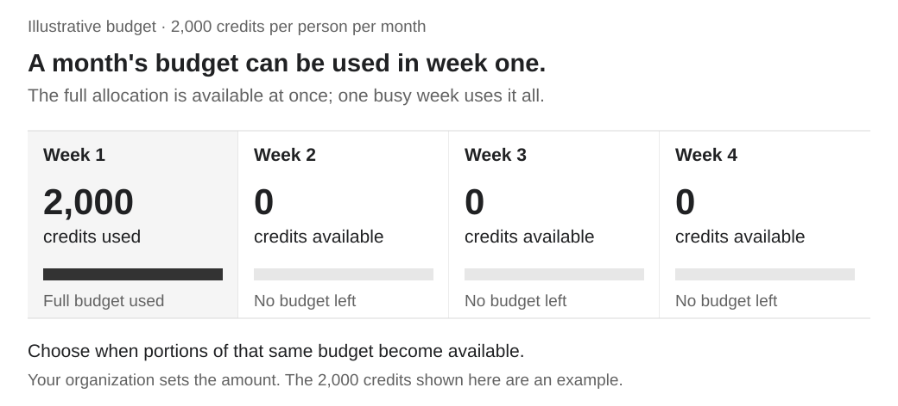
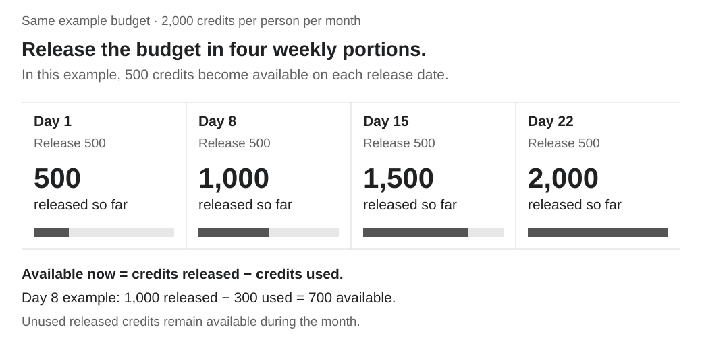
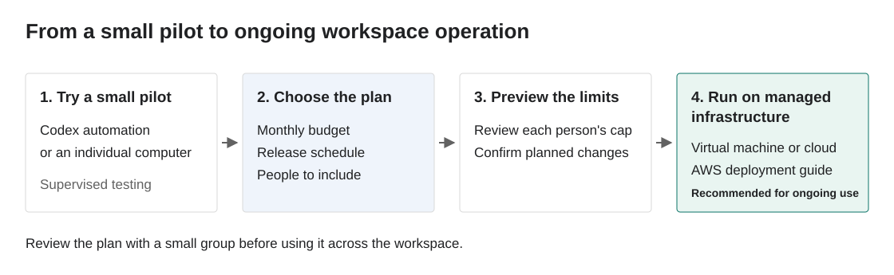

# Release ChatGPT usage budgets hourly, daily, or weekly

Usage limits in **ChatGPT Enterprise and Edu are monthly**. A user who spends their allocation in the first week reaches the limit with most of the month still ahead.

The [usage-limit endpoints in the ChatGPT Admin API](https://chatgpt.com/public/admin/api-reference) give you more control over when that budget becomes available. Release credits **hourly, daily, weekly, or on a custom schedule** to keep capacity available for later work. Choose amounts and schedules for individual users, a department, or your workspace.

For your most active users, increase the available amount based on recent consumption, up to a monthly maximum you set. Pair these adjustments with regular usage updates so people understand what remains, when more will be available, and how their model choices affect consumption.

## Keep capacity available throughout the month

The illustration uses **2,000 credits per person per month**. All amounts in this guide are examples; choose budgets that fit the people and teams you support.

Releasing 500 credits each week reserves part of that allocation for later weeks. Each release increases the person's monthly limit, reaching the full 2,000 credits with the fourth release.

Monthly reset dates

Usage limits reset on the first day of each month in UTC by default. A workspace can also align its monthly usage period with its billing cycle. [See your workspace's usage period](https://help.openai.com/en/articles/20001001-manage-usage-limits-and-overages-in-chatgpt-enterprise-and-edu).

## Try a release plan in your browser

Open the [interactive example](assets/release-explorer.html). Change the monthly budget, compare release schedules, and see how usage affects the amount available. Start immediately with the example data in your browser.

| Release date | New credits available | Monthly limit after release |
| --- | ---: | ---: |
| Day 1 | 500 | 500 |
| Day 8 | 500 | 1,000 |
| Day 15 | 500 | 1,500 |
| Day 22 | 500 | 2,000 |

Unused released credits remain available within the month. You choose the total monthly budget and when each portion becomes available.

## Get started

[Download the starter kit](https://raw.githubusercontent.com/openai/openai-cookbook/codex/daily-usage-limits/examples/chatgpt/daily_usage_limits/assets/chatgpt-usage-budget-starter.zip) and extract the folder. Choose the path that fits the tools available to you.

The browser example and fictional demonstration work on **Windows, macOS, and Linux**. The starter kit includes the source, guides, tests, and illustrations from this GitHub example.

| Your setup | Start here |
| --- | --- |
| You have Node.js 24 or later and use a terminal or PowerShell. | [Run the example](https://github.com/openai/openai-cookbook/blob/codex/daily-usage-limits/examples/chatgpt/daily_usage_limits/docs/get-started.md#run-with-nodejs) with one command. |
| You use Codex and want help with setup. | [Open the folder in Codex](https://github.com/openai/openai-cookbook/blob/codex/daily-usage-limits/examples/chatgpt/daily_usage_limits/docs/get-started.md#let-codex-help) and ask it to run the example. |
| Your team provides a managed computer, virtual machine, or cloud environment. | [Run in that environment](https://github.com/openai/openai-cookbook/blob/codex/daily-usage-limits/examples/chatgpt/daily_usage_limits/docs/get-started.md#use-a-managed-environment). This path also works when you cannot run the required software on your computer. |

The example walks through a weekly release plan for three fictional people. Review each person's current limit, the next release, and the monthly maximum. Then choose the people, amounts, and schedule for your pilot.

## Choose how to release the budget

| Approach | Use it to |
| --- | --- |
| Scheduled releases | Spread a monthly allocation across hourly, daily, weekly, or custom releases. |
| Usage-based increases | Give active users more capacity as consumption grows, up to a monthly maximum. |

Set different budgets and schedules for different populations. For example, give a project team weekly releases and use consumption-based increases for a small group of power users. Keep each person in one active configuration.

See [policy configuration and examples](https://github.com/openai/openai-cookbook/blob/codex/daily-usage-limits/examples/chatgpt/daily_usage_limits/docs/operations.md#choose-a-policy) for the settings. Share the monthly allocation, usage so far, and next release date through your existing communication channels. Use those updates to help people choose models that fit their work and available budget.

## Test with a small group

Use a local run or Codex automation to try the approach with a small group. Review the proposed limits, observe how the release schedule fits their work, and adjust the plan.

For ongoing workspace credit management, run the program on **organization-managed infrastructure**, such as a managed virtual machine or cloud service. Assign a team to monitor it and keep it running independently of an individual's computer.

| Next step | Guide |
| --- | --- |
| Test a scheduled Codex pilot | [Set up a Codex pilot](https://github.com/openai/openai-cookbook/blob/codex/daily-usage-limits/examples/chatgpt/daily_usage_limits/docs/codex.md) |
| Run on a managed macOS or Linux computer or server | [Set up a managed host](https://github.com/openai/openai-cookbook/blob/codex/daily-usage-limits/examples/chatgpt/daily_usage_limits/docs/local.md) |
| Deploy using your AWS account | [Deploy on AWS](https://github.com/openai/openai-cookbook/blob/codex/daily-usage-limits/examples/chatgpt/daily_usage_limits/docs/aws.md) |

The AWS guide includes a deployment template and setup instructions. Your technical team can adapt the program to other infrastructure your organization operates.

For Windows admins, the AWS guide provides a browser-based setup path through AWS CloudShell. Live local scheduling uses the included macOS or Linux service setup.

## Prepare a reviewed enrollment

Choose the people included, confirm their current settings and monthly period, and review the proposed changes. The [configuration and enrollment guide](https://github.com/openai/openai-cookbook/blob/codex/daily-usage-limits/examples/chatgpt/daily_usage_limits/docs/operations.md#prepare-a-reviewed-enrollment) takes you through each step. A preview shows the proposed limits before you apply them.

## Stop, restore, and renew

The program saves the original settings and records its changes. Follow the [stop and restore procedure](https://github.com/openai/openai-cookbook/blob/codex/daily-usage-limits/examples/chatgpt/daily_usage_limits/docs/operations.md#stop-restore-and-renew) when ending a pilot or changing its policy. Review a fresh enrollment for the next monthly period.

For implementation details, see the [verification guide](https://github.com/openai/openai-cookbook/blob/codex/daily-usage-limits/examples/chatgpt/daily_usage_limits/docs/verification.md) and [API contract](https://github.com/openai/openai-cookbook/blob/codex/daily-usage-limits/examples/chatgpt/daily_usage_limits/docs/api-contract.md).
