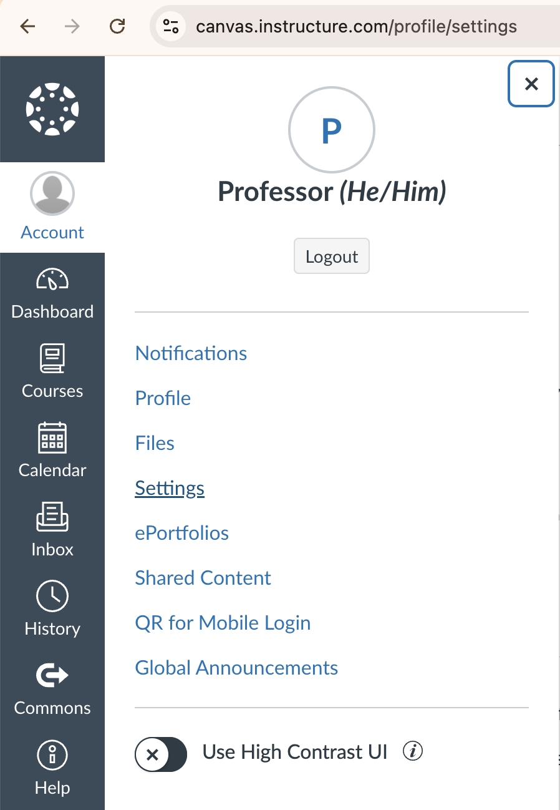
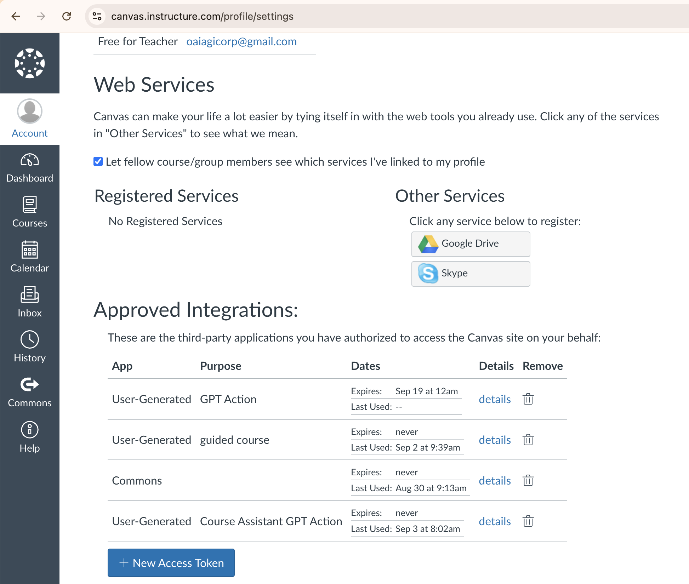
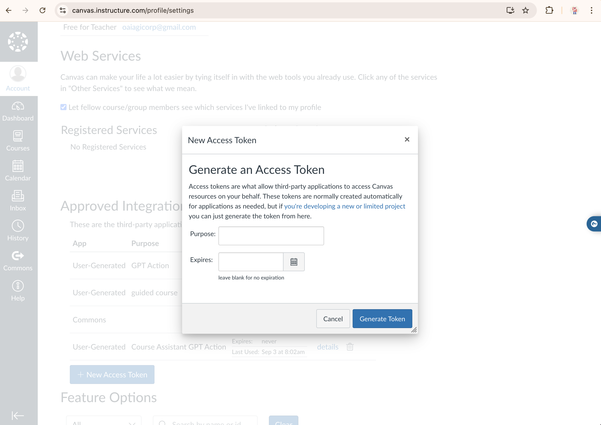

# Canvas LMS Cookbook

### Table of Contents

1. [**General App Information**](#general-app-information) - Overview of Canvas LMS, its functionality, and the role of ChatGPT's Custom Actions to enhance educational experiences through AI integration.

2. [**Authentication from ChatGPT to Canvas**](#authentication-from-chatgpt-to-canvas) - Explanation of authentication methods (OAuth and User Generated Access Tokens) for connecting ChatGPT to Canvas, with detailed instructions for setting up each option.

3. [**Sample Use Case: Student Course Assistant**](#sample-use-case-student-course-assistant) - Detailed example of using ChatGPT to assist students with course navigation, exam preparation, and personalized feedback, including specific API calls and workflows.

4. [**Other Use Cases for Consideration**](#other-use-cases-for-consideration) - Additional potential integrations using the Canvas API, such as classroom analytics and report generation.

5. [**Congratulations**](#congratulations)  

## General App Information

Canvas is a widely-used Learning Management System (LMS) designed to support online learning and teaching. It offers a robust set of tools for course management, content delivery, assessments, and student collaboration. Through the [Canvas REST API](https://canvas.instructure.com/doc/api/all_resources.html), Canvas allows for extensive customization and integration with third-party applications, including AI-powered tools like ChatGPT. 

ChatGPT’s Custom Actions with Canvas enable educators to leverage AI to enhance course content, automate tasks, and provide personalized learning journeys for students. Examples include virtual teaching assistants based on active courses, as the capabilities are well-suited for pulling information in from Canvas to create an educational dialogue. ChatGPT with Custom Actions is not meant for automating the entire Canvas experience nor act as a replacement to many of its capabilities better suited for completion in the Canvas app. 

## Authentication from ChatGPT to Canvas

For a general overview on Authentication in Custom Actions, see the [Action authentication documentation](https://platform.openai.com/docs/actions/authentication).

There are two options for authentication in Canvas: 1) OAuth and 2) User Generated Access Tokens.
- For large-scale deployments, it is required to use OAuth for Action Authentication.
- If the user is considering a single-user deployment or does not have access to Admin Settings, they may consider User Generated Access Tokens. Be aware that any request made by the action will be made using the token the user generated, so Canvas will register all requests as the user's activity and use the user's permissions to complete them.

### Implementing OAuth for Canvas

While this Canvas Cookbook does not use OAuth, any deployment with more than one user must use it. See [OAuth for Canvas Documentation](https://canvas.instructure.com/doc/api/file.oauth.html#oauth2-flow) for a detailed walkthrough. 

Here are some things to keep in mind while implementing OAuth in a Canvas Custom Action:

-  Access to Canvas’ Admin settings is required for OAuth in order to retrieve a Client ID and Client Secret.
-  The Authorization URL will look like (make sure to update the Canvas Install URL): https://<canvas-install-url>/login/oauth2/auth
-  The Token URL will look like (make sure to update the Canvas Install URL): ttps://<canvas-install-url>/login/oauth2/token
-  Scopes may not need to be defined in the Custom Action. If the developer key does not require scopes and no scope parameter is specified, the access token will have access to all scopes. If the developer key does require scopes and no scope parameter is specified, Canvas will respond with "invalid_scope." More information on developer keys [here](https://canvas.instructure.com/doc/api/file.developer_keys.html) and endpoints [here](https://canvas.instructure.com/doc/api/file.oauth_endpoints.html#get-login-oauth2-auth).
-  Token Exchange Method is Default (POST Request)
-  Canvas uses the term `redirect_uri` where ChatGPT uses the term `Callback URL` for URL to complete the redirect process after successful authentication.

### Implementing authentication with User Generated Access Tokens

In some cases, it may be appropriate to use [User Generated Access Tokens](https://canvas.instructure.com/doc/api/file.oauth.html#manual-token-generation) for Custom Action authentication with Canvas. Here are the steps to follow to do so:

  1. Proceed to Canvas Account Settings shown here:
  
  2. Scroll down to the List of Tokens shown here:          
  
  3. Generate a New Token, and **store this token**. It will not be accessible later.
  

## Sample Use Case: Student Course Assistant

### Overview

Assists students in navigating and understanding their courses by providing detailed information, generating personalized practice exams, and offering constructive feedback to enhance learning.

### Considerations

- Some information like the Syllabus is returned as an HTML page when requested by the API. This renders it impossible to show in ChatGPT. Instead, reference course description, modules, and the assignments to guide the user.
- Requests can be modified to retrieve specific pieces of information using the `include[]` query parameter. If you need to request specific information about a course, provide an example in the GPT instructions.

### GPT Instructions

There can be multiple ways to write these instructions. [See here](https://platform.openai.com/docs/guides/prompt-engineering) for guidance on Prompt Engineering strategies and best practices.

```
# **Context:** You support college students by providing detailed information about their courses hosted on the Canvas Learning Management System. You help them understand course content, generate practice exams based on provided materials, and offer insightful feedback to aid their learning journey. Assume the students are familiar with basic academic terminologies.

# **Instructions:**

## Scenarios

### - When the user asks for information about a specific course, follow this 5 step process:
1. Ask the user to specify the course they want assistance with and the particular area of focus (e.g., overall course overview, specific module).
2. If you do not know the Course ID for the course requested, use the listYourCourses to find the right course and corresponding ID in Canvas. If none of the courses listed returned courses that seem to match the course request, use the searchCourses to see if there are any similarly named course. 
3. Retrieve the course information from Canvas using the getSingleCourse API call and the listModules API call. 
4. Ask the user which module(s) they would like to focus on and use the listModuleItems to retrieve the requested module items. For any assignments, share links to them.
5. Ask if the user needs more information or if they need to prepare for an exam.

### When a user asks to take a practice test or practice exam for a specific course, follow this 6 step process:
1. Ask how many questions
2. Ask which chapters or topics they want to be tested on, provide a couple examples from the course modules in Canvas.
3. Ask 1 question at a time, be sure the questions are multiple choice (do not generate the next question until the question is answered)
4. When the user answers, tell them if its right or wrong and give a description for the correct answer 
5. Ask the user if they want to export the test results and write the code to create the PDF
6. Offer additional resources and study tips tailored to the user's needs and progress, and inquire if they require further assistance with other courses or topics.

### When a user asks to create a study guide
- Format the generated study guide in a table
```

### OpenAPI Schema

- API Calls Featured
  - [GET] [listYourCourses](https://canvas.instructure.com/doc/api/courses.html#method.courses.index)
  - [GET] [getSingleCourse](https://canvas.instructure.com/doc/api/courses.html#method.courses.show)
  - [GET] [listModules](https://canvas.instructure.com/doc/api/modules.html#method.context_modules_api.index)
  - [GET] [listModuleItems](https://canvas.instructure.com/doc/api/modules.html#method.context_module_items_api.index)
  - [GET] [searchCourses](https://canvas.instructure.com/doc/api/search.html#method.search.all_courses)

Below was generated with a combination of [Canvas API Reference](https://canvas.instructure.com/doc/api/index.html) and the [ActionsGPT](https://chatgpt.com/g/g-TYEliDU6A-actionsgpt).

```yaml
openapi: 3.1.0
info:
  title: Canvas API
  description: API for interacting with Canvas LMS, including courses, modules, module items, and search functionalities.
  version: 1.0.0
servers:
  - url: https://canvas.instructure.com/api/v1
    description: Canvas LMS API server
    variables:
      domain:
        default: canvas.instructure.com
        description: The domain of your Canvas instance
paths:
  /courses:
    get:
      operationId: listYourCourses
      summary: List your courses
      description: Retrieves a paginated list of active courses for the current user.
      parameters:
        - name: enrollment_type
          in: query
          description: Filter by enrollment type (e.g., "teacher", "student").
          schema:
            type: string
        - name: enrollment_role
          in: query
          description: Filter by role type. Requires admin permissions.
          schema:
            type: string
        - name: enrollment_state
          in: query
          description: Filter by enrollment state (e.g., "active", "invited").
          schema:
            type: string
        - name: exclude_blueprint_courses
          in: query
          description: Exclude Blueprint courses if true.
          schema:
            type: boolean
        - name: include
          in: query
          description: Array of additional information to include (e.g., "term", "teachers").
          schema:
            type: array
            items:
              type: string
        - name: per_page
          in: query
          description: The number of results to return per page.
          schema:
            type: integer
          example: 10
        - name: page
          in: query
          description: The page number to return.
          schema:
            type: integer
          example: 1
      responses:
        '200':
          description: A list of courses.
          content:
            application/json:
              schema:
                type: array
                items:
                  type: object
                  properties:
                    id:
                      type: integer
                      description: The ID of the course.
                    name:
                      type: string
                      description: The name of the course.
                    account_id:
                      type: integer
                      description: The ID of the account associated with the course.
                    enrollment_term_id:
                      type: integer
                      description: The ID of the term associated with the course.
                    start_at:
                      type: string
                      format: date-time
                      description: The start date of the course.
                    end_at:
                      type: string
                      format: date-time
                      description: The end date of the course.
                    course_code:
                      type: string
                      description: The course code.
                    state:
                      type: string
                      description: The current state of the course (e.g., "unpublished", "available").
        '400':
          description: Bad request, possibly due to invalid query parameters.
        '401':
          description: Unauthorized, likely due to invalid authentication credentials.

  /courses/{course_id}:
    get:
      operationId: getSingleCourse
      summary: Get a single course
      description: Retrieves the details of a specific course by its ID.
      parameters:
        - name: course_id
          in: path
          required: true
          description: The ID of the course.
          schema:
            type: integer
        - name: include
          in: query
          description: Array of additional information to include (e.g., "term", "teachers").
          schema:
            type: array
            items:
              type: string
      responses:
        '200':
          description: A single course object.
          content:
            application/json:
              schema:
                type: object
                properties:
                  id:
                    type: integer
                    description: The ID of the course.
                  name:
                    type: string
                    description: The name of the course.
                  account_id:
                    type: integer
                    description: The ID of the account associated with the course.
                  enrollment_term_id:
                    type: integer
                    description: The ID of the term associated with the course.
                  start_at:
                    type: string
                    format: date-time
                    description: The start date of the course.
                  end_at:
                    type: string
                    format: date-time
                    description: The end date of the course.
                  course_code:
                    type: string
                    description: The course code.
                  state:
                    type: string
                    description: The current state of the course (e.g., "unpublished", "available").
                  is_public:
                    type: boolean
                    description: Whether the course is public.
                  syllabus_body:
                    type: string
                    description: The syllabus content of the course.
                  term:
                    type: object
                    description: The term associated with the course.
                    properties:
                      id:
                        type: integer
                      name:
                        type: string
                      start_at:
                        type: string
                        format: date-time
                      end_at:
                        type: string
                        format: date-time
        '400':
          description: Bad request, possibly due to an invalid course ID or query parameters.
        '401':
          description: Unauthorized, likely due to invalid authentication credentials.
        '404':
          description: Course not found, possibly due to an invalid course ID.

  /courses/{course_id}/modules:
    get:
      operationId: listModules
      summary: List modules in a course
      description: Retrieves the list of modules for a given course in Canvas.
      parameters:
        - name: course_id
          in: path
          required: true
          description: The ID of the course.
          schema:
            type: integer
        - name: include
          in: query
          description: Include additional information such as items in the response.
          schema:
            type: array
            items:
              type: string
            example: ["items"]
        - name: search_term
          in: query
          description: The partial title of the module to match and return.
          schema:
            type: string
        - name: student_id
          in: query
          description: Return module completion information for the student with this ID.
          schema:
            type: integer
        - name: per_page
          in: query
          description: The number of results to return per page.
          schema:
            type: integer
          example: 10
        - name: page
          in: query
          description: The page number to return.
          schema:
            type: integer
          example: 1
      responses:
        '200':
          description: A list of modules in the course.
          content:
            application/json:
              schema:
                type: array
                items:
                  type: object
                  properties:
                    id:
                      type: integer
                      description: The ID of the module.
                    name:
                      type: string
                      description: The name of the module.
                    items_count:
                      type: integer
                      description: The number of items in the module.
                    state:
                      type: string
                      description: The state of the module (e.g., "active", "locked").
        '400':
          description: Bad request, possibly due to an invalid course ID or query parameters.
        '401':
          description: Unauthorized, likely due to invalid authentication credentials.
        '404':
          description: Course not found, possibly due to an invalid course ID.

  /courses/{course_id}/modules/{module_id}/items:
    get:
      operationId: listModuleItems
      summary: List items in a module
      description: Retrieves the list of items within a specific module in a Canvas course.
      parameters:
        - name: course_id
          in: path
          required: true
          description: The ID of the course.
          schema:
            type: integer
        - name: module_id
          in: path
          required: true
          description: The ID of the module.
          schema:
            type: integer
        - name: include
          in: query
          description: Include additional information in the response, such as content details.
          schema:
            type: array
            items:
              type: string
            example: ["content_details"]
        - name: student_id
          in: query
          description: Return completion information for the student with this ID.
          schema:
            type: integer
        - name: per_page
          in: query
          description: The number of results to return per page.
          schema:
            type: integer
          example: 10
        - name: page
          in: query
          description: The page number to return.
          schema:
            type: integer
          example: 1
      responses:
        '200':
          description: A list of items in the module.
          content:
            application/json:
              schema:
                type: array
                items:
                  type: object
                  properties:
                    id:
                      type: integer
                      description: The ID of the module item.
                    title:
                      type: string
                      description: The title of the module item.
                    type:
                      type: string
                      description: The type of the module item (e.g., "Assignment", "File").
                    position:
                      type: integer
                      description: The position of the item within the module.
                    indent:
                      type: integer
                      description: The level of indentation of the item in the module.
                    completion_requirement:
                      type: object
                      description: The completion requirement for the item.
                      properties:
                        type:
                          type: string
                        min_score:
                          type: integer
                    content_id:
                      type: integer
                      description: The ID of the associated content item (e.g., assignment, file).
                    state:
                      type: string
                      description: The state of the item (e.g., "active", "locked").
        '400':
          description: Bad request, possibly due to an invalid module ID or query parameters.
        '401':
          description: Unauthorized, likely due to invalid authentication credentials.
        '404':
          description: Module or course not found, possibly due to an invalid module or course ID.

  /search/all_courses:
    get:
      operationId: searchCourses
      summary: Search for courses
      description: Searches for public courses in Canvas.
      parameters:
        - name: search
          in: query
          description: The search term to filter courses.
          schema:
            type: string
        - name: public_only
          in: query
          description: If true, only returns public courses.
          schema:
            type: boolean
        - name: open_enrollment_only
          in: query
          description: If true, only returns courses with open enrollment.
          schema:
            type: boolean
        - name: enrollment_type
          in: query
          description: Filter by enrollment type (e.g., "teacher", "student").
          schema:
            type: string
        - name: sort
          in: query
          description: Sort the results by "asc" or "desc" order.
          schema:
            type: string
          enum:
            - asc
            - desc
        - name: per_page
          in: query
          description: The number of results to return per page.
          schema:
            type: integer
          example: 10
        - name: page
          in: query
          description: The page number to return.
          schema:
            type: integer
          example: 1
      responses:
        '200':
          description: A list of courses matching the search criteria.
          content:
            application/json:
              schema:
                type: array
                items:
                  type: object
                  properties:
                    id:
                      type: integer
                      description: The ID of the course.
                    name:
                      type: string
                      description: The name of the course.
                    account_id:
                      type: integer
                      description: The ID of the account associated with the course.
                    enrollment_term_id:
                      type: integer
                      description: The ID of the term associated with the course.
                    start_at:
                      type: string
                      format: date-time
                      description: The start date of the course.
                    end_at:
                      type: string
                      format: date-time
                      description: The end date of the course.
                    course_code:
                      type: string
                      description: The course code.
                    state:
                      type: string
                      description: The current state of the course (e.g., "unpublished", "available").
                    is_public:
                      type: boolean
                      description: Whether the course is public.
                    term:
                      type: object
                      description: The term associated with the course.
                      properties:
                        id:
                          type: integer
                        name:
                          type: string
                        start_at:
                          type: string
                          format: date-time
                        end_at:
                          type: string
                          format: date-time
        '400':
          description: Bad request, possibly due to invalid query parameters.
        '401':
          description: Unauthorized, likely due to invalid authentication credentials.
        '404':
          description: No courses found matching the criteria.
```

### Sample Conversation Starters

- Help me take a practice exam.
- Give an overview of one of my courses.
- List all of my courses.

### GPT Capabilities

- [On] Web Browsing
- [On] DALL·E Image Generation
- [On] Code Interpreter & Data Analysis

## Other Use Cases for Consideration

Below is a non-exhaustive list of additional use cases that could be explored using the Canvas API. The basic outline for each is provided, but the GPT Instructions and specific API calls referenced are intentionally left to you as the user to decide what works best for your needs. 

### Classroom Analytics and Reports

**Use Case:** Empowers teachers with comprehensive analytics and performance reports on student engagement, grades, and participation. By leveraging this data, teachers can make informed decisions to tailor their course delivery, identify at-risk students, and enhance overall classroom effectiveness.

**API Resources:**

- [**Analytics**](https://canvas.instructure.com/doc/api/analytics.html) and [**Quiz Statistics**](https://canvas.instructure.com/doc/api/quiz_statistics.html): Retrieve detailed data on student participation, grades, and course-level statistics.
- [**Quiz Reports**](https://canvas.instructure.com/doc/api/quiz_reports.html): Generate and view various reports to analyze overall class performance and track progress over time.

### Review and Improvement Guidance for Graded Assignments

**Use Case:** Provide students with a tool to review their graded assignments, analyze their performance, and receive targeted guidance on how to improve in areas where they have knowledge gaps. The tool can highlight specific questions or sections where the student struggled and suggest additional resources or practice materials to help them improve.

**API Resources:**

- [**Submissions**](https://canvas.instructure.com/doc/api/submissions.html) and [**Quiz Submissions**](https://canvas.instructure.com/doc/api/quiz_submissions.html): Retrieve the student’s submissions and associated grades.
- [**Assignments**](https://canvas.instructure.com/doc/api/assignments.html): Retrieve detailed information about the assignment, including rubrics and grading criteria.
- [**Rubric Assessments**](https://canvas.instructure.com/doc/api/rubrics.html): Access detailed feedback and rubric assessments
- [**Modules**](https://canvas.instructure.com/doc/api/modules.html): Suggest additional learning modules that target the student’s weak areas using the List modules API.
- [**Quizzes**](https://canvas.instructure.com/doc/api/quizzes.html): Recommend practice quizzes to help the student improve on specific knowledge gaps

# Congratulations!

You’ve successfully created a Custom GPT with a working Custom Action using Canvas LMS. You should be able to have a conversation that looks similar to the screenshot below. Great job and keep going!

 
