# GPT Action Library: GitHub (OAuth)

## Introduction

This page provides instructions for GPT developers/creators who want to connect a GPT Action to GitHub **_via OAuth_**. If you would like to use a GitHub Personal Access Token (PAT) instead, see [GPT Actions library - GitHub](https://developers.openai.com/cookbook/examples/chatgpt/gpt_actions_library/gpt_action_github). Before proceeding, familiarize yourself with the following resources:
- [Introduction to GPT Actions](https://platform.openai.com/docs/actions)
- [GPT Actions Library](https://platform.openai.com/docs/actions/actions-library)
- [Building a GPT Action from Scratch](https://platform.openai.com/docs/actions/getting-started)
- [GPT Action authentication - OAuth](https://developers.openai.com/api/docs/actions/authentication#oauth)

This cookbook helps GPT creators add a GPT Action that pulls information from GitHub **on behalf of the users** of their GPT _(whereas [GPT Actions library - GitHub](https://developers.openai.com/cookbook/examples/chatgpt/gpt_actions_library/gpt_action_github) pulls the information based on the account that created the GitHub PAT)_.

## Value & Example Business Use Cases

### **Value**:

GPT authors can connect a GPT action to GitHub that uses OAuth when interacting with GitHub APIs via natural language.

- **For GPT authors**: This allows you to have your GPT interact with GitHub APIs based on your users permissions/token, instead of your own.

### **Example Use Case**:

- You want your GPT to interact with GitHub APIs using the authentication of the GPT user, and not one solely associated with your GitHub user.

## Application Information

### **Key Links**

Before starting, explore these resources:
- [GitHub](https://github.com)
- [GitHub API Documentation](https://docs.github.com/en/rest/pulls?apiVersion=2026-03-10)

### **Prerequisites**

Ensure you have a GitHub and ChatGPT account.

## GitHub App Setup

### Creating a GitHub App

#### 1. Navigate to ["Create GitHub App"](https://github.com/settings/apps/new) and fill in the required fields:

- **GitHub App name**: Choose a name for your app (e.g. "My Custom GPT GitHub App Example").
- **Homepage URL**: Enter the URL of your GPT.
- **Callback URL:** You will get this later from the ChatGPT Action setup. For now enter a placeholder (e.g., `https://example.com/callback`) and we will update it later.
  - _(e.g. for later `https://chat.openai.com/aip/{g-YOUR-GPT-ID-HERE}/oauth/callback`)_
- [x] **Expire user authorization tokens**
- [x] **Request user authorization (OAuth) during installation**
- [ ] **Enable Device Flow**
- [ ] **Webhook > Active**
- **Permissions:** Select whichever permissions your app needs based on the GitHub API endpoints you intend to use (e.g., `read:content`, `read&write:pull_requests`).
- **Where can this GitHub App be installed?:** Choose "Any account" or "Only on this account" based on your needs. For initial testing, "Only on this account" would be better, and you can change this later to "Any account" if you want other users of your GPT to leverage this action.

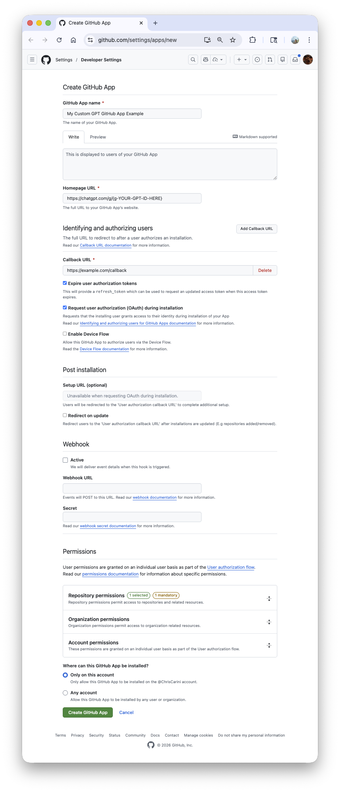

_**Note:** For demo purposes, only `Pull requests: Read-only` permission was selected for this example, but you can select additional permissions based on the GitHub API endpoints you want to use in your GPT Action._

#### 2. Click `Create GitHub App`

#### 3. Click `Generate a new client secret`

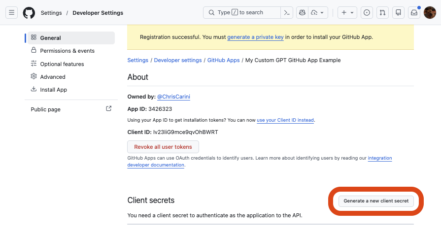

#### 4. Note the `Client ID` and `Client Secret` for later use

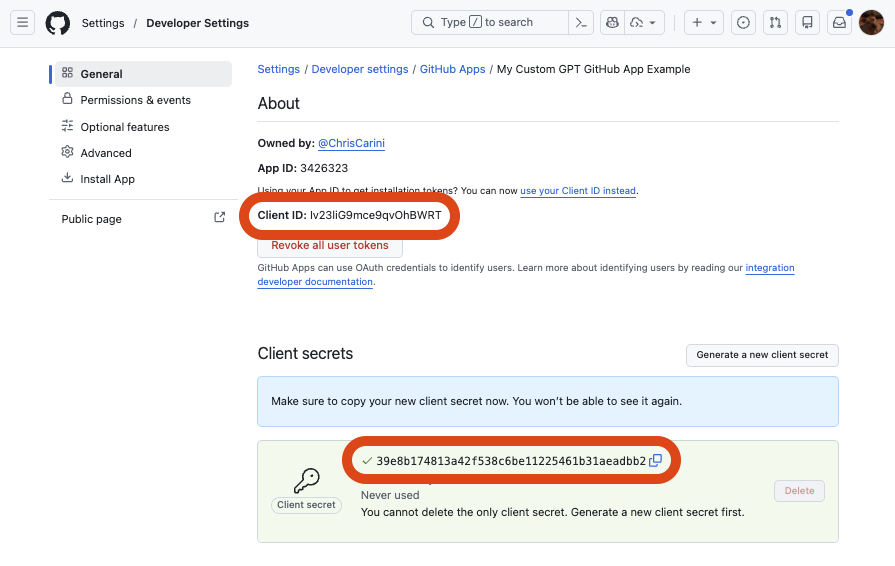

#### 5. Proceed to the "ChatGPT Steps" section below to set up the Action in ChatGPT, but keep the GitHub App creation window/tab open - we will make additional changes to it shortly.

## ChatGPT Steps

### Add Action to ChatGPT Custom GPT

#### 1. In your Custom GPT editor (e.g. `https://chatgpt.com/gpts/editor/g-<id>`), navigate to the bottom and click `Create new action`.

#### 2. Fill in the form:

- **Authentication**: `OAuth`
  - **Authentication Type:** OAuth
  - **Client ID:** _(from GitHub App setup above)_
  - **Client Secret:** _(from GitHub App setup above)_
  - **Authorization URL:** `https://github.com/login/oauth/authorize`
  - **Token URL:** `https://github.com/login/oauth/access_token`
  - **Scope:** _(leave empty)_
  - **Example:** 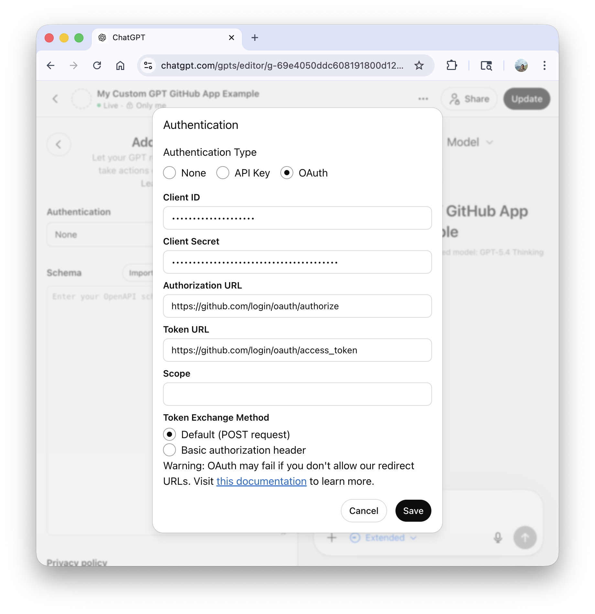
- **Schema:** Enter an OpenAPI schema that defines the GitHub API endpoints you want to use. You can use the [example schema provided in the "GPT Actions library - GitHub" cookbook example](https://developers.openai.com/cookbook/examples/chatgpt/gpt_actions_library/gpt_action_github#openapi-schema) as a starting point, and modify it based on your needs.
- **Privacy policy:** `https://docs.github.com/en/site-policy/privacy-policies/github-general-privacy-statement` 
- **Example:** 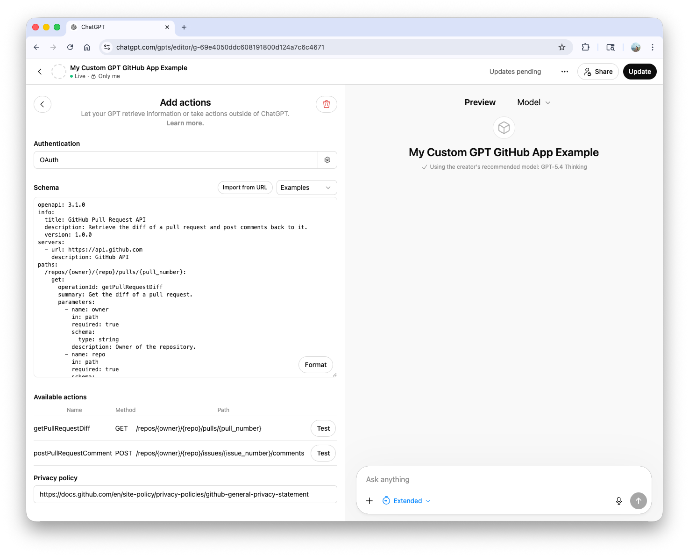

#### 3. Click the `Back` button at the top left to return to the Custom GPT editor.

#### 4. You should now see a `Callback URL` below the Action you just created.

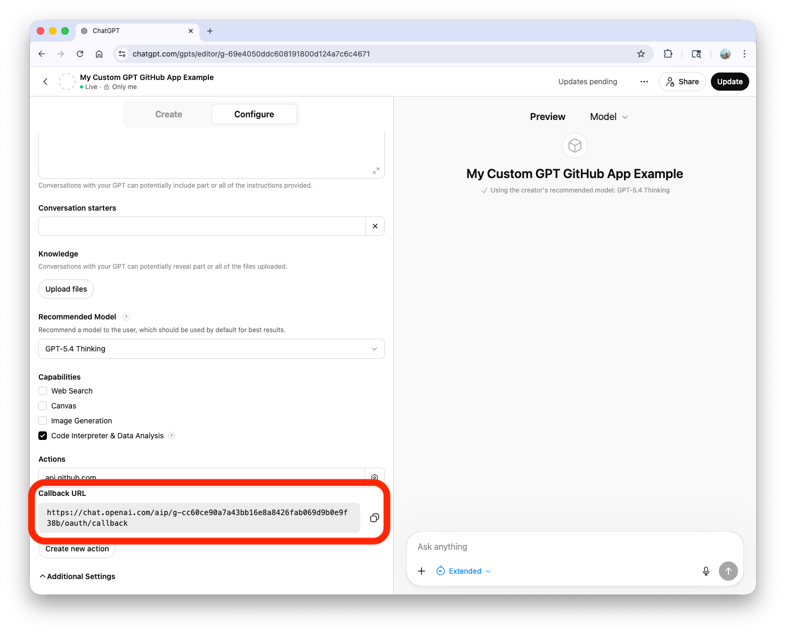

1. Copy this URL, and go back to the GitHub App creation window/tab.
2. Edit the GitHub App you created, and replace the placeholder **Callback URL** with the one you just copied from ChatGPT.
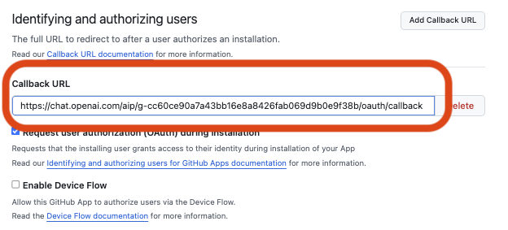

3. Click **Save changes** at the bottom of the GitHub App page.

### Test the GPT Action in your GPT

#### 1. You are now ready to test out the GPT. You can enter a simple prompt like `Get the pull request for owner: openai , repo: openai-cookbook , pull-number: 2 - summarize it`. You will see a button to `Sign in with api.github.com`:

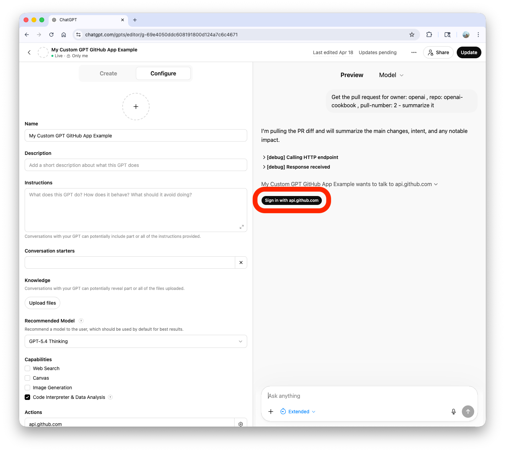

#### 2. Expanding the `[debug] Calling HTTP endpoint`, you can confirm the expected tool is being called with the correct parameters.

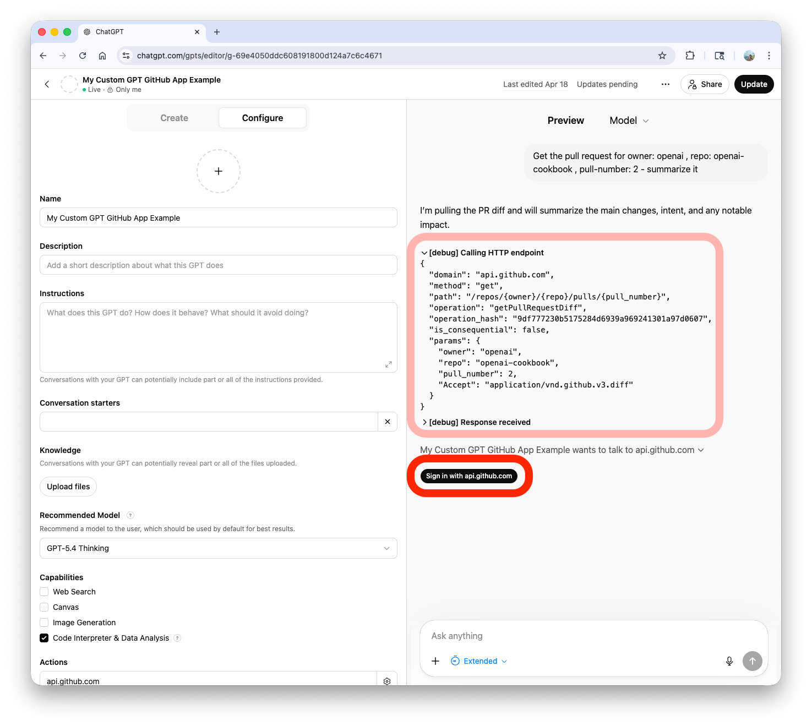

#### 3. Clicking the `Sign in with api.github.com` button will take you through the OAuth flow to connect your GitHub account and authorize the GitHub App you created to access your account based on the permissions you set.

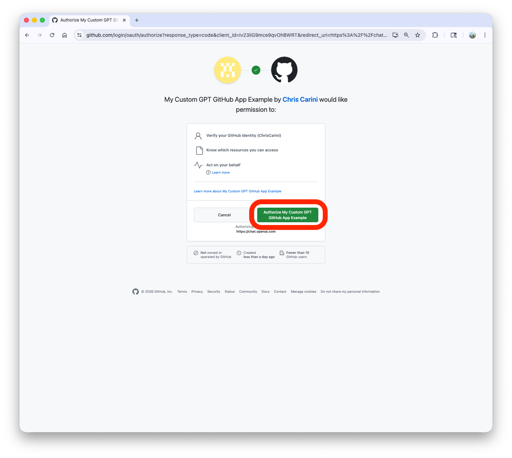

#### 4. After successfully authenticating and authorizing the GitHub App, you should see a confirmation message in ChatGPT that your `api.github.com` account is now connected.

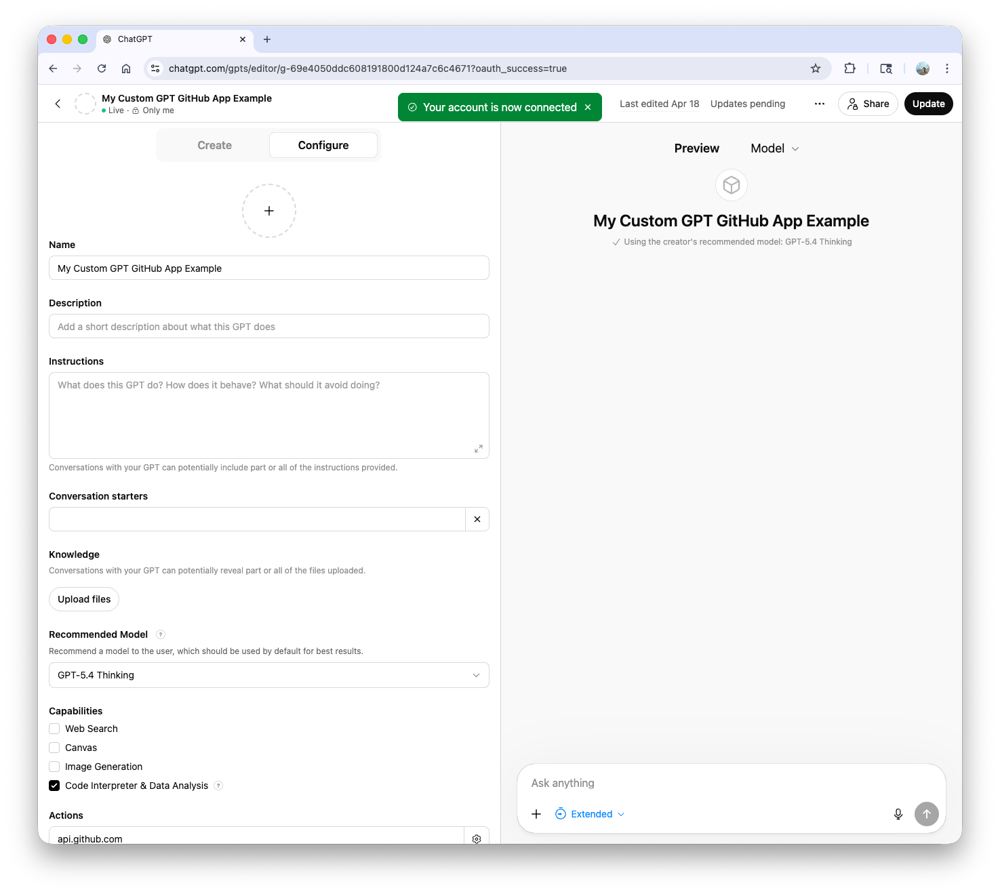

#### 5. If you run the same prompt again, you should now be presented with a tool call, asking you to `Allow`, `Always Allow`, or `Decline` - pick either of the `Allow` options.

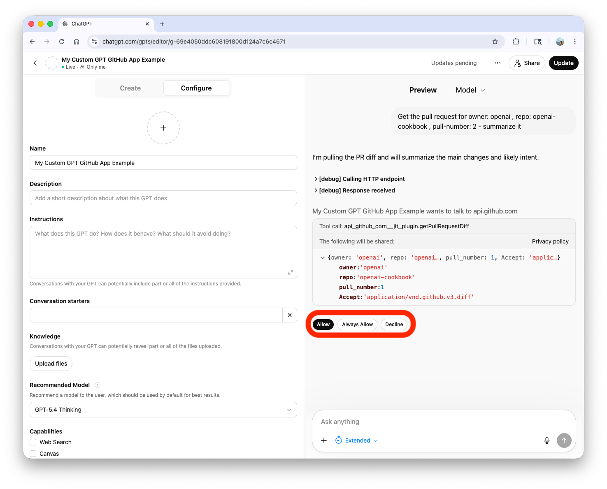

#### 6. View the results! You should see the response from the GitHub API based on the prompt you entered.

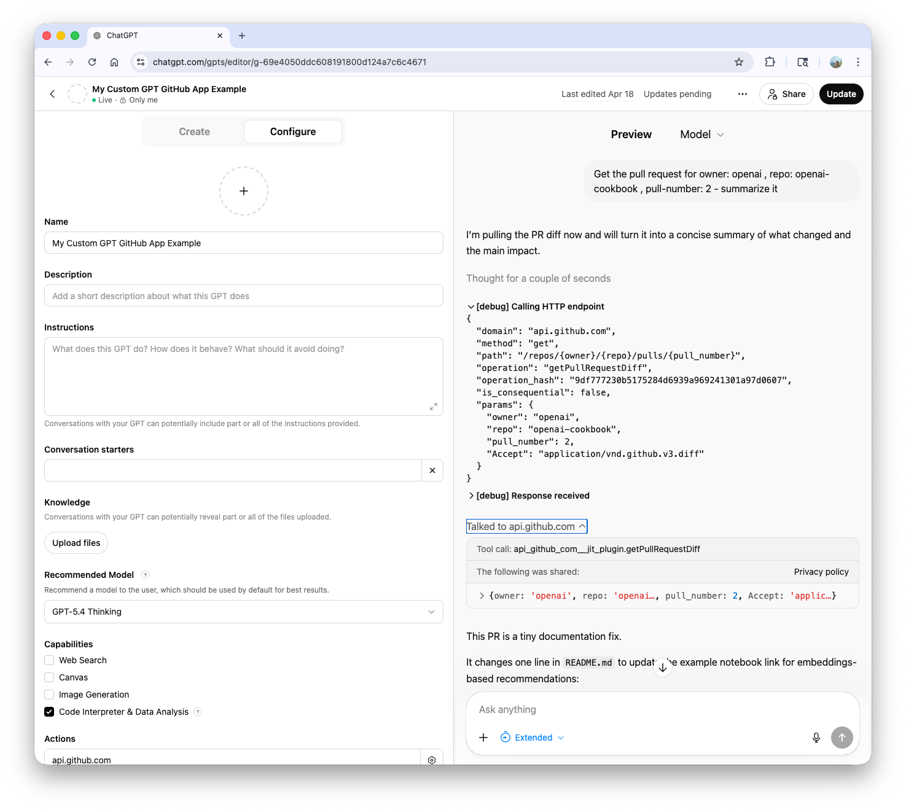

**Note:** If you search for a PR that is too large, the API may not return the full thing, so GPT may not be able to provide a summary. Try with smaller PRs for testing.
