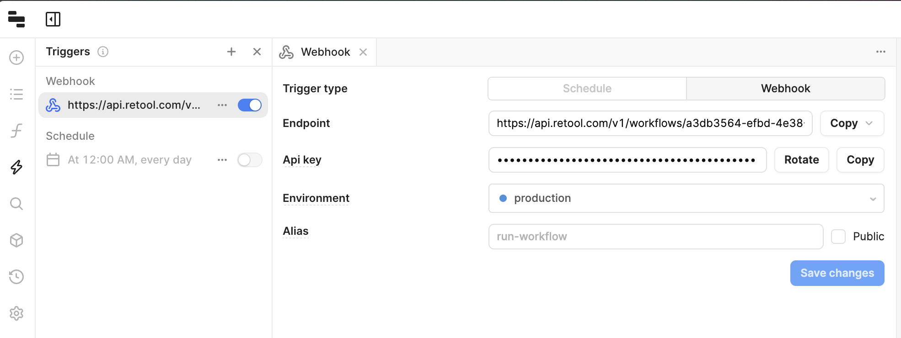

# GPT Action Library: Retool Workflow

## Introduction

This page provides an instruction & guide for developers building a GPT Action for a specific application. Before you proceed, make sure to first familiarize yourself with the following information: 
- [Introduction to GPT Actions](https://platform.openai.com/docs/actions)
- [Introduction to GPT Actions Library](https://platform.openai.com/docs/actions/actions-library)
- [Example of Building a GPT Action from Scratch](https://platform.openai.com/docs/actions/getting-started)

This particular GPT Action provides an overview of how to connect to a **Retool Workflow**. This Action takes a users input and sends it to the workflow in Retool using a webhook trigger. Retool then performns the configured workflow and sends a response back to ChatGPT as a JSON object.

### Value + Example Business Use Cases

**Value**: Users can now leverage ChatGPT's natural language capability to connect directly to any workflow in Retool.

**Example Use Cases**: 
- You have custom code running in a Retool workflow that you'd like to incorporate into a GPT. 
- Data Scientists maintain an external VectorDB (either using Retool Vector or another vector DB) and would like to send the results of the vector search back to ChatGPT. 
- Retool is used as middleware to connect to internal services, and you'd like to use Retool's webhooks to provide access to these services to ChatGPT. 

## Application Information

### Application Key Links

Check out these links from the application before you get started:
- Application Website: https://retool.com/products/workflows
- Application API Documentation: https://docs.retool.com/workflows

### Application Prerequisites

Before you get started, make sure you go through the following steps in your Retool environment:
- Set up a Retool account
- Create a simple workflow

### Application Workflow Steps

Below is an example of a basic Retool Workflow. This workflow takes in 2 values and adds them and responds to the webhook trigger with the result.

***Note:*** Your workflow must be deployed before it will be accessible from your GPT.

<!--ARCADE EMBED START--><div style="position: relative; padding-bottom: calc(57.26681127982647% + 41px); height: 0; width: 100%;"><iframe src="https://demo.arcade.software/MG7PcF8fh3RH722eonUb?embed&embed_mobile=tab&embed_desktop=inline&show_copy_link=true" title="Retool Workflow Cookbook" frameborder="0" loading="lazy" webkitallowfullscreen mozallowfullscreen allowfullscreen allow="clipboard-write" style="position: absolute; top: 0; left: 0; width: 100%; height: 100%; color-scheme: light;" ></iframe></div><!--ARCADE EMBED END-->

## ChatGPT Steps

### Custom GPT Instructions 

Once you've created a Custom GPT, you should add Instructions to the GPT providing context about the GPTs role, and the actions it is able to perform. Have questions? Check out [Getting Started Example](https://platform.openai.com/docs/actions/getting-started) to see how this step works in more detail.

### OpenAPI Schema 

Once you've created a Custom GPT, copy the text below in the Actions panel. Have questions? Check out [Getting Started Example](https://platform.openai.com/docs/actions/getting-started) to see how this step works in more detail.

***Note:*** You need to replace the __<WORKFLOW_ID>__ value in the OpenAPI spec below with the ID for your workflow.


```yaml
openapi: 3.1.0
info:
  title: Retool Workflow API
  description: API for interacting with Retool workflows.
  version: 1.0.0
servers:
  - url: https://api.retool.com/v1
    description: Main (production) server
paths:
  /workflows/<WORKFLOW_ID>/startTrigger:
    post:
      operationId: add_numbers
      summary: Takes 2 numbers and adds them.
      description: Initiates a workflow in Retool by triggering a specific workflow ID.
      requestBody:
        required: true
        content:
          application/json:
            schema:
              type: object
              properties:
                first:
                  type: integer
                  description: First parameter for the workflow.
                second:
                  type: integer
                  description: Second parameter for the workflow.
      responses:
        "200":
          description: Workflow triggered successfully.
        "400":
          description: Bad Request - Invalid parameters or missing data.
        "401":
          description: Unauthorized - Invalid or missing API key.
      security:
        - apiKeyAuth: []
```

## Authentication Instructions

Below are instructions on setting up authentication with this 3rd party application. Have questions? Check out [Getting Started Example](https://platform.openai.com/docs/actions/getting-started) to see how this step works in more detail.

### Pre-Action Steps

Before you set up authentication in ChatGPT, please take the following steps in the application.
- Get your API Key from the Webhook config panel



### In ChatGPT

In ChatGPT, click on "Authentication" and choose **"API Key"**. Enter in the information below. 

- **API Key**: (Paste your API Key provided by the Retool Workflow Webhook Trigger)
- **Auth Type**: Custom
- **Custom Header Name**: X-Workflow-Api-Key

### FAQ & Troubleshooting

- *Auth Error:* Ensure you have set the custom header name correctly.
- *Invalid Workflow Error:* Ensure you have deployed your workflow within Retool.

*Are there integrations that you’d like us to prioritize? Are there errors in our integrations? File a PR or issue in our github, and we’ll take a look.*
