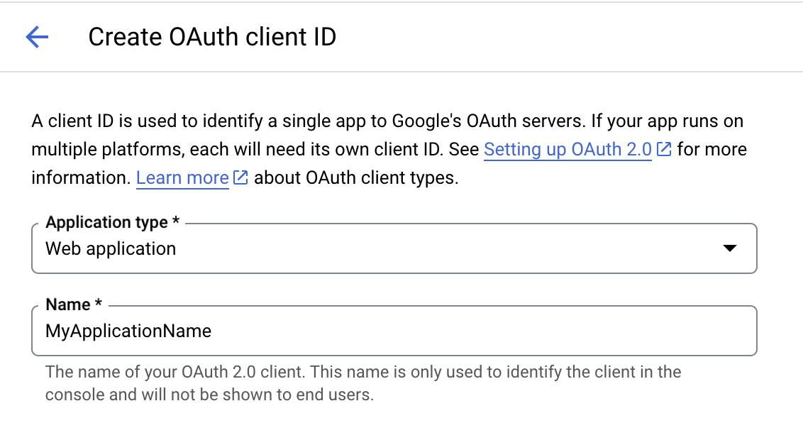
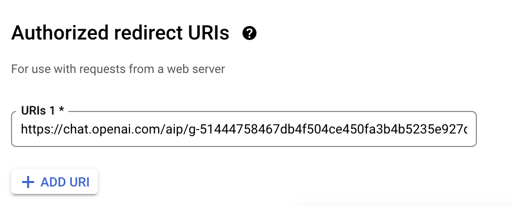

# GPT Action Library (Middleware): Google Cloud Function

## Introduction


This page provides an instruction & guide for developers building middleware to connect a GPT Action to a specific application. Before you proceed, make sure to first familiarize yourself with the following information:
- [Introduction to GPT Actions](https://platform.openai.com/docs/actions)
- [Introduction to GPT Actions Library](https://platform.openai.com/docs/actions/actions-library)
- [Example of Building a GPT Action from Scratch](https://platform.openai.com/docs/actions/getting-started)

This particular GPT Action provides an overview of how to build an **Google Cloud Function**, Google's cloud-based function builder. This documentation helps a user set up an OAuth-protected Google Cloud Function to connect to a GPT Action, and to a sample application.

### Value + Example Business Use Cases

**Value**: Users can now leverage ChatGPT's natural language capability to connect directly to Google Cloud Function. This can in a few ways:

- 100k character limit in GPT Actions: users can use the middleware to pre-process the text response from an API. For example, you can use OpenAI’s API in the middleware to summarize the text before sending it back to ChatGPT.
- Typically for actions, users are relying on the SaaS API to return text. You can convert the response for the vendor API into easily digestible text, and it can handle different data types such as structured and unstructured data.
- It can return files instead of just text. This can be useful to surface CSV files for Data Analysis, or bring back an PDF file and ChatGPT will treat it like an upload.


**Example Use Cases**:
- A user needs to look up query Google Cloud SQL, but needs a middleware app between ChatGPT and Google Cloud SQL
- A user has built several steps in a row in a Google Cloud function, and needs to be able to kick off that process using ChatGPT

## Application Information

### Application Key Links

Check out these links from the application before you get started:
- Application Website: https://cloud.google.com/functions/docs
- Application API Documentation: https://cloud.google.com/functions/docs/writing/write-http-functions

### Application Prerequisites

Before you get started, make sure you go through the following steps in your application environment:
- Google Cloud Console with access to create Google Cloud Functions and Google Cloud APIs (you will need this to set up the OAuth Client)

## Application Setup

### Installing the app

There are 3 options to create and deploy the Google Cloud Functions

*   IDE - create using your favorite IDE, e.g. VS Code
*   Google Cloud Console - create using your browser
*   Google Cloud CLI (gcloud) - create through command line

You can read up on the supported runtimes [here](https://cloud.google.com/functions/docs/concepts/execution-environment)

#### Option 1: Use IDE (VSCode)

See Google's documentation [here](https://cloud.google.com/functions/docs/create-deploy-ide) for how to deploy using VSCode. If you have familiarity with this approach, feel free to use it.


#### Option 2: Directly in Google Cloud Console

See the documentation [here](https://cloud.google.com/functions/docs/console-quickstart) for how to deploy using the Google Cloud Console. 

#### Option 3: Use the Google Cloud CLI (`gcloud`)

See the documentation [here](https://cloud.google.com/functions/docs/create-deploy-gcloud) for how to deploy using the Google Cloud Console. We’ll walk through an example here step by step.


##### Part 1: Install and initialize Google Cloud CLI (`gcloud`)
Follow the steps [here](https://cloud.google.com/sdk/docs/install) that are relevant to the OS you are runnning. The last step of this process is for you to run `gcloud init` and sign in to your Google account

##### Part 2: Setup local development environment
In this example, we will be setting up a Node.js environment.

```
mkdir <directory_name>
cd <directory_name>
```

Initialize the Node.js project

```
npm init
```
Accept the default values for `npm init`

##### Part 3: Create Function
Create the `index.js` file

```
const functions = require('@google-cloud/functions-framework');
const axios = require('axios');

const TOKENINFO_URL = 'https://oauth2.googleapis.com/tokeninfo';

// Register an HTTP function with the Functions Framework that will be executed
// when you make an HTTP request to the deployed function's endpoint.
functions.http('executeGCPFunction', async (req, res) => {
  const authHeader = req.headers.authorization;

  if (!authHeader) {
    return res.status(401).send('Unauthorized: No token provided');
  }

  const token = authHeader.split(' ')[1];
  if (!token) {
    return res.status(401).send('Unauthorized: No token provided');
  }

  try {
    const tokenInfo = await validateAccessToken(token);            
    res.json("You have connected as an authenticated user to Google Functions");
  } catch (error) {
    res.status(401).send('Unauthorized: Invalid token');
  }  
});

async function validateAccessToken(token) {
  try {
    const response = await axios.get(TOKENINFO_URL, {
      params: {
        access_token: token,
      },
    });
    return response.data;
  } catch (error) {
    throw new Error('Invalid token');
  }
}
```
##### Part 4: Deploy Function

This step below will install and add the necessary dependencies in your `package.json` file

```
npm install @google-cloud/functions-framework
npm install axios
```

```
npx @google-cloud/functions-framework --target=executeGCPFunction
```

```
gcloud functions deploy gcp-function-for-chatgpt \
  --gen2 \
  --runtime=nodejs20 \
  --region=us-central1 \
  --source=. \
  --entry-point=executeGCPFunction \
  --trigger-http \
  --allow-unauthenticated
```

## ChatGPT Steps

### Custom GPT Instructions

Once you've created a Custom GPT, copy the text below in the Instructions panel. Have questions? Check out [Getting Started Example](https://platform.openai.com/docs/actions/getting-started) to see how this step works in more detail.

```
When the user asks you to test the integration, you will make a call to the custom action and display the results
```

### OpenAPI Schema

Once you've created a Custom GPT, copy the text below in the Actions panel. Have questions? Check out [Getting Started Example](https://platform.openai.com/docs/actions/getting-started) to see how this step works in more detail.

Below is an example of what connecting to this Middlware might look like. You'll need to insert your application's & function's information in this section.

```javascript
openapi: 3.1.0
info:
  title: {insert title}
  description: {insert description}
  version: 1.0.0
servers:
  - url: {url of your Google Cloud Function}
    description: {insert description}
paths:
  /{your_function_name}:
    get:
      operationId: {create an operationID}
      summary: {insert summary}
      responses:
        '200':
          description: {insert description}
          content:
            text/plain:
              schema:
                type: string
                example: {example of response}
```

## Authentication Instructions

Below are instructions on setting up authentication with this 3rd party application. Have questions? Check out [Getting Started Example](https://platform.openai.com/docs/actions/getting-started) to see how this step works in more detail.


### In Google Cloud Console
In Google Cloud Console, you need to create OAuth client ID credentials. To navigate to the right page search for "Credentials" in Google Cloud Console or enter `https://console.cloud.google.com/apis/credentials?project=<your_project_id>` in your browser. You can read more about it [here](https://developers.google.com/workspace/guides/create-credentials).

Click on "CREATE CREDENTIALS" and select "Oauth client ID". Select "Web Application" for "Application type" and enter the name of your application (see below).



In the "OAuth client created" modal dialog, please take note of the

* Client ID
* Client secret


### In ChatGPT (refer to Step 2 in the Getting Started Example)

In ChatGPT, click on "Authentication" and choose **"OAuth"**. Enter in the information below.

- **Client ID**: *see step above*
- **Client Secret**: *see step above*
- **Authorization URL**: `https://accounts.google.com/o/oauth2/auth`
- **Token URL**: `https://oauth2.googleapis.com/token`
- **Scope**: `https://www.googleapis.com/auth/userinfo.email`

### Back in Google Cloud Console (while referring to Step 4 in the Getting Started Example)

Edit the OAuth 2.0 Client ID you create in Google Cloud earlier and add the callback URL you received after creating your custom action.



### Test the GPT

You are now ready to test out the GPT. You can enter a simple prompt like "Test Integration" and expect to see the following:

1. Request to sign into Google
2. Allow request to your Google Function
3. Response from ChatGPT showing the response from your function - e.g. "You have connected as an authenticated user to Google Functions"

*Are there integrations that you’d like us to prioritize? Are there errors in our integrations? File a PR or issue in our github, and we’ll take a look.*
