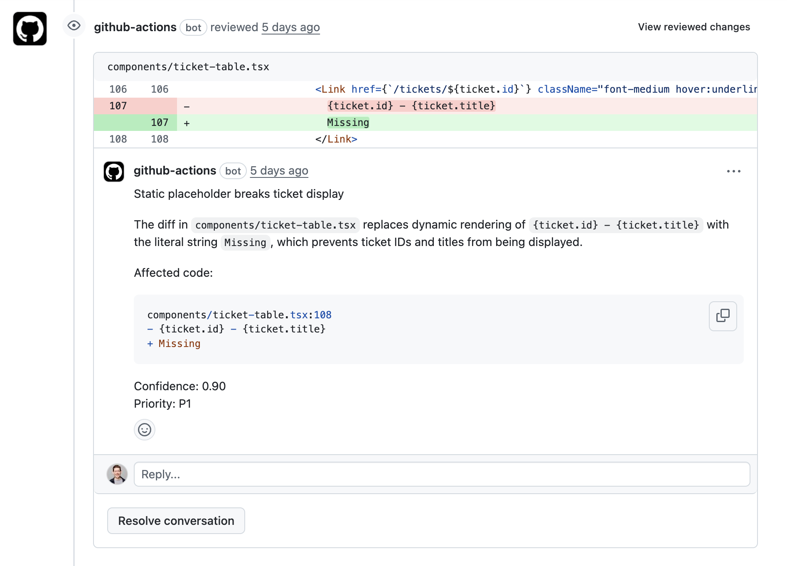

# Build Code Review with the Codex SDK

With [Code Review](https://chatgpt.com/codex/settings/code-review) in Codex Cloud, you can connect your team's cloud hosted GitHub repository to Codex and receive automated code reviews on every PR. But what if your code is hosted on-prem, or you don't have GitHub as an SCM?

Luckily, we can replicate Codex's cloud hosted review process in our own CI/CD runners. In this guide, we'll build our own Code Review action using the Codex CLI headless mode with both GitHub Actions and Jenkins.

Model recommendation: use `gpt-5.2-codex` for the strongest code review accuracy and consistency in these workflows.

To build our own Code review, we'll take the following steps and adhere to them closely:

1. Install the Codex CLI in our CI/CD runner
2. Prompt Codex in headless (exec) mode with the Code Review prompt that ships with the CLI
3. Specify a structured output JSON schema for Codex
4. Parse the JSON result and use it to make API calls to our SCM to create review comments

Once implemented, Codex will be able to leave inline code review comments:


## The Code Review Prompt

GPT-5.2-Codex has received specific training to improve its code review abilities. You can steer GPT-5.2-Codex to conduct a code review with the following prompt:

```
You are acting as a reviewer for a proposed code change made by another engineer.
Focus on issues that impact correctness, performance, security, maintainability, or developer experience.
Flag only actionable issues introduced by the pull request.
When you flag an issue, provide a short, direct explanation and cite the affected file and line range.
Prioritize severe issues and avoid nit-level comments unless they block understanding of the diff.
After listing findings, produce an overall correctness verdict (\"patch is correct\" or \"patch is incorrect\") with a concise justification and a confidence score between 0 and 1.
Ensure that file citations and line numbers are exactly correct using the tools available; if they are incorrect your comments will be rejected.
```

## Codex Structured Outputs

In order to make comments on code ranges in our pull request, we need to receive Codex's response in a specific format. To do that we can create a file called `codex-output-schema.json` that conforms to OpenAI's [structured outputs](https://platform.openai.com/docs/guides/structured-outputs) format.

To use this file in our workflow YAML, we can call Codex with the `output-schema-file` argument like this:

```yaml
- name: Run Codex structured review
        id: run-codex
        uses: openai/codex-action@main
        with:
            openai-api-key: ${{ secrets.OPENAI_API_KEY }}
            prompt-file: codex-prompt.md
            sandbox: read-only
            model: ${{ env.CODEX_MODEL }}
            output-schema-file: codex-output-schema.json # <-- Our schema file
            output-file: codex-output.json
```

You can also pass a similar argument to `codex exec` for example:

```bash
codex exec "Review my pull request!" --output-schema codex-output-schema.json
```

## GitHub Actions Example

Let's put it all together. If you're using GitHub Actions in an on-prem environment, you can tailor this example to your specific workflow. Inline comments highlight the key steps.

```yaml
name: Codex Code Review

# Determine when the review action should be run:
on:
  pull_request:
    types:
      - opened
      - reopened
      - synchronize
      - ready_for_review

concurrency:
  group: codex-structured-review-${{ github.event.pull_request.number }}
  cancel-in-progress: true

jobs:
  codex-structured-review:
    name: Run Codex structured review
    runs-on: ubuntu-latest
    permissions:
      contents: read
      pull-requests: write
    env:
      OPENAI_API_KEY: ${{ secrets.OPENAI_API_KEY }}
      GITHUB_TOKEN: ${{ github.token }}
      CODEX_MODEL: ${{ vars.CODEX_MODEL || 'o4-mini' }}
      PR_NUMBER: ${{ github.event.pull_request.number }}
      HEAD_SHA: ${{ github.event.pull_request.head.sha }}
      BASE_SHA: ${{ github.event.pull_request.base.sha }}
      REPOSITORY: ${{ github.repository }}
    outputs:
      codex-output: ${{ steps.run-codex.outputs.final-message }}
    steps:
      - name: Checkout pull request merge commit
        uses: actions/checkout@v5
        with:
          ref: refs/pull/${{ github.event.pull_request.number }}/merge

      - name: Fetch base and head refs
        run: |
          set -euxo pipefail
          git fetch --no-tags origin \
            "${{ github.event.pull_request.base.ref }}" \
            +refs/pull/${{ github.event.pull_request.number }}/head
        shell: bash

      # The structured output schema ensures that codex produces comments
      # with filepaths, line numbers, title, body, etc.
      - name: Generate structured output schema
        run: |
          set -euo pipefail
          cat <<'JSON' > codex-output-schema.json
          {
              "type": "object",
              "properties": {
                "findings": {
                  "type": "array",
                  "items": {
                    "type": "object",
                    "properties": {
                      "title": {
                        "type": "string",
                        "maxLength": 80
                      },
                      "body": {
                        "type": "string",
                        "minLength": 1
                      },
                      "confidence_score": {
                        "type": "number",
                        "minimum": 0,
                        "maximum": 1
                      },
                      "priority": {
                        "type": "integer",
                        "minimum": 0,
                        "maximum": 3
                      },
                      "code_location": {
                        "type": "object",
                        "properties": {
                          "absolute_file_path": {
                            "type": "string",
                            "minLength": 1
                          },
                          "line_range": {
                            "type": "object",
                            "properties": {
                              "start": {
                                "type": "integer",
                                "minimum": 1
                              },
                              "end": {
                                "type": "integer",
                                "minimum": 1
                              }
                            },
                            "required": [
                              "start",
                              "end"
                            ],
                            "additionalProperties": false
                          }
                        },
                        "required": [
                          "absolute_file_path",
                          "line_range"
                        ],
                        "additionalProperties": false
                      }
                    },
                    "required": [
                      "title",
                      "body",
                      "confidence_score",
                      "priority",
                      "code_location"
                    ],
                    "additionalProperties": false
                  }
                },
                "overall_correctness": {
                  "type": "string",
                  "enum": [
                    "patch is correct",
                    "patch is incorrect"
                  ]
                },
                "overall_explanation": {
                  "type": "string",
                  "minLength": 1
                },
                "overall_confidence_score": {
                  "type": "number",
                  "minimum": 0,
                  "maximum": 1
                }
              },
              "required": [
                "findings",
                "overall_correctness",
                "overall_explanation",
                "overall_confidence_score"
              ],
              "additionalProperties": false
            }
          JSON
        shell: bash

      # This section generates our prompt:
      - name: Build Codex review prompt
        env:
          REVIEW_PROMPT_PATH: ${{ vars.CODEX_PROMPT_PATH || 'review_prompt.md' }}
        run: |
          set -euo pipefail
          PROMPT_PATH="codex-prompt.md"
          TEMPLATE_PATH="${REVIEW_PROMPT_PATH}"

          if [ -n "$TEMPLATE_PATH" ] && [ -f "$TEMPLATE_PATH" ]; then
            cat "$TEMPLATE_PATH" > "$PROMPT_PATH"
          else
            {
              printf '%s\n' "You are acting as a reviewer for a proposed code change made by another engineer."
              printf '%s\n' "Focus on issues that impact correctness, performance, security, maintainability, or developer experience."
              printf '%s\n' "Flag only actionable issues introduced by the pull request."
              printf '%s\n' "When you flag an issue, provide a short, direct explanation and cite the affected file and line range."
              printf '%s\n' "Prioritize severe issues and avoid nit-level comments unless they block understanding of the diff."
              printf '%s\n' "After listing findings, produce an overall correctness verdict (\"patch is correct\" or \"patch is incorrect\") with a concise justification and a confidence score between 0 and 1."
              printf '%s\n' "Ensure that file citations and line numbers are exactly correct using the tools available; if they are incorrect your comments will be rejected."
            } > "$PROMPT_PATH"
          fi

          {
            echo ""
            echo "Repository: ${REPOSITORY}"
            echo "Pull Request #: ${PR_NUMBER}"
            echo "Base ref: ${{ github.event.pull_request.base.ref }}"
            echo "Head ref: ${{ github.event.pull_request.head.ref }}"
            echo "Base SHA: ${BASE_SHA}"
            echo "Head SHA: ${HEAD_SHA}"
            echo "Changed files:"
            git --no-pager diff --name-status "${BASE_SHA}" "${HEAD_SHA}"
            echo ""
            echo "Unified diff (context=5):"
            git --no-pager diff --unified=5 --stat=200 "${BASE_SHA}" "${HEAD_SHA}" > /tmp/diffstat.txt
            git --no-pager diff --unified=5 "${BASE_SHA}" "${HEAD_SHA}" > /tmp/full.diff
            cat /tmp/diffstat.txt
            echo ""
            cat /tmp/full.diff
          } >> "$PROMPT_PATH"
        shell: bash

      # Putting it all together: we run the codex action with our code review prompt,
      # structured output, and output file:
      - name: Run Codex structured review
        id: run-codex
        uses: openai/codex-action@main
        with:
          openai-api-key: ${{ secrets.OPENAI_API_KEY }}
          prompt-file: codex-prompt.md
          output-schema-file: codex-output-schema.json
          output-file: codex-output.json
          sandbox: read-only
          model: ${{ env.CODEX_MODEL }}

      - name: Inspect structured Codex output
        if: ${{ always() }}
        run: |
          if [ -s codex-output.json ]; then
            jq '.' codex-output.json || true
          else
            echo "Codex output file missing"
          fi
        shell: bash

      # This step produces in-line code review comments on specific line
      # ranges of code.
      - name: Publish inline review comments
        if: ${{ always() }}
        env:
          REVIEW_JSON: codex-output.json
        run: |
          set -euo pipefail
          if [ ! -s "$REVIEW_JSON" ]; then
            echo "No Codex output file present; skipping comment publishing."
            exit 0
          fi
          findings_count=$(jq '.findings | length' "$REVIEW_JSON")
          if [ "$findings_count" -eq 0 ]; then
            echo "Codex returned no findings; skipping inline comments."
            exit 0
          fi
          jq -c --arg commit "$HEAD_SHA" '.findings[] | {
              body: (.title + "\n\n" + .body + "\n\nConfidence: " + (.confidence_score | tostring) + (if has("priority") then "\nPriority: P" + (.priority | tostring) else "" end)),
              commit_id: $commit,
              path: .code_location.absolute_file_path,
              line: .code_location.line_range.end,
              side: "RIGHT",
              start_line: (if .code_location.line_range.start != .code_location.line_range.end then .code_location.line_range.start else null end),
              start_side: (if .code_location.line_range.start != .code_location.line_range.end then "RIGHT" else null end)
            } | with_entries(select(.value != null))' "$REVIEW_JSON" > findings.jsonl
          while IFS= read -r payload; do
            echo "Posting review comment payload:" && echo "$payload" | jq '.'
            curl -sS \
              -X POST \
              -H "Accept: application/vnd.github+json" \
              -H "Authorization: Bearer ${GITHUB_TOKEN}" \
              -H "X-GitHub-Api-Version: 2022-11-28" \
              "https://api.github.com/repos/${REPOSITORY}/pulls/${PR_NUMBER}/comments" \
              -d "$payload"
          done < findings.jsonl
        shell: bash

      # This section creates a single comment summarizing the review.
      - name: Publish overall summary comment
        if: ${{ always() }}
        env:
          REVIEW_JSON: codex-output.json
        run: |
          set -euo pipefail
          if [ ! -s "$REVIEW_JSON" ]; then
            echo "Codex output missing; skipping summary."
            exit 0
          fi
          overall_state=$(jq -r '.overall_correctness' "$REVIEW_JSON")
          overall_body=$(jq -r '.overall_explanation' "$REVIEW_JSON")
          confidence=$(jq -r '.overall_confidence_score' "$REVIEW_JSON")
          msg="**Codex automated review**\n\nVerdict: ${overall_state}\nConfidence: ${confidence}\n\n${overall_body}"
          curl -sS \
            -X POST \
            -H "Accept: application/vnd.github+json" \
            -H "Authorization: Bearer ${GITHUB_TOKEN}" \
            -H "X-GitHub-Api-Version: 2022-11-28" \
            "https://api.github.com/repos/${REPOSITORY}/issues/${PR_NUMBER}/comments" \
            -d "$(jq -n --arg body "$msg" '{body: $body}')"
        shell: bash
```

## Gitlab Example
GitLab doesn’t have a direct equivalent to the GitHub Action, but you can run codex exec inside GitLab CI/CD to perform automated code reviews.

However, the GitHub Action includes an important [safety strategy](https://github.com/openai/codex-action?tab=readme-ov-file#safety-strategy): it drops sudo permissions so Codex cannot access its own OpenAI API key. This isolation is critical—especially for public repositories where sensitive secrets (like your OpenAI API key) may be present—because it prevents Codex from reading or exfiltrating credentials during execution.
Before running this job, configure your GitLab project:

1. Go to **Project → Settings → CI/CD**.
2. Expand the **Variables** section.
3. Add these variables:
   - `OPENAI_API_KEY`
   - `GITLAB_TOKEN`
4. Mark them as masked/protected as appropriate.
5. Add the following GitLab example job to your `.gitlab-ci.yml` file at the root of your repository so it runs during merge request pipelines.

Please be mindful with your API key on public repositories.

```yaml
stages:
  - review

codex-structured-review:
  stage: review
  image: ubuntu:22.04
  rules:
    - if: '$CI_PIPELINE_SOURCE == "merge_request_event"'
  variables:
    PR_NUMBER: $CI_MERGE_REQUEST_IID
    REPOSITORY: "$CI_PROJECT_PATH"
    BASE_SHA: "$CI_MERGE_REQUEST_DIFF_BASE_SHA"
    HEAD_SHA: "$CI_COMMIT_SHA"

  before_script:
    - apt-get update -y
    - apt-get install -y git curl jq
    - |
      if ! command -v codex >/dev/null 2>&1; then
        ARCH="$(uname -m)"
        case "$ARCH" in
          x86_64) CODEX_PLATFORM="x86_64-unknown-linux-musl" ;;
          aarch64|arm64) CODEX_PLATFORM="aarch64-unknown-linux-musl" ;;
          *)
            echo "Unsupported architecture: $ARCH"
            exit 1
            ;;
        esac

        CODEX_VERSION="${CODEX_VERSION:-latest}"
        if [ -n "${CODEX_DOWNLOAD_URL:-}" ]; then
          CODEX_URL="$CODEX_DOWNLOAD_URL"
        elif [ "$CODEX_VERSION" = "latest" ]; then
          CODEX_URL="https://github.com/openai/codex/releases/latest/download/codex-${CODEX_PLATFORM}.tar.gz"
        else
          CODEX_URL="https://github.com/openai/codex/releases/download/${CODEX_VERSION}/codex-${CODEX_PLATFORM}.tar.gz"
        fi

        TMP_DIR="$(mktemp -d)"
        curl -fsSL "$CODEX_URL" -o "$TMP_DIR/codex.tar.gz"
        tar -xzf "$TMP_DIR/codex.tar.gz" -C "$TMP_DIR"
        install -m 0755 "$TMP_DIR"/codex-* /usr/local/bin/codex
        rm -rf "$TMP_DIR"
      fi
    - git fetch origin $CI_MERGE_REQUEST_TARGET_BRANCH_NAME
    - git fetch origin $CI_MERGE_REQUEST_SOURCE_BRANCH_NAME
    - git checkout $CI_MERGE_REQUEST_SOURCE_BRANCH_NAME

  script:
    - echo "Running Codex structured review for MR !${PR_NUMBER}"

    # Generate structured output schema
    - |
      cat <<'JSON' > codex-output-schema.json
      {
        "$schema": "http://json-schema.org/draft-07/schema#",
        "title": "Codex Structured Review",
        "type": "object",
        "additionalProperties": false,
        "required": [
          "overall_correctness",
          "overall_explanation",
          "overall_confidence_score",
          "findings"
        ],
        "properties": {
          "overall_correctness": {
            "type": "string",
            "description": "Overall verdict for the merge request."
          },
          "overall_explanation": {
            "type": "string",
            "description": "Explanation backing up the verdict."
          },
          "overall_confidence_score": {
            "type": "number",
            "minimum": 0,
            "maximum": 1,
            "description": "Confidence level for the verdict."
          },
          "findings": {
            "type": "array",
            "description": "Collection of actionable review findings.",
            "items": {
              "type": "object",
              "additionalProperties": false,
              "required": [
                "title",
                "body",
                "confidence_score",
                "code_location"
              ],
              "properties": {
                "title": {
                  "type": "string"
                },
                "body": {
                  "type": "string"
                },
                "confidence_score": {
                  "type": "number",
                  "minimum": 0,
                  "maximum": 1
                },
                "code_location": {
                  "type": "object",
                  "additionalProperties": false,
                  "required": [
                    "absolute_file_path",
                    "relative_file_path",
                    "line_range"
                  ],
                  "properties": {
                    "absolute_file_path": {
                      "type": "string"
                    },
                    "relative_file_path": {
                      "type": "string"
                    },
                    "line_range": {
                      "type": "object",
                      "additionalProperties": false,
                      "required": [
                        "start",
                        "end"
                      ],
                      "properties": {
                        "start": {
                          "type": "integer",
                          "minimum": 1
                        },
                        "end": {
                          "type": "integer",
                          "minimum": 1
                        }
                      }
                    }
                  }
                }
              }
            },
            "default": []
          }
        }
      }
      JSON

    # Build Codex review prompt
    - |
      PROMPT_PATH="codex-prompt.md"
      TEMPLATE_PATH="${REVIEW_PROMPT_PATH:-review_prompt.md}"
      if [ -n "$TEMPLATE_PATH" ] && [ -f "$TEMPLATE_PATH" ]; then
        cat "$TEMPLATE_PATH" > "$PROMPT_PATH"
      else
        {
          printf '%s\n' "You are acting as a reviewer for a proposed code change..."
          printf '%s\n' "Focus on issues that impact correctness, performance, security..."
          printf '%s\n' "Flag only actionable issues introduced by this merge request..."
          printf '%s\n' "Provide an overall correctness verdict..."
        } > "$PROMPT_PATH"
      fi
      {
        echo ""
        echo "Repository: ${REPOSITORY}"
        echo "Merge Request #: ${PR_NUMBER}"
        echo "Base SHA: ${BASE_SHA}"
        echo "Head SHA: ${HEAD_SHA}"
        echo ""
        echo "Changed files:"
        git --no-pager diff --name-status "${BASE_SHA}" "${HEAD_SHA}"
        echo ""
        echo "Unified diff (context=5):"
        git --no-pager diff --unified=5 "${BASE_SHA}" "${HEAD_SHA}"
      } >> "$PROMPT_PATH"

    # Run Codex exec CLI
    - |
      printenv OPENAI_API_KEY | codex login --with-api-key && \
      codex exec --output-schema codex-output-schema.json \
                 --output-last-message codex-output.json \
                 --sandbox read-only \
                 - < codex-prompt.md

    # Inspect structured Codex output
    - |
      if [ -s codex-output.json ]; then
        jq '.' codex-output.json || true
      else
        echo "Codex output file missing"; exit 1
      fi

    # Publish inline comments to GitLab MR
    - |
      findings_count=$(jq '.findings | length' codex-output.json)
      if [ "$findings_count" -eq 0 ]; then
        echo "No findings from Codex; skipping comments."
        exit 0
      fi

      jq -c \
        --arg base "$BASE_SHA" \
        --arg start "$BASE_SHA" \
        --arg head "$HEAD_SHA" '
        .findings[] | {
          body: (.title + "\n\n" + .body + "\n\nConfidence: " + (.confidence_score | tostring)),
          position: {
            position_type: "text",
            base_sha: $base,
            start_sha: $start,
            head_sha: $head,
            new_path: (.code_location.relative_file_path // .code_location.absolute_file_path),
            new_line: .code_location.line_range.end
          }
        }
      ' codex-output.json > findings.jsonl

      while IFS= read -r payload; do
        curl -sS --request POST \
             --header "PRIVATE-TOKEN: $GITLAB_TOKEN" \
             --header "Content-Type: application/json" \
             --data "$payload" \
             "https://gitlab.com/api/v4/projects/${CI_PROJECT_ID}/merge_requests/${PR_NUMBER}/discussions"
      done < findings.jsonl

    # Publish overall summary comment
    - |
      overall_state=$(jq -r '.overall_correctness' codex-output.json)
      overall_body=$(jq -r '.overall_explanation' codex-output.json)
      confidence=$(jq -r '.overall_confidence_score' codex-output.json)

      summary="**Codex automated review**\n\nVerdict: ${overall_state}\nConfidence: ${confidence}\n\n${overall_body}"

      curl -sS --request POST \
           --header "PRIVATE-TOKEN: $GITLAB_TOKEN" \
           --header "Content-Type: application/json" \
           --data "$(jq -n --arg body "$summary" '{body: $body}')" \
           "https://gitlab.com/api/v4/projects/${CI_PROJECT_ID}/merge_requests/${PR_NUMBER}/notes"

  artifacts:
    when: always
    paths:
      - codex-output.json
      - codex-prompt.md

```


## Jenkins Example

We can use the same approach to scripting a job with Jenkins. Once again, comments highlight key stages of the workflow:

```groovy
pipeline {
  agent any

  options {
    timestamps()
    ansiColor('xterm')
    // Prevent overlapping runs on the same PR. Newer builds will cancel older ones after passing the milestone.
    disableConcurrentBuilds()
  }

  environment {
    // Default model like your GHA (can be overridden at job/env level)
    CODEX_MODEL = "${env.CODEX_MODEL ?: 'o4-mini'}"

    // Filled in during Init
    PR_NUMBER   = ''
    HEAD_SHA    = ''
    BASE_SHA    = ''
    REPOSITORY  = ''   // org/repo
  }

  stages {
    stage('Init (PR context, repo, SHAs)') {
      steps {
        checkout scm

        // Compute PR context and SHAs similar to the GitHub Action
        sh '''
          set -euo pipefail

          # Derive PR number from Jenkins env when building PRs via GitHub Branch Source
          PR_NUMBER="${CHANGE_ID:-}"
          if [ -z "$PR_NUMBER" ]; then
            echo "Not a PR build (CHANGE_ID missing). Exiting."
            exit 1
          fi
          echo "PR_NUMBER=$PR_NUMBER" >> $WORKSPACE/jenkins.env

          # Discover owner/repo (normalize SSH/HTTPS forms)
          ORIGIN_URL="$(git config --get remote.origin.url)"
          if echo "$ORIGIN_URL" | grep -qE '^git@github.com:'; then
            REPO_PATH="${ORIGIN_URL#git@github.com:}"
            REPO_PATH="${REPO_PATH%.git}"
          else
            # e.g. https://github.com/owner/repo.git
            REPO_PATH="${ORIGIN_URL#https://github.com/}"
            REPO_PATH="${REPO_PATH%.git}"
          fi
          echo "REPOSITORY=$REPO_PATH" >> $WORKSPACE/jenkins.env

          # Ensure we have all refs we need
          git fetch --no-tags origin \
            "+refs/heads/*:refs/remotes/origin/*" \
            "+refs/pull/${PR_NUMBER}/head:refs/remotes/origin/PR-${PR_NUMBER}-head" \
            "+refs/pull/${PR_NUMBER}/merge:refs/remotes/origin/PR-${PR_NUMBER}-merge"

          # HEAD (PR head) and BASE (target branch tip)
          CHANGE_TARGET="${CHANGE_TARGET:-main}"
          HEAD_SHA="$(git rev-parse refs/remotes/origin/PR-${PR_NUMBER}-head)"
          BASE_SHA="$(git rev-parse refs/remotes/origin/${CHANGE_TARGET})"

          echo "HEAD_SHA=$HEAD_SHA" >> $WORKSPACE/jenkins.env
          echo "BASE_SHA=$BASE_SHA" >> $WORKSPACE/jenkins.env

          echo "Resolved:"
          echo "  REPOSITORY=$REPO_PATH"
          echo "  PR_NUMBER=$PR_NUMBER"
          echo "  CHANGE_TARGET=$CHANGE_TARGET"
          echo "  HEAD_SHA=$HEAD_SHA"
          echo "  BASE_SHA=$BASE_SHA"
        '''
        script {
          def envMap = readProperties file: 'jenkins.env'
          env.PR_NUMBER  = envMap['PR_NUMBER']
          env.REPOSITORY = envMap['REPOSITORY']
          env.HEAD_SHA   = envMap['HEAD_SHA']
          env.BASE_SHA   = envMap['BASE_SHA']
        }

        // Ensure only latest build for this PR proceeds; older in-flight builds will be aborted here
        milestone 1
      }
    }

    stage('Generate structured output schema') {
      steps {
        sh '''
          set -euo pipefail
          cat > codex-output-schema.json <<'JSON'
          {
            "type": "object",
            "properties": {
              "findings": {
                "type": "array",
                "items": {
                  "type": "object",
                  "properties": {
                    "title": { "type": "string", "maxLength": 80 },
                    "body": { "type": "string", "minLength": 1 },
                    "confidence_score": { "type": "number", "minimum": 0, "maximum": 1 },
                    "priority": { "type": "integer", "minimum": 0, "maximum": 3 },
                    "code_location": {
                      "type": "object",
                      "properties": {
                        "absolute_file_path": { "type": "string", "minLength": 1 },
                        "line_range": {
                          "type": "object",
                          "properties": {
                            "start": { "type": "integer", "minimum": 1 },
                            "end": { "type": "integer", "minimum": 1 }
                          },
                          "required": ["start","end"],
                          "additionalProperties": false
                        }
                      },
                      "required": ["absolute_file_path","line_range"],
                      "additionalProperties": false
                    }
                  },
                  "required": ["title","body","confidence_score","priority","code_location"],
                  "additionalProperties": false
                }
              },
              "overall_correctness": { "type": "string", "enum": ["patch is correct","patch is incorrect"] },
              "overall_explanation": { "type": "string", "minLength": 1 },
              "overall_confidence_score": { "type": "number", "minimum": 0, "maximum": 1 }
            },
            "required": ["findings","overall_correctness","overall_explanation","overall_confidence_score"],
            "additionalProperties": false
          }
          JSON
        '''
      }
    }

    stage('Build Codex review prompt') {
      environment {
        REVIEW_PROMPT_PATH = "${env.CODEX_PROMPT_PATH ?: 'review_prompt.md'}"
      }
      steps {
        sh '''
          set -euo pipefail
          PROMPT_PATH="codex-prompt.md"
          TEMPLATE_PATH="${REVIEW_PROMPT_PATH}"

          if [ -n "$TEMPLATE_PATH" ] && [ -f "$TEMPLATE_PATH" ]; then
            cat "$TEMPLATE_PATH" > "$PROMPT_PATH"
          else
            {
              printf '%s\n' "You are acting as a reviewer for a proposed code change made by another engineer."
              printf '%s\n' "Focus on issues that impact correctness, performance, security, maintainability, or developer experience."
              printf '%s\n' "Flag only actionable issues introduced by the pull request."
              printf '%s\n' "When you flag an issue, provide a short, direct explanation and cite the affected file and line range."
              printf '%s\n' "Prioritize severe issues and avoid nit-level comments unless they block understanding of the diff."
              printf '%s\n' "After listing findings, produce an overall correctness verdict (\\\"patch is correct\\\" or \\\"patch is incorrect\\\") with a concise justification and a confidence score between 0 and 1."
              printf '%s\n' "Ensure that file citations and line numbers are exactly correct using the tools available; if they are incorrect your comments will be rejected."
            } > "$PROMPT_PATH"
          fi

          {
            echo ""
            echo "Repository: ${REPOSITORY}"
            echo "Pull Request #: ${PR_NUMBER}"
            echo "Base ref: ${CHANGE_TARGET}"
            echo "Head ref: ${CHANGE_BRANCH:-PR-${PR_NUMBER}-head}"
            echo "Base SHA: ${BASE_SHA}"
            echo "Head SHA: ${HEAD_SHA}"
            echo "Changed files:"
            git --no-pager diff --name-status "${BASE_SHA}" "${HEAD_SHA}"
            echo ""
            echo "Unified diff (context=5):"
            git --no-pager diff --unified=5 --stat=200 "${BASE_SHA}" "${HEAD_SHA}" > /tmp/diffstat.txt
            git --no-pager diff --unified=5 "${BASE_SHA}" "${HEAD_SHA}" > /tmp/full.diff
            cat /tmp/diffstat.txt
            echo ""
            cat /tmp/full.diff
          } >> "$PROMPT_PATH"
        '''
      }
    }

    stage('Run Codex structured review') {
      environment {
        REVIEW_PROMPT = 'codex-prompt.md'
        REVIEW_SCHEMA = 'codex-output-schema.json'
        REVIEW_OUTPUT = 'codex-output.json'
      }
      steps {
        withCredentials([
          string(credentialsId: 'openai-api-key', variable: 'OPENAI_API_KEY')
        ]) {
          // Option A: If you have the OpenAI CLI installed on the Jenkins agent
          sh '''
            set -euo pipefail
            if command -v openai >/dev/null 2>&1; then
              # Use the Responses API with a JSON schema tool spec
              # Produces codex-output.json with the structured result.
              openai responses.create \
                --model "${CODEX_MODEL}" \
                --input-file "${REVIEW_PROMPT}" \
                --response-format "json_object" \
                --output-schema "${RESPONSE_FORMAT}" \
                --tool-choice "auto" \
                > raw_response.json || true

              # Fallback if CLI doesn’t support your exact flags:
              # Keep demo resilient: If raw_response.json is empty, create a minimal stub so later steps don’t fail.
              if [ ! -s raw_response.json ]; then
                echo '{"findings":[],"overall_correctness":"patch is correct","overall_explanation":"No issues detected.","overall_confidence_score":0.5}' > "${REVIEW_OUTPUT}"
              else
                # If your CLI/format returns a JSON object with the structured content in .output or similar, map it here.
                # Adjust jq path to match your CLI output shape.
                jq -r '.output // .' raw_response.json > "${REVIEW_OUTPUT}" || cp raw_response.json "${REVIEW_OUTPUT}"
              fi
            else
              echo "openai CLI not found; creating a stub output for demo continuity."
              echo '{"findings":[],"overall_correctness":"patch is correct","overall_explanation":"(CLI not available on agent)","overall_confidence_score":0.4}' > "${REVIEW_OUTPUT}"
            fi
          '''
        }
      }
    }

    stage('Inspect structured Codex output') {
      steps {
        sh '''
          if [ -s codex-output.json ]; then
            jq '.' codex-output.json || true
          else
            echo "Codex output file missing"
          fi
        '''
      }
    }

    stage('Publish inline review comments') {
      when { expression { true } }
      steps {
        withCredentials([string(credentialsId: 'github-token', variable: 'GITHUB_TOKEN')]) {
          sh '''
            set -euo pipefail
            REVIEW_JSON="codex-output.json"
            if [ ! -s "$REVIEW_JSON" ]; then
              echo "No Codex output file present; skipping comment publishing."
              exit 0
            fi

            findings_count=$(jq '.findings | length' "$REVIEW_JSON")
            if [ "$findings_count" -eq 0 ]; then
              echo "Codex returned no findings; skipping inline comments."
              exit 0
            fi

            jq -c --arg commit "$HEAD_SHA" '.findings[] | {
                body: (.title + "\\n\\n" + .body + "\\n\\nConfidence: " + (.confidence_score | tostring) + (if has("priority") then "\\nPriority: P" + (.priority | tostring) else "" end)),
                commit_id: $commit,
                path: .code_location.absolute_file_path,
                line: .code_location.line_range.end,
                side: "RIGHT",
                start_line: (if .code_location.line_range.start != .code_location.line_range.end then .code_location.line_range.start else null end),
                start_side: (if .code_location.line_range.start != .code_location.line_range.end then "RIGHT" else null end)
              } | with_entries(select(.value != null))' "$REVIEW_JSON" > findings.jsonl

            while IFS= read -r payload; do
              echo "Posting review comment payload:" && echo "$payload" | jq '.'
              curl -sS \
                -X POST \
                -H "Accept: application/vnd.github+json" \
                -H "Authorization: Bearer ${GITHUB_TOKEN}" \
                -H "X-GitHub-Api-Version: 2022-11-28" \
                "https://api.github.com/repos/${REPOSITORY}/pulls/${PR_NUMBER}/comments" \
                -d "$payload"
            done < findings.jsonl
          '''
        }
      }
    }

    stage('Publish overall summary comment') {
      steps {
        withCredentials([string(credentialsId: 'github-token', variable: 'GITHUB_TOKEN')]) {
          sh '''
            set -euo pipefail
            REVIEW_JSON="codex-output.json"
            if [ ! -s "$REVIEW_JSON" ]; then
              echo "Codex output missing; skipping summary."
              exit 0
            fi

            overall_state=$(jq -r '.overall_correctness' "$REVIEW_JSON")
            overall_body=$(jq -r '.overall_explanation' "$REVIEW_JSON")
            confidence=$(jq -r '.overall_confidence_score' "$REVIEW_JSON")
            msg="**Codex automated review**\\n\\nVerdict: ${overall_state}\\nConfidence: ${confidence}\\n\\n${overall_body}"

            jq -n --arg body "$msg" '{body: $body}' > /tmp/summary.json

            curl -sS \
              -X POST \
              -H "Accept: application/vnd.github+json" \
              -H "Authorization: Bearer ${GITHUB_TOKEN}" \
              -H "X-GitHub-Api-Version: 2022-11-28" \
              "https://api.github.com/repos/${REPOSITORY}/issues/${PR_NUMBER}/comments" \
              -d @/tmp/summary.json
          '''
        }
      }
    }
  }

  post {
    always {
      archiveArtifacts artifacts: 'codex-*.json, *.md, /tmp/diff*.txt', allowEmptyArchive: true
    }
  }
}
```

# Wrap Up

With the Codex SDK, you can build your own GitHub Code Review in on-prem environments. However, the pattern of triggering Codex with a prompt, receiving a structured output, and then acting on that output with an API call extends far beyond Code Review. For example, we could use this pattern to trigger a root-cause analysis when an incident is created and post a structured report into a Slack channel. Or we could create a code quality report on each PR and post results into a dashboard.
