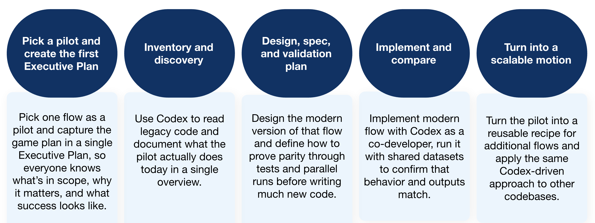
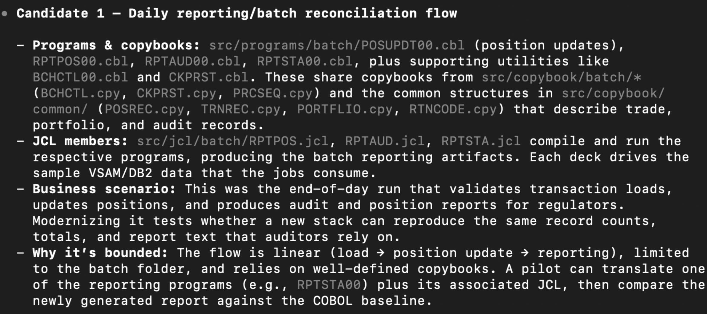
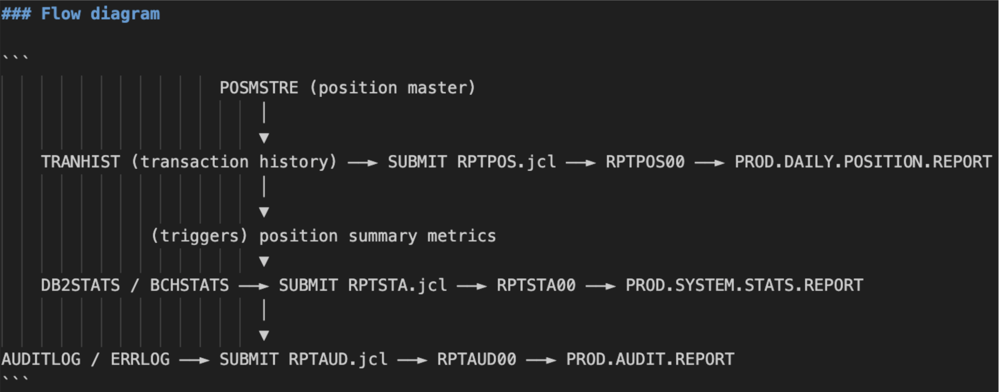
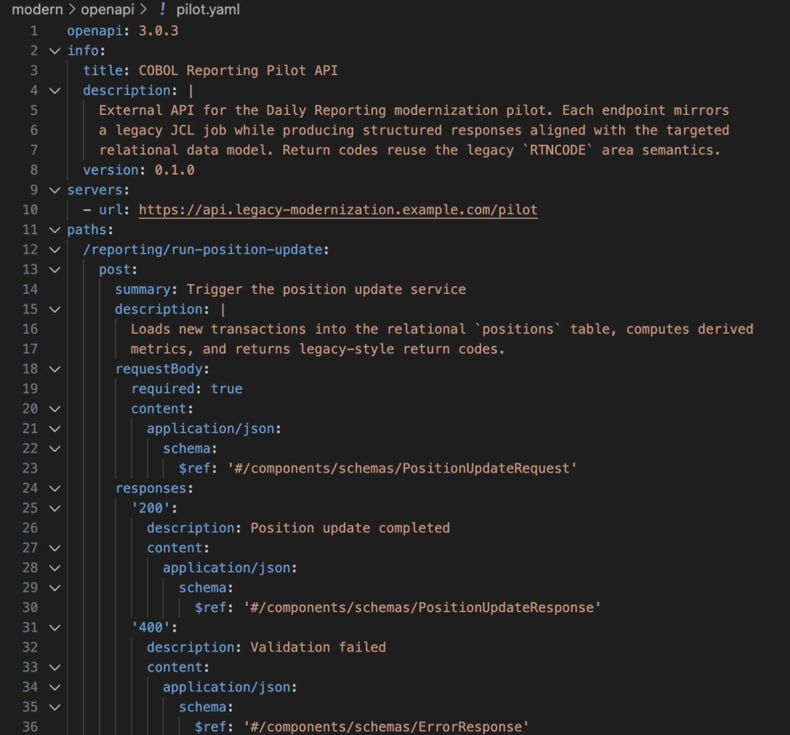
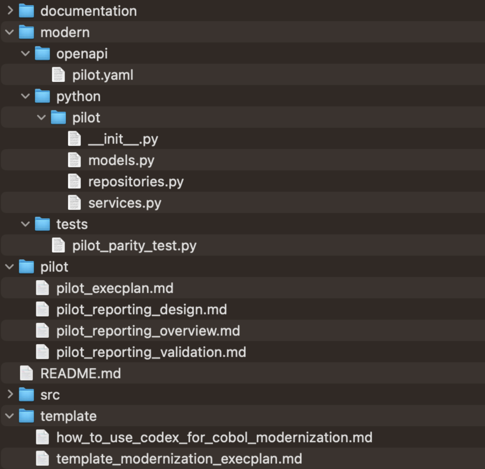

# Modernizing your Codebase with Codex

## Introduction

Codex is trained to read and reason about large, complex codebases, plan work alongside engineers, and produce high-quality changes. Code modernization has quickly become one of its most common and valuable uses. In this setup, engineers focus on architecture and business rules while Codex handles the heavy lifting: translating legacy patterns, proposing safe refactors, and keeping documentation and tests in sync as the system evolves.

This cookbook shows how to use **OpenAI's Codex CLI** to modernize a legacy repository in a way that is:

* Understandable to new engineers
* Auditable for architects and risk teams
* Repeatable as a pattern across other systems

We’ll use a COBOL-based [investment portfolio system](https://github.com/sentientsergio/COBOL-Legacy-Benchmark-Suite/) as the running example and choose a single pilot flow to focus on. You can substitute any legacy stack (eg. Java monolith, PL/SQL) where you have legacy programs, orchestration (jobs, schedulers, scripts), or shared data sources.

---

## High Level Overview

We’ve broken it down into 5 different phases that revolve around an executive plan (ExecPlan in short), which is a design document that the agent can follow to deliver the system change.



We will create 4 types of documents for the pilot flow we choose:

* **pilot_execplan.md** - ExecPlan that orchestrates the pilot that answers: what’s in scope, why it matters, what steps we’ll take, and how we’ll know we’re done.
* **pilot_overview.md** - Which legacy programs (COBOL in our example), orchestration jobs (JCL here), and data sources are involved, how data flows between them, and what the business flow actually does.
* **pilot_design.md** - Target shape of the system: the service/module that will own this flow, the new data model, and the public APIs or batch entry points.
* **pilot_validation.md** - Defines how we’ll prove parity: key scenarios, shared input datasets, how to run legacy vs modern side-by-side, and what “matching outputs” means in practice.

These 4 files help lay out what code is being changed, what the new system should look like, and exactly how to check that behavior hasn’t regressed.

---

## Phase 0 - Set up AGENTS and PLANS

**Goal**: Give Codex a lightweight contract for how planning works in this repo, without overwhelming people with process.

We’re taking inspiration from the [Using PLANS.md for multi-hour problem solving](https://cookbook.openai.com/articles/codex_exec_plans) cookbook to create an AGENTS.md and PLANS.md file that will be placed in a .agent folder.

* AGENTS.md: If you haven’t created an AGENTS.md for your repository yet, I suggest using the /init command. Once generated, reference the add a section in your AGENTS.md to instruct the agent to reference the PLANS.md. 
* PLANS.md: Use the example provided in the cookbook as a starting point

These explain what an ExecPlan is, when to create or update one, where it lives, and what sections every plan must have.

### Where Codex CLI helps
If you want Codex to tighten AGENTS or PLANS for your specific repo, you can run:

```md
Please read the directory structure and refine .agent/AGENTS.md and .agent/PLANS.md so they are a clear, opinionated standard for how we plan COBOL modernization work here. Keep the ExecPlan skeleton but add one or two concrete examples.
```

---

## Phase 1 - Pick a pilot and create the first ExecPlan

**Goal**: Align on one realistic but bounded pilot flow and capture the plan for Phase 1 in a single ExecPlan file.

**Key artifact**: pilot_execplan.md

### 1.1 Choose pilot flow
If you don’t have a flow in mind to pilot with, you can ask Codex to propose. Example prompt from the repository root:

```md
Look through this repository and propose one or two candidate pilot flows for modernization that are realistic but bounded.
For each candidate, list:
- COBOL programs and copybooks involved
- JCL members involved
- The business scenario in plain language
- End with a clear recommendation for which flow we should use as the first pilot
```

In this case, we’ll choose a reporting flow as the pilot.



### 1.2 Ask Codex to create the pilot ExecPlan

```md
Create pilot_execplan.md following .agent/PLANS.md. Scope it to the daily reporting flow. The plan should cover four outcomes for this one flow:
- Inventory and diagrams
- Modernization Technical Report content
- Target design and spec
- Test plan for parity
Use the ExecPlan skeleton and fill it in with concrete references to the actual COBOL and JCL files.
```

This plan is now your “home base” for all pilot work. 

---

## Phase 2 - Inventory and discovery

**Goal**: Capture what the pilot flow actually does today: programs, jobs, data flows, and business rules. Engineers can reason about the change without reading every line of legacy code.

**Key artifact**: pilot_reporting_overview.md

**Where engineers can focus**:

* Confirm which jobs truly run in production
* Fill in gaps Codex cannot infer from code (SLAs, operational context, owners)
* Sanity check diagrams and descriptions

### 2.1 Ask Codex to draft the overview
```md
Create or update pilot_reporting_overview.md with two top-level sections: “Inventory for the pilot” and “Modernization Technical Report for the pilot”.
Use pilot_execplan.md to identify the pilot flow.

In the inventory section, include:
1. The COBOL programs and copybooks involved, grouped as batch, online, and utilities if applicable
2. The JCL jobs and steps that call these programs
3. The data sets or tables they read and write
4. A simple text diagram that shows the sequence of jobs and data flows

In the modernization technical report section, describe:
1. The business scenario for this flow in plain language
2. Detailed behavior of each COBOL program in the flow
3. The data model for the key files and tables, including field names and meanings
4. Known technical risks such as date handling, rounding, special error codes, or tricky conditions
```

This document will be helpful for engineers to understand the shape and behavior of the pilot without reading all the code.

Example of the flow diagram in pilot_reporting_overview.md



### 2.2 Update the ExecPlan

Once the overview exists, ask Codex to keep the plan aligned

```md
Update pilot_execplan.md to reflect the new pilot_reporting_overview.md file.
- In Progress, mark the inventory and MTR sections as drafted.
- Add any notable findings to Surprises and discoveries and Decision log.
- Keep the ExecPlan readable for someone new to the repo.
```

At the end of Phase 2, you’ll have a single pilot overview doc that plays the role of both system inventory report and modernization technical report.

---

## Phase 3 - Design, spec, and validation plan

**Goal**

* Decide what the modern version of the pilot flow should look like 
* Describe the target service and data model
* Define how to prove parity through tests and parallel runs. 

By the end of this phase, we’ll have decided what we’re building and how we’ll prove it works.

**Key artifacts**

* pilot_reporting_design.md
* pilot_reporting_validation.md
* modern/openapi/pilot.yaml
* modern/tests/pilot_parity_test.py

### 3.1 Target design document

```md
Based on pilot_reporting_overview.md, draft pilot_reporting_design.md with these sections:

# Target service design
- Which service or module will own this pilot flow in the modern architecture.
- Whether it will be implemented as a batch job, REST API, event listener, or a combination.
- How it fits into the broader domain model.

# Target data model
- Proposed database tables and columns that replace the current files or DB2 tables.
- Keys, relationships, and any derived fields.
- Notes about how legacy encodings such as packed decimals or EBCDIC fields will be represented.

# API design overview
- The main operations users or systems will call.
- A short description of each endpoint or event.
- A pointer to modern/openapi/pilot.yaml where the full schema will live.
```

### 3.2 API specification

We capture the pilot flow’s external behavior in an OpenAPI file so the modern system has a clear, language-agnostic contract. This spec becomes the anchor for implementation, test generation, and future integrations, and it gives Codex something concrete to scaffold code and tests from.

```md
Using pilot_reporting_design.md, draft an OpenAPI file at modern/openapi/pilot.yaml that describes the external API for this pilot. Include:
- Paths and operations for the main endpoints or admin hooks
- Request and response schemas for each operation
- Field types and constraints, aligning with the target data model
```

Example output:



### 3.3 Validation and test plan

```md
Create or update pilot_reporting_validation.md with three sections:

# Test plan
- Key scenarios, including at least one happy path and a couple of edge cases.
- Inputs and outputs to capture for each scenario.

# Parity and comparison strategy
- How you will run the legacy COBOL flow and the modern implementation on the same input data.
- What outputs will be compared (files, tables, logs).
- How differences will be detected and triaged.

# Test scaffolding
- Notes about the test file modern/tests/pilot_parity_test.py, including how to run it.
- What needs to be filled in once the modern implementation exists.
```

Then ask Codex to scaffold the tests:

```md
Using pilot_reporting_validation.md, create an initial test file at modern/tests/pilot_parity_test.py.

Include placeholder assertions and comments that reference the scenarios in the test plan, but do not assume the modern implementation is present yet.
```

### 3.4 Update the ExecPlan

```md
Update pilot_execplan.md so that Plan of work, Concrete steps, and Validation and acceptance explicitly reference:
1. pilot_reporting_overview.md
2. pilot_reporting_design.md
3. pilot_reporting_validation.md
4. modern/openapi/pilot.yaml
5. modern/tests/pilot_parity_test.py
```

At the end of Phase 3, you’ll have a clear design, a machine readable spec, and a test plan/scaffolding that describes how you will prove parity.

---

## Phase 4 - Implement and compare

**Goal:** Implement the modern pilot, run it in parallel with the COBOL version, and show that outputs match for the planned scenarios.

**Key artifacts**

* Code under modern/<stack>/pilot (for example modern/java/pilot)
* Completed tests in modern/tests/pilot_parity_test.py
* Updated sections in pilot_reporting_validation.md that describe the actual parallel run steps

### 4.1 Generate a first draft of the modern code

```md
Using pilot_reporting_design.md and the COBOL programs listed in pilot_reporting_overview.md, generate initial implementation code under modern/<stack>/pilot that:
- Defines domain models and database entities for the key records and tables.
- Implements the core business logic in service classes, preserving behavior from COBOL paragraphs.
- Adds comments that reference the original COBOL paragraphs and copybooks.
- Treat this as a first draft for engineers to review.
```

You can run this several times, focusing on different modules.

### 4.2 Wire up the parity tests

```md
Extend modern/tests/pilot_parity_test.py so that it:
- Invokes the legacy pilot flow using whatever wrapper or command we have for COBOL (for example a script that runs the JCL in a test harness).
- Invokes the new implementation through its API or batch entry point.
- Compares the outputs according to the “Parity and comparison strategy” in pilot_reporting_validation.md.
```

### 4.3 Document the parallel run steps

Rather than a separate parallel_run_pilot.md, reuse the validation doc:

```md
Update the Parity and comparison strategy section in pilot_reporting_validation.md so that it includes a clear, ordered list of commands to:
- Prepare or load the input data set
- Run the COBOL pilot flow on that data
- Run the modern pilot flow on the same data
- Compare outputs and interpret the results
- Include precise paths for outputs and a short description of what success looks like
```

### 4.4 (If needed) Use Codex for iterative fixes

As tests fail or behavior differs, work in short loops:

```md
Here is a failing test from modern/tests/pilot_parity_test.py and the relevant COBOL and modern code. Explain why the outputs differ and propose the smallest change to the modern implementation that will align it with the COBOL behavior. Show the updated code and any test adjustments.
```

Each time you complete a meaningful chunk of work, ask Codex to update the ExecPlan:

```md
Update pilot_execplan.md so that Progress, Decision log, and Outcomes reflect the latest code, tests, and validation results for the pilot.
```

You’ll see that the ExecPlan “progress” and “outcomes” section will be updated with something along the lines of:

```md
Progress  
- [x] Inventory and diagrams drafted (`pilot_reporting_overview.md` plus supporting notes in `system-architecture.md`).  
- [x] Modernization technical report drafted (`pilot_reporting_overview.md` MTR section).  
- [x] Target design spec drafted (`pilot_reporting_design.md` and `modern/openapi/pilot.yaml`).  
- [x] Parity test plan and scaffolding documented (`pilot_reporting_validation.md` and `modern/tests/pilot_parity_test.py`).

Outcomes  
- `pilot_reporting_overview.md`, `pilot_reporting_design.md`, and `pilot_reporting_validation.md` now provide an end-to-end narrative (inventory, design, validation).  
- `modern/openapi/pilot.yaml` describes the API surface, and `modern/python/pilot/{models,repositories,services}.py` hold the draft implementation.  
- `modern/tests/pilot_parity_test.py` exercises the parity flow using placeholders and helpers aligned with the validation strategy.  
- Remaining work is limited to updating the operations test appendix and wiring the services to the real runtime.
```

---

## Phase 5 - Turn the pilot into a scalable motion

**Goal:** Provide reusable templates for other flows and a short guide to using Codex in this repo.

**Key artifacts**

* template_modernization_execplan.md
* how_to_use_codex_for_cobol_modernization.md

### 6.1 Template ExecPlan

```md
Look at the pilot files we created:
1. pilot_reporting_overview.md
2. pilot_reporting_design.md
3. pilot_reporting_validation.md
4. pilot_execplan.md

Create template_modernization_execplan.md that a team can copy when modernizing another flow. It should:
1. Follow .agent/PLANS.md
2. Include placeholders for “Overview”, “Inventory”, “Modernization Technical Report”, “Target design”, and “Validation plan”
3. Assume a similar pattern: overview doc, design doc, validation doc, OpenAPI spec, and tests.
```

### 6.2 How-to guide

```md
Using the same pilot files, write how_to_use_codex_for_cobol_modernization.md that:
1. Explains the phases at a high level (Pick a pilot, Inventory and discover, Design and spec, Implement and validate, Factory pattern).
2. For each phase, lists where coding agents helps and points to the relevant files and example prompts.
```

---

## Wrap up

If you follow the steps in this cookbook for any pilot, you should end up with a folder layout that looks roughly like this: ExecPlan, three pilot docs, an OpenAPI spec, a pilot module, and a parity test. You can further organize the markdown files in additional pilot and template subfolders for more structure.



You’ll notice that there isn’t a runnable entry point in modern/python/pilot yet since the modules (models.py, repositories.py, services.py) are first‑draft building blocks to start. You have two options if you want to experiment locally, you can

* Use an interactive shell or small script
* Create your own runner (e.g. modern/python/pilot/main.py) that wires the repositories and services together

While this cookbook uses a COBOL pilot flow as the running example, the same pattern shows up in very different kinds of refactors. For example, one customer used Codex to migrate a large monorepo by feeding it hundreds of Jira tickets, having Codex flag higher-risk work, surface cross-cutting dependencies, and draft the code changes, with a separate validator reviewing and merging.

Modernizing COBOL repositories is just one popular case, but the same approach applies to any legacy stack or large-scale migration: turn “modernize our codebase” into a series of small, testable steps (an ExecPlan, a handful of docs, and a parity-first implementation). Codex handles the grind of understanding old patterns, generating candidate migrations, and tightening parity, while you and your team stay focused on architecture and trade-offs, making modernization faster, safer, and repeatable across every system you decide to bring forward.
