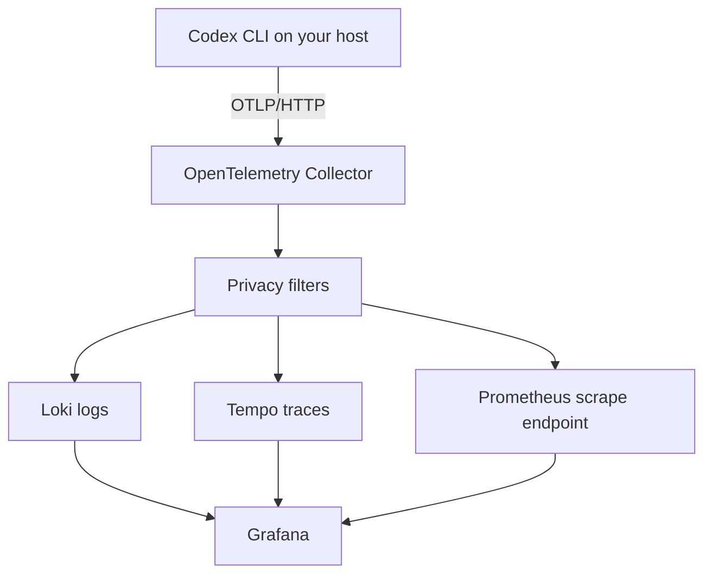

# Observe Codex with OpenTelemetry and Grafana LGTM

Codex can export operational logs, traces, and metrics through OpenTelemetry. In this cookbook, you will run a local Grafana LGTM stack with Docker Compose, send it real telemetry from one read-only Codex turn, and inspect the resulting dashboard.

The local workflow keeps Codex on your host and runs only the observability services in Docker. It does not copy Codex authentication into a container, and it keeps telemetry settings in an opt-in Codex profile.

## What you will build



The included stack gives you:

- OpenTelemetry Collector intake on `http://127.0.0.1:4318`
- Loki for privacy-filtered structured events
- Tempo for privacy-filtered traces
- Prometheus for native Codex metrics and Collector health metrics
- Grafana with provisioned datasources and a Codex overview dashboard
- Copy-and-paste Codex and Docker Compose commands, explicit readiness checks, and an optional synthetic privacy test

All published ports bind to `127.0.0.1`. The Collector drops `codex.tool_result`, removes unknown attributes, and replaces log bodies and span names before anything reaches storage.

## Get the runnable example

The Docker stack, Collector configuration, Grafana provisioning, dashboard, and validation assets live in the [accompanying example folder on GitHub](https://github.com/openai/openai-cookbook/tree/main/examples/codex/codex-opentelemetry-observability).

Clone the Cookbook repository and enter that folder before running the commands in this guide:

```bash
git clone --depth 1 https://github.com/openai/openai-cookbook.git
cd openai-cookbook/examples/codex/codex-opentelemetry-observability
```

If you already have the Cookbook repository, update your checkout and enter the same example folder.

## Prerequisites

You need:

1. Docker with Docker Compose
2. Codex CLI `0.140.0` or later, already signed in
3. Git, `curl`, and Python 3.11 or later
4. Approximately 4 GB of available Docker memory
5. Local ports `3001`, `3100`, `3200`, `4318`, `9090`, and `13133`, or equivalent overrides

## 1. Start the local stack

```bash
docker compose --file docker/docker-compose.yml up --detach
```

The first run downloads pinned Collector, Grafana, Loki, Tempo, and Prometheus images. Check the containers and each service directly:

```bash
docker compose --file docker/docker-compose.yml ps

curl --fail http://127.0.0.1:13133/
curl --fail http://127.0.0.1:9090/-/ready
curl --fail http://127.0.0.1:3100/ready
curl --fail http://127.0.0.1:3200/ready
curl --fail http://127.0.0.1:3001/api/health
```

Containers can take several seconds to become ready. Repeat any failed readiness request before continuing.

Open the provisioned dashboard:

```text
http://127.0.0.1:3001/d/codex-otel-lgtm/codex-otel-overview
```

The dashboard will initially be empty.

The [Compose file on GitHub](https://github.com/openai/openai-cookbook/blob/main/examples/codex/codex-opentelemetry-observability/docker/docker-compose.yml) starts only local observability services. Unlike the demo project that inspired this guide, it does not start a Codex runner, custom enrichment service, or raw-log dashboard.

## 2. Configure Codex and generate activity

Codex ignores `[otel]` settings in a [project-local `.codex/config.toml`](https://developers.openai.com/codex/config-advanced#project-config-files-codexconfigtoml). Put telemetry settings in a user-level configuration layer instead. For this guide, use a [named profile](https://developers.openai.com/codex/config-advanced#profiles) so Codex exports telemetry only when you select it.

Create `~/.codex/local-otel.config.toml` with the following content:

```toml
[analytics]
enabled = true

[otel]
environment = "local-demo"
log_user_prompt = false

[otel.exporter."otlp-http"]
endpoint = "http://127.0.0.1:4318/v1/logs"
protocol = "binary"

[otel.trace_exporter."otlp-http"]
endpoint = "http://127.0.0.1:4318/v1/traces"
protocol = "binary"

[otel.metrics_exporter."otlp-http"]
endpoint = "http://127.0.0.1:4318/v1/metrics"
protocol = "binary"
```

The example includes the same content in [`local-otel.config.toml.example`](https://github.com/openai/openai-cookbook/blob/main/examples/codex/codex-opentelemetry-observability/local-otel.config.toml.example). You can install it directly:

```bash
cp local-otel.config.toml.example ~/.codex/local-otel.config.toml
```

If you want these exporters enabled for every local Codex session, place the same tables in `~/.codex/config.toml` instead. The named profile is safer for this guide because telemetry remains opt-in.

Run one read-only Codex turn with the profile:

```bash
PRIVACY_SENTINEL="CODEX_OTEL_PRIVACY_SENTINEL_$(date +%s)"

codex \
  --profile local-otel \
  --sandbox read-only \
  --ask-for-approval never \
  --model "${CODEX_OTEL_MODEL:-gpt-5.4}" \
  exec \
  --ephemeral \
  "Read README.md and reply with exactly the H1 heading, with no extra text. Do not repeat this privacy-test token: ${PRIVACY_SENTINEL}"
```

The command asks Codex to read this README and return its heading with `gpt-5.4`. It runs ephemerally and activates the OTel profile only for this invocation. Set `CODEX_OTEL_MODEL` first if your account uses another available model.

The profile makes each telemetry choice visible:

- `analytics.enabled=true` enables the native metrics exporter
- `log_user_prompt=false` prevents prompt logging at the Codex source
- The three exporters send logs, traces, and metrics to separate OTLP/HTTP paths
- `--profile local-otel` keeps telemetry opt-in instead of enabling it for every Codex session
- `--ephemeral` prevents this demonstration turn from persisting session files
- The unique sentinel gives you a concrete value to search for in the privacy check

The resulting signal path is:

```text
Codex on host
  -> http://127.0.0.1:4318/v1/logs
  -> http://127.0.0.1:4318/v1/traces
  -> http://127.0.0.1:4318/v1/metrics
```

Managed Codex policy can still override the environment or approval labels.

After the turn finishes, query Prometheus for the native thread metric:

```bash
curl --get \
  --data-urlencode 'query=codex_thread_started_total' \
  "http://127.0.0.1:${CODEX_OTEL_PROMETHEUS_PORT:-9090}/api/v1/query" \
  | python3 -m json.tool
```

The response should contain at least one result. Refresh Grafana and select `local-demo` in the Environment filter. An administrator-enforced environment label can replace `local-demo`, so select that label when one is present.

## 3. Explore the signals

The dashboard uses native Codex telemetry plus Collector self-metrics. It answers:


- Did the Collector accept logs, spans, and metric points?
- How many turns and aggregate tokens were observed?
- Are tool calls succeeding?
- Where are turn or tool latencies increasing?
- Which sandbox postures and tool decisions appear?
- Can an operator find a relevant trace without displaying raw content?

You can also query each backend directly.

Prometheus:

```promql
sum by (env, model) (last_over_time(codex_thread_started_total[1h]))
```

Loki:

```logql
{service_name=~"codex.*"}
  | event_name="codex.api_request"
```

Tempo:

```traceql
{ resource.service.name =~ "codex.*" }
```

The local Grafana account is anonymous and view-only. Datasources and dashboards are provisioned from version-controlled files.

## 4. Verify the privacy boundary

Start with the sentinel passed to the real Codex turn. Query Loki directly and confirm the `result` array is empty:

```bash
: "${PRIVACY_SENTINEL:?Run the Codex command in step 2 from this shell first}"

curl --get \
  --data-urlencode "query={service_name=~\"codex.*\"} |= \"${PRIVACY_SENTINEL}\"" \
  "http://127.0.0.1:${CODEX_OTEL_LOKI_PORT:-3100}/loki/api/v1/query_range" \
  | python3 -m json.tool
```

Then confirm the Collector did not store any `codex.tool_result` records:

```bash
curl --get \
  --data-urlencode 'query={service_name=~"codex.*"} | event_name="codex.tool_result"' \
  "http://127.0.0.1:${CODEX_OTEL_LOKI_PORT:-3100}/loki/api/v1/query_range" \
  | python3 -m json.tool
```

These checks make the expected storage behavior observable without a wrapper. The filtering rules are also visible in the [Collector configuration](https://github.com/openai/openai-cookbook/blob/main/examples/codex/codex-opentelemetry-observability/docker/otel-collector-config.yaml).

For broader optional coverage, run the synthetic privacy test:

```bash
python3 scripts/local-smoke-test.py
```

The [test source](https://github.com/openai/openai-cookbook/blob/main/examples/codex/codex-opentelemetry-observability/scripts/local-smoke-test.py) reads the [OTLP JSON fixtures](https://github.com/openai/openai-cookbook/tree/main/examples/codex/codex-opentelemetry-observability/tests/fixtures), substitutes a unique environment, sentinel, trace ID, span ID, and timestamps, then posts each payload to the Collector. It polls the Loki, Tempo, and Prometheus HTTP APIs and exits with an error if any assertion fails. Specifically, it confirms that:

1. Loki receives a sanitized operational event
2. Tempo receives a sanitized trace
3. Prometheus receives a native Codex metric
4. A unique sentinel never appears in any backend
5. `codex.tool_result` never reaches Loki
6. Unknown metrics, span links, and metric exemplars are dropped

The local Collector configuration applies the same fail-closed policy:

| Signal | Stored data |
| --- | --- |
| Logs | Approved operational attributes with a constant record body |
| Traces | Approved operational attributes with constant span and event names |
| Metrics | Approved native Codex metrics and low-cardinality dimensions |

The processors remove prompts, arguments, outputs, account and email fields, conversation and call identifiers, hostnames, request identifiers, endpoints, and error text. Unknown attributes are discarded. Loki does not promote high-cardinality identifiers into stream labels.

Keep `log_user_prompt = false` even when a Collector applies equivalent filtering. Treat any sentinel match as a failed privacy check.

## 5. Operate the local stack

Follow service logs:

```bash
docker compose --file docker/docker-compose.yml logs --follow
```

Stop containers while retaining local data:

```bash
docker compose --file docker/docker-compose.yml down
```

Remove the containers and this example's Docker volumes:

```bash
docker compose --file docker/docker-compose.yml down --volumes --remove-orphans
```

The Compose file declares the project name `codex-otel-cookbook`, so the final command removes only this example's volumes.

### Resolve port conflicts

Override host ports when another local stack already uses the defaults:

```bash
export CODEX_OTEL_HTTP_PORT=14318
export CODEX_OTEL_HEALTH_PORT=14133
export CODEX_OTEL_GRAFANA_PORT=13001
export CODEX_OTEL_LOKI_PORT=13100
export CODEX_OTEL_PROMETHEUS_PORT=19090
export CODEX_OTEL_TEMPO_PORT=13200

docker compose --file docker/docker-compose.yml up --detach
```

Use the same environment variables for every command in that shell. Update the three endpoints in `~/.codex/local-otel.config.toml` to use port `14318`. The Prometheus query reads `CODEX_OTEL_PROMETHEUS_PORT`; substitute the exported values in the other readiness requests and browser URL.

## 6. Validate the assets

Validate the Compose model directly:

```bash
docker compose --file docker/docker-compose.yml config --quiet
```

The remaining validation commands are contributor test harnesses, not prerequisites for running the guide.

Run the contributor validation harness:

```bash
./scripts/validate.sh
```

If Docker is not available, run the source-only checks:

```bash
./scripts/validate.sh --source-only
```

The validation policy rejects embedded credentials, mutable Docker images, raw-log dashboard panels, and sensitive dashboard fields.

## Design choices

- Codex runs on the host so its authentication is never copied into Docker.
- Codex telemetry settings live in a named user profile because project-local configuration cannot set `[otel]`.
- Only OTLP/HTTP is enabled because that is the protocol configured for Codex.
- The Collector is stateless and uses bounded in-memory queues.
- The stack does not include raw-log views, debug export, custom enrichment, extension attribution, service graphs, tail sampling, or per-user views.
- Aggregate token panels use native Codex metrics and do not allocate tokens to users, tools, MCP servers, plugins, or skills.
- Backend storage uses local Docker volumes intended for this guide.

Codex OTel is operational telemetry. It is not a substitute for the Codex Compliance API or another audit-log product.

## Compatibility

| Component | Validated version |
| --- | --- |
| Codex CLI | `0.140.0` |
| Docker Engine | `29.5.2` |
| Docker Compose | `5.1.4` |
| OpenTelemetry Collector Contrib | `0.153.0` |
| Grafana | `11.2.2` |
| Loki | `3.2.1` |
| Tempo | `2.6.1` |
| Prometheus | `3.11.2` |

These pins define the tested example. Review upstream release notes and rerun validation before changing them.

## Troubleshooting

| Symptom | Check |
| --- | --- |
| Stack startup reports a bind error | Override the occupied host port or stop the other local service |
| Collector starts but a backend is unavailable | Run `docker compose --file docker/docker-compose.yml ps`, then inspect `docker compose --file docker/docker-compose.yml logs` |
| The demo cannot authenticate | Run `codex login` on the host and retry |
| Only metrics are absent | Confirm `[analytics]` and `[otel.metrics_exporter]` are present in the active `local-otel` profile |
| Dashboard is empty | Select `local-demo` or the administrator-enforced environment label, use a recent time range, and rerun the Codex command in step 2 |
| Expected logs are absent | The privacy policy intentionally drops `codex.tool_result` and unknown attributes |
| Data disappears after `down --volumes` | Removing the Compose volumes intentionally deletes this example's local backend data |

## References

- [Codex configuration reference](https://developers.openai.com/codex/config-reference)
- [Codex advanced configuration](https://developers.openai.com/codex/config-advanced)
- [OpenTelemetry Collector configuration](https://opentelemetry.io/docs/collector/configuration/)
- [Loki OTLP ingestion](https://grafana.com/docs/loki/latest/send-data/otel/)
- [Tempo configuration](https://grafana.com/docs/tempo/latest/configuration/)
- [Prometheus OTLP ingestion](https://prometheus.io/docs/guides/opentelemetry/)
- [Grafana provisioning](https://grafana.com/docs/grafana/latest/administration/provisioning/)
