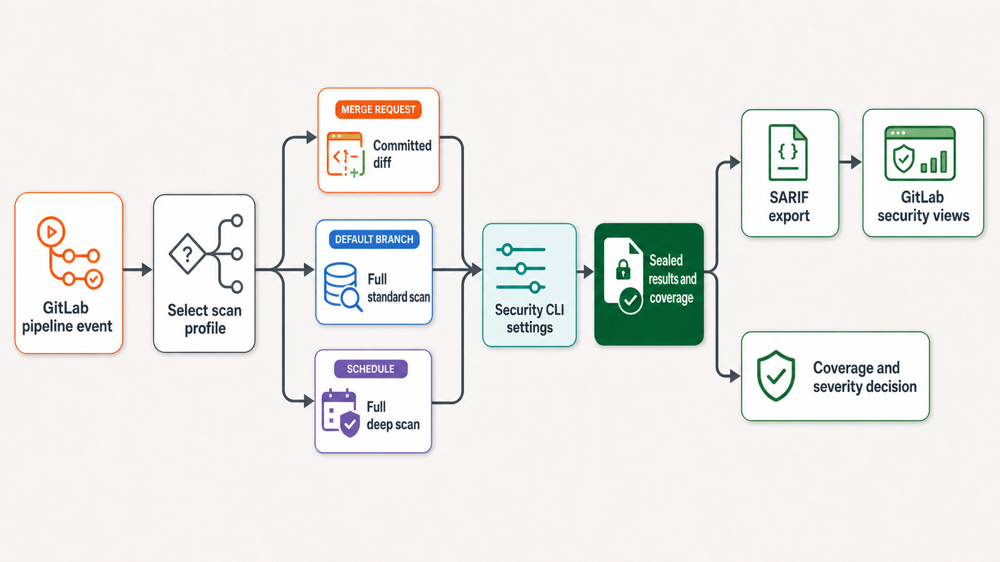
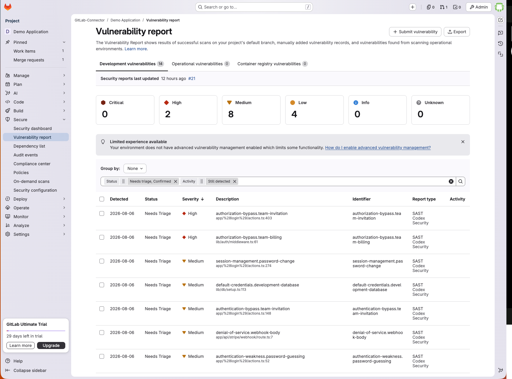

# Detect and remediate vulnerabilities in GitLab CI with Codex Security

Use [`@openai/codex-security`](https://learn.chatgpt.com/docs/security/cli) with GitLab CI/CD to scan protected merge requests, review the default branch, publish SARIF findings, and optionally propose verified security fixes as draft merge requests.

The scanner never receives repository-write credentials, and generated fixes require human review. The example was validated with a Docker-based runner and a Next.js SaaS application, but the pipeline can use any eligible trusted runner on GitLab.com, GitLab Self-Managed, or GitLab Dedicated.

## What you will build

You will create a GitLab pipeline that:

1. Scans protected merge request diffs and the default branch, with optional scheduled deep reviews.
2. Preserves structured findings, coverage, scan metadata, and human-readable reports.
3. Publishes SARIF through a successful report job and enforces scanner status in a separate gate.
4. Optionally validates and patches one high- or critical-severity finding.
5. Creates an optional draft merge request after a focused regression check verifies the fix.
6. Tests unprotected remediation merge requests without exposing protected credentials.

The finished workflow selects a scan profile from the GitLab pipeline event:



## Prerequisites

You need:

- A GitLab project and trusted GitLab Runner that can create the user namespace required by the Codex sandbox.
- Node.js 22.13.0 or later, as required by the [Security CLI quickstart](https://learn.chatgpt.com/docs/security/cli).
- Python 3.10 or later for scans and exports; Python 3.10 also requires `tomli`.
- The public `@openai/codex-security` package.
- An OpenAI API key from a project with Codex Security access.
- [Trusted Access for Cyber](https://chatgpt.com/cyber) if your account and repository require it for full-repository scans.
- Full Git history when calculating merge request diffs.
- GitLab Ultimate 19.2 or later for generally available [SARIF ingestion](https://docs.gitlab.com/user/application_security/detect/sarif/).
- For optional remediation, a deterministic verification command that fails with exit `1` on the vulnerable code and passes with exit `0` after the fix.
- For optional draft merge requests, a project access token with GitLab API and repository-write access.

## Step 1: Store the API key in GitLab

Make the Codex Security credential available only to trusted scan jobs without committing it to the repository.

Create a [masked, hidden, and protected GitLab CI/CD variable](https://docs.gitlab.com/ci/variables/#define-a-cicd-variable-in-the-ui):

- Key: `CODEX_SECURITY_API_KEY`
- Value: an OpenAI Platform API key with Codex Security access
- Protect variable: enabled

The value is not a GitLab token, runner token, npm token, ChatGPT session token, or a shell assignment.

If you already created a masked variable without enabling hidden visibility, GitLab cannot convert it to masked-and-hidden in place. Preserve the value securely, recreate the variable with masked, hidden, and protected settings, and never print the credential.

The example maps this project variable to `OPENAI_API_KEY` only for scan and dry-run processes. Validation and patching invoke Codex directly and receive the same value as a process-scoped `CODEX_API_KEY`. Its scan rule excludes fork merge requests and requires protected source and target branches. This does not make every same-project merge request trusted: code in a merge request can also change `.gitlab-ci.yml` and attempt to expose variables available to its pipeline. Masking and hiding reduce accidental disclosure in the UI and job logs, but they are not access controls for untrusted CI code.

For an eligible merge request job to receive the protected variable, both branches must belong to the same project and be protected, the user who starts the pipeline must have push or merge access to the target branch, and **Allow merge request pipelines to access protected variables and runners** must be enabled. GitLab documents these requirements under [protected merge request resources](https://docs.gitlab.com/ci/pipelines/merge_request_pipelines/#control-access-to-protected-variables-and-runners). If your workflow uses ordinary unprotected feature branches, run the secret-bearing scan after merge on the protected default branch instead. Larger deployments can enforce an immutable job through a [pipeline execution policy](https://docs.gitlab.com/user/application_security/policies/pipeline_execution_policies/) and retrieve a scoped, short-lived credential from an [external secrets provider](https://docs.gitlab.com/ci/secrets/). You are ready to continue when the protected `CODEX_SECURITY_API_KEY` is available only to approved scan jobs.

## Step 2: Choose initial scan profiles

Use GitLab [job rules](https://docs.gitlab.com/ci/jobs/job_rules/) to match each pipeline event to the smallest scan that answers its security question while retaining periodic broad coverage.

Start with profiles that map to distinct development decisions:

| Profile | Trigger | Target | Effort | Security question |
| --- | --- | --- | --- | --- |
| Merge request | Eligible protected same-project MR | Committed diff | `low` | What risk does this change introduce? |
| Default branch | Push or manual run on the protected default branch | Full repository, `standard` | `high` | What risks exist in the integrated codebase? |
| Deep review | Scheduled pipeline | Full repository, `deep` | `xhigh` | What additional issues appear under deeper review? |

These effort levels are starting points, not universal recommendations. Measure representative repositories before setting organization-wide defaults. With these profiles in place, eligible protected merge requests receive focused feedback, the default branch receives a full standard scan, and scheduled pipelines run a deeper repository review. Complete coverage for a selected merge request diff applies only to that change, not to the entire repository. This keeps the tradeoff between feedback time, repository coverage, and cost explicit.

Start with a focused diff or a lower-effort smoke test before running a full default-branch scan. In the validation project, one complete 58-file scan at `high` effort took 777 seconds and reported an estimated cost of USD 9.29. That observation is not a prediction for another repository. Consider adding `--max-cost` before the first paid full scan, and remember that it is an estimate guardrail rather than a hard billing cap.

## Step 3: Add the GitLab pipeline

Install Codex Security in a trusted location, select the appropriate scan profile, publish SARIF from a successful report job, and enforce the original scan status only after optional remediation and merge request publication.

[Download the complete `.gitlab-ci.yml`](./gitlab_ci_codex_security/.gitlab-ci.yml), save it at the root of your GitLab repository, and use the sections below to understand each component. If you already have a pipeline, merge its stages, hidden templates, and jobs into your existing configuration.

The example pins `@openai/codex-security` to the tested `0.1.11` release with `CODEX_SECURITY_VERSION`. Retest dry-run authentication, SARIF ingestion, severity handling, and remediation before changing that version. Optional model, policy, context, and cost controls are covered later in Step 9 and documented in the [Security CLI reference](https://learn.chatgpt.com/docs/security/cli/reference).

The job rules are self-contained so the example can be added to an existing pipeline without replacing its global `workflow`. If the project already uses [`workflow: rules`](https://docs.gitlab.com/ci/yaml/workflow/), make sure it permits eligible [merge request pipelines](https://docs.gitlab.com/ci/pipelines/merge_request_pipelines/), default-branch pushes and manual runs, and scheduled pipelines.

### Route eligible pipeline events to scan profiles

The hidden `.codex-security-rules` job maps each supported GitLab event to a scan profile. Scheduled pipelines receive deep repository scans, protected default-branch pushes and manual runs share the standard repository profile, and eligible merge requests between protected branches receive focused diff scans. The protected variable and GitLab's protected-resource checks still determine whether a job receives the credential.

If the repository already defines stages, add `security_scan`, `security_remediation`, `security_publish`, and `security_gate` to the existing list instead of replacing test, build, or deployment stages. The remediation and publishing stages remain empty unless remediation is explicitly enabled.

The shared variables, stages, and routing template are:

```yaml
variables:
  CODEX_SECURITY_VERSION: "0.1.11"
  CODEX_SECURITY_MAX_CHANGED_FILES: "8"

stages:
  - security_scan
  - security_remediation
  - security_publish
  - security_gate

.codex-security-rules:
  rules:
    - if: '$CI_PIPELINE_SOURCE == "schedule"'
      variables:
        CODEX_SECURITY_TARGET: "repository"
        CODEX_SECURITY_MODE: "deep"
        CODEX_SECURITY_EFFORT: "xhigh"
    - if: '$CI_PIPELINE_SOURCE == "merge_request_event" && $CI_MERGE_REQUEST_SOURCE_PROJECT_ID == $CI_PROJECT_ID && $CI_MERGE_REQUEST_SOURCE_BRANCH_PROTECTED == "true" && $CI_MERGE_REQUEST_TARGET_BRANCH_PROTECTED == "true"'
      variables:
        CODEX_SECURITY_TARGET: "diff"
        CODEX_SECURITY_MODE: "standard"
        CODEX_SECURITY_EFFORT: "low"
    - if: '$CI_COMMIT_REF_PROTECTED == "true" && $CI_COMMIT_BRANCH == $CI_DEFAULT_BRANCH && ($CI_PIPELINE_SOURCE == "push" || $CI_PIPELINE_SOURCE == "web")'
      variables:
        CODEX_SECURITY_TARGET: "repository"
        CODEX_SECURITY_MODE: "standard"
        CODEX_SECURITY_EFFORT: "high"
```

### Install the tested CLI outside the checkout

The scan and remediation jobs share a Node.js image and install the pinned Security CLI release under `/tmp`. Installing it outside the checked-out repository and invoking its absolute path prevents repository-controlled executables from replacing the command. `--ignore-scripts` prevents dependency lifecycle scripts from running during installation. Git, Python, ripgrep, certificates, and `util-linux` provide the runtime and sandbox prerequisites used by the CLI.

The YAML omits `tags` so GitLab can select any eligible runner configured for the project. Add your organization's trusted security-runner tag only when required. The `unshare` check fails before a paid scan when the selected runner cannot start the Codex sandbox.

The hidden runtime job installs the pinned CLI once for each job that extends it:

```yaml
.codex-security-runtime:
  image: node:26-bookworm-slim
  variables:
    GIT_DEPTH: "0"
  before_script:
    - |
      set -eu

      CLI_DIR="/tmp/codex-security-cli"

      apt-get update -qq > /dev/null
      apt-get install -y -qq --no-install-recommends \
        ca-certificates git python3 ripgrep util-linux

      npm install \
        --prefix "$CLI_DIR" \
        --ignore-scripts \
        --no-audit \
        --no-fund \
        --loglevel=error \
        "@openai/codex-security@$CODEX_SECURITY_VERSION"

      export CODEX_SECURITY_BIN="$CLI_DIR/node_modules/.bin/codex-security"
      "$CODEX_SECURITY_BIN" --version
```

### Build an exact and reproducible scan target

`GIT_DEPTH: "0"` gives the job enough history to calculate the merge base for a merge request. For a diff scan, the script resolves the merge base and passes both the base and `CI_COMMIT_SHA` to the CLI. This ensures that the result describes the committed change GitLab is reviewing instead of an ambiguous working tree.

The pipeline tested for this cookbook also hashes the deterministic binary Git diff and exports `CODEX_SECURITY_TARGET_SNAPSHOT_DIGEST`. This compatibility step binds the scan manifest to the exact reviewed content so the observed `git_diff` result can be sealed. It is not a general configuration option in the public CLI reference. After the installed CLI changes, rerun a known diff scan without the variable and remove the workaround if the scan seals successfully. The variable is cleared before target selection and set only for diff scans, because a clean repository scan is identified by its Git revision instead.

Repository profiles do not calculate a diff. They pass the selected `standard` or `deep` mode directly to the CLI.

The scan job selects and seals the appropriate target:

```bash
unset CODEX_SECURITY_TARGET_SNAPSHOT_DIGEST

case "$CODEX_SECURITY_TARGET" in
  diff)
    BASE_REVISION="$(git merge-base \
      "$CI_MERGE_REQUEST_DIFF_BASE_SHA" \
      "$CI_COMMIT_SHA")"

    DIFF_DIGEST="$(
      git diff --binary --full-index --no-ext-diff --no-textconv \
        "$BASE_REVISION" "$CI_COMMIT_SHA" \
        | python3 -c 'import hashlib, sys; print(hashlib.sha256(sys.stdin.buffer.read()).hexdigest())'
    )"
    export CODEX_SECURITY_TARGET_SNAPSHOT_DIGEST="codex-security-snapshot/v1:sha256:$DIFF_DIGEST"

    set -- --diff "$BASE_REVISION" --head "$CI_COMMIT_SHA"
    ;;
  repository)
    set -- --mode "$CODEX_SECURITY_MODE"
    ;;
  *)
    echo "Unsupported scan target: ${CODEX_SECURITY_TARGET:-unset}" >&2
    exit 2
    ;;
esac
```

### Validate configuration before starting the scan

The job validates that `CODEX_SECURITY_API_KEY` is present, creates private job-specific state and result directories under `/tmp`, and then runs [`--dry-run`](https://learn.chatgpt.com/docs/security/cli/reference). With `--auth api-key`, Security CLI `0.1.11` requires a process-scoped `OPENAI_API_KEY` even for this preflight. The dry run checks the repository, target, output directory, and configuration without starting a paid scan, but its `verified: false` result does not establish key entitlement, model access, available quota, or current rate-limit capacity.

`CODEX_SECURITY_API_KEY` is mapped to `OPENAI_API_KEY` separately for the dry run and the paid scan. The job removes supported credential variables immediately afterward so artifact and export commands do not inherit them.

Both scan commands receive credentials only for their individual processes:

```bash
# API-key authentication requires a credential even in dry-run mode.
OPENAI_API_KEY="$CODEX_SECURITY_API_KEY" \
  "$CODEX_SECURITY_BIN" scan . "$@" --dry-run

set +e
OPENAI_API_KEY="$CODEX_SECURITY_API_KEY" \
CODEX_SECURITY_STATE_DIR="$STATE_DIR" \
  "$CODEX_SECURITY_BIN" scan . "$@" > "$JSON_FILE"
scan_exit="$?"
set -e

unset OPENAI_API_KEY CODEX_API_KEY CODEX_ACCESS_TOKEN CODEX_SECURITY_API_KEY
```

### Publish SARIF before enforcing scan policy

The scan writes canonical artifacts to its private result directory and structured JSON to a separate file. The report job copies available output into `codex-security-artifacts` even when the CLI returns a non-zero status. This is important because exit `1` or a narrowly validated partial-coverage exit `2` can still accompany useful findings.

GitLab can upload a SARIF artifact from a failed report job without ingesting its findings, even when `allow_failure` is enabled. The report job must therefore verify a completed manifest, export a non-empty SARIF report, save the actual scanner status in `scan-exit-code.txt`, and return success. Scanner exit `2` is accepted only when the sealed result is completed and `coverage.json` explicitly reports `partial`; missing evidence, export errors, unrelated scanner errors, and unexpected statuses remain blocking. A separate final gate returns the stored scanner status after remediation and publication have finished.

GitLab retains the full artifact directory for seven days and ingests `results.sarif` through `artifacts:reports:sarif` when the report job succeeds. [`artifacts:access: maintainer`](https://docs.gitlab.com/ci/yaml/#artifactsaccess) restricts UI and API downloads to Maintainers and Owners because the retained evidence can contain source excerpts and vulnerability details. It does not block access through CI/CD job tokens or prevent artifacts from being forwarded to downstream pipelines, so configure project visibility and pipeline access separately.

Register the SARIF report on the successful scan job:

```yaml
codex-security:
  artifacts:
    when: always
    access: maintainer
    expire_in: 7 days
    paths:
      - codex-security-artifacts/
    reports:
      sarif: codex-security-artifacts/results.sarif
```

During initial calibration, only the final policy gate uses `allow_failure: exit_codes: [2]` to make a verified partial-coverage result advisory. The report job never masks missing credentials, sandbox failures, missing evidence, export errors, or unexplained scanner exit `2`. Remove the gate's temporary allowance when incomplete coverage must block the pipeline.

The separate policy gate restores the original scanner status after optional remediation and publishing:

```yaml
codex-security-gate:
  extends: .codex-security-rules
  stage: security_gate
  image: alpine:3.20
  dependencies:
    - codex-security
  # Remove this calibration-only allowance when partial coverage must block.
  allow_failure:
    exit_codes:
      - 2
  script:
    - |
      set -eu
      unset OPENAI_API_KEY CODEX_API_KEY CODEX_ACCESS_TOKEN CODEX_SECURITY_API_KEY

      scan_exit="$(cat codex-security-artifacts/scan-exit-code.txt)"
      echo "Codex Security scan exit code: $scan_exit"

      case "$scan_exit" in
        0|1|2) exit "$scan_exit" ;;
        *) echo "Invalid Codex Security scan exit code: $scan_exit" >&2; exit 2 ;;
      esac
```

The downloadable configuration combines these components with optional remediation and draft merge request publication. Remediation jobs remain excluded until you configure the opt-in variables described in Step 5.

## Step 4: Run and verify the first pipeline

Confirm that GitLab selects the intended profile, the runner can start the Codex sandbox, the report job succeeds with canonical artifacts, and the separate gate returns the original scanner status.

Create an eligible merge request between protected branches in the same project and inspect the `codex-security` job log. Confirm that it reports the `diff` target and the configured effort. Then inspect the `codex-security-artifacts` artifact and verify that a completed scan contains:

- `scan-manifest.json`
- `findings.json`
- `coverage.json`
- `report.md`
- `codex-security.json`
- `results.sarif`
- `scan-exit-code.txt`

The pipeline checks that the required GitLab variable is present and runs [`--dry-run`](https://learn.chatgpt.com/docs/security/cli/reference) before starting a paid scan. Both scan invocations receive a process-scoped `OPENAI_API_KEY`; the dry run does not verify account access, quota, or rate limits. If the namespace preflight fails, no canonical scan artifacts are expected; fix the runner before retrying. For other preflight failures, fix the repository target, output directory, or CLI configuration. The integration is verified when the report job succeeds, GitLab ingests its SARIF, the artifacts retain the scanner's actual exit status, and the later gate enforces that status. An uploaded SARIF artifact from a failed job is not evidence of successful ingestion.

## Step 5: Enable guarded vulnerability remediation

Keep scanning separate from repository writes. The optional remediation job processes one high- or critical-severity finding from a completed default-branch scan, while the optional publishing job receives the GitLab write credential only after a focused regression check passes.

The remediation component is explicitly enabled and limited to protected default-branch pipelines:

```yaml
codex-security-remediate:
  extends: .codex-security-runtime
  stage: security_remediation
  environment:
    name: codex-security/remediate
  variables:
    CODEX_SECURITY_REMEDIATION_EFFORT: "high"
  rules:
    - if: '$CODEX_SECURITY_ENABLE_REMEDIATION == "true" && $CI_COMMIT_REF_PROTECTED == "true" && $CI_COMMIT_BRANCH == $CI_DEFAULT_BRANCH && ($CI_PIPELINE_SOURCE == "push" || $CI_PIPELINE_SOURCE == "schedule" || $CI_PIPELINE_SOURCE == "web")'
  needs:
    - job: codex-security
      artifacts: true
```

The [Security CLI reference](https://learn.chatgpt.com/docs/security/cli/reference) provides the two commands used by the pipeline:

```bash
CODEX_API_KEY="$CODEX_SECURITY_API_KEY" \
  npx @openai/codex-security@0.1.11 validate finding.json --effort high

CODEX_API_KEY="$CODEX_SECURITY_API_KEY" \
  npx @openai/codex-security@0.1.11 patch finding.json --effort high
```

Each command accepts a finding as literal text or a file. The pipeline passes only the selected finding, so one run cannot accidentally request fixes for every issue in the original scan. `validate` returns a human-readable assessment, not a machine-readable proof that the vulnerability was fixed. Review the before-and-after validation reports together with the deterministic regression check.

The two subcommands invoke the bundled Codex executable directly. In Security CLI `0.1.11`, its noninteractive authentication requires a process-scoped `CODEX_API_KEY`, even though `scan` uses `OPENAI_API_KEY`. Do not add `--auth` to `validate` or `patch`; those subcommands do not support it.

### Configure patch generation

Add these protected project CI/CD variables before enabling remediation:

| Variable | Required | Example | Purpose |
| --- | --- | --- | --- |
| `CODEX_SECURITY_ENABLE_REMEDIATION` | Yes | `true` | Enable remediation only for protected default-branch push, manual, or scheduled pipelines |
| `CODEX_SECURITY_VERIFICATION_COMMAND` | Yes | `npm test -- --runInBand tests/security-regression.test.ts` | Run an existing focused regression check that exits `1` before the fix and `0` afterward |
| `CODEX_SECURITY_SETUP_COMMAND` | No | `npm ci` | Install project dependencies before running the regression check |
| `CODEX_SECURITY_REMEDIATION_EFFORT` | No | `high` | Override the remediation job's default reasoning effort |
| `CODEX_SECURITY_MAX_CHANGED_FILES` | No | `8` | Limit the patch to between one and 20 reviewed source and test files |
| `CODEX_SECURITY_GITLAB_INTERNAL_URL` | No | `http://gitlab` | Override the GitLab API and Git push URL only when a container cannot reach the advertised server URL |

Use a security regression test that already exists on the vulnerable revision. Test the security invariant, not one prescribed implementation: a complete authorization fix might enforce an owner check in a shared wrapper or protect every affected sink independently. A command that passes before remediation cannot demonstrate the original issue, and an exit such as `127` usually indicates a missing tool rather than a reproduced vulnerability. Repository setup and verification run with known OpenAI, GitLab job, repository, container-registry, and deployment credentials removed from their child-process environments. Validation and patching receive only a process-scoped `CODEX_API_KEY` and do not inherit those GitLab credentials. Scope additional project-specific secrets to the jobs that require them, and keep credentials out of both command variables.

Set `CODEX_SECURITY_MAX_CHANGED_FILES` to the smallest bounded value that allows a complete fix and its regression tests. In the verified application, a complete authorization fix required five implementation files and two focused test files, so a five-file limit incorrectly rejected it. The example defaults to eight and rejects values outside the inclusive range from one to 20.

The remediation job checks that:

1. The scan manifest is complete, the scan revision matches `CI_COMMIT_SHA`, and coverage is `complete`.
2. The finding comes from `findings.json`, has severity `high` or `critical`, and has an `occurrenceId`.
3. No GitLab repository-write token is available to the remediation process.
4. The regression check fails with exit `1` on the original revision.
5. Codex Security validates the finding and generates a focused source or test change.
6. The patch stays within the changed-file limit and does not modify CI configuration, Git metadata, environment files, private keys, or binary files.
7. The same regression check passes after the fix, and revalidation does not modify the verified patch.

The job stores `finding.json`, `fix.patch`, both validation reports, the patch report, and before-and-after regression logs in `codex-security-remediation/`. Artifact downloads are restricted to project Maintainers and Owners. A clean scan with no high- or critical-severity findings exits successfully without generating a patch.

### Optionally create a draft merge request

Patch artifacts work without a GitLab write credential. To also create a draft merge request, create a [project access token](https://docs.gitlab.com/user/project/settings/project_access_tokens/) with the Developer role and permission to push a remediation branch and create merge requests. The verified workflow did not require Maintainer access. Select both [access token scopes](https://docs.gitlab.com/security/tokens/access_token_scopes/):

- `write_repository` for pushing the remediation branch over Git HTTPS.
- `api` for listing existing merge requests and creating a new draft merge request.

Add the token as a masked, hidden, protected variable named `GITLAB_REMEDIATION_TOKEN`. Set its [environment scope](https://docs.gitlab.com/ci/environments/#limit-the-environment-scope-of-a-cicd-variable) to exactly `codex-security/publish`, not the default `*`. The remediation job explicitly fails if this token is visible there. GitLab advises against using environment-scoped secrets in `rules`, so the opt-in rules inspect only the separate, non-secret configuration variables.

The publishing component uses its own protected environment and a separate merge-request opt-in:

```yaml
codex-security-draft-mr:
  stage: security_publish
  image: python:3.13-slim
  environment:
    name: codex-security/publish
  rules:
    - if: '$CODEX_SECURITY_ENABLE_REMEDIATION == "true" && $CODEX_SECURITY_CREATE_MR == "true" && $CI_COMMIT_REF_PROTECTED == "true" && $CI_COMMIT_BRANCH == $CI_DEFAULT_BRANCH && ($CI_PIPELINE_SOURCE == "push" || $CI_PIPELINE_SOURCE == "schedule" || $CI_PIPELINE_SOURCE == "web")'
  needs:
    - job: codex-security-remediate
      artifacts: true
```

Finally, add the protected variable `CODEX_SECURITY_CREATE_MR=true`. The publishing job then applies the verified patch to a clean checkout, checks the protected-path policy again, and calls the [GitLab merge requests API](https://docs.gitlab.com/api/merge_requests/#create-a-merge-request). Its base branch name is `codex-security/fix-<finding-hash>`. An existing open merge request for that branch or a pipeline-suffixed variant is reused instead of duplicated. If a previous merge request was closed but its source branch still exists, the job appends `-$CI_PIPELINE_ID` before pushing, preventing a non-fast-forward collision while keeping the finding identity stable.

Do not substitute `CI_JOB_TOKEN` for the GitLab project token. GitLab's documented [job token permissions](https://docs.gitlab.com/ci/jobs/ci_job_token/) allow reading merge requests but do not include the API operation needed to create one. GitLab Runner can also inject a local `include.path` that rewrites repository URLs to embed the job token and sets `credential.interactive=never`. Before pushing, the publishing job removes that checkout-only include, clears inherited GitLab job credentials, and explicitly permits the protected `askpass` flow with `credential.interactive=true`. This keeps authentication on the Developer-scoped project token. The example never automatically merges a fix and never gives the publishing token to the scanner, patching process, or project setup and test commands.

On ordinary GitLab installations, leave `CODEX_SECURITY_GITLAB_INTERNAL_URL` unset and use GitLab's predefined API and server URLs. For a containerized or self-hosted runner where GitLab advertises `localhost` but is reachable from the job through a private container hostname, set the optional protected variable to the reachable internal origin. The publishing job uses that origin for both API requests and Git pushes; no demo-specific hostname is required elsewhere.

### Test unprotected remediation merge requests without secrets

Automatically created `codex-security/fix-*` branches should remain unprotected. Their merge request pipelines cannot receive the protected OpenAI or publishing credentials and must not attempt another paid security scan. The separate `codex-security-remediation-mr-check` job matches only same-project remediation branches targeting the default branch, rejects either protected credential if present, removes inherited GitLab repository and registry credentials, and runs ordinary project regression checks.

Its routing rule limits the job to unprotected remediation merge requests:

```yaml
codex-security-remediation-mr-check:
  stage: security_gate
  image: node:26-bookworm-slim
  variables:
    CODEX_SECURITY_MR_TEST_COMMAND: "npm test"
  rules:
    - if: '$CI_PIPELINE_SOURCE == "merge_request_event" && $CI_MERGE_REQUEST_SOURCE_PROJECT_ID == $CI_PROJECT_ID && $CI_MERGE_REQUEST_SOURCE_BRANCH_NAME =~ /^codex-security\/fix-/ && $CI_MERGE_REQUEST_SOURCE_BRANCH_PROTECTED != "true" && $CI_MERGE_REQUEST_TARGET_BRANCH_NAME == $CI_DEFAULT_BRANCH'
```

Configure `CODEX_SECURITY_MR_TEST_COMMAND` in the job or as a non-secret variable that is available to unprotected merge request pipelines. Its example default is `npm test`; set optional `CODEX_SECURITY_MR_SETUP_COMMAND` when project dependencies must be installed first. If your package registry itself requires credentials, use a separate least-privilege read-only mechanism approved for unprotected jobs. Do not unprotect the scan key or publishing token to make the merge request pass.

To test the complete workflow, commit a deliberately vulnerable example and an existing regression test that fails with exit `1` on the protected default branch. First enable patch generation without `CODEX_SECURITY_CREATE_MR`; inspect `fix.patch`, both validation reports, and the before-and-after test logs. Then configure the scoped GitLab token, set `CODEX_SECURITY_CREATE_MR=true`, rerun the trusted pipeline, and verify that GitLab creates one draft merge request with the expected source changes. Confirm that the resulting unprotected merge request runs only the credential-free regression job and that a repeated default-branch run reuses the existing draft. Review the proposed fix manually before merging it.

## Step 6: Optimize cost in the right order

Reduce unnecessary scan spend without removing the coverage needed for the pipeline's security decision.

Cost optimization should preserve the security question the pipeline needs to answer. Apply the controls in this order:

### 1. Remove unnecessary pipeline executions

Integrate the required conditions into the project's existing [`workflow: rules`](https://docs.gitlab.com/ci/yaml/workflow/) when duplicate branch and merge request pipelines are possible. Skip fork and unprotected merge requests that cannot receive the protected API key. In monorepos, use [`rules:changes`](https://docs.gitlab.com/ci/yaml/#ruleschanges) to avoid starting a service-specific scan when that service did not change.

This is often the cleanest cost reduction because it removes scans that provide no new decision value.

### 2. Choose the smallest valid target

Use a committed diff for merge request feedback. Use repeated `--path` arguments for independently owned monorepo services. Retain a periodic full scan because a diff scan does not establish repository-wide coverage.

### 3. Use standard mode for routine scans

Start with standard mode for full repository and path scans. Run deep mode on a schedule, manually, or for specifically identified high-risk components.

### 4. Tune reasoning effort with evidence

Run the same representative change set at two effort levels. Compare:

- Estimated cost and token usage.
- Runtime.
- Findings and severity.
- Coverage completeness.
- Deferred surfaces and open questions.
- Reviewer assessment of finding quality.

Lower effort only where the quality remains sufficient for the intended decision.

### 5. Evaluate model choice separately

`--model` is another quality, latency, and cost control. Compare supported models against the same repository revision, target, and effort. Consult current model pricing before drawing cost conclusions, and avoid changing model and effort in the same experiment.

### 6. Measure before changing organization-wide defaults

During calibration, add `--verbose`, retain the completion summary, and record:

- Repository revision, scan target, and mode.
- Model and effort.
- Changed files or selected paths.
- Estimated cost, token usage, and duration.
- Coverage completeness and deferred work.
- Finding count and reviewer disposition.

For custom orchestration, the [Codex Security TypeScript SDK](https://learn.chatgpt.com/docs/security/sdk) provides `maxCostUsd`, an `onCost` callback, and a final estimated cost. The CLI is sufficient for the GitLab integration in this cookbook, while the SDK is useful for central dashboards or cross-repository budget enforcement.

The optimization is complete when each profile has a target, cadence, effort level, and model choice that reflect its security purpose, while periodic full scans remain in place. Always measure cost alongside coverage and finding quality so that a cheaper configuration does not silently weaken the control.

## Step 7: Verify SARIF ingestion in GitLab

Step 3 already exports the sealed scan, retains `results.sarif`, and declares it as a GitLab report artifact. This step confirms that GitLab accepted the report and mapped its findings into the security workflow.

[GitLab Ultimate 19.2 or later](https://docs.gitlab.com/user/application_security/detect/sarif/) can display supported SARIF 2.1.0 findings in the pipeline Security tab, merge request security widget, project vulnerability report, and security dashboard. After the pipeline completes:

1. Open the pipeline Security tab and check for ingestion warnings.
2. Confirm that each finding has the expected scanner name, severity, file location, and identifier.
3. Open the project vulnerability report and verify that the findings are available for triage.
4. Download `results.sarif` from the job artifacts and retain it for debugging and audit evidence.



*An earlier scan imported by pipeline `#21` populated the demo project's vulnerability report with 14 Codex Security findings: 2 high, 8 medium, and 4 low. This observed demo result is illustrative; finding counts vary by repository and scan profile.*

The live validation of the corrected report-and-gate pattern produced 10 findings from a complete 58-file scan: one high, four medium, and five low. GitLab ingested all 10 from the successful report job without processing warnings. It did not test a critical finding.

GitLab skips findings that do not contain `ruleId` or `physicalLocation`. Under [GitLab's SARIF severity resolution](https://docs.gitlab.com/user/application_security/detect/sarif/#severity-resolution), `level: error` alone maps to high severity. Verify critical findings independently: GitLab needs `result.rank` of at least `90` or `security-severity` of at least `9.0` to preserve critical severity. If the exporter does not provide the required value, add a reviewed normalization step before report publication. Preserve stable identifiers, locations, and CWE tags when adapting SARIF. The integration is verified only when GitLab displays the expected supported findings without ingestion errors and users can download the retained artifact.

## Step 8: Apply coverage and severity policy

Distinguish a completed clean scan, a severity-policy failure, incomplete coverage, and an infrastructure or export problem before deciding whether the pipeline should block.

Interpret the [Security CLI exit codes](https://learn.chatgpt.com/docs/security/cli/reference) as follows:

| Exit code | Meaning | Suggested treatment |
| --- | --- | --- |
| `0` | Complete coverage and configured severity policy passed | Pass |
| `1` | Completed scan found an issue at or above the configured threshold | Block when severity policy is enabled |
| `2` | Input, runtime, export, configuration, or incomplete-coverage outcome | Inspect artifacts and logs; advisory only during calibration |
| `130` | Interrupted with Ctrl-C | Retry or investigate cancellation |
| `143` | Terminated with SIGTERM | Check timeout, cancellation, or runner shutdown |

Exit `2` does not always mean that no results exist. A scan can produce findings and sealed artifacts while reporting partial coverage. The report job accepts this outcome only when the manifest is completed, `coverage.json` says `partial`, export succeeds, and SARIF is non-empty. It then records exit `2` for the final gate. Any other exit `2`, missing evidence, or failed export fails before GitLab publication.

Roll out the policy in three stages:

1. **Integration validation:** Confirm that the secret is configured, run `--dry-run`, validate runner behavior, and confirm artifact and SARIF publication.
2. **Advisory calibration:** Run representative diff and full scans, measure cost and quality, and keep the gate's temporary `allow_failure: exit_codes: [2]` while investigating verified partial coverage.
3. **Policy enforcement:** Add `--fail-on-severity`, remove the gate's calibration allowance when incomplete coverage must block, and document exceptions and ownership.

Do not introduce a blocking severity threshold before the team has reviewed representative findings, false-positive handling, scan duration, cost, and coverage behavior. Begin in report-only calibration mode, then add an explicit severity threshold and coverage policy once normal results are understood. Because the report job succeeds and the final gate runs after optional remediation and publication, a finding above the threshold can still produce an ingested SARIF report and a reviewable draft fix before the pipeline fails with exit `1`. Findings and coverage answer different questions: exit `1` represents a configured finding threshold, while exit `2` can represent incomplete evidence or a technical problem.

## Step 9: Tune the available Security CLI settings

The working pipeline already sets authentication, target selection, effort, output paths, and structured output. Most teams only need the following controls when adapting it for production. Use the complete [Security CLI option reference](https://learn.chatgpt.com/docs/security/cli/reference) for specialized runtime and output settings.

### Controls most GitLab teams need

| Setting | Use it for | Guidance |
| --- | --- | --- |
| `--diff BASE --head HEAD` | Eligible protected merge request scans | Pin both revisions to the committed change GitLab is reviewing |
| `--path PATH` | Independently owned monorepo services | Repeat for related paths and retain enough context for a complete review |
| `--mode standard` or `--mode deep` | Routine scans or scheduled high-risk reviews | Start with standard; reserve deep mode for repository or path scans |
| `--effort LEVEL` | Quality, latency, and cost calibration | Compare effort levels on the same revision and target |
| `--model MODEL` | Model-specific quality, latency, and cost evaluation | Change model separately from effort and consult current pricing |
| `--knowledge-base PATH` | Architecture, threat-model, or security-policy context | Include only relevant, maintained material because it expands context |
| `--max-cost USD` | Per-profile estimated-cost guardrail | Tune from observed runs; it is an estimate, not a hard billing cap |
| `--fail-on-severity LEVEL` | Blocking on `critical`, `high`, `medium`, or `low` findings | Enable only after representative findings and false positives are understood |

`--path` and `--diff` select different scan targets and should not be combined. Deep mode supports repository and path scans, not diff scans. Severity policy changes the pipeline decision but does not reduce scan cost.

Change one control at a time and compare runtime, estimated cost, coverage, findings, and reviewer usefulness. Keep `--dry-run` in CI, add `--verbose` during calibration, and restrict access to result directories because they can contain source excerpts and vulnerability details. Refer to the full option reference for custom Python interpreters, plugin overrides, output formats, and isolated Codex configuration.

## Step 10: Troubleshoot the integration

Identify whether a failed or inconclusive job comes from Git history, the runner sandbox, credentials, cost limits, coverage, export, or GitLab ingestion.

| Symptom | Check |
| --- | --- |
| Unknown base or unexpected MR diff | Fetch full history, verify both SHAs, and calculate the merge base explicitly |
| `bwrap: No permissions to create a new namespace` | Verify runner user-namespace and sandbox policy |
| Exit `2` with artifacts present | Inspect the completion summary, coverage details, deferred work, and open questions |
| Exit `2` without canonical artifacts | Inspect credentials, runtime, output directory, and sandbox setup |
| Dry run reports missing API credentials | Confirm `OPENAI_API_KEY` is process-scoped to the dry run as well as the paid scan |
| Validation or patching reports authentication failure | Pass the protected project credential as process-scoped `CODEX_API_KEY`; do not add unsupported `--auth` |
| Scan exceeds the expected cost | Confirm profile, target, effort, model, change size, knowledge base, and duplicate pipelines |
| Cost limit is hit on most runs | Recalibrate the limit or narrow scope; do not treat partial results as clean coverage |
| SARIF export fails | Confirm a completed, sealed manifest exists |
| GitLab does not show findings | Confirm the report job succeeded, then inspect GitLab tier/version, SARIF 2.1.0, report registration, and limits |
| Remediation job does not appear | Confirm remediation is enabled, the pipeline uses the protected default branch, and the scan succeeded |
| Verification fails with an unexpected exit code | Install project dependencies and confirm the focused regression check exits `1` before the fix |
| Complete fix exceeds the changed-file limit | Increase `CODEX_SECURITY_MAX_CHANGED_FILES` within the reviewed one-to-20-file range |
| Remediation sees the GitLab write token | Change the token's environment scope from `*` to exactly `codex-security/publish` |
| Git push uses the wrong GitLab identity | Remove the runner's checkout-only `include.path`, clear job credentials, and enable the protected `askpass` flow |
| Publishing cannot reach a localhost GitLab URL | Set optional `CODEX_SECURITY_GITLAB_INTERNAL_URL` to the origin reachable from the job container |
| Draft merge request creation fails | Confirm `CODEX_SECURITY_CREATE_MR`, project-token scopes, branch permissions, and GitLab API access |
| Remediation merge request pipeline requests protected secrets | Run only the dedicated credential-free regression job for unprotected `codex-security/fix-*` branches |

### Fix user-namespace failures on Docker executors

Runner configuration is environment-specific and therefore is not part of the portable `.gitlab-ci.yml`. For the Docker executor used to validate this example, the default seccomp profile blocked the user namespace required by the Codex Linux sandbox. The following last-resort runner setting allowed the namespace while keeping privileged mode disabled:

```toml
[runners.docker]
  security_opt = ["seccomp=unconfined"]
  privileged = false
```

`seccomp=unconfined` disables Docker's default seccomp profile, so do not treat it as a least-privilege configuration. First prefer a tailored seccomp profile that permits the required user-namespace operation. If `unconfined` is the only available workaround, apply it only to a dedicated trusted runner, keep privileged mode disabled, restrict the runner to protected refs, and use an explicit trusted runner tag when needed. An unprotected instance runner that accepts arbitrary untagged jobs is suitable only for an isolated demonstration, not production secret-bearing scans. Restart only the affected runner and confirm that `unshare -Ur true` succeeds before retrying the scan.

Start with the presence or absence of canonical artifacts, then inspect coverage and the job's exit code. This separates jobs that never produced a scan from completed but inconclusive scans and avoids applying the wrong remediation to the same non-zero exit code.

## Conclusion

A useful GitLab integration connects five decisions:

- Scope and cadence determine what is scanned and how often cost is incurred.
- Mode, model, and effort balance analysis quality, latency, and estimated cost.
- Coverage, severity policy, and exit codes determine whether the result can support a security decision.
- SARIF places supported findings in GitLab's existing review and vulnerability-management workflow.
- Focused remediation, deterministic verification, credential separation, and draft merge requests turn accepted findings into reviewable fixes.

Begin with a correct, report-only integration. Measure representative scans, enable one verified fix at a time, and introduce draft merge requests or blocking policy only after the trust boundaries and operating model are clear.

## Next steps for production rollout

Use the working pipeline as a baseline, then complete these steps in the target GitLab project:

1. Validate one eligible merge request between protected branches end to end. Confirm that the protected variable is available, the intended base and head revisions are selected, coverage is complete, `scan-manifest.json` is sealed, SARIF ingestion succeeds, and the artifact directory is complete. Resolve authentication, sandbox, target-sealing, coverage, and export-related exit `2` outcomes before enforcement; do not rely on `allow_failure` to hide incomplete results.
2. Calibrate all three profiles with representative changes. Run focused merge requests with `low` effort, a default-branch repository scan with `high` effort, and a scheduled deep scan with `xhigh` effort. Record duration, estimated cost, coverage, findings, and reviewer disposition.
3. Choose and enforce the production policy. Keep merge-request scans focused, reserve broader scans for the default branch or a schedule, and enable `--fail-on-severity` only after reviewers understand result quality and false positives. When the pipeline is stable, remove the policy gate's temporary exit `2` allowance, apply the project's chosen trust controls to the job and API-key variable, and require the gate result in the merge policy.
4. Validate remediation against one real, accepted finding. Confirm that the regression check fails before the fix and passes afterward, the patch excludes protected paths, both validation reports remain available, and the Developer-scoped GitLab write token is available only to `codex-security/publish`. Enable optional draft merge requests only after patch-only mode has been reviewed, then verify that the unprotected draft runs its credential-free regression job.
5. Assign operational ownership. Name the team that reviews findings and remediation merge requests, define who investigates coverage or export failures, set response expectations for critical and high findings, and document the exception process and approvers.
6. Maintain the integration. Review the installed CLI version, supported models, pricing assumptions, GitLab SARIF support, runner image, artifact retention, project-token expiration, and remediation behavior regularly. When the resolved CLI version changes, rerun a known merge request and verify sealed artifacts, SARIF ingestion, exit-code behavior, runtime, cost, and one representative patch before broader rollout.

At that point, the integration has an owner, a tested operating model, measurable cost, and an explicit enforcement policy instead of being only a working CI example.
