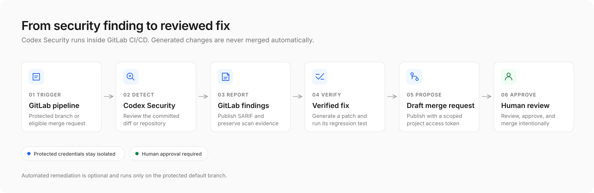

# Detect and remediate vulnerabilities in GitLab CI with Codex Security

Use [`@openai/codex-security`](https://learn.chatgpt.com/docs/security/cli) to scan GitLab merge requests and the default branch, publish findings to GitLab Security, and optionally open draft merge requests with verified fixes.

The pipeline keeps scanning credentials separate from repository-write access and requires human approval before merging any generated fix.



Start with scan-only reporting, then enable optional remediation after you have validated the runner, findings, and security boundaries. The complete implementation is provided as a downloadable GitLab CI configuration.

## Prerequisites

You need a GitLab project with a trusted runner that supports the Codex sandbox's user namespace, an OpenAI API key with Codex Security access, Node.js 22.13.0 or later, Python 3.10 or later, and full Git history for merge request scans. Python 3.10 additionally requires `tomli`.

GitLab Ultimate 19.2 or later supports [SARIF ingestion](https://docs.gitlab.com/user/application_security/detect/sarif/). Some accounts or repositories also require [Trusted Access for Cyber](https://chatgpt.com/cyber) for full-repository scans.

Automated remediation additionally requires an existing regression test and a runner capable of executing repository-controlled commands without access to protected credentials. Publishing a draft merge request requires a separate, narrowly scoped GitLab project access token.

## Step 1: Add the API key and pipeline

Create a [masked, hidden, protected GitLab CI/CD variable](https://docs.gitlab.com/ci/variables/#define-a-cicd-variable-in-the-ui) named `CODEX_SECURITY_API_KEY` using an OpenAI Platform API key with Codex Security access.

Scanning and SARIF publication require only one project variable: `CODEX_SECURITY_API_KEY`. Additional credentials and settings are necessary only when enabling optional automated remediation.

[Download the complete `.gitlab-ci.yml`](./gitlab_ci_codex_security/.gitlab-ci.yml) and place it in your GitLab repository's root. If you already have a pipeline, merge its stages, hidden templates, and jobs into your existing configuration.

The example adds `security_scan`, `security_remediation`, `security_publish`, and `security_gate` stages. Preserve your existing build, test, and deployment stages when integrating it. If your project defines `workflow: rules`, confirm they allow the pipeline events you intend to scan.

The pipeline scans protected default-branch commits and same-project merge requests between protected branches. Merge request pipelines can access protected credentials only when GitLab's [protected merge request resource requirements](https://docs.gitlab.com/ci/pipelines/merge_request_pipelines/#control-access-to-protected-variables-and-runners) are satisfied.

Both branches must belong to the same project, both must be protected, and the project must permit merge request pipelines to access protected variables and runners. The user triggering the pipeline also needs permission to push or merge into the target branch.

Review who can modify `.gitlab-ci.yml` or run secret-bearing jobs: masking and hiding a variable do not make untrusted CI code safe. If feature branches are unprotected, scan after merging to the protected default branch instead.

## Step 2: Run a scan and verify GitLab findings

Create an eligible protected merge request or run the pipeline on the protected default branch. Start with a small diff before running a paid full-repository scan.

Open the `codex-security` job and confirm that its artifacts include `scan-manifest.json`, `findings.json`, `coverage.json`, `results.sarif`, and `scan-exit-code.txt`. Then:

1. Open the pipeline **Security** tab and check for ingestion warnings.
2. Confirm finding identifiers, severities, and source locations.
3. For a default-branch pipeline, open the project vulnerability report. For merge requests, check the Security tab or merge-request widget.


GitLab creates project vulnerability records after default-branch scans; merge-request findings alone do not create project-wide vulnerability records.

The manifest identifies the scanned revision, `findings.json` contains canonical findings, and `coverage.json` records whether the selected target was completely reviewed. If these artifacts are missing, investigate authentication, runner setup, or sandbox permissions before retrying a paid scan.

## Step 3: Understand the pipeline

The downloadable pipeline selects one of three profiles:

| Trigger | Target | Mode | Effort |
| --- | --- | --- | --- |
| Protected same-project merge request | Committed diff | `standard` | `low` |
| Protected default-branch push or manual run | Full repository | `standard` | `high` |
| Scheduled pipeline | Full repository | `deep` | `xhigh` |

Merge request scans prioritize quick feedback on the committed change. Default-branch scans review the integrated repository, while scheduled deep scans provide broader periodic coverage. A completed diff scan applies only to that change and must not be treated as proof that the entire repository is clean.

The routing rules pin the CLI version with `CODEX_SECURITY_VERSION` and exclude forked or unprotected merge requests:

```yaml
variables:
  CODEX_SECURITY_VERSION: "0.1.11"
  CODEX_SECURITY_MAX_CHANGED_FILES: "8"

stages:
  - security_scan
  - security_remediation
  - security_publish
  - security_gate

.codex-security-rules:
  rules:
    - if: '$CI_PIPELINE_SOURCE == "schedule"'
      variables:
        CODEX_SECURITY_TARGET: "repository"
        CODEX_SECURITY_MODE: "deep"
        CODEX_SECURITY_EFFORT: "xhigh"
    - if: '$CI_PIPELINE_SOURCE == "merge_request_event" && $CI_MERGE_REQUEST_SOURCE_PROJECT_ID == $CI_PROJECT_ID && $CI_MERGE_REQUEST_SOURCE_BRANCH_PROTECTED == "true" && $CI_MERGE_REQUEST_TARGET_BRANCH_PROTECTED == "true"'
      variables:
        CODEX_SECURITY_TARGET: "diff"
        CODEX_SECURITY_MODE: "standard"
        CODEX_SECURITY_EFFORT: "low"
    - if: '$CI_COMMIT_REF_PROTECTED == "true" && $CI_COMMIT_BRANCH == $CI_DEFAULT_BRANCH && ($CI_PIPELINE_SOURCE == "push" || $CI_PIPELINE_SOURCE == "web")'
      variables:
        CODEX_SECURITY_TARGET: "repository"
        CODEX_SECURITY_MODE: "standard"
        CODEX_SECURITY_EFFORT: "high"
```

The scanner installs outside the repository, checks the sandbox, runs a dry-run preflight, and scans the exact committed target. CLI `0.1.11` requires a process-scoped `OPENAI_API_KEY` for both the dry run and paid scan; the pipeline derives it from `CODEX_SECURITY_API_KEY`.

For merge requests, full Git history allows the pipeline to calculate the merge base and bind the scan to the reviewed base and head revisions. The tested CLI also uses an internal snapshot digest to seal diff results; repository scans instead use their Git revision.

The dry run checks configuration without starting a paid scan, but it does not prove account entitlement, available quota, or model access. Retest authentication and report handling before changing the pinned CLI version.

The completed scan publishes SARIF from a successful report job:

```yaml
codex-security:
  artifacts:
    when: always
    access: maintainer
    expire_in: 7 days
    paths:
      - codex-security-artifacts/
    reports:
      sarif: codex-security-artifacts/results.sarif
```

GitLab does not ingest SARIF findings from a failed job, even with `allow_failure`. The pipeline therefore publishes a successful report first, then restores the scanner's exit status in a separate final gate. Partial coverage is accepted only when the completed scan, coverage evidence, and non-empty SARIF are verified; remediation still requires complete coverage.

This separation means an eligible finding can appear in GitLab and produce a verified draft fix before the final policy gate blocks the pipeline. Restrict artifact access because reports may contain source excerpts and vulnerability details.

To preserve GitLab severities, the pipeline matches SARIF results to `findings.json` and assigns rank `95` for critical findings, `80` for high, `55` for medium, `25` for low, and `5` for informational.

## Step 4: Enable automated draft merge requests

Automated remediation is optional and runs only for protected default-branch pipelines. It never receives repository-write access, and generated changes always require human review.

### How automatic vulnerability remediation creates a merge request

A protected default-branch pipeline performs these stages without a webhook:

| Step | Job | Result |
| --- | --- | --- |
| 1. Scan | `codex-security` | Publishes findings and coverage evidence |
| 2. Select | `codex-security-remediate` | Requires complete coverage and one `high`- or `critical`-severity finding |
| 3. Reproduce | `codex-security-remediate` | Confirms the existing regression test fails before generating a fix |
| 4. Verify | `codex-security-remediate` | Rejects unsafe changes and reruns the regression test |
| 5. Publish | `codex-security-draft-mr` | Uses a scoped project token to create a draft merge request |
| 6. Review | `codex-security-remediation-mr-check` | Tests the unprotected branch without protected secrets |

Merge request diff scans do not create remediation merge requests. The workflow rejects incomplete coverage, medium- or low-severity findings, failed verification, and unsafe changes. It reuses an open draft instead of creating a duplicate and never automatically merges code.

### Configure verified patch generation

Set protected `CODEX_SECURITY_ENABLE_REMEDIATION=true` and define `CODEX_SECURITY_VERIFICATION_COMMAND` as an existing regression test. That test must fail with exit `1` before the fix and pass with exit `0` afterward.

Choose a test that checks the underlying security invariant rather than one specific implementation. Set optional `CODEX_SECURITY_SETUP_COMMAND` if dependencies must be installed first. A passing test before remediation does not demonstrate the vulnerability, while exit `127` usually indicates a missing executable.

The remediation job runs only on the protected default branch:

```yaml
codex-security-remediate:
  extends: .codex-security-runtime
  stage: security_remediation
  environment:
    name: codex-security/remediate
  variables:
    CODEX_SECURITY_REMEDIATION_EFFORT: "high"
  rules:
    - if: '$CODEX_SECURITY_ENABLE_REMEDIATION == "true" && $CI_COMMIT_REF_PROTECTED == "true" && $CI_COMMIT_BRANCH == $CI_DEFAULT_BRANCH && ($CI_PIPELINE_SOURCE == "push" || $CI_PIPELINE_SOURCE == "schedule" || $CI_PIPELINE_SOURCE == "web")'
  needs:
    - job: codex-security
      artifacts: true
```

`validate` and `patch` use process-scoped `CODEX_API_KEY`, unlike `scan`, which uses `OPENAI_API_KEY`. Do not add unsupported `--auth` to either subcommand:

```bash
CODEX_API_KEY="$CODEX_SECURITY_API_KEY" \
  npx "@openai/codex-security@$CODEX_SECURITY_VERSION" validate finding.json --effort high

CODEX_API_KEY="$CODEX_SECURITY_API_KEY" \
  npx "@openai/codex-security@$CODEX_SECURITY_VERSION" patch finding.json --effort high
```

Repository-controlled setup and tests run under a separate unprivileged user without OpenAI, GitLab, registry, or deployment credentials. Non-root runners must run verification in a separate credential-free job.

The patch must preserve protected files and remain within `CODEX_SECURITY_MAX_CHANGED_FILES`. The default allows eight changed files; adjust it only when a complete fix and its focused tests require a different reviewed limit.

### Automatically create a draft merge request

Create a [GitLab project access token](https://docs.gitlab.com/user/project/settings/project_access_tokens/) with the Developer role and the `api` and `write_repository` scopes. Store it as protected, masked, hidden `GITLAB_REMEDIATION_TOKEN` scoped only to the `codex-security/publish` environment.

Set protected `CODEX_SECURITY_CREATE_MR=true` to enable the publishing job:

```yaml
codex-security-draft-mr:
  stage: security_publish
  image: python:3.13-slim
  environment:
    name: codex-security/publish
  rules:
    - if: '$CODEX_SECURITY_ENABLE_REMEDIATION == "true" && $CODEX_SECURITY_CREATE_MR == "true" && $CI_COMMIT_REF_PROTECTED == "true" && $CI_COMMIT_BRANCH == $CI_DEFAULT_BRANCH && ($CI_PIPELINE_SOURCE == "push" || $CI_PIPELINE_SOURCE == "schedule" || $CI_PIPELINE_SOURCE == "web")'
  needs:
    - job: codex-security-remediate
      artifacts: true
```

The publisher creates `codex-security/fix-<finding-hash>` and opens `Draft: Fix Codex Security finding <finding-hash>`. It reuses existing drafts and handles source branches left behind by closed merge requests.

Do not substitute `CI_JOB_TOKEN` for the scoped project token: it cannot perform the required merge request creation operation. The publisher also isolates its Git credentials from runner-injected checkout credentials before pushing the fix branch.

The resulting unprotected merge request runs `codex-security-remediation-mr-check` without protected secrets. Configure its ordinary regression command with non-secret `CODEX_SECURITY_MR_TEST_COMMAND` when `npm test` is not appropriate. Review and merge the proposed fix manually.

## Step 5: Configure optional variables

Only the API key is required for scanning. Configure additional variables only when enabling their corresponding feature:

| Variable | When needed | Default or purpose |
| --- | --- | --- |
| `CODEX_SECURITY_API_KEY` | Every scan | Protected, masked, hidden OpenAI API key |
| `CODEX_SECURITY_VERSION` | Optional CLI upgrade | `0.1.11`; retest before changing |
| `CODEX_SECURITY_ENABLE_REMEDIATION` | Patch generation | Protected opt-in; disabled by default |
| `CODEX_SECURITY_VERIFICATION_COMMAND` | Patch generation | Protected regression test |
| `CODEX_SECURITY_SETUP_COMMAND` | Optional remediation setup | Protected dependency installation |
| `CODEX_SECURITY_REMEDIATION_EFFORT` | Optional remediation tuning | `high` |
| `CODEX_SECURITY_MAX_CHANGED_FILES` | Optional patch-size limit | `8`; allowed range `1` through `20` |
| `CODEX_SECURITY_CREATE_MR` | Draft merge request creation | Protected opt-in; disabled by default |
| `GITLAB_REMEDIATION_TOKEN` | Draft merge request creation | Protected Developer token scoped to `codex-security/publish` |
| `CODEX_SECURITY_GITLAB_INTERNAL_URL` | Optional self-hosted publishing | GitLab origin reachable from the runner |
| `CODEX_SECURITY_MR_TEST_COMMAND` | Optional remediation branch tests | Non-secret command for unprotected branches; default `npm test` |
| `CODEX_SECURITY_MR_SETUP_COMMAND` | Optional remediation branch setup | Non-secret dependency setup for unprotected branches |

GitLab supplies `CI_*` variables. The pipeline manages internal `CODEX_SECURITY_BIN`, `CODEX_SECURITY_EFFORT`, `CODEX_SECURITY_MODE`, `CODEX_SECURITY_STATE_DIR`, `CODEX_SECURITY_TARGET`, and `CODEX_SECURITY_TARGET_SNAPSHOT_DIGEST`; do not configure them as project variables.

For scan-only usage, add only `CODEX_SECURITY_API_KEY`. Patch generation additionally needs the remediation opt-in and verification command. Draft publication adds the separate publishing opt-in and environment-scoped project token.

## Step 6: Tune cost and enforcement

Use focused diffs for merge request feedback, standard repository scans for the default branch, and scheduled deep scans for broader coverage. Compare effort and model changes independently, and retain periodic full scans.

One validation project reported estimated costs of USD 2.76 for a two-file diff and USD 11.67 for a 63-file repository scan. These are examples, not predictions. `--max-cost` provides an estimated-cost guardrail, not a hard billing cap.

Scanner exit `0` indicates a passing scan, exit `1` indicates a configured severity-policy failure, and exit `2` requires investigating coverage or infrastructure. The final gate temporarily allows verified partial coverage during calibration; remove that allowance when incomplete coverage must block.

When a job fails, begin with the available evidence: missing scan artifacts suggest a configuration or runner issue, while existing artifacts with partial coverage require reviewing the completion summary. If GitLab displays no findings, confirm the report job itself succeeded. If remediation does not run, check the protected branch, both opt-ins, complete coverage, finding severity, and the publishing token's environment scope.

Consult the [Security CLI reference](https://learn.chatgpt.com/docs/security/cli/reference) for target selection, effort, model, budget, and severity-policy options.

## Next steps

Start with scan-only reporting, verify GitLab ingestion, and calibrate representative runs. Enable one verified fix at a time, keep publishing credentials isolated, and introduce blocking policy only after your team understands coverage, cost, and finding quality.
