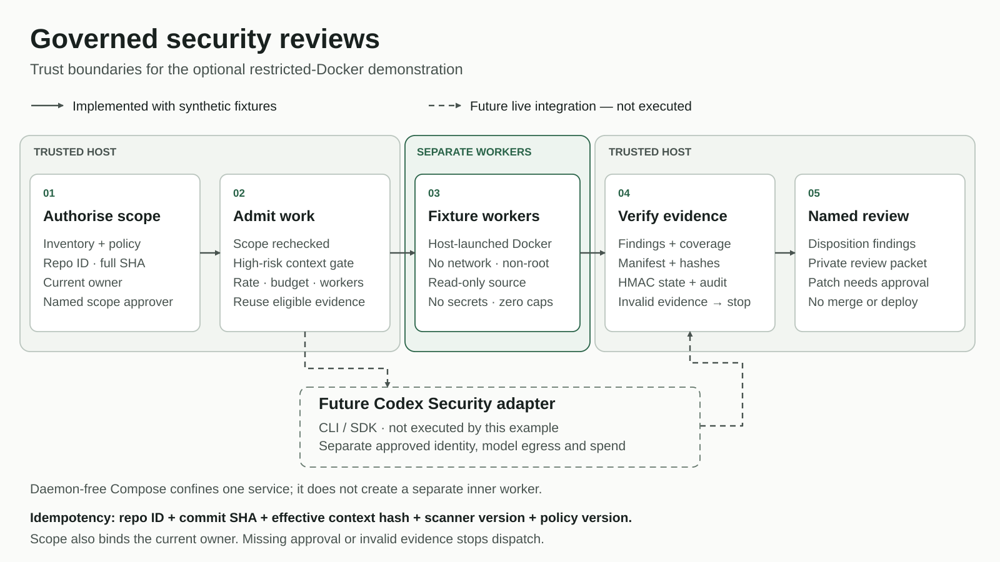

# Govern repository security reviews with versioned context

Build a small security-review control plane that binds human approval to an
exact repository revision and threat-context hash. Run six fictional
repositories through bounded work admission, evidence verification and human
disposition. Repeat the cycle to see why unchanged evidence is reused and a
hostile repository remains quarantined.

The executable scanner is a deterministic fixture adapter. **It does not call
Codex Security or a hosted model.** The separate integration contract is pinned
to Codex Security CLI `0.1.20`; recorded, isolated `--version` and `--help` checks
verify command syntax, not scan quality, account access or production capacity.

## Prerequisites

- Python 3.11 or later on macOS or Linux. The default run uses the standard
  library only. Native Windows execution is not supported by the POSIX locks.
- A complete copy of this example directory, including `src`, `scripts`,
  `fixtures`, `contracts` and `cookbook/security-review-pipeline`.
- No API key, provider token, customer repository or employee-only plugin.
- Optional: Docker with an approved, cached `python:3.12-alpine` image for actual
  isolation tests. The example uses `--pull never` and never silently falls back
  to host execution. Record the image ID in your verification receipt.

## 1. Run the offline workflow

From a checkout containing this contribution:

```sh
cd examples/codex/governed_repository_security_reviews
python3 -B scripts/run_security_review_cookbook.py --cycles 2
```

With no transient failures, the JSON receipt contains:

```json
{
  "scanner_invocations_per_cycle": [4, 0],
  "attempted_repositories_per_cycle": [4, 0],
  "retry_attempts_per_cycle": [0, 0],
  "live_product_execution": false,
  "paid_api_calls": 0,
  "external_writes": 0
}
```

Four distinct approved repositories are attempted. Two results await finding
disposition, one is a clean synthetic review packet and one safely abstains on
hostile content. The other two repositories wait for scope or high-risk context
approval. Temporary state is removed unless you explicitly supply `--state-dir`
outside the checkout. A review packet is evidence for a person, not permission
to merge or deploy.

A permitted transient retry can increase the first raw attempt count without
adding another repository job. Each extra attempt must match a typed retry
event and stay within the policy's attempt, concurrency and budget limits.
The verifier checks exact repository identities and final decisions as well as
those counts. An unexplained duplicate, exhausted failure or missing isolation
receipt still fails. An unchanged restart must have exactly zero new attempts.

## 2. Follow the notebook

Open [the tutorial](governed_repository_security_reviews.ipynb) in Jupyter and
run it from top to bottom. It works from its own directory without a hidden
`PROJECT_ROOT` variable. You can also execute its exact cells without Jupyter:

```sh
python3 -B scripts/execute_notebook.py governed_repository_security_reviews.ipynb
```

The walkthrough covers scope refusal, hierarchical context, repeat runs,
changed revisions, tampered evidence and named human decisions. All reviewer
names and approval files are fictional teaching fixtures, not a production
identity or approval service.



## 3. Check the context and product contracts

```sh
python3 -B scripts/evaluate_threat_context.py
python3 -B scripts/check_codex_security_capabilities.py --help
```

The context evaluation uses a separately declared synthetic label set. It tests
whether expected threat scenarios survive inheritance and changes. It does not
measure vulnerability detection, exploitability or actual reviewer time.

Read [the pinned product contract](PUBLICATION_SOURCES.md) before adapting the
inert native command plans. An estimated per-attempt cost threshold is not a
hard fleet-spend cap. The default output remains a private review packet; this
example implements no provider-write adapter.

## 4. Reproduce the checks

```sh
python3 -B scripts/verify_cookbook_example.py
```

This runs the recipe, metadata-only planner, independent context evaluation,
notebook and the included fleet, recipe and stress tests. Without `--docker`,
real-container checks are explicitly reported as skipped.

For a separate ordinary-Jupyter check, create a virtual environment outside the
example and install the optional tooling. These installation commands contact
your configured Python package registry; the tutorial itself remains offline.

```sh
python3 -m venv /tmp/governed-cookbook-venv
/tmp/governed-cookbook-venv/bin/python -m pip install -r requirements.txt
/tmp/governed-cookbook-venv/bin/python -B scripts/verify_cookbook_example.py --jupyter
```

Run actual restricted-container tests only after approving the local Docker
daemon and image. If the image is absent, acquire it through your organisation's
approved image process before continuing.

```sh
docker image inspect python:3.12-alpine --format '{{.Id}}'
python3 -B scripts/verify_cookbook_example.py --docker
python3 -B scripts/run_security_stress_soak.py --cycles 2
```

The bounded soak classifies 2,000 synthetic metadata records, but executes only
a small, enumerated corpus of fictional fixtures. Read its separate scenario,
container and scan-attempt counts; do not call this a 2,000-repository security
scan. Its elapsed time describes your local run, not a production SLA.

For automatic reconciliation inside a local service container, follow the
[bounded supervisor guide](local/README.md). That mode intentionally has no
Docker socket and no nested workers. The guide distinguishes an outer service
container from separately isolated workers launched by a trusted host.

## 5. Adapt the pattern without weakening its boundary

Keep inventory, policy and approvals outside untrusted repositories. Treat
events as hints, not authority. Revalidate the current owner, exact revision,
effective context and evidence before reuse. An organisation-wide change may
invalidate many repository contexts even though only one baseline document
changed; shared models do not make the rescan or review work disappear.

Before connecting a real scanner, implement and approve repository acquisition,
identity, scoped access, data routing, network egress, spend ownership, evidence
retention and on-call operations. Independently test scan outcomes and coverage.
Keep finding disposition, patches, provider writes, merge, deployment,
exceptions and policy changes with named humans.

## What this contribution adds

Existing Cookbook examples cover code-review automation, security triage,
governance and run budgets. This example connects **revision-bound authority,
effective threat-context fingerprints, repeat-safe admission and authenticated
review evidence** in one inspectable workflow. The underlying restricted
executor is reused unchanged; the separate automated-development tutorial is
not included in this contribution.

See [the operating guide](cookbook/security-review-pipeline/OPERATOR_RUNBOOK.md)
for human gates and [third-party notices](THIRD_PARTY_NOTICES.md) for the public
schema snapshot. Passing the local checks is not product approval, public
release approval or Cookbook acceptance.
