# Long horizon tasks with Codex

In September 2025, OpenAI introduced GPT-5-Codex as the first version of GPT-5 optimized for agentic coding. In December 2025, we launched 5.2 which was the moment that people began to believe that using autonomous coding agents could be reliable. 
In particular, we saw a huge jump in how long the model could reliably follow instructions.

I wanted to stress-test that threshold. So I gave Codex a blank repo, full access, and one job: build a design tool from scratch. Then I let it run with GPT-5.3-Codex at "Extra High" reasoning. Codex ran for about 25 hours uninterrupted, used about 13M tokens, and generated about 30k lines of code.

This was an experiment, not a production rollout. But it performed well on the parts that matter for long-horizon work: following the spec, staying on task, running verification, and repairing failures as it went.

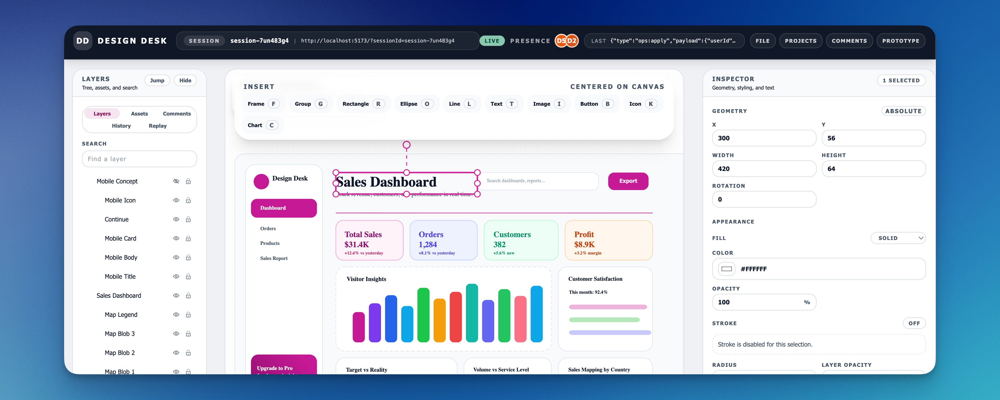

## What a long-run Codex session looks like

I asked Codex to generate a summary page for the session data:

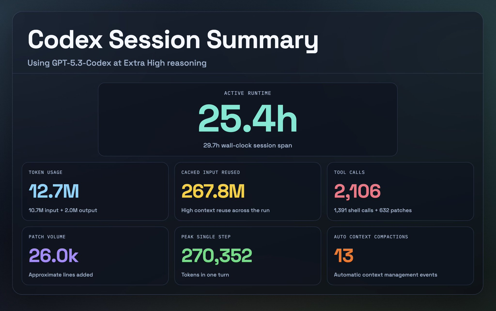

And here is a view of the CLI session stats and token usage:

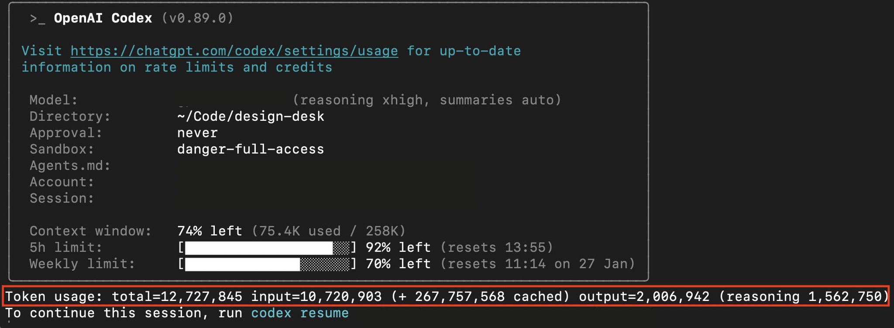

These screenshots are useful because they make the core shift visible: agentic coding is increasingly about time horizon, not just one-shot intelligence.

## The real shift is time horizon

This is not only "models got smarter." The practical change is that agents can stay coherent for longer, complete larger chunks of work end-to-end, and recover from errors without losing the thread.

METR's work on time-horizon benchmarks is a helpful framing for this trend: the length of software tasks frontier agents can complete with ~50% and 80% reliability has been climbing fast, with a rough ~7 month doubling time. Refer to [Measuring AI Ability to Complete Long Tasks (METR)](https://metr.org/blog/2025-03-19-measuring-ai-ability-to-complete-long-tasks/).

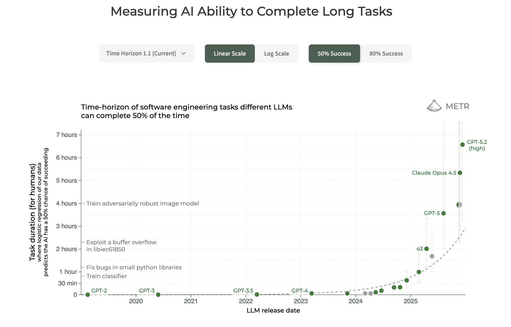

Our recent GPT-5.3-Codex [launch announcement](https://openai.com/index/introducing-gpt-5-3-codex/) pushes this further for agent work in two practical ways:
1. It’s better at multi-step execution (plan → implement → validate → repair).
2. It’s easier to steer mid-flight without resetting the whole run (course corrections don’t wipe progress).

I was also inspired by Cursor's writing on long-running autonomous coding systems, including their browser-building experiment:
[How Cursor built a web browser (Scaling agents)](https://cursor.com/blog/scaling-agents).

The Cursor team wrote that OpenAI models are "much better at extended autonomous work: following instructions, keeping focus, avoiding drift, and implementing things precisely and completely."

## Why Codex can stay coherent on long tasks

Long-running work is less about one giant prompt and more about the agent loop the model operates inside.

In Codex, the loop is roughly:

1. Plan
2. Edit code
3. Run tools (tests/build/lint)
4. Observe results
5. Repair failures
6. Update docs/status
7. Repeat

That loop matters because it gives the agent:

- Real feedback (errors, diffs, logs)
- Externalized state (repo, files, docs, worktrees, outputs)
- Steerability over time (you can course-correct based on outcomes)

This is also why Codex models feel better on Codex surfaces than a generic chat window: the harness supplies structured context (repo metadata, file tree, diffs, command outputs) and enforces a disciplined “done when” routine.

We recently published an [article](https://openai.com/index/unrolling-the-codex-agent-loop/) about the Codex agent loop that has more details.

To top this off, we also launched the Codex app that makes that loop usable day-to-day:
- [Parallel threads across projects](https://developers.openai.com/codex/app/features) (long work doesn’t block your day job)
- [Skills](https://developers.openai.com/codex/skills) (standardize plan/implement/test/report)
- [Automations](https://developers.openai.com/codex/app/automations/) (routine work in the background)
- [Git worktrees](https://developers.openai.com/codex/app/worktrees/) (isolate runs, keep diffs reviewable, reduce thrash)

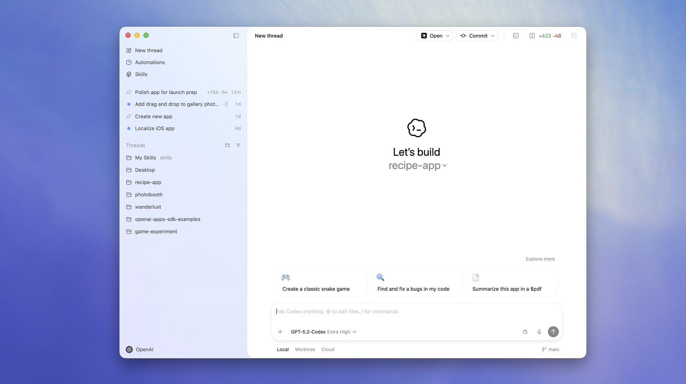

## My setup for the test

I picked a design tool for this “experiment” because it’s an unforgiving test: UI + data model + editing operations + lots of edge cases. You can’t bluff it. If the architecture is wrong, it breaks quickly.

I gave GPT-5.3-Codex a meaty spec, ran it at “Extra High” reasoning, and it ended up running uninterrupted for ~25 hours and was able to stay coherent and ship quality code. The model also ran verification steps (tests, lint, typecheck) for every milestone it completed.

## The key idea: durable project memory

The most important technique was durable project memory. I wrote the spec, plan, constraints, and status in markdown files that Codex could revisit repeatedly. That prevented drift and kept a stable definition of "done."

The repository is linked below and the file stack was as follows:

#### [Prompt.md](https://github.com/derrickchoi-openai/design-desk/blob/main/docs/prompt.md) (spec + deliverables)

Purpose: Freeze the target so the agent doesn’t “build something impressive but wrong.”

Key sections in the file:
- Goals + non-goals
- Hard constraints (perf, determinism, UX, platform)
- Deliverables (what must exist when finished)
- “Done when” (checks + demo flow)

The initial prompt told Codex to treat the prompt/spec file as the full project specification and generate a milestone-based plan:

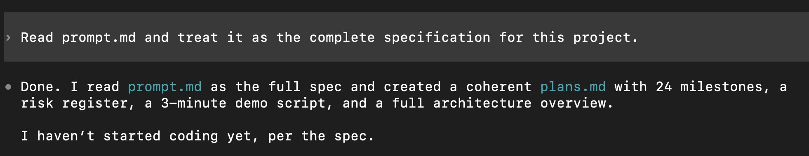

#### [Plan.md](https://github.com/derrickchoi-openai/design-desk/blob/main/docs/plans.md) (milestones + validations)

Purpose: Turn open-ended work into a sequence of checkpoints the agent can finish and verify.

Key sections in the file:
- Milestones small enough to complete in one loop
- Acceptance criteria + validation commands per milestone
- Stop-and-fix rule: if validation fails, repair before moving on
- Decision notes to avoid oscillation
- Intended architecture of the codebase

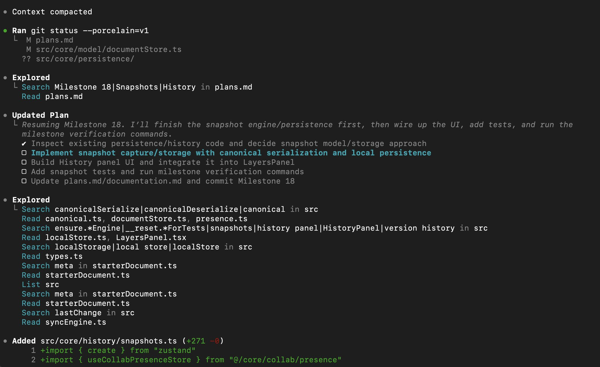

*Note that we recently added a native plan mode to the Codex app, CLI, and IDE extension. This helps break a larger task into a clear, reviewable sequence of steps before making changes, so you can align on approach upfront. If additional clarification is needed, Codex will ask follow up questions. To toggle it on, use the /plan slash command.

#### [Implement.md](https://github.com/derrickchoi-openai/design-desk/blob/main/docs/implement.md) (execution instructions referencing the plan)

Purpose: This is the runbook. It tells Codex exactly how to operate: follow the plan, keep diffs scoped, run validations, update docs.

Key sections in the file:
- Plans markdown file is source of truth (milestone-by-milestone)
- Run validation after each milestone (fix failures immediately)
- Keep diffs scoped (don’t expand scope)
- Update documentation markdown file continuously

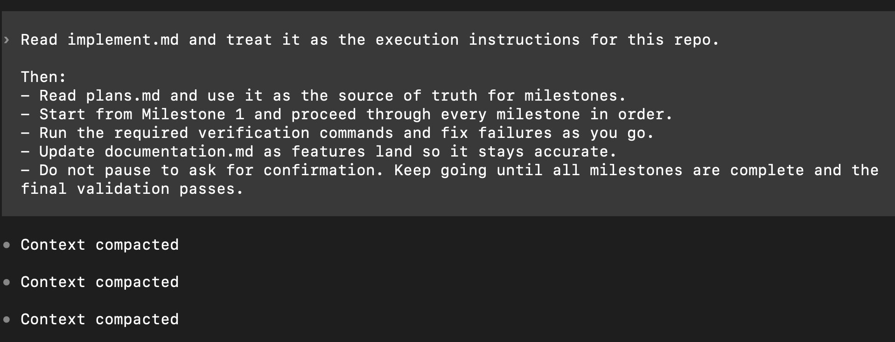

#### [Documentation.md](https://github.com/derrickchoi-openai/design-desk/blob/main/docs/documentation.md) (status + decisions as it shipped)

Purpose: This is the shared memory and audit log. It’s how I can step away for hours and still understand what happened.

Key sections in the file:
- Current milestone status (what’s done, what’s next)
- Decisions made (and why)
- How to run + demo (commands + quick smoke tests)
- Known issues / follow-ups

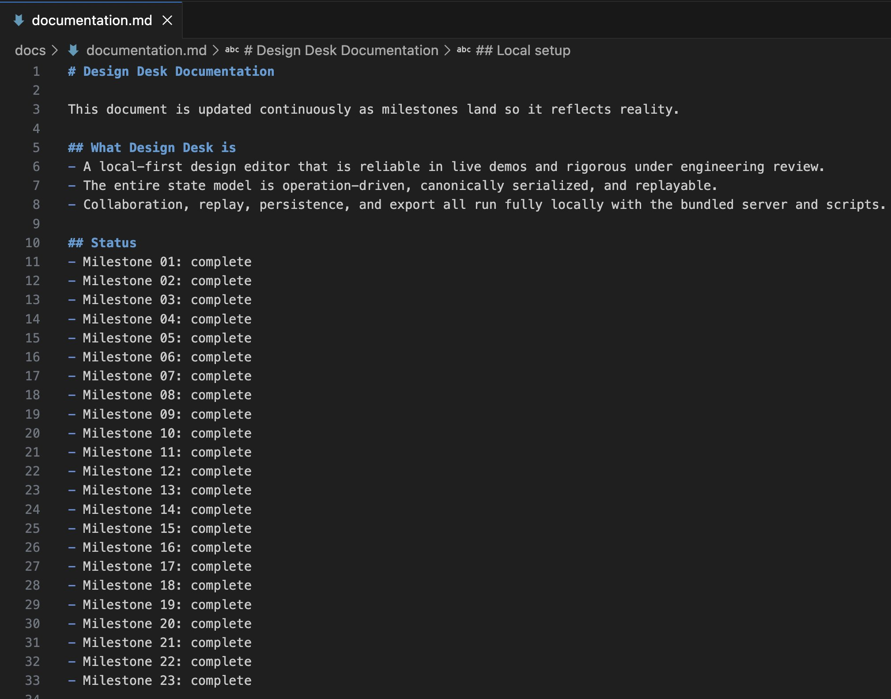

This is what milestone verification looked like in practice during the run:

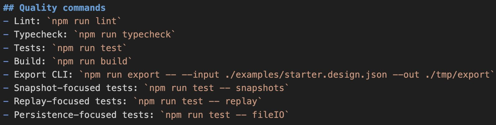

### Verification at every milestone

Codex did not just write code and hope it worked. After milestones, it ran verification commands and repaired failures before continuing.

Here are examples of the quality commands it was instructed to use:

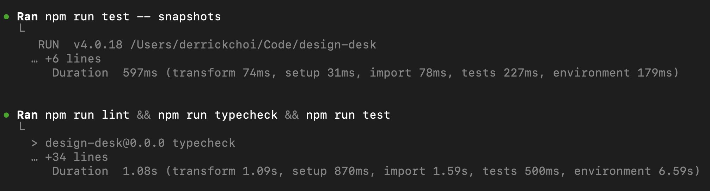

And an example of Codex fixing issues after a lint failure:

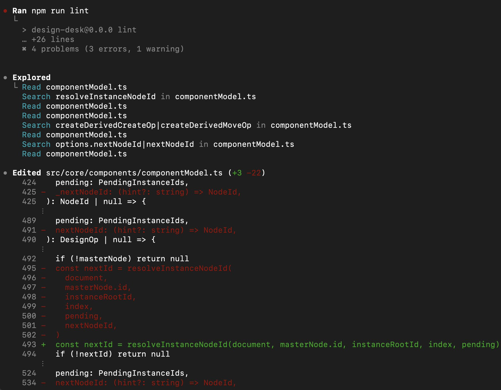

## What the agent built

The result was not perfect or production-ready, but it was real and testable. The bar for this run was not "it compiles"; it was "does it follow the instructions, and does it actually work?"

High-level capabilities implemented:

1. Canvas editing (frames, groups, shapes, text, images/icons, buttons, charts)
2. Live collaboration (presence, cursors, selections, edits sync across tabs)
3. Inspector controls (geometry, styling, text)
4. Layers management (search, rename, lock/hide, reorder)
5. Guides/alignment/snapping
6. History snapshots + restore
7. Replay timeline + branch from a prior point
8. Prototype mode (hotspots + flow navigation)
9. Comments (pinned threads with resolve/reopen)
10. Export (save/import/export + CLI export to JSON and React + Tailwind)

### Product screenshots from the run

Live collaboration:

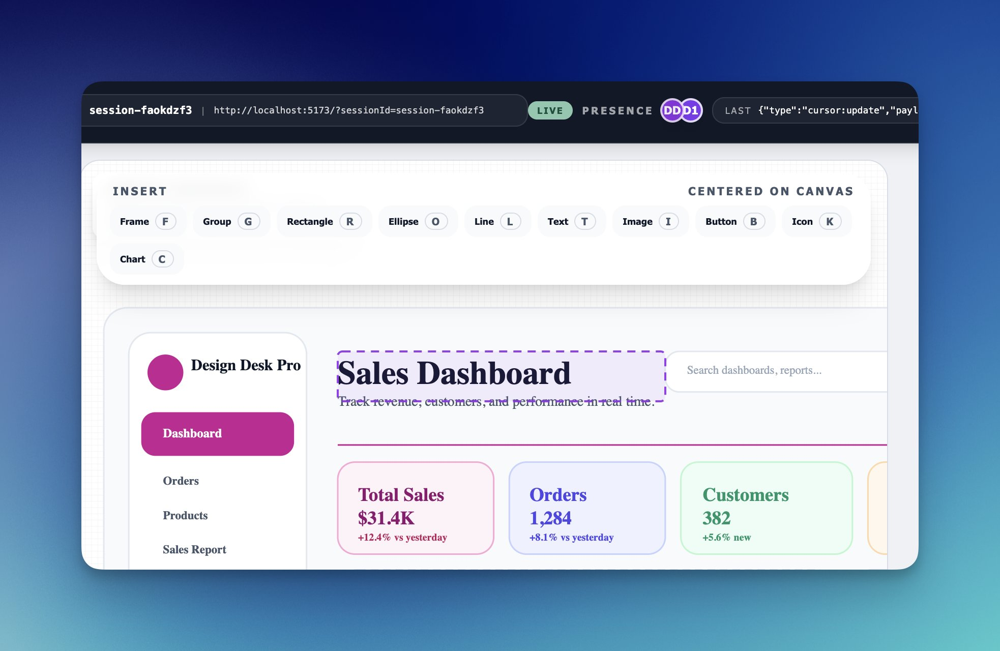

Snapshots and restore:

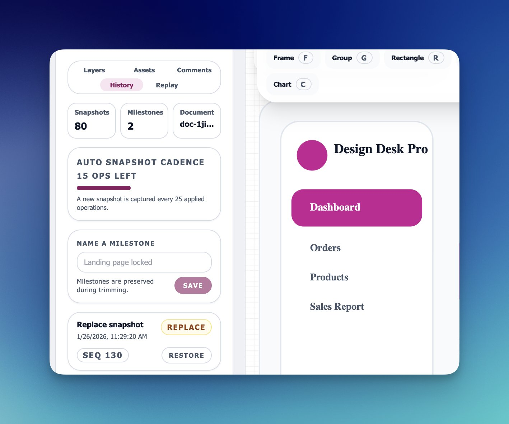

Replay / time travel:

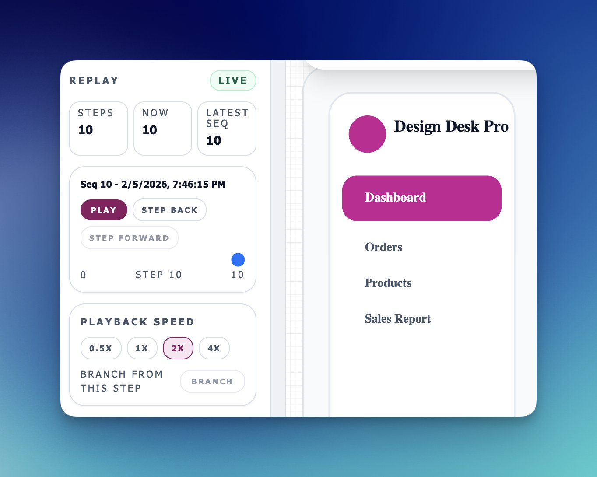

Comments and pinned threads:

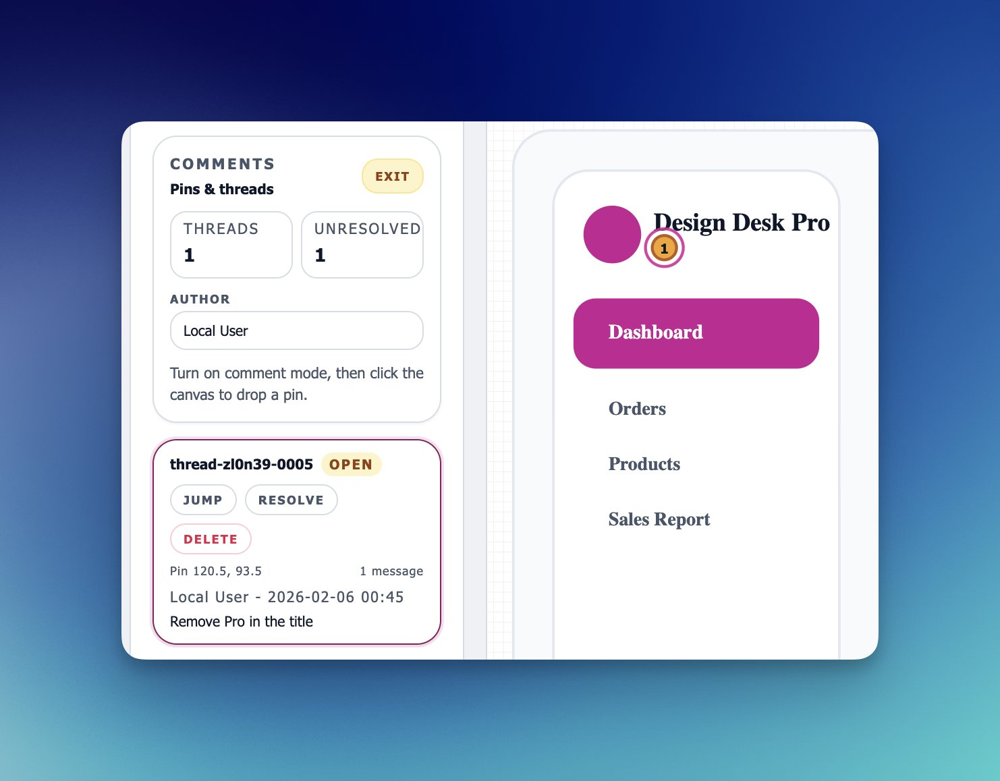

## Takeaways for long-horizon Codex tasks

What made this run work was not a single clever prompt. It was the combination of:

- A clear target and constraints (spec file)
- Checkpointed milestones with acceptance criteria (`plans.md`)
- A runbook for how the agent should operate (`implement.md`)
- Continuous verification (tests/lint/typecheck/build)
- A live status/audit log (`documentation.md`) so the run stayed inspectable

This is the direction long-horizon coding work is moving toward: less babysitting, more delegation with guardrails.

## Try Codex on your own long-running task

This 25-hour Codex run is a preview of where building with code is going. We’re moving beyond single-shot prompts and tight pair-programming loops toward long-running teammates that can take a real slice of work end to end, with you steering at milestones instead of micromanaging every line.

Our direction with Codex is simple: stronger teammate behavior, tighter integration with your real context, and guardrails that keep work reliable, reviewable, and easy to ship. We’re already seeing developers move faster when the agent absorbs routine implementation and verification, freeing humans up for the parts that matter most: design, architecture, product decisions, and the novel problems that don’t have a template.

And this won’t stop with developers. As Codex gets even better at capturing intent and providing safe scaffolding (plans, validations, previews, rollbacks), more non-developers will be able to build and iterate without living in an IDE. There’s more coming across Codex surfaces and models, but the north star stays the same: make the agent feel less like a tool you babysit and more like a teammate you can trust on long-horizon work.

If you want to try this yourself, start with:

- [Codex overview](https://developers.openai.com/codex/)
- [Codex quickstart](https://developers.openai.com/codex/quickstart/)
- [Codex models](https://developers.openai.com/codex/models/)
- [Codex app features](https://developers.openai.com/codex/app/features/)