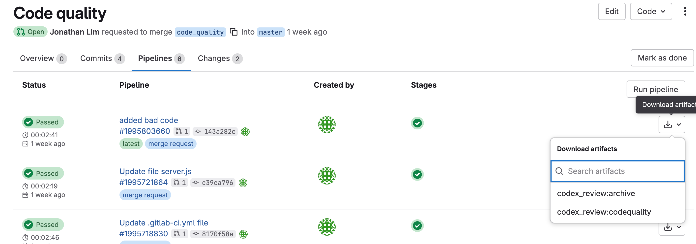
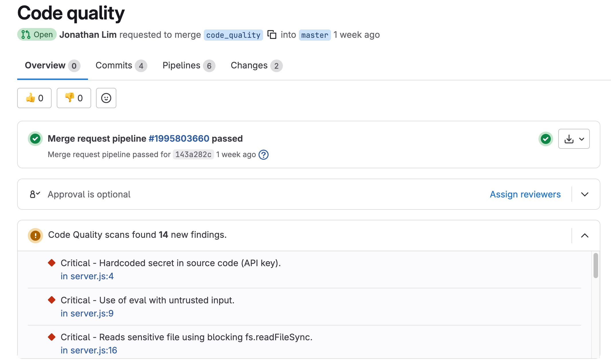

# Automating Code Quality and Security Fixes with Codex CLI in GitLab

## Introduction

When deploying production code, most teams rely on CI/CD pipelines to validate changes before merging. Reviewers typically look at unit test results, vulnerability scans, and code quality reports. Traditionally, these are produced by rule-based engines that catch known issues but often miss contextual or higher-order problems—while leaving developers with noisy results that are hard to prioritize or act on.

With LLMs, you can add a new layer of intelligence to this process: reasoning about code quality and interpreting security findings. By augmenting your GitLab pipelines with **OpenAI’s Codex CLI**, teams gain insights that go beyond static rules:

* **Code Quality** → Generate GitLab-compliant CodeClimate JSON reports that surface contextual issues directly in merge requests.

* **Security** → Post-process existing SAST results to consolidate duplicates, rank issues by exploitability, and provide clear, actionable remediation steps.

This guide shows how to integrate Codex CLI into a GitLab pipeline for both use cases—delivering structured, machine-readable reports alongside actionable, human-readable guidance.

## What is Codex CLI?

Codex CLI is an open-source command-line tool for bringing OpenAI’s reasoning models into your development workflow. For installation, usage, and full documentation, refer to the official repository: [github.com/openai/codex](https://github.com/openai/codex?utm_source=chatgpt.com).

In this cookbook, we’ll use **Full Auto mode** in an ephemeral GitLab runner to generate a standards-compliant JSON report.

### Pre-requisites

To follow along, you’ll need:

* A GitLab account and project  
* A GitLab runner with **internet access** (we’ve tested this on a Linux runner with 2 vCPUs, 8GB memory and 30GB of storage)  
* Runner must be able to connect to  `api.openai.com`  
* An **OpenAI API key** (`OPENAI_API_KEY`)  
* GitLab CI/CD variables configured under **Settings → CI/CD → Variables**

## Example #1 - Using Codex CLI to Produce a Code Quality Report

### Background

This repository is a deliberately vulnerable Node.js Express demo app based on [GitLab's node express template](https://gitlab.com/gitlab-org/project-templates/express/-/tree/main), built to showcase static application security testing (SAST) and code quality scanning in GitLab CI/CD.

The code includes common pitfalls such as command injection, path traversal, unsafe `eval`, regex DoS, weak cryptography (MD5), and hardcoded secrets. It’s used to validate that Codex-powered analyzers produce GitLab-native reports (Code Quality and SAST) that render directly in merge requests.

The CI runs on GitLab SaaS runners with `node:24` images and a few extras (`jq`, `curl`, `ca-certificates`, `ripgrep`, `ajv-cli`). Jobs are hardened with `set -euo pipefail`, schema validation, and strict JSON markers to keep parsing reliable even if Codex output varies.

This pipeline pattern—prompt, JSON marker extraction, schema validation—can be adapted to other stacks, though prompt wording and schema rules may need tweaks. Since Codex runs in a sandbox, some system commands (like `awk` or `nl`) may be restricted.

Your team wants to ensure that **code quality checks run automatically** before any merge. To surface findings directly in GitLab’s merge request widget, reports must follow the **CodeClimate JSON format**. [Reference: GitLab Docs](https://docs.gitlab.com/ci/testing/code_quality/#import-code-quality-results-from-a-cicd-job)

### Code Quality CI/CD Job Example

Here’s a drop-in GitLab CI job using **Codex CLI** to produce a compliant JSON file:
```yaml
stages: [codex]

default:
  image: node:24
  variables:
    CODEX_QA_PATH: "gl-code-quality-report.json"
    CODEX_RAW_LOG: "artifacts/codex-raw.log"
    # Strict prompt: must output a single JSON array (or []), no prose/markdown/placeholders.
    CODEX_PROMPT: |
      Review this repository and output a GitLab Code Quality report in CodeClimate JSON format.
      RULES (must follow exactly):
      - OUTPUT MUST BE A SINGLE JSON ARRAY. Example: [] or [ {...}, {...} ].
      - If you find no issues, OUTPUT EXACTLY: []
      - DO NOT print any prose, backticks, code fences, markdown, or placeholders.
      - DO NOT write any files. PRINT ONLY between these two lines:
        === BEGIN_CODE_QUALITY_JSON ===
        <JSON ARRAY HERE>
        === END_CODE_QUALITY_JSON ===
      Each issue object MUST include these fields:
        "description": String,
        "check_name": String (short rule name),
        "fingerprint": String (stable across runs for same issue),
        "severity": "info"|"minor"|"major"|"critical"|"blocker",
        "location": { "path": "<repo-relative-file>", "lines": { "begin": <line> } }
      Requirements:
      - Use repo-relative paths from the current checkout (no "./", no absolute paths).
      - Use only files that actually exist in this repo.
      - No trailing commas. No comments. No BOM.
      - Prefer concrete, de-duplicated findings. If uncertain, omit the finding.

codex_review:
  stage: codex
  # Skip on forked MRs (no secrets available). Run only if OPENAI_API_KEY exists.
  rules:
    - if: '$CI_PIPELINE_SOURCE == "merge_request_event" && $CI_MERGE_REQUEST_SOURCE_PROJECT_ID != $CI_PROJECT_ID'
      when: never
    - if: '$OPENAI_API_KEY'
      when: on_success
    - when: never

  script:
    - set -euo pipefail
    - echo "PWD=$(pwd)  CI_PROJECT_DIR=${CI_PROJECT_DIR}"
    # Ensure artifacts always exist so upload never warns, even on early failure
    - mkdir -p artifacts
    - ': > ${CODEX_RAW_LOG}'
    - ': > ${CODEX_QA_PATH}'
    # Minimal deps + Codex CLI
    - apt-get update && apt-get install -y --no-install-recommends curl ca-certificates git lsb-release ripgrep
    - npm --ignore-scripts -g i @openai/codex@latest
    - codex --version && git --version
    # Build a real-file allowlist to guide Codex to valid paths/lines
    - FILE_LIST="$(git ls-files | sed 's/^/- /')"
    - |
      export CODEX_PROMPT="${CODEX_PROMPT}
      Only report issues in the following existing files (exactly as listed):
      ${FILE_LIST}"
    # Run Codex; allow non-zero exit but capture output for extraction
    - |
      set +o pipefail
      script -q -c 'codex exec --full-auto "$CODEX_PROMPT"' | tee "${CODEX_RAW_LOG}" >/dev/null
      CODEX_RC=${PIPESTATUS[0]}
      set -o pipefail
      echo "Codex exit code: ${CODEX_RC}"
    # Strip ANSI + \r, extract JSON between markers to a temp file; validate or fallback to []
    - |
      TMP_OUT="$(mktemp)"
      sed -E 's/\x1B\[[0-9;]*[A-Za-z]//g' "${CODEX_RAW_LOG}" \
        | tr -d '\r' \
        | awk '
            /^\s*=== BEGIN_CODE_QUALITY_JSON ===\s*$/ {grab=1; next}
            /^\s*=== END_CODE_QUALITY_JSON ===\s*$/   {grab=0}
            grab
          ' > "${TMP_OUT}"
      # If extracted content is empty/invalid or still contains placeholders, replace with []
      if ! node -e 'const f=process.argv[1]; const s=require("fs").readFileSync(f,"utf8").trim(); if(!s || /(<JSON ARRAY HERE>|BEGIN_CODE_QUALITY_JSON|END_CODE_QUALITY_JSON)/.test(s)) process.exit(2); JSON.parse(s);' "${TMP_OUT}"; then
        echo "WARNING: Extracted content empty/invalid; writing empty [] report."
        echo "[]" > "${TMP_OUT}"
      fi
      mv -f "${TMP_OUT}" "${CODEX_QA_PATH}"
      # Soft warning if Codex returned non-zero but we still produced a report
      if [ "${CODEX_RC}" -ne 0 ]; then
        echo "WARNING: Codex exited with code ${CODEX_RC}. Proceeding with extracted report." >&2
      fi

  artifacts:
    when: always
    reports:
      codequality: gl-code-quality-report.json
    paths:
      - artifacts/codex-raw.log
    expire_in: 14 days
```

1. Installs Codex CLI (`npm -g i @openai/codex@latest`)  
2. Builds a file allowlist with `git ls-files`  
3. Runs Codex in **full-auto mode** with a strict JSON-only prompt  
4. Extracts valid JSON between markers, validates it, and falls back to `[]` if invalid  
5. Publishes artifacts to GitLab so results appear inline with merge requests
6. [`Edit: 10 Sep 2025`] Enriched with ripgrep hotspot context to produce markdown report

The generated artifacts can be downloaded from the pipeline page



Or when running as a merge from a feature to master branch, 



By embedding Codex CLI into your GitLab CI/CD pipelines, you can **elevate code quality checks beyond static rules**. Instead of only catching syntax errors or style violations, you enable reasoning-based analysis that highlights potential issues in context.

This approach has several benefits:

* **Consistency**: every merge request is reviewed by the same reasoning process  
* **Context awareness**: LLMs can flag subtle issues rule-based scanners miss  
* **Developer empowerment**: feedback is immediate, visible, and actionable

As teams adopt this workflow, LLM-powered quality checks can complement traditional linting and vulnerability scanning—helping ensure that code shipped to production is both robust and maintainable.

## Example #2 – Using Codex CLI for Security Remediation

### Background

For this example, we tested on [OWASP Juice Shop](https://github.com/juice-shop/juice-shop?utm_source=chatgpt.com), a deliberately vulnerable Node.js Express app. It contains common flaws such as injection, unsafe `eval`, weak crypto, and hardcoded secrets—ideal for validating Codex-powered analysis. 

Your team wants to ensure that whenever code changes are introduced, the pipeline automatically checks for security vulnerabilities before merge. This is already handled by static analyzers and language-specific scanners, which generate reports in the GitLab SAST JSON schema. However, raw outputs can be rigid, noisy, and often leave reviewers without clear next steps.

By adding Codex CLI into your pipeline, you can turn scanner results generated by [GitLab SAST scanners](https://docs.gitlab.com/user/application_security/sast/) (or other scanner outputs) into **actionable remediation guidance** and even generate **ready-to-apply git patches**:

### Step 1: Generating Recommendations

* Codex reads `gl-sast-report.json`.  
* Consolidates duplicate findings.  
* Ranks by exploitability (e.g. user input → dangerous sinks).  
* Produces a succinct `security_priority.md` with top 5 actions and detailed remediation notes.

#### Security Recommendations CI/CD Job Example

**Requirement**: This job expects that upstream SAST jobs already generated a `gl-sast-report.json`. Codex reads it and produces `security_priority.md` for reviewers.

```yaml
stages:
  - codex
  - remediation

default:
  image: node:24

variables:
  CODEX_SAST_PATH: "gl-sast-report.json"
  CODEX_SECURITY_MD: "security_priority.md"
  CODEX_RAW_LOG: "artifacts/codex-sast-raw.log"

  # -------- Recommendations prompt (Codex reads embedded SAST JSON and writes Markdown) --------
  CODEX_PROMPT: |-
    You are a security triage assistant analyzing GitLab SAST output.

    INPUTS YOU WILL RECEIVE INLINE IN THIS PROMPT:
    - SAST_JSON_BASE64: A base64-encoded (UTF-8) minified copy of gl-sast-report.json. Decode before parsing.
    - A short repo file list and a ripgrep hotspot summary (heuristics only).

    GOAL:
    - Parse the SAST JSON.
    - Consolidate duplicate/overlapping findings (same CWE + same sink/function, same file/line ranges, or same data flow root cause).
    - Rank by realistic exploitability & business risk (not just presence).
      * PRIORITIZE where:
        - Reachable from exposed entry points (HTTP handlers, controllers, public APIs, CLI args)
        - User-controlled input reaches dangerous sinks (SQL/OS exec/eval/path/file ops/deserialization/SSRF)
        - In/around authZ/authN boundaries or secrets/keys/tokens
        - Clear call stacks/evidence pointing to concrete methods that run
        - Internet-facing or privileged components
      * DE-PRIORITIZE dead code / purely theoretical

    CONSOLIDATION RULES:
    - Aggregate by (CWE, primary sink/function, file[:line], framework route/handler) when applicable.
    - Merge repeated instances if the source→sink pattern and remediation are the same.
    - Keep a single representative entry with a count of affected locations; list notable examples.

    OUTPUT FORMAT (MARKDOWN ONLY, BETWEEN MARKERS):
    === BEGIN_SECURITY_MD ===
    <TITLE + short summary of total findings and how many consolidated>
    <Table "TOP PRIORITIES" sorted by exploitability>
    <Top 5 Immediate Actions>
    <Deduplicated Findings (Full Details): risk, 0–100 exploitability score, evidence (file:line + methods), remediation, owners, references>
    === END_SECURITY_MD ===

    RULES:
    - Print ONLY between the markers above. No prose, no backticks outside.
    - Be concise but specific. Cite only evidence present in SAST.
    - If SAST is missing/invalid, print a brief note inside the markers.


# ---------------------------
# Stage: codex → Job 1 (Recommendations)
# ---------------------------
codex_recommendations:
  stage: codex
  rules:
    - if: '$CI_PIPELINE_SOURCE == "merge_request_event" && $CI_MERGE_REQUEST_SOURCE_PROJECT_ID != $CI_PROJECT_ID'
      when: never
    - if: '$OPENAI_API_KEY'
      when: on_success
    - when: never
  script:
    - set -euo pipefail
    - mkdir -p artifacts
    - ': > "$CODEX_RAW_LOG"'
    - ': > "$CODEX_SECURITY_MD"'
    - apt-get update && apt-get install -y --no-install-recommends curl ca-certificates git jq ripgrep coreutils
    - npm -g i @openai/codex@latest ajv-cli
    - codex --version && git --version && jq --version && rg --version
    - FILE_LIST="$(git ls-files | sed 's/^/- /')"
    - |
      cat > /tmp/rg-patterns.txt <<'PATTERNS'
      \b(eval|Function)\s*\(
      child_process\.(exec|execFile|spawn|spawnSync|execSync)\s*\(
      \bfs\.(readFile|writeFile|appendFile|createWriteStream|createReadStream|unlink|rm)\s*\(
      (\[|\.)innerHTML\s*=?|document\.write\s*\(
      jsonwebtoken\.(sign|verify)\s*\(
      SELECT\s+.+FROM
      PATTERNS
      rg -n -f /tmp/rg-patterns.txt -S --hidden --no-ignore-vcs \
        -g '!**/*.spec.ts' -g '!**/test/**' -g '!**/cypress/**' \
        -g '!**/assets/**' -g '!**/*.map' -g '!**/*.min.*' \
        -g '!**/screenshots/**' -g '!**/*.{gif,jpg,png,svg,ico,mp4}' \
        --no-heading --max-count 100 | head -n 100 > artifacts/hotspots_samples.txt || true
      rg -c -f /tmp/rg-patterns.txt -S --hidden --no-ignore-vcs \
        -g '!**/*.spec.ts' -g '!**/test/**' -g '!**/cypress/**' \
        -g '!**/assets/**' -g '!**/*.map' -g '!**/*.min.*' \
        -g '!**/screenshots/**' -g '!**/*.{gif,jpg,png,svg,ico,mp4}' \
        --no-messages | sort -t: -k2,2nr | head -n 50 > artifacts/hotspots_summary.txt || true
      HOTSPOT_SUMMARY="$(head -n 50 artifacts/hotspots_summary.txt | sed 's/^/- /')"
    - |
      TMP_PROMPT="$(mktemp)"
      printf "%s\n\n" "$CODEX_PROMPT" > "$TMP_PROMPT"
      printf "Existing repository files (for reference only; use paths exactly as listed in SAST evidence):\n%s\n\n" "$FILE_LIST" >> "$TMP_PROMPT"
      printf "ripgrep hotspot summary (top 50 files with pattern hits):\n%s\n\n" "${HOTSPOT_SUMMARY:-<none>}" >> "$TMP_PROMPT"
      if [ -s "${CODEX_SAST_PATH}" ]; then
        SAST_MINI_B64="$(jq -c . "${CODEX_SAST_PATH}" | head -c 200000 | base64 -w0)"
        printf "SAST_JSON_BASE64:%s\n" "$SAST_MINI_B64" >> "$TMP_PROMPT"
      else
        echo "WARNING: ${CODEX_SAST_PATH} not found or empty; Codex will print a 'no parsable findings' note." >&2
        printf "SAST_JSON_BASE64:\n" >> "$TMP_PROMPT"
      fi
      PROMPT_CONTENT="$(cat "$TMP_PROMPT")"
      rm -f "$TMP_PROMPT"
    - |
      set +o pipefail
      codex exec --full-auto "$PROMPT_CONTENT" | tee "${CODEX_RAW_LOG}" >/dev/null
      CODEX_RC=${PIPESTATUS[0]}
      set -o pipefail
      echo "Codex exit code: ${CODEX_RC}"
    - |
      TMP_OUT="$(mktemp)"
      sed -E 's/\x1B\[[0-9;]*[A-Za-z]//g' "${CODEX_RAW_LOG}" | tr -d '\r' | awk '
        /^\s*=== BEGIN_SECURITY_MD ===\s*$/ {grab=1; next}
        /^\s*=== END_SECURITY_MD ===\s*$/   {grab=0}
        grab
      ' > "${TMP_OUT}"
      if ! [ -s "${TMP_OUT}" ]; then
        {
          echo "=== BEGIN_SECURITY_MD ==="
          echo "No parsable SAST findings detected in \`gl-sast-report.json\`."
          echo "=== END_SECURITY_MD ==="
        } > "${TMP_OUT}"
        echo "WARNING: No content extracted; wrote minimal placeholder."
      fi
      mv -f "${TMP_OUT}" "${CODEX_SECURITY_MD}"
  artifacts:
    when: always
    paths:
      - artifacts/codex-sast-raw.log
      - artifacts/hotspots_summary.txt
      - artifacts/hotspots_samples.txt
      - security_priority.md
    expire_in: 14 days
```
Here's an example of the output we receive: 

### Example Output: Consolidated SAST Findings

Parsed `gl-sast-report.json` and merged overlapping issues.  
**Total raw findings:** 5 → **Consolidated into:** 4 representative entries  
(duplicated SQL injection patterns across endpoints were merged).

#### Summary Table

| Rank | CWE      | Title                                | Affected Locations | Likely Exploit Path                  | Risk     | Rationale (1–2 lines)                                                                                 |
|------|----------|--------------------------------------|-------------------|--------------------------------------|----------|--------------------------------------------------------------------------------------------------------|
| 1    | CWE-798  | Hardcoded JWT private key            | 1                 | Auth token issuance / verification   | Critical | Repo leak enables minting valid admin JWTs; trivial exploitation, internet-facing.                     |
| 2    | CWE-89   | SQL injection in login and search    | 2                 | Login endpoint; product search       | Critical | Raw SQL concatenation; direct login bypass and data exfiltration via public HTTP handlers.             |
| 3    | CWE-94   | Server-side code injection via eval  | 1                 | User profile update handler          | High     | `eval()` on user input allows RCE; conditionally enabled but still high-impact when reachable.          |
| 4    | — (SSRF) | SSRF via arbitrary image URL fetch   | 1                 | Image URL fetch/write flow           | High     | Outbound fetch of unvalidated URLs enables internal service / metadata access (e.g., AWS metadata).     |

#### Top 5 Immediate Actions
1. Replace hardcoded JWT signing key in `lib/insecurity.ts:23`; load from secret storage, rotate keys, and invalidate existing tokens.  
2. Update `routes/login.ts:34` to use parameterized queries; remove raw concatenation; validate and escape inputs.  
3. Fix `routes/search.ts:23` by using ORM bind parameters or escaped `LIKE` helpers instead of string concatenation.  
4. Refactor `routes/userProfile.ts:55–66`; replace `eval()` with safe templating or a whitelisted evaluator.  
5. Harden image import logic: allowlist schemes/hosts, block link-local/metadata IPs, apply timeouts and size limits.  

##### Deduplicated Findings (Full Details)

##### 1. CWE-798 — Hardcoded JWT private key
- Risk: Critical — Exploitability 98/100  
- Evidence:  
  - File: `lib/insecurity.ts:23`  
  - Message: RSA private key embedded in source enables forged admin tokens  
- Suggested Remediation: Remove key from source, load via env/secret manager, rotate keys, enforce short TTLs  
- Owners/Teams: Backend/Core (lib)  
- References: CWE-798; OWASP ASVS 2.1.1, 2.3.1  
---
##### 2. CWE-89 — SQL injection (login & search)
- Risk: Critical — Exploitability 95/100  
- Evidence:  
  - `routes/login.ts:34` — classic login bypass via `' OR 1=1--`  
  - `routes/search.ts:23` — UNION-based extraction via `%25' UNION SELECT ...`  
- Suggested Remediation: Use parameterized queries/ORM, validate inputs, add WAF/error suppression  
- Owners/Teams: Backend/API (routes)  
- References: CWE-89; OWASP Top 10 A03:2021; ASVS 5.3  
---
##### 3. CWE-94 — Server-side code injection (`eval`)
- Risk: High — Exploitability 72/100  
- Evidence:  
  - `routes/userProfile.ts:55–66` — `eval()` used for dynamic username patterns  
- Suggested Remediation: Remove `eval()`, or sandbox with strict whitelist; validate/encode inputs  
- Owners/Teams: Backend/API (routes)  
- References: CWE-94; OWASP Top 10 A03:2021  
---
##### 4. SSRF — Arbitrary image URL fetch
- Risk: High — Exploitability 80/100  
- Evidence:  
  - Image import fetches arbitrary `imageUrl` → can hit internal services (`169.254.169.254`)  
- Suggested Remediation: Enforce HTTPS + DNS/IP allowlist, block RFC1918/link-local, validate post-resolution, no redirects  
- Owners/Teams: Backend/API (routes)  
- References: OWASP SSRF Prevention; OWASP Top 10 A10:2021  
---
### Step 2: Remediating Security Issues Based on Recommendations
- Codex consumes both the SAST JSON and the repo tree.  
- For each High/Critical issue:  
  - Builds a structured prompt → outputs a unified `git diff`.  
  - Diff is validated (`git apply --check`) before being stored as `.patch`.  

#### Remediation CI/CD Job Example

**Requirement**: This job depends on the previous stage output of the `security_priority.md` file to use as input to generate the patch file for creating an MR: 

```yaml
  # -------- Remediation prompt (Codex outputs unified diffs only) --------
  CODEX_DIFF_PROMPT: |-
    You are a secure code remediation assistant.

    YOU WILL RECEIVE:
    - VULNERABILITY_JSON: one item from a GitLab SAST report
    - EXISITING_REPOSITORY_FILES: flat list of repo files
    - CONSTRAINTS: the exact file you may edit (EXPECTED_FILE) and approximate line range

    GOAL:
    - Produce the minimal, safe code change that fixes the vulnerability.
    - Keep behavior identical except for the security fix.
    - Do not refactor or touch unrelated code.

    GENERAL GUIDANCE:
    - Prefer surgical fixes: input validation, strict allowlists, parameterized queries, permission checks, safe APIs.
    - For SQL: replace string concatenation with parameterized queries/placeholders.
    - For file/OS exec: validate/normalize inputs; switch to safer APIs.
    - For SSRF/HTTP: enforce allowlists or block private IP ranges unless required.
    - For authZ/authN: add missing checks in the narrowest scope possible.

    XML SAFETY NOTE (libxmljs2):
    - Do NOT use `noent: true` (entity substitution). Remove it if present.
    - Prefer `{ nonet: true }` to block external entity/network access.
    - Avoid DTD/entity expansion entirely (no DOCTYPE usage).

    OUTPUT RULES (MUST FOLLOW EXACTLY):
    - PRINT ONLY between these two markers:
      === BEGIN_UNIFIED_DIFF ===
      <unified diff here>
      === END_UNIFIED_DIFF ===
    - The diff must be repo-relative paths. `diff --git a/path b/path` headers are accepted.
    - Output a valid unified diff that `git apply` can consume. When possible include:
      * `diff --git a/<path> b/<path>`
      * `index <hash>..<hash> <mode>` (if known)
      * `--- a/<path>`
      * `+++ b/<path>`
      * At least one `@@` hunk header with a few lines of context (like `git diff -U3`)
    - Modify exactly ONE file: the EXPECTED_FILE from CONSTRAINTS. Do not add, delete, or rename files.
    - No binary changes. No explanations outside the markers.
    - If no safe, minimal fix is possible without broader changes, output an empty diff between the markers.

    FORMAT REMINDER:
    - Absolutely no prose before, between, or after the markers.
    - If you change a string literal, ensure quotes and escaping remain valid.

# ---------------------------
# Stage: remediation → Job 2 (Resolution / git diffs)
# ---------------------------
codex_resolution:
  stage: remediation
  needs:
    - job: codex_recommendations
      artifacts: true
  rules:
    - if: '$OPENAI_API_KEY'
      when: on_success
    - when: never
  variables:
    SAST_REPORT_PATH: "gl-sast-report.json"
    PATCH_DIR: "codex_patches"
    CODEX_DIFF_RAW: "artifacts/codex-diff-raw.log"
  script:
    - set -Eeuo pipefail
    - mkdir -p "$PATCH_DIR" artifacts
    - apt-get update && apt-get install -y --no-install-recommends bash git jq curl ca-certificates coreutils
    - npm -g i @openai/codex@latest ajv-cli
    - git --version && codex --version || true
    - jq --version || true

    - |
      # --- Fast exit if SAST missing ---
      if [ ! -s "${SAST_REPORT_PATH}" ]; then
        echo "No SAST report found; resolution will no-op."
        printf "CODEX_CREATED_PATCHES=false\n" > codex.env
        exit 0
      fi

      # --- Pick High/Critical findings only ---
      jq -c '.vulnerabilities[]? | select((.severity|ascii_downcase)=="high" or (.severity|ascii_downcase)=="critical")' "$SAST_REPORT_PATH" \
        | nl -ba > /tmp/hicrit.txt || true

      if [ ! -s /tmp/hicrit.txt ]; then
        echo "No High/Critical vulnerabilities found. Nothing to fix."
        printf "CODEX_CREATED_PATCHES=false\n" > codex.env
        exit 0
      fi

      FILE_LIST="$(git ls-files | sed 's/^/- /')"
      git config user.name "CI Codex Bot"
      git config user.email "codex-bot@example.com"
      created=0

      while IFS=$'\t' read -r idx vuln_json; do
        echo "Processing vulnerability #$idx"
        echo "$vuln_json" > "/tmp/vuln-$idx.json"

        EXPECTED_FILE=$(jq -r '.location.file // .file // empty' "/tmp/vuln-$idx.json")
        START_LINE=$(jq -r '.location.start_line // .start_line // 0' "/tmp/vuln-$idx.json")
        END_LINE=$(jq -r '.location.end_line // .end_line // 0' "/tmp/vuln-$idx.json")

        # --- Build constraints text (no heredoc-in-substitution to avoid EOF pitfalls) ---
        CONSTRAINTS_HEADER="CONSTRAINTS:"
        CONSTRAINTS_BODY=$' - Modify exactly one file: '
        CONSTRAINTS_BODY+="${EXPECTED_FILE:-<unknown>}"$'\n'
        CONSTRAINTS_BODY+=$' - Do not touch any other file. If a safe fix requires multiple files, output an empty diff.\n'
        CONSTRAINTS_BODY+=$' - Make a minimal change in the vicinity of lines '"${START_LINE}-${END_LINE}"$' if present.\n'
        CONSTRAINTS_BODY+=$' - Keep behavior unchanged except for the security fix.\n'
        CONSTRAINTS="${CONSTRAINTS_HEADER}\n${CONSTRAINTS_BODY}"

        # --- Optional context snippet for the target file & range ---
        CONTEXT_SNIPPET=""
        if [ -n "${EXPECTED_FILE}" ] && [ -f "${EXPECTED_FILE}" ]; then
          if [ "${START_LINE}" -gt 0 ]; then
            START=$(( START_LINE>30 ? START_LINE-30 : 1 ))
            END=$(( END_LINE>0 ? END_LINE+30 : START+60 ))
            CONTEXT_SNIPPET="$(sed -n "${START},${END}p" "${EXPECTED_FILE}" | nl -ba | sed 's/^/    /')"
          fi
        fi

        # --- Compose model prompt in a temp file; here-docs with left-justified terminators ---
        PROMPT_FILE="$(mktemp)"
        {
          printf "%s\n\n" "$CODEX_DIFF_PROMPT"
          printf "VULNERABILITY_JSON:\n<<JSON\n"
          cat "/tmp/vuln-$idx.json"
          printf "\nJSON\n\n"
          printf "%b\n\n" "$CONSTRAINTS"
          if [ -n "$CONTEXT_SNIPPET" ]; then
            printf "AFFECTED_FILE_CONTEXT (numbered lines):\n<<CODE\n"
            printf "%s\n" "$CONTEXT_SNIPPET"
            printf "CODE\n\n"
          fi
          printf "EXISTING_REPOSITORY_FILES (exact list):\n"
          printf "%s\n" "$FILE_LIST"
        } > "$PROMPT_FILE"

        PER_FINDING_PROMPT="$(cat "$PROMPT_FILE")"
        rm -f "$PROMPT_FILE"

        # --- Run Codex and capture raw output ---
        : > "$CODEX_DIFF_RAW"
        set +o pipefail
        codex exec --full-auto "$PER_FINDING_PROMPT" | tee -a "$CODEX_DIFF_RAW" >/dev/null
        RC=${PIPESTATUS[0]}
        set -o pipefail
        echo "Codex (diff) exit code: ${RC}"

        OUT_PATCH="$PATCH_DIR/fix-$idx.patch"

        # --- Extract and sanitize diff strictly to avoid 'corrupt patch' ---
        # 1) strip ANSI + CRs
        # 2) grab only lines between markers
        # 3) drop anything before the first 'diff --git'
        # 4) ensure at least one hunk header '@@'
        sed -E 's/\x1B\[[0-9;]*[A-Za-z]//g' "$CODEX_DIFF_RAW" \
          | tr -d '\r' \
          | awk '
              /^\s*=== BEGIN_UNIFIED_DIFF ===\s*$/ {grab=1; next}
              /^\s*=== END_UNIFIED_DIFF ===\s*$/   {grab=0}
              grab
            ' \
          | awk '
              start { print; next }
              /^diff --git / { start=1; print; next }
            ' > "$OUT_PATCH"

        # --- Basic structure checks ---
        if ! [ -s "$OUT_PATCH" ] || ! grep -q '^diff --git ' "$OUT_PATCH"; then
          echo "  Diff lacks headers; skipping."
          rm -f "$OUT_PATCH"
          continue
        fi
        if ! grep -q '^@@ ' "$OUT_PATCH"; then
          echo "  Diff lacks hunk headers; skipping."
          rm -f "$OUT_PATCH"
          continue
        fi

        # --- Ensure only the expected file is modified ---
        PATCH_FILES=$(grep -E '^diff --git ' "$OUT_PATCH" | awk '{print $3}' | sed 's@^a/@@')
        UNIQUE_COUNT=$(printf "%s\n" "$PATCH_FILES" | sort -u | wc -l | tr -d ' ')
        FIRST_FILE=$(printf "%s\n" "$PATCH_FILES" | head -n1)

        if [ "$UNIQUE_COUNT" -ne 1 ] || { [ -n "${EXPECTED_FILE}" ] && [ "$FIRST_FILE" != "$EXPECTED_FILE" ]; }; then
          echo "  Patch touches unexpected file(s):"
          printf "    %s\n" "$PATCH_FILES"
          echo "  Expected: ${EXPECTED_FILE:-<unknown>}. Skipping."
          rm -f "$OUT_PATCH"
          continue
        fi

        # --- Special guard for XML issue in fileUpload.ts ---
        if echo "$EXPECTED_FILE" | grep -q 'fileUpload\.ts$'; then
          if ! grep -E 'parseXml|noent|nonet' "$OUT_PATCH" >/dev/null 2>&1; then
            echo "  Patch does not appear to change XML parsing; skipping."
            rm -f "$OUT_PATCH"
            continue
          fi
        fi

        # --- Try to validate/applyability (print errors but keep going if a later mode passes) ---
        if git apply --check -p0 "$OUT_PATCH"; then
          echo "  Patch validated with -p0 → $OUT_PATCH"
          created=$((created+1))
          continue
        fi
        if git apply --check -p1 "$OUT_PATCH"; then
          echo "  Patch validated with -p1 → $OUT_PATCH"
          created=$((created+1))
          continue
        fi
        if git apply --3way -p1 "$OUT_PATCH"; then
          echo "  Patch validated with 3-way -p1 → $OUT_PATCH"
          created=$((created+1))
          continue
        fi

        echo "  Patch failed to apply cleanly in all modes; removing."
        rm -f "$OUT_PATCH"
      done < /tmp/hicrit.txt

      echo "Total patches created: $created"
      if [ "$created" -gt 0 ]; then
        printf "CODEX_CREATED_PATCHES=true\nPATCH_DIR=%s\n" "$PATCH_DIR" > codex.env
      else
        printf "CODEX_CREATED_PATCHES=false\n" > codex.env
      fi

  artifacts:
    when: always
    paths:
      - codex_patches/
      - artifacts/codex-diff-raw.log
    reports:
      dotenv: codex.env
    expire_in: 14 days
```

## Key Benefits
Using Codex CLI in GitLab CI/CD allows you to augment existing review processes so that your team can ship faster.

* **Complementary**: Codex doesn’t replace scanners — it interprets their findings and accelerates fixes. 
* **Actionable**: Reviewers see not just vulnerabilities, but prioritized steps to fix them.  
* **Automated**: Patches are created directly in CI, ready for `git apply` or a remediation branch.  

---

## Wrapping Up

In this cookbook, we explored how **Codex CLI** can be embedded into GitLab CI/CD pipelines to make software delivery safer and more maintainable:

* **Code Quality Reports**: Generate GitLab-compliant CodeClimate JSON so reasoning-based findings surface alongside lint, unit tests, and style checks.

* **Vulnerability Interpretation**: Take the raw output of SAST and other security scanners (`gl-sast-report.json`) and transform it into a prioritized, human-readable plan (`security_priority.md`) with deduplication, exploitability ranking, and actionable next steps.

* **Automated Remediation**: Extend the workflow by having Codex generate unified git diffs as `.patch` files. These patches are validated (`git apply --check`) and can be applied automatically to a new branch.

Taken together, these patterns show how **LLM-powered analysis complements—not replaces—traditional rule-based tools**. Scanners remain the source of truth for detection, while Codex adds context awareness, prioritization, developer guidance, and even the ability to propose concrete fixes via MRs. GitLab’s schemas and APIs provide the structure to make these outputs predictable, actionable, and fully integrated into developer workflows.

The critical lesson is that good results require **clear prompts, schema validation, and guardrails**. JSON markers, severity whitelists, schema enforcement, and diff validation ensure outputs are usable. 

Looking forward, this pattern can be extended to unify all major scan types through a single Codex-powered remediation flow:

* **Dependency Scans** → consolidate CVEs across lockfiles, recommend upgrades, and auto-generate diffs bumping vulnerable versions.  
* **Container/Image Scans** → flag outdated base images and propose Dockerfile updates.  
* **DAST Results** → highlight exploitable endpoints and patch routing/middleware for validation or access control.

By merging these into a single Codex-powered post-processing \+ remediation pipeline, teams can get a consistent stream of **actionable guidance, validated patches** across all security domains.

**The broader takeaway:** with prompt engineering, schema validation, and integration into GitLab’s native MR workflow, LLMs evolve from “advisors” into **first-class CI/CD agents** — helping teams ship code that is not only functional, but also secure, maintainable, and automatically remediated where possible.
