# MCP for Deep Research

This is a minimal example of a Deep Research style MCP server for searching and fetching files from the OpenAI file storage service.

For a reference of _how_ to call this service from the Responses API, with Deep Research see [this cookbook](<./how_to_use_deep_research> ). To see how to call the MCP server with the Agents SDK, checkout [this cookbook](<./agents_deep_research_cookbook>)!

The Deep Research agent relies specifically on Search and Fetch tools. Search should look through your object store for a set of specfic, top-k IDs. Fetch, is a tool that takes objectIds as arguments and pulls back the relevant resources.

## Set up & run

Store your internal file(s) in [OpenAI Vector Storage](https://platform.openai.com/storage/vector_stores/)

Python setup:

```shell
python3 -m venv env
source env/bin/activate
pip install -r requirements.txt
```

Run the server:

```shell
python main.py
```

The server will start on `http://0.0.0.0:8000/sse/` using SSE transport. If you want to reach the server from the public internet, there are a variety of ways to do that including with ngrok:

```shell
brew install ngrok 
ngrok config add-authtoken <your_token>
ngrok http 8000
```

You should now be able to reach your local server from your client. 

## Files

- `main.py`: Main server code

## Example Flow diagram for MCP Server

```mermaid
flowchart TD
  subgraph Connection_Setup
    A1[MCP Server starts up<br/>listening on /sse/] --> A2[Client opens SSE connection]
    A2 --> A3[Server confirms SSE connection]
  end

  subgraph Tool_Discovery
    A3 --> B1[Client asks 'What tools do you support?']
    B1 --> B2[Server replies with Search & Fetch schemas]
    B2 --> B3[Client stores schemas in context]
  end

  subgraph Search_Fetch_Loop
    B3 --> C1[Client issues search call]
    C1 --> C2[MCP Server routes to Search Tool]
    C2 --> C3[Search Tool queries Data Store<br/>returns one hit]
    C3 --> C4[Client issues fetch call]
    C4 --> C5[MCP Server routes to Fetch Tool]
    C5 --> C6[Fetch Tool retrieves document text]
    C6 --> C7[Client refines/repeats search<br/> cost-effectiveness, market revenue…]
    C7 --> C1
  end
```



## Example request

```python
# system_message includes reference to internal file lookups for MCP.
system_message = """
You are a professional researcher preparing a structured, data-driven report on behalf of a global health economics team. Your task is to analyze the health question the user poses.

Do:
- Focus on data-rich insights: include specific figures, trends, statistics, and measurable outcomes (e.g., reduction in hospitalization costs, market size, pricing trends, payer adoption).
- When appropriate, summarize data in a way that could be turned into charts or tables, and call this out in the response (e.g., "this would work well as a bar chart comparing per-patient costs across regions").
- Prioritize reliable, up-to-date sources: peer-reviewed research, health organizations (e.g., WHO, CDC), regulatory agencies, or pharmaceutical earnings reports.
- Include an internal file lookup tool to retrieve information from our own internal data sources. If you've already retrieved a file, do not call fetch again for that same file. Prioritize inclusion of that data.
- Include inline citations and return all source metadata.

Be analytical, avoid generalities, and ensure that each section supports data-backed reasoning that could inform healthcare policy or financial modeling.
"""

user_query = "Research the economic impact of semaglutide on global healthcare systems."

response = client.responses.create(
  model="o3-deep-research-2025-06-26",
  input=[
    {
      "role": "developer",
      "content": [
        {
          "type": "input_text",
          "text": system_message,
        }
      ]
    },
    {
      "role": "user",
      "content": [
        {
          "type": "input_text",
          "text": user_query,
        }
      ]
    }
  ],
  reasoning={
    "summary": "auto"
  },
  tools=[
    {
      "type": "web_search_preview"
    },
    { # ADD MCP TOOL SUPPORT
      "type": "mcp",
      "server_label": "internal_file_lookup",
      "server_url": "http://0.0.0.0:8000/sse/", # Update to the location of *your* MCP server
      "require_approval": "never"
    }
  ]
)