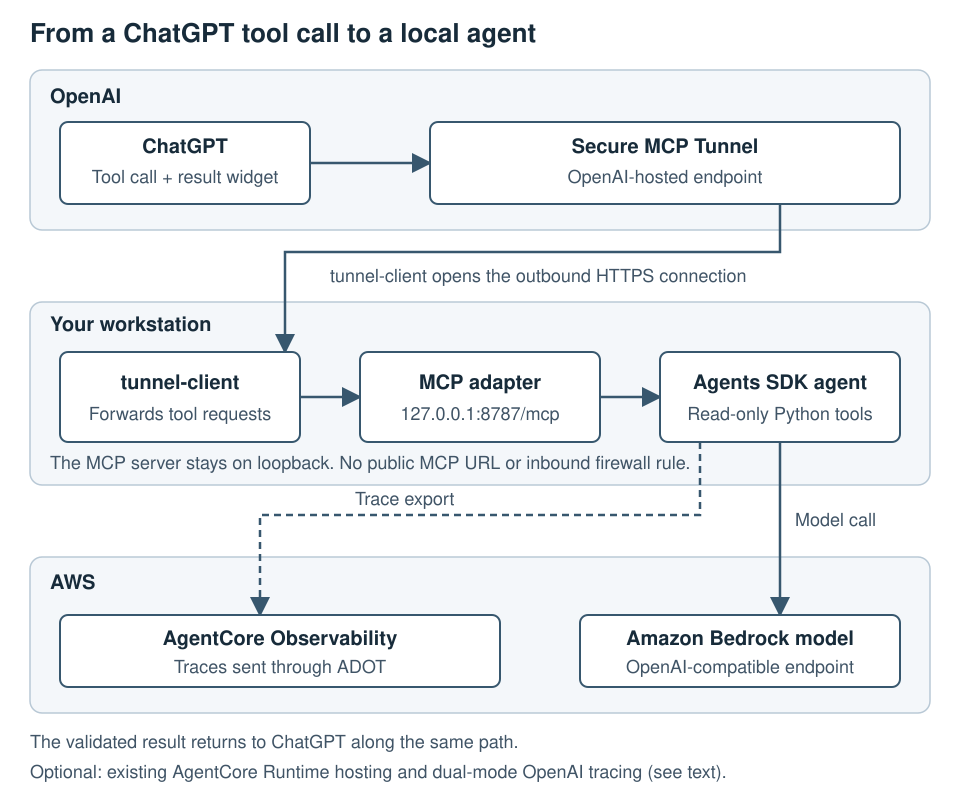

# Build a ChatGPT plugin with the OpenAI Agents SDK and Amazon Bedrock AgentCore

[OpenAI Cookbook](https://github.com/openai/openai-cookbook) · [Notebook](../notebooks/chatgpt_agents_sdk_aws_agentcore_cookbook.ipynb) · [Optional Runtime ARN](existing-agentcore-runtime.md)

This guide describes the repository's default private-MCP topology. ChatGPT
reaches a locally hosted MCP adapter through OpenAI Secure MCP Tunnel. The
adapter runs the checked-in Python agent locally, the agent uses an Amazon
Bedrock OpenAI-compatible model endpoint, and the same run exports internal
spans to Amazon Bedrock AgentCore Observability. OpenAI Traces is an explicit
dual-mode opt-in, not a default destination.

## What is implemented

- `runtime-agent/agent.py` defines the OpenAI Agents SDK workflow and its
  deterministic function tools.
- `runtime-agent/local_invoke.py` is the local process entrypoint and attaches
  the shared correlation ID.
- `mcp-adapter/providers/local-agent-invoker.ts` launches that entrypoint under
  AWS ADOT instrumentation for each MCP tool invocation.
- `mcp-adapter/server.ts` exposes three typed, read-only tools over Streamable
  HTTP at `/mcp`.
- `mcp-adapter/public/flight-widget.html` is a self-contained, versioned Apps
  SDK resource.
- `runtime-agent/promptfooconfig.cjs` checks sample Runtime-response fixtures
  locally with Promptfoo's echo provider.
- `runtime-agent/promptfooconfig.agent.cjs` runs the three canonical cases
  through the instrumented local Agents SDK workflow and scores each fresh
  output with deterministic contract and expected-behavior assertions.
- The optional AWS evaluation command reads explicitly tagged canonical cases
  from the same JSONL file, invokes one dedicated non-production evaluation
  Runtime supplied by its owner, and sends its CloudWatch session spans to
  AgentCore built-in evaluators.
- The optional `aws-agentcore-runtime-invoker.ts` path remains available only when
  `COOKBOOK_EXECUTION_MODE=deployed` is selected.

## Architecture boundaries



The diagram shows the default local path: ChatGPT sends typed MCP
requests through an OpenAI-hosted tunnel endpoint. A customer-hosted
`tunnel-client` initiates the outbound-only HTTPS connection and forwards those
requests to the private or loopback MCP adapter. No public MCP URL or inbound
firewall rule is required. The adapter validates requests and responses at the
execution seam, then one of these modes runs the checked-in OpenAI Agents SDK
workflow:

- **Default local mode:** the MCP adapter launches the Python agent on the
  developer workstation. It requires no AgentCore Runtime, CDK, deployment
  bucket, or Runtime-management permissions.
- **Optional deployed mode:** the adapter invokes one existing AgentCore
  Runtime ARN. The caller needs only scoped invoke access; the Runtime owner
  controls its deployment, model credentials, tracing, and operations.

Your team chooses where `tunnel-client` and the private MCP adapter run, and uses its
approved identity, secret-delivery, deployment, and retention patterns without
changing the cookbook's typed MCP or agent contracts. Deployment and artifact
storage apply only when a Runtime owner chooses to build or update a Runtime.

The default local flow is:

```text
ChatGPT
  -> OpenAI-hosted Secure MCP Tunnel endpoint
    -> customer-hosted tunnel-client
       (outbound HTTPS connection initiated by tunnel-client)
      -> private or loopback MCP adapter
        -> execution seam
          -> local OpenAI Agents SDK process
            -> Amazon Bedrock OpenAI-compatible model
            -> deterministic local function tool
            -> AWS ADOT exporter
               -> Amazon Bedrock AgentCore Observability / CloudWatch
            -> optional dual-mode OpenAI Traces exporter
```

The MCP adapter keeps correlation metadata outside user-visible
`structuredContent`. The widget renders the validated result and does not call
a backend directly.

The repository can trace activity beginning when its MCP tool is invoked. It
cannot access ChatGPT's private planning/model spans or unrelated tool calls.
Identity, tunnel-client placement, private MCP hosting, secret storage, and log
retention are production-owner decisions.

### Plug in existing enterprise services

Keep `RuntimeRequest` and `RuntimeResponse` as the execution-seam contract.
Replace the deterministic implementations behind `runtime-agent/tools.py`
with read-only calls to approved internal services, or select
`COOKBOOK_EXECUTION_MODE=deployed` to invoke one existing Runtime through
`aws-agentcore-runtime-invoker.ts`. In either case, preserve the strict
action-specific schemas, read-only tool annotations, response validation, and
secret isolation. The enterprise continues to own authentication, networking,
service availability, logging, and retention behind that seam.

## Install and configure

Follow the root [README](../README.md) for locked installation, notebook
launch, AWS CLI authentication, and the complete `.env` field list. The
essential local setting is:

```dotenv
COOKBOOK_EXECUTION_MODE=local
```

The local process needs the Bedrock endpoint/model key, an authenticated AWS
profile, and a CloudWatch log group. It does not need a Runtime ARN or an
OpenAI trace key in the default `COOKBOOK_TRACING_MODE=aws` mode. Explicit
`COOKBOOK_TRACING_MODE=dual` needs a separate OpenAI Platform trace key/project.

## Run locally

```bash
cd mcp-adapter
npm run build
AWS_PROFILE=agentcore-dev npm start
```

The endpoint is `http://127.0.0.1:8787/mcp`. Calling any of its tools launches
the local Python agent once and exports its AWS telemetry. Dual mode adds the
separate OpenAI trace exporter.

The server exposes exactly three idempotent, read-only tools:

| Tool | Purpose | Required input |
| --- | --- | --- |
| `search_flights` | Search sample flight options | origin, destination, travel date |
| `get_upcoming_status` | Inspect the sample upcoming trip | none |
| `get_live_status` | Inspect a flight or route | flight number or route hint; forward the search-result date when available |

All inputs and action-specific outputs are strict. Extra fields, malformed
airport codes, write-like actions, and incomplete responses are rejected.

Run the canonical two-step search-to-status smoke with the same execution path:

```bash
AWS_PROFILE=agentcore-dev npm run smoke:live
```

The command follows `COOKBOOK_EXECUTION_MODE`; in the default `local` mode both
invocations are local. The smoke uses the configured synthetic demo date,
forwards the first result to live status, and fails if the flight identity or
date changes.
Run the separate offline Promptfoo response-contract suite from
`runtime-agent/`; it uses the echo provider and does not create application
invocations or traces.

## Connect ChatGPT through Secure MCP Tunnel

Run the OpenAI `tunnel-client` with a profile that maps the associated tunnel
ID to `http://127.0.0.1:8787/mcp`. Confirm the profile with
`tunnel-client doctor`, start it with `tunnel-client run`, and wait for its
readiness endpoint. In ChatGPT, enable **Developer mode** under **Settings →
Security and login**, then open [ChatGPT Plugins](https://chatgpt.com/plugins)
and select the plus button. Enter a user-facing name and description. Under
**Connection**, choose **Tunnel** and select or paste that tunnel ID. Choose
**No authentication**: the tunnel runtime key authenticates `tunnel-client`,
not the ChatGPT plugin connection. Create the plugin connection and wait for
automatic tool discovery to list `search_flights`, `get_upcoming_status`, and
`get_live_status`. Add the plugin connection to a new conversation and invoke a
flight tool. After rebuilding tool or template metadata, refresh the plugin
connection.

The Platform principal used by `tunnel-client` needs Tunnels Read + Use
permission. ChatGPT Developer Mode is separate, and the tunnel must be
associated with the intended Platform organization and ChatGPT workspace. This
repository documents a ChatGPT host loop that remains a manual opt-in
validation step; support for other OpenAI product surfaces is a product
capability, not evidence produced by this cookbook.

This setup lets you test a private connection in ChatGPT Developer mode. Your
tunnel client and MCP server remain on infrastructure your team controls. To
make the plugin publicly available, your team must arrange a public endpoint,
assign operating and publishing owners, resolve licensing, and complete the
security/privacy, product, and any required listing reviews. The repository's
MIT License covers the code; a successful private test does not provide public
release approval.

## Optional deployed Runtime

Teams can explicitly switch the execution seam to an existing AgentCore
Runtime:

```dotenv
COOKBOOK_EXECUTION_MODE=deployed
AGENTCORE_RUNTIME_REGION=us-west-2
AGENTCORE_RUNTIME_AGENT_ARN=arn:aws:bedrock-agentcore:us-west-2:123456789012:runtime/example
```

That consumer path requires invoke permission; a separate Runtime owner retains
deployment ownership. It is documented in
[Use an existing AgentCore Runtime](existing-agentcore-runtime.md) and is not
required for the default local ChatGPT end-to-end workflow.

Every Runtime response includes an authoritative `executionMode` value:
`local` or `deployed`. The legacy `provider: "agentcore-runtime"` field is
deprecated and retained for compatibility only; it does not identify where the
workflow ran.

## Tracing and evaluation paths


Evaluation is a separate test and release workflow. It does not sit inline with
an end-user request. A dedicated test invocation emits traces while the agent
runs; the evaluation job scores the resulting output or completed spans
afterward.

### Primary pre-promotion agent-output evaluation

The solid lane is the recommended v1 path: Promptfoo runs representative cases
through the actual local OpenAI Agents SDK workflow, then applies
expected-behavior and contract assertions to the returned outputs before
promotion. Agents SDK tracing and OpenAI Traces are the observability surface
for those runs; they are not an inline evaluator.

The `eval:run` command remains the credential-free response-contract suite. It
uses Promptfoo's echo provider to check positive and negative checked-in
fixtures and does not invoke the agent. The separate guarded `eval:agent`
command selects the three runnable canonical cases, launches
`local_invoke.py` under the same AWS ADOT instrumentation as the MCP adapter,
and evaluates each fresh output against both the Runtime contract and its exact
canonical expected response. Correlation values are kept in Promptfoo metadata
rather than the scored Runtime response.

`npm run eval:agent:validate` checks this configuration without credentials or
an agent invocation.
`AWS_PROFILE=agentcore-dev RUN_PROMPTFOO_AGENT_EVALUATION=1 npm run eval:agent`
loads the root `.env`, runs one case at a time, disables Promptfoo sharing and
remote generation, and writes a private timestamped JSON report under the
ignored `runtime-agent/evals/results/` directory. Replace the profile name with
the approved one, or omit it only when the intended credential chain is already
active. The command can create model and telemetry usage and is not run in CI.

Use **Agents SDK tracing** or **OpenAI Traces** for telemetry, and **Promptfoo
agent-output regression evaluation** for the primary scoring workflow. This
cookbook does not call that workflow “Agents SDK Evaluations” or “OpenAI Evals.”

### Optional AWS-native AgentCore Evaluations

The dashed lane is an on-demand validation harness around a dedicated
non-production evaluation Runtime supplied by its owner. It creates test
invocations, waits for their CloudWatch session spans, and then calls Amazon
Bedrock AgentCore Evaluations with `ReferenceInputs`. It is not attached to
normal production traffic. Because the built-in evaluators reconstruct prompt,
response, and tool activity from those spans, the Runtime owner must have enabled
`OTEL_INSTRUMENTATION_GENAI_CAPTURE_MESSAGE_CONTENT=true` and approved the
resulting trace-content handling.

The AWS runner sends only explicitly tagged canonical cases to
`Builtin.Correctness`, `Builtin.GoalSuccessRate`, and
`Builtin.TrajectoryExactOrderMatch`. Both Promptfoo configurations and the AWS
runner read `runtime-agent/evals/fixtures/flight-status-results.jsonl`. The
actual-agent Promptfoo lane and the AWS runner select the same three tagged
canonical cases; malformed and synthetic response fixtures remain confined to
the credential-free echo suite.

This optional lane requires a dedicated assumed role, Runtime observability,
CloudWatch Transaction Search, and a configured evaluation Runtime log group.
It is manually guarded with both `RUN_AWS_EVALUATION=1` and
`AGENTCORE_EVALUATION_CONTENT_CAPTURE_CONFIRMED=1`, is never run in CI, and may
create Runtime and judge-model charges. See
[Optional AWS-native AgentCore Evaluations](aws-evaluation.md).

## What each check establishes

- The [source project CI](https://github.com/eliza-hq/chatgpt-agents-sdk-aws-agentcore-cookbook/blob/a259ad0/.github/workflows/ci.yml)
  runs credential-free Python, MCP adapter, and Promptfoo checks. Those checks
  make no live AWS, OpenAI, or tunnel calls. Run the same local checks using the
  [README commands](../README.md#optional-notebook-and-developer-checks).
- Python tests validate schemas, tools, tracing configuration, and the local
  entrypoint.
- TypeScript tests validate MCP contracts, local process invocation, optional
  Runtime invocation, and widget resources.
- With `COOKBOOK_EXECUTION_MODE=local`, a successful `smoke:live` validates the
  live Bedrock-backed local response path; it does not verify trace ingestion.
- A matching AWS span from the bounded read-only verifier validates AWS trace
  ingestion. In explicit dual mode, a named verifier must separately confirm
  the OpenAI trace; the `openai/session` value identifies an anonymized ChatGPT
  conversation, not an individual message submission. One conversation-level
  group can contain multiple tool-invocation traces, each with its own
  invocation UUID.
- A successful `eval:run` checks only the checked-in execution-mode, action,
  and output contract fixtures. It creates no application invocation, trace,
  or cloud evaluation resource.
- A successful guarded `eval:agent` run proves that the three canonical inputs
  reached the actual local Agents SDK workflow and that each fresh output
  passed the contract and exact expected-behavior assertions. Its correlation
  metadata helps locate the test runs, but the report alone does not prove
  either tracing backend accepted the spans.
- A successful `eval:aws:validate` proves only that the AWS-tagged canonical
  fixture metadata is internally valid. It uses no AWS credentials.
- A successful guarded `eval:aws` run proves that the configured role can
  invoke the exact Runtime, retrieve the resulting CloudWatch session spans,
  and receive results from `Builtin.Correctness`,
  `Builtin.GoalSuccessRate`, and
  `Builtin.TrajectoryExactOrderMatch` using case-specific ground truth.
  Results apply only to the tested Runtime, cases, time, and AWS environment.
  Redacted live evidence is written locally and is not committed.
