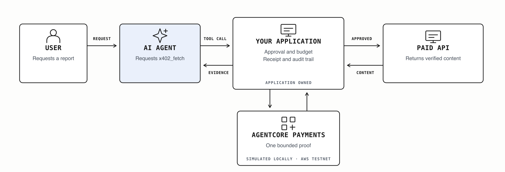
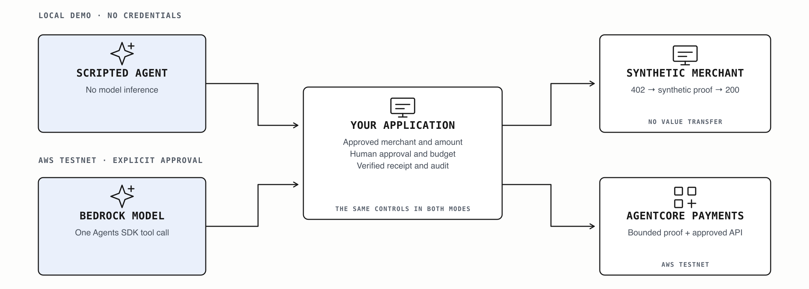
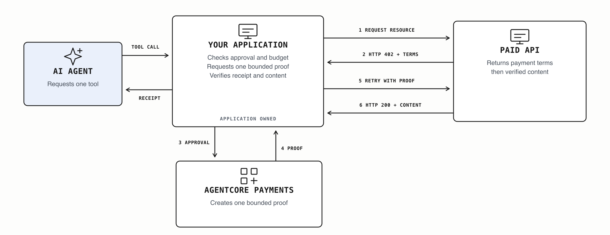

# Build an AI agent that can pay for APIs using AgentCore Payments

**Authors:** Deepak Jain and Sid Rampally

An agent researching a supplier may need a paid risk report, a sanctions
check, or current search results. The application must decide which services
the agent can use, how much it can spend, and when a person must approve a
purchase.

This example uses the OpenAI Agents SDK to request a supplier report through
an `x402_fetch` tool. Application code controls the merchant, business
purpose, spending limit, approval, receipt, and audit history. Amazon Bedrock
AgentCore Payments provides the bounded payment session for the connected AWS
testnet workflow. A local simulation demonstrates the same application
controls before AWS resources are configured.

The notebook also shows how to run the same application-controlled tool loop
directly through the Responses API without using the OpenAI Agents SDK for
orchestration. AgentCore Payments remains the payment provider for the
connected AWS workflow.

Amazon Bedrock AgentCore Payments is the payment infrastructure for this
example's connected testnet workflow. Its preview API shape was last checked
on August 10, 2026 with
`bedrock-agentcore==1.18.1`. Revalidate the API and supported Regions before a
live run. This example is not production payment guidance.

On August 10, 2026, revision `6871ce4` completed one separately approved,
bounded Base Sepolia testnet run. GPT-5.6 Sol completed the one-tool loop,
AgentCore Payments generated the proof used by the adapter, the allowlisted
merchant accepted one paid retry with HTTP `200`, the temporary session was
deleted, and the instrument balance decreased by exactly `0.002` test USDC.
The validated provider path used AgentCore Payments with a Coinbase CDP
testnet connector and embedded wallet. Coinbase credentials and wallet setup
remained outside the notebook and were not displayed or stored by the example.
This evidence does not independently verify on-chain settlement or finality.



## Architecture



The local simulation uses synthetic payment proof. The connected AWS workflow
runs from the notebook and calls Amazon Bedrock plus AgentCore Payments.
AgentCore Runtime is not used by this example; it remains a possible future
deployment option outside the current validation boundary.

## How x402 works

An x402 merchant first returns `402 Payment Required` with machine-readable
payment requirements. The application treats that challenge as a proposal,
validates it against approved policy, obtains one bounded payment proof, and
retries the request with a stable idempotency key.

The reviewed sandbox challenge also includes the official x402 `bazaar`
discovery extension. The adapter accepts only its expected `info` and `schema`
objects, rejects unknown or malformed extensions, and never forwards discovery
metadata as payment authority.

The live adapter binds the exact resource, recipient, timeout or expiry,
asset, network, and amount before constructing provider input. Each request
also resolves and pins a validated public merchant address while preserving
TLS hostname verification. The economic tool consumes a one-shot application
capability before network or payment side effects. Proxy-based merchant
networking is not supported because it would break this DNS-to-connection
binding. The live readiness check fails closed when `HTTP_PROXY`,
`HTTPS_PROXY`, or `ALL_PROXY` variants are set. Use only a security-approved
direct network environment; do not bypass a required corporate proxy.



## Control boundaries

| Layer | Owns | Does not own |
|---|---|---|
| Model and Agents SDK | Tool selection and typed proposal | Approval, budget, wallet access, or settlement truth |
| Application | Merchant and purpose policy, approval, challenge validation, idempotency, receipts, and audit | Signing credentials |
| AgentCore Payments | Payment-header generation inside a bounded session | Business authorization |
| Testnet wallet provider | Delegated testnet signing | Model reasoning or approval policy |

## Run the local notebook

```bash
cd /path/to/openai-cookbook
unset VIRTUAL_ENV
uv run \
  --project examples/partners/AWS/controlled_agentic_commerce_with_agentcore_payments \
  --group dev --with jupyter \
  jupyter lab --port=8899 \
  --ServerApp.root_dir="$PWD" \
  --ServerApp.default_url="/lab/tree/examples/partners/AWS/controlled_agentic_commerce_with_agentcore_payments/controlled_agentic_commerce.ipynb"
```

Stop any older Jupyter server before running this command. Start Jupyter from
the repository root as shown. The notebook diagrams live
under the repository-level `images/` directory, which a server started inside
the nested example directory cannot serve. A standalone notebook copied to
another directory also will not contain those image files.

Run all notebook cells in order. By default, the observable result is one synthetic
`402 -> proof -> 200` exchange, one typed agent proposal, an ordered audit
trail, a rejected fabricated proposal, and a skipped live section. No live
service call is enabled by default.

## Run the tests

From the repository root, change into the example directory first:

```bash
cd examples/partners/AWS/controlled_agentic_commerce_with_agentcore_payments
uv run --group dev pytest -q
uv run --group dev ruff check src tests
uv run --group dev ruff format --check src tests
```

The expected result is that all tests pass and Ruff reports no selected errors.

The negative suite covers missing or mismatched approval, disallowed
merchants, HTTP destinations, expired sessions and challenges, budget limits,
idempotency conflicts, malformed challenges, fabricated agent output, private
or changed DNS answers, unapproved recipients and timeouts, mainnet
configuration, unsanitized failures, and cleanup.

## End-to-end AgentCore testnet path

Keep every live gate disabled until the merchant, amount, network, asset,
wallet provider, payment instrument, and short-lived session are reviewed.
Never put provider credentials, wallet secrets, payment proofs, session IDs,
or account identifiers in the notebook or repository. The notebook reads
configuration only from its process environment and never displays configured
values.

The public notebook does not collect payment-provider or wallet credentials.
Complete the one-time credential-provider, connector, payment-manager,
instrument, testnet-funding, and signing-permission steps outside Jupyter by
using the current AgentCore console, CLI, or SDK. The executable notebook path
starts from those approved resources and covers their read-only verification,
the bounded session lifecycle, model inference, payment proof, merchant retry,
evidence checks, and cleanup.

The offline notebook path imports and runs on Windows. The optional live
session-administration path requires POSIX file locking and must be run from
macOS or Linux.

1. Configure a supported testnet wallet connector outside the notebook, then
   create and fund one dedicated Base Sepolia instrument for a synthetic user.
   Enable the provider's project-level delegated-signing setting and complete
   the separate per-wallet grant for the exact wallet linked to the instrument.
   Confirm the grant is active and has not expired; selecting or granting a
   different wallet is not sufficient.
2. Configure AWS profiles for the three responsibilities:
   `BEDROCK_AWS_PROFILE` invokes the model,
   `AGENTCORE_SESSION_AWS_PROFILE` creates and deletes bounded sessions, and
   `AGENTCORE_RUNTIME_AWS_PROFILE` processes payments. The model and session
   profiles may use the same approved developer identity for this local test,
   but the payment-execution profile must be separate.
3. Copy `.env.example` to an ignored local configuration source and supply the
   reviewed resource, merchant recipient, connector, instrument, user,
   manager, asset, challenge timeout, and idempotency values.
   Keep `PAYMENT_SESSION_ID` empty; the managed runner injects it privately.
   Install the live-only SDK with
   `uv sync --extra agentcore --group dev`.
4. Set only `ALLOW_AGENTCORE_READ_ONLY=1` and run
   `agentic-commerce-agentcore-infrastructure`. Confirm that the instrument is
   `ACTIVE`, its wallet network is `ETHEREUM`, and the balance query reports
   `BASE_SEPOLIA` and `USDC`. Then return this gate to `0`. These two read-only
   AWS calls do not report the balance amount and cannot create a session,
   generate a proof, contact a merchant, or transfer value.
5. Run the shipped deterministic insufficient-budget check:
   `uv run --group dev pytest -q tests/test_agentcore_payments.py -k insufficient_session_budget`.
   It must pass without AWS, merchant, wallet, or payment calls. This example
   does not ship a separate live below-price runner.
6. Enable all five transaction gates only for one reviewed run:
   `RUN_AGENTCORE_E2E`, `ALLOW_AGENTCORE_SESSION_ADMIN`,
   `ALLOW_PAID_INFERENCE`, `ALLOW_AGENTCORE_TESTNET`, and
   `APPROVE_AGENTCORE_TESTNET_PURCHASE`.
7. Run the managed notebook cell. It creates a 15-minute session capped at the
   approved request amount, runs one combined Agents SDK -> AgentCore Payments
   -> x402 merchant request, and deletes the session in `finally`.
8. Confirm `result=PASSED`, `model_run_completed=true`,
   `agentcore_payment_path_completed=true`,
   `merchant_paid_retry_completed=true`, `status_code=200`,
   `payment_attempts=1`, and `session_cleanup=DELETED`.
9. Disable the read-only gate and all five transaction gates.
10. Verify settlement separately before using settlement language. The
    sanitized application report intentionally returns
    `settlement_verified=false`.

### Optional live validation

The connected testnet path is intentionally disabled by default. A live run requires a fresh human approval, reviewed testnet configuration, all documented safety gates, and a bounded AgentCore payment session.

Use the gated workflow in the notebook to perform readiness checks before any live action. Do not enable the live path as part of the default Cookbook run.

The readiness check itself must not create a payment session, invoke the model, contact the merchant, generate payment proof, or transfer testnet value.

Before a live smoke test, configure
[AgentCore Payments log delivery](https://docs.aws.amazon.com/bedrock-agentcore/latest/devguide/payments-observability.html)
to a short-retention CloudWatch log group. If `ProcessPayment` fails, the CLI
report includes only a sanitized stage, category, AWS error code, and HTTP
status when available. It never prints provider messages, request IDs, payment
identifiers, wallet data, or proof headers. Use the corresponding CloudWatch
event for detailed diagnosis, and do not rerun until the failure is understood.
If the log delivery exists only for this validation, delete the delivery,
destination, source, and log group after the review.

If cleanup reports `FAILED`, do not rerun the purchase. Use the distinct
session-administration role to delete the recorded session first:

```bash
uv run --extra agentcore agentic-commerce-agentcore-session delete
```

The application reuses one stable idempotency token across payment retries.
AgentCore session limits provide a second enforcement layer; they do not
replace application authorization.

The live success report proves that the model completed the one-tool loop,
AgentCore completed the payment path used by the adapter, and the allowlisted
merchant returned a successful paid response. It does not independently prove
on-chain settlement; that requires separate AgentCore, merchant, or testnet
evidence.

The recorded August 10, 2026 validation returned `PASSED` for one bounded
`0.002` test-USDC attempt. Any future live run requires a fresh review, approval,
short-lived session, and testnet-only configuration.

AWS documents the [x402 payment flow](https://docs.aws.amazon.com/bedrock-agentcore/latest/devguide/payments-how-it-works.html)
and recommends [separate IAM roles for session administration and payment execution](https://docs.aws.amazon.com/bedrock-agentcore/latest/devguide/payments-iam-roles.html).
Also review the current AWS guidance for
[prerequisites](https://docs.aws.amazon.com/bedrock-agentcore/latest/devguide/payments-prerequisites.html),
[payment instruments](https://docs.aws.amazon.com/bedrock-agentcore/latest/devguide/payments-create-instrument.html),
and [bounded sessions](https://docs.aws.amazon.com/bedrock-agentcore/latest/devguide/payments-create-session.html).

## Source and credit

Nick's AWS [paid-research sample](https://github.com/awslabs/agentcore-samples/pull/1869)
provides a broader multi-agent live testnet reference. Its wallet-neutral setup
and bounded-session exercise informed this example. No source code was copied.
See `SOURCE_ATTRIBUTION.md` for the fixed revision and license.
