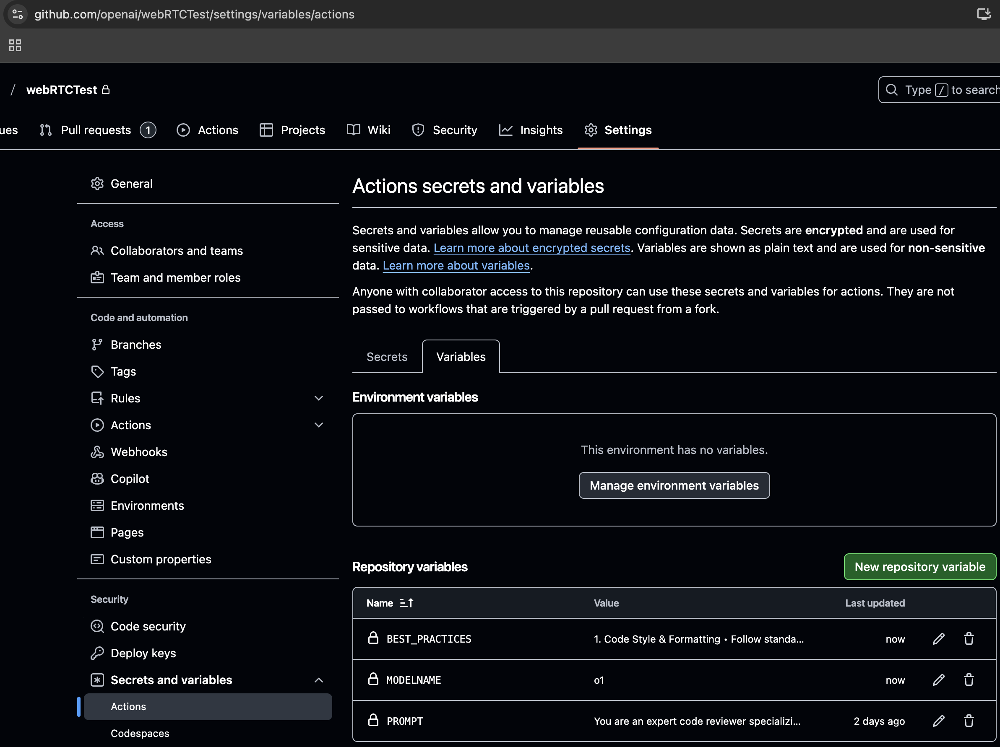
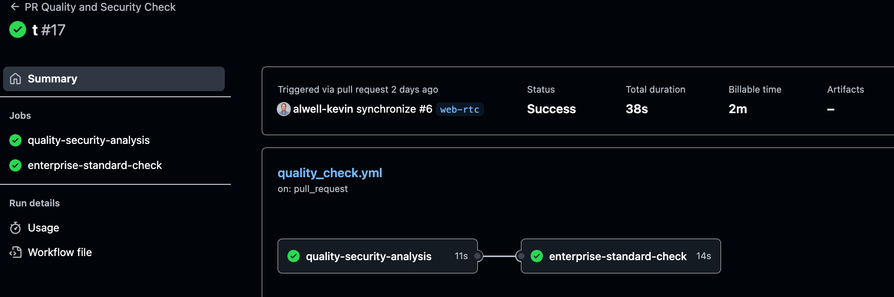
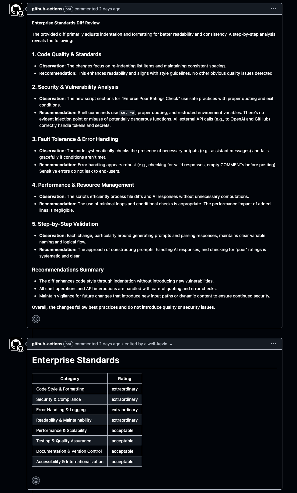

# Code Quality and Security Scan with GitHub Actions

## Introduction

This recipe describes how to integrate OpenAI reasoning models with your continuous integration (CI) pipelines to analyze and fortify the quality, security and compliance of code in Pull Requests (PR).

Before you begin, familiarize yourself with the following resources:
- [Introduction to GitHub Actions](https://docs.github.com/en/actions)
- [OpenAI Reasoning Modles](https://platform.openai.com/docs/guides/reasoning)

Although this is a concrete example of how OpenAI can be integrated to drive efficiency and quality gains, there are many other ways to integrate AI into your SDLC to accelerate software delivery and improve software quality.


## Value & Example Business Use Cases

### **Value**:

Rigorous code reviews, while critical, can often feel time-consuming and tedious for developers. Automating code quality and security scans helps developers focus on meaningful work by reducing manual effort and ensuring consistent feedback on their code. For organizations, this approach saves time and money by addressing issues early, avoiding costly rework, and enforcing best practices across the codebase. Overall, automated code quality and security scans with OpenAI reasoning models enhances productivity, improves code reliability, and fosters a culture of efficiency, benefiting both individual contributors and the broader business.

### **Example Use Cases**:

- A reviewer seeks feedback on the quality and security of a proposed code change.
- An organization encourages adherence to best practices and standards automatically during code review.

## **Prerequisites**

##### **Generate an OpenAI "Project Key" to authenticate your OpenAI API requests**

1. Navigate to platform.openai.com/api-keys.
2. Click to **[Create a new secret key](https://platform.openai.com/api-keys)**.
   1. You will only need "Completions" write permissions under "Model capabilities".
3. Copy and securely store the token.

##### **Choose your OpenAI model**

Consider leveraging the [OpenAI Reasoning Models](https://platform.openai.com/docs/guides/reasoning) to ensure the model is able to reason through the code and provide the most accurate feedback. Start with the most capable model, and then iterate on the prompt to improve the quality of the feedback. 


##### **Select a Pull Request**

Navigate to your GitHub repository, e.g., [example PR](https://github.com/alwell-kevin/OpenAI-Forum/pull/6).
   - Ensure GitHub Actions are enabled for the repository and that you are a Repo Owner, so you can configure [Actions Secrets and Repository Variables](https://docs.github.com/en/actions/writing-workflows/choosing-what-your-workflow-does/store-information-in-variables#creating-configuration-variables-for-a-repository).

##### **Define Enterprise Coding Standards**

If you want to enforce specific coding standards across your organization or repository, you will need to define those standards in plain text. For example:

```
	1.	Code Style & Formatting
	•	Follow standardized, consistent naming conventions (e.g., camelCase or PascalCase for functions and variables).
	•	Use clear and descriptive names for variables, functions, and classes.
	•	Adhere to industry-recognized style guidelines (e.g., PEP 8 for Python or standard ESLint rules for JavaScript).
	•	Maintain consistent indentation and spacing.
	•	Limit line lengths for improved readability (e.g., 80–120 characters).
	2.	Readability & Maintainability
	•	Write self-documenting code: prefer meaningful names, clear function boundaries, and logical structure over excessive comments.
	•	Use comments to clarify non-obvious parts of the logic. Avoid trivial comments.
	•	Organize code into cohesive modules or classes.
	•	Limit function or method sizes to facilitate unit testing, readability, and maintainability.
	3.	Security & Compliance
	•	Validate and sanitize all external inputs to prevent common vulnerabilities (e.g., SQL injection, XSS).
	•	Use secure libraries and frameworks whenever possible.
	•	Store secrets (API keys, credentials) securely and never hard-code them in source files.
	•	Adhere to relevant security standards (e.g., OWASP Top Ten).
	•	Implement proper error handling to avoid revealing sensitive information in logs or error messages.
	4.	Error Handling & Logging
	•	Use structured error handling; log meaningful error messages without exposing sensitive data.
	•	Provide enough context in logs to facilitate debugging and troubleshooting.
	•	Avoid silent catch-all exceptions.
	•	Include fallback or recovery mechanisms where feasible.
	5.	Performance & Scalability
	•	Write efficient code, considering time complexity and resource usage.
	•	Avoid premature optimization; focus first on clarity and correctness.
	•	Use caching, batching, or other techniques as needed for large or frequent operations.
	6.	Testing & Quality Assurance
	•	Include automated unit tests for each major function or module.
	•	Write clear, reproducible tests that reflect real-world usage scenarios.
	•	Use integration tests to verify end-to-end flows when applicable.
	•	Ensure code coverage thresholds (where applicable) are met or exceeded.
	7.	Documentation & Version Control
	•	Include or update relevant documentation (e.g., README, inline docstrings) so others can quickly understand and use the code.
	•	Commit changes regularly with clear commit messages.
	•	Follow your organization’s branching strategy (e.g., GitFlow) for merges and releases.
	8.	Accessibility & Internationalization (when relevant)
	•	Consider accessibility requirements (e.g., WAI-ARIA) for front-end code.
	•	Use frameworks and patterns that support localization/internationalization where necessary.

Instruction to LLM:
	•	Generate only code that adheres to the above conventions.
	•	Avoid shortcuts or hidden assumptions that reduce clarity, maintainability, or security.
	•	When in doubt, err on the side of clarity, safety, and correctness.
	•	When referencing third-party libraries, ensure they are well-established, actively maintained, and meet enterprise security and licensing requirements.
```

Store the standards in as a repository variable BEST_PRACTICES in your GitHub repository




#### Define your prompt that will be sent to OpenAI

We leverage [meta-prompt](https://platform.openai.com/docs/guides/reasoning/meta-prompting) best practices to request OpenAI analyzes the code for quality and security issues. 

```
You are an expert code reviewer specializing in security, quality, and adherence to best practices. Your goal is to methodically analyze the provided code to ensure it meets the highest standards. Approach the review in a structured, step-by-step manner:

1. **Code Quality & Standards**:
   - Validate that the code follows established coding standards, style guides, and naming conventions.
   - Check for consistent formatting, clear variable and function names, logical code organization, and adherence to language-specific best practices.

2. **Security & Vulnerability Analysis**:
   - Inspect each code block for common vulnerabilities, including but not limited to:
     - SQL injection
     - Cross-Site Scripting (XSS)
     - Command injection
     - Insecure cryptographic operations
   - Verify robust input validation, proper output encoding, principle of least privilege in permissions, and the safe handling of sensitive data.
   - Identify any libraries or functions known to be insecure, and recommend safer alternatives.

3. **Fault Tolerance & Error Handling**:
   - Confirm the code gracefully handles errors, exceptions, and unexpected inputs.
   - Check if proper try/catch blocks or equivalent mechanisms are in place.
   - Ensure that sensitive error details are not exposed to end users.

4. **Performance & Resource Management**:
   - Evaluate the code for potential performance bottlenecks, unnecessary computations, or inefficient resource usage.
   - Suggest improvements to enhance efficiency without compromising readability or security.

5. **Step-by-Step Validation**:
   - Examine the code incrementally, line by line or function by function.
   - Document each identified issue and provide explicit recommendations.
   - If code changes are suggested, present them in Markdown-formatted code blocks. Include straightforward comments and notes that make it easy for developers to understand and implement the improvements.

**Response Guidelines**:
- Be both comprehensive and succinct in your final summary.
- If recommendations are made, show sample improvements using Markdown code blocks. For example:

```java
// Before:
String userInput = request.getParameter('username');
String query = 'SELECT * FROM Users WHERE name = '' + userInput + ''';
// Potentially vulnerable to SQL injection

// After:
String userInput = request.getParameter("username");
PreparedStatement stmt = conn.prepareStatement("SELECT * FROM Users WHERE name = ?");
stmt.setString(1, userInput);
// Parameterized query prevents SQL injection
```

##### **Create your GitHub Actions Workflow**

The workflow created for you has two jobs, within each job are a number of steps to achieve a workflow that runs on every PR against your main branch, gathers the git diff data (ignoring .json and .png files), and sends it to OpenAI for analysis. OpenAI will return a response that is posted back to the PR as a comment. If there are suggested code fixes, the workflow will include those fixes in the comment. The workflow then evaluates the PR against your enterprise standards and posts the results back to the PR as a markdown table that describes levels of adherence to the standards. We've also allowed for a dynamic definition of the prompt, modelname, and best pracitices so you can easily update the workflow to use your own definitions.

```yaml
name: PR Quality and Security Check

on:
  pull_request:
    branches: [main]

permissions:
  contents: read
  pull-requests: write

jobs:
  quality-security-analysis:
    runs-on: ubuntu-latest
    steps:
      - name: Check out code
        uses: actions/checkout@v3
        with:
          fetch-depth: 0  # Ensure full history for proper diff

      - name: Gather Full Code From Changed Files
        run: |
          CHANGED_FILES=$(git diff --name-only origin/main...HEAD)
          echo '{"original files": [' > original_files_temp.json
          for file in $CHANGED_FILES; do
            if [[ $file == *.json ]] || [[ $file == *.png ]]; then
              continue
            fi
            if [ -f "$file" ]; then
              CONTENT=$(jq -Rs . < "$file")
              echo "{\"filename\": \"$file\", \"content\": $CONTENT}," >> original_files_temp.json
            fi
          done
          sed -i '$ s/,$//' original_files_temp.json
          echo "]}" >> original_files_temp.json

      - name: Display Processed Diff (Debug)
        run: cat original_files_temp.json

      - name: Get Diff
        run: |
          git diff origin/main...HEAD \
            | grep '^[+-]' \
            | grep -Ev '^(---|\+\+\+)' > code_changes_only.txt
          jq -Rs '{diff: .}' code_changes_only.txt > diff.json
          if [ -f original_files_temp.json ]; then
            jq -s '.[0] * .[1]' diff.json original_files_temp.json > combined.json
            mv combined.json diff.json

      - name: Display Processed Diff (Debug)
        run: cat diff.json

      - name: Analyze with OpenAI
        env:
          OPENAI_API_KEY: ${{ secrets.OPENAI_API_KEY }}
        run: |
          DIFF_CONTENT=$(jq -r '.diff' diff.json)
          ORIGINAL_FILES=$(jq -r '."original files"' diff.json)
          PROMPT="Please review the following code changes for any obvious quality or security issues. Provide a brief report in markdown format:\n\nDIFF:\n${DIFF_CONTENT}\n\nORIGINAL FILES:\n${ORIGINAL_FILES}"
          jq -n --arg prompt "$PROMPT" '{
            "model": "gpt-4",
            "messages": [
              { "role": "system", "content": "You are a code reviewer." },
              { "role": "user", "content": $prompt }
            ]
          }' > request.json
          curl -sS https://api.openai.com/v1/chat/completions \
            -H "Content-Type: application/json" \
            -H "Authorization: Bearer ${OPENAI_API_KEY}" \
            -d @request.json > response.json

      - name: Extract Review Message
        id: extract_message
        run: |
          ASSISTANT_MSG=$(jq -r '.choices[0].message.content' response.json)
          {
            echo "message<<EOF"
            echo "$ASSISTANT_MSG"
            echo "EOF"
          } >> $GITHUB_OUTPUT

      - name: Post Comment to PR
        env:
          COMMENT: ${{ steps.extract_message.outputs.message }}
          GH_TOKEN: ${{ github.token }}
        run: |
          gh api \
            repos/${{ github.repository }}/issues/${{ github.event.pull_request.number }}/comments \
            -f body="$COMMENT"
```

### Test the workflow

You are now ready to test out the workflow. You commit this workflow to your repository and then create a new PR. You should see the workflow run and post a comment to the PR with the results of the code review.

Public examples of this workflow can be found in the [OpenAI-Forum](https://github.com/alwell-kevin/OpenAI-Forum/blob/main/.github/workflows/pr_quality_and_security_check.yml) repository.






*Are there integrations or cookbooks you’d like us to prioritize? Are there errors in our examples? File a PR or issue in our repository, and we’ll take a look.*
