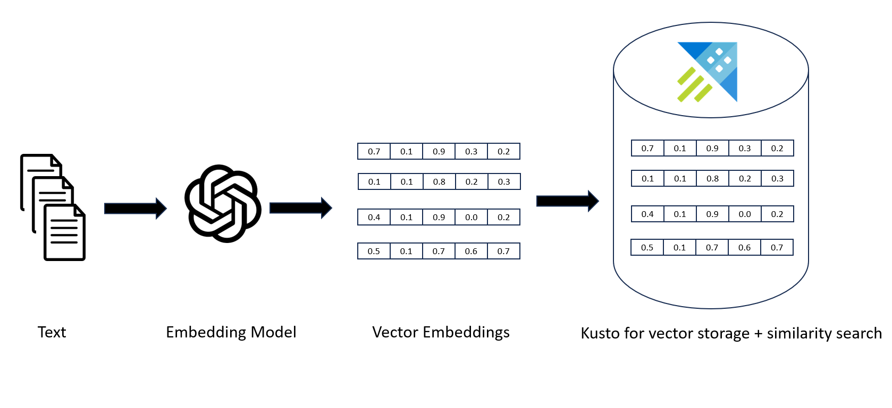
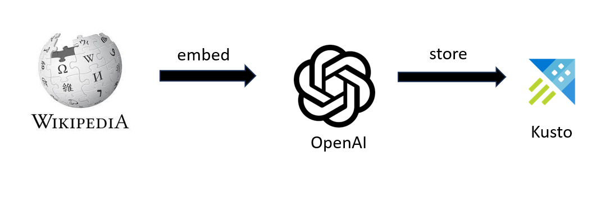
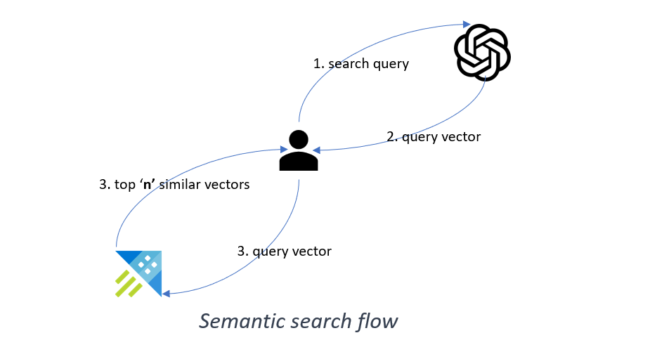

# Kusto as a Vector database

[Azure Data Explorer aka Kusto](https://azure.microsoft.com/en-us/products/data-explorer) is a cloud-based data analytics service that enables users to perform advanced analytics on large datasets in real-time. It is particularly well-suited for handling large volumes of data, making it an excellent choice for storing and searching vectors.

Kusto supports a special data type called dynamic, which can store unstructured data such as arrays and properties bag. [Dynamic data type](https://learn.microsoft.com/en-us/azure/data-explorer/kusto/query/scalar-data-types/dynamic) is perfect for storing vector values. You can further augment the vector value by storing metadata related to the original object as separate columns in your table.  
Kusto also supports in-built function [series_cosine_similarity_fl](https://learn.microsoft.com/en-us/azure/data-explorer/kusto/functions-library/series-cosine-similarity-fl) to perform vector similarity searches.

[Get started](https://aka.ms/kustofree) with Kusto for free. 

## Getting started with Kusto and Open AI embedding

### Demo Scenario

If you’d like to try this demo, please follow the instructions in the [Notebook](Getting_started_with_kusto_and_openai_embeddings.ipynb).

It will allow you to -  

1. Use precomputed embeddings created by OpenAI API. 

2. Store the embeddings in Kusto. 

3. Convert raw text query to an embedding with OpenAI API. 

4. Use Kusto to perform cosine similarity search in the stored embeddings.