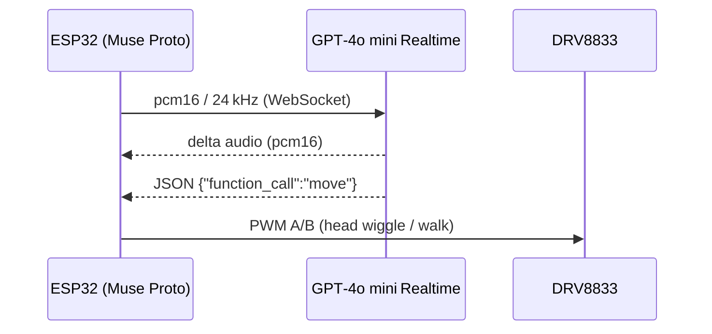

<!-- ─────────────────────────────  links  ──────────────────────────── -->
<p align="center">
  <a href="https://github.com/RASPIAUDIO/OpenDino"><strong>GitHub Open Dino</strong></a> •
  <a href="http://raspiaudio.com/"><strong>Site web RaspiAudio</strong></a> •
  <a href="http://instagram.com/raspiaudio"><strong>Instagram @raspiaudio</strong></a> •
  <a href="https://cookbook.openai.com/examples/voice_solutions/opendino_realtime_ai_toy_on_esp32"><strong>OpenAI Cookbook</strong></a>
</p>

# 🦖 Open Dino: An Open, Real‑Time AI Educational Toy on ESP32

<p align="center">
  <a href="https://www.youtube.com/watch?v=aPcab4P5pzs">
    
  </a>
</p>

---
## Overview

Open Dino is a fully open‑source, microcontroller‑powered voice assistant that runs **GPT‑4o mini Realtime** entirely over **raw WebSockets**—no WebRTC, desktop bridge, or companion server required. A single **ESP32‑WROVER** handles:

- Secure authentication and streaming JSON messages to OpenAI.
- Full‑duplex 24 kHz PCM16 audio (≈ 400 ms push‑to‑talk latency on 10 Mbps Wi‑Fi).
- JSON‑Schema function calls to control toy motors (e.g. `move(speed, duration)`).
- **Captive‑portal configuration** that stores Wi‑Fi credentials, API key, and child‑specific prompt in NVS.

The reference hardware is RaspiAudio’s **Muse Proto** dev‑board, but **buying it is totally optional**. Any ESP32‑WROVER plus an I²S microphone and I²S amplifier works. Muse Proto simply merges those breakouts onto one PCB so you have fewer wires and an integrated charger.

---


OpenDino talks straight to the OpenAI Realtime API from the ESP32 over TLS WebSockets, whereas **other approach routes the audio through an intermediate edge‑server** [ElatoAI example](https://cookbook.openai.com/examples/voice_solutions/running_realtime_api_speech_on_esp32_arduino_edge_runtime_elatoai), running on a PC, Raspberry Pi, or cloud VM. No solution is categorically "better"—direct‑to‑cloud is simpler, while an edge server unlocks heavier codecs, retries, and multi‑user analytics. Pick whatever matches your project’s constraints.

---

## Table of Contents

1. [Motivation](#motivation)
2. [Key Features](#key-features)
3. [System Architecture](#system-architecture)
   - 3.1 [Hardware Platform](#hardware-platform)
   - 3.2 [Realtime Inference Backend](#realtime-inference-backend)
4. [Bill of Materials](#bill-of-materials)
5. [Quick‑Start Guide](#quick-start-guide)
6. [Roadmap](#roadmap)
7. [Contributing](#contributing)
8. [License](#license)

---

## Motivation

Commercial “smart toys” often lock users into proprietary ecosystems, collect opaque telemetry, and demand subscriptions. Open Dino takes the opposite approach:

- **Data ownership** – Voice data goes only to the API endpoint you configure.
- **Cost control** – No mandatory cloud fees; just supply your own API key.
- **Hackability** – All firmware, hardware, and documentation are permissively licensed.

The project also proves that modern LLM capabilities fit on **sub‑\$5**, 520 kB‑RAM microcontrollers when unnecessary protocol overhead is stripped away.

---

## Key Features

| Feature                        | Details                                                            |
| ------------------------------ | ------------------------------------------------------------------ |
| Bare‑metal WebSocket stack     | No local or cloud relay servers.                                   |
| Full‑duplex 24 kHz PCM16 audio | Bidirectional streaming handled by dual‑core task split.           |
| Push‑to‑talk latency ≈ 400 ms  | Measured on 10 Mb s⁻¹ 802.11n Wi‑Fi.                               |
| JSON‑Schema function calls     | `move(speed, duration)` controls two DC motors via an H‑bridge.    |
| **Captive web portal**         | Save Wi‑Fi, API key, and per‑child prompt to NVS (survives reset). |


---

## System Architecture



### Hardware Platform

## Bill of Materials

### Choose one of the two core‑board options

| Qty    | Part                                | Includes                                          | Link                                                                                     |
| ------ | ----------------------------------- | ------------------------------------------------- | ---------------------------------------------------------------------------------------- |
| 1      | **Option A: RaspiAudio Muse Proto** | ESP32‑WROVER, I²S mic, I²S amp, battery charger   | [https://raspiaudio.com/product/muse-proto/](https://raspiaudio.com/product/muse-proto/) |
| – or – |                                     |                                                   |                                                                                          |
| 1      | **Option B: discrete parts**        | ESP32‑WROVER module + INMP441 mic + MAX98357A amp | any retailer                                                                             |

### Always required (both options)

| Qty | Part                  | Purpose                 |
| --- | --------------------- | ----------------------- |
| 1   | DRV8833 dual H‑bridge | Drives plush‑toy motors |
| 1   | 18650 Li‑ion + holder | Portable power          |
| 1   | Motorised plush toy   | Enclosure & actuators   |


Default pinout used by Muse Proto (all pins re‑mappable in `config.h`):

| Function     | GPIO | Notes                                   |
| ------------ | ---- | --------------------------------------- |
| I²S BCLK     | 5    |                                         |
| I²S LRCK     | 25   |                                         |
| I²S DOUT     | 26   | Speaker DAC (MAX98357A)                 |
| I²S DIN      | 35   | MEMS mic (INMP441)                      |
| I²S MCLK     | 0    | Optional if codec derives its own clock |
| PTT button   | 19   | Active‑LOW push‑to‑talk                 |
| Amp enable   | 21   | HIGH disables amp during deep‑sleep     |
| NeoPixel LED | 22   | Status feedback                         |
| Motor A IN1  | 32   | PWM A                                   |
| Motor A IN2  | 15   | LOW at boot (strap pin)                 |

### Schematic with option A

<p align="center">
  
</p>


### Realtime Inference Backend

- **Transport:** TLS WebSockets
- **Audio:** 16‑bit PCM, 24 kHz, 20 ms frames
- **Round‑trip latency:** 620 ± 35 ms (N = 100)

---


## Quick‑Start Guide (Arduino IDE ≥ 2.3, ESP32 core v3.1.0)

```bash
# Clone the repo
git clone https://github.com/RASPIAUDIO/OpenDino.git
cd OpenDino/firmware
```

1. Install **ESP32 Arduino core v3.1.0** via *Boards Manager*.
2. Open `OpenDino.ino`.
3. **Flash once with dummy credentials**. After boot the device hosts a **captive Wi‑Fi portal** (`OpenDino‑Setup`) where you enter real Wi‑Fi, an API key, and a prompt. These persist in NVS.

<p align="center">

</p>


4. **Tools ▸ Partition Scheme** → **Huge App (3 MB No OTA)**; enable **PSRAM**.
5. Compile, flash, and open Serial Monitor @ 921 600 baud.
6. Hold **GPIO 19** to talk; release and Dino replies *and* moves.
7. Need the portal again? Hold **GPIO 19** while pressing RESET.

---

## Roadmap

| Version | Milestone                                    | Status      |
| ------- | -------------------------------------------- | ----------- |
| v0.1    | GPT‑4o mini realtime demo                    | ✅ Completed |
| v0.2    | Captive Wi‑Fi/API/prompt portal saved to NVS | ✅ Completed |
| v0.3    | Evaluate Opus encoding                       | ⏳ Planned   |
| v0.4    | Temporary API key rotation                   | ⏳ Planned   |
| v0.5    | Non‑proprietary echo cancellation            | ⏳ Planned   |
| v0.6    | Full‑duplex (no PTT)                         | ⏳ Planned   |
| v0.7    | OTA firmware updates                         | ⏳ Planned   |

---

## Contributing

PRs are welcome! Open an issue first for large changes to avoid overlap.

---

## License

- **Firmware & docs:** MIT
