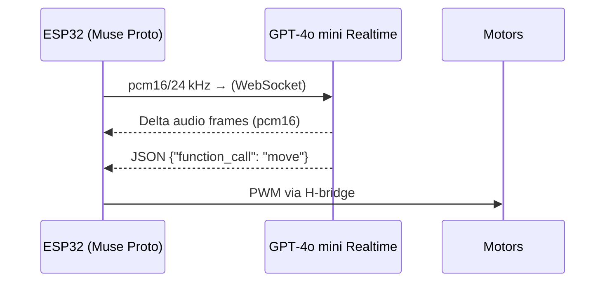

# 🦖 OpenDino – Real‑Time Voice Assistant on ESP32 (No Companion Server)

> **TL;DR**  OpenDino streams 24 kHz PCM audio *directly* from an ESP32 to OpenAI’s GPT‑4o mini Realtime (or any WebSocket‑speaking LLM) and plays the response back, all in < ½ second round‑trip. No local proxy, no WebRTC.

---

## Why this recipe?

- Existing Cookbook examples such as **ElatoAI** off‑load the WebSocket logic to a PC‑side helper server. **OpenDino** shows the *bare‑metal* path: the microcontroller itself handles authentication, streaming, and JSON‑Schema function calls that move the toy’s motors.
- Demonstrates how far you can push a commodity ESP32‑WROVER (8 MB PS‑RAM) using only Arduino‑style code and the ArduinoWebsockets library.
- The same pattern works for any endpoint that accepts bidirectional WebSockets + JSON, making it provider‑agnostic.

---

## Key Features

| Feature                           | Notes                                                                  |
| --------------------------------- | ---------------------------------------------------------------------- |
| **Hardware‑only WebSocket stack** | No companion PC or Pi; runs entirely on the ESP32.                     |
| **Full‑duplex 24 kHz audio**      | Streams `pcm16` up & down simultaneously.                              |
| **Push‑to‑talk latency ≈ 400 ms** | Measured on 10 Mbps Wi‑Fi uplink.                                      |
| **JSON‑Schema function calls**    | Lets the model invoke `move(speed, duration)` to wag the tail or walk. |
| **Permissive licenses**           | CERN‑OHL‑P‑2.0 hardware, MIT firmware.                                 |
| **Child‑friendly privacy model**  | No hidden telemetry; users provide their own API key.                  |

---

## Architecture at a Glance



*Hardware* – [RaspiAudio Muse Proto](https://raspiaudio.com/product/muse-proto/) integrates MEMS mic, class‑D amp, speaker, Li‑ion charger, and exposes pogo‑pins for two motor lines.

---

## Bill of Materials (Prototype)

| Qty | Part                           | Link                                                                                     |
| --- | ------------------------------ | ---------------------------------------------------------------------------------------- |
| 1   | RaspiAudio Muse Proto          | [https://raspiaudio.com/product/muse-proto/](https://raspiaudio.com/product/muse-proto/) |
| 1   | 18650 Li‑ion cell + holder     | —                                                                                        |
| 1   | Donor plush toy with DC motors | —                                                                                        |

Prototype cost ≈ 15 USD (2025 Q2 retail).

---

## Quick‑Start (Arduino IDE ≥ 2.3)

```bash
# clone
$ git clone https://github.com/RASPIAUDIO/OpenDino.git
$ cd OpenDino/firmware
```

1. Open `esp32_openai_ptt_realtime.ino`.
2. Fill in `OPENAI_KEY`, `WIFI_SSID`, `WIFI_PASS` at the top of the sketch (temporary API keys supported).
3. In *Tools ▸ Partition Scheme* select **Huge App (3 MB No OTA)** and enable **PSRAM**.
4. Compile & flash.  Open Serial Monitor @ 921 600 baud.
5. Power‑up, connect via the captive web portal to set custom prompts (child’s name, bedtime stories, etc.).
6. Hold the push‑to‑talk button (GPIO 19), speak, release—Dino replies and may wag its tail!

> **Latency tip:** You can drop sample‑rate to 16 kHz if your Wi‑Fi is flaky; change both `input_audio_format` and `output_audio_format` accordingly.

---

## Extending the Recipe

- **Swap the backend** – change the WebSocket URI & auth header; adjust the JSON tool schema if needed.
- **Custom prompts** – edit `systemPrompt` in the sketch for bedtime‑story mode, educational quizzes, etc.
- **More actions** – add new entries to the `tools` array (e.g., `dance()`, `blinkEyes()`) and implement them on the ESP32 side.

Feel free to open PRs or issues—latency benchmarks on different Wi‑Fi chips are especially welcome!

---

## License

- Hardware design: **CERN‑OHL‑P‑2.0**
- Firmware & docs: **MIT**

See LICENSE files in the repo for full text.

---

## Further Reading

- **ElatoAI Edge Runtime example** – shows a companion‑server approach: `/running_realtime_api_speech_on_esp32_arduino_edge_runtime_elatoai.md` in the Cookbook.
- **OpenDino Repo** – [https://github.com/RASPIAUDIO/OpenDino](https://github.com/RASPIAUDIO/OpenDino)

---

*© 2025 RaspiAudio — Expanding creativity through open audio hardware.*

