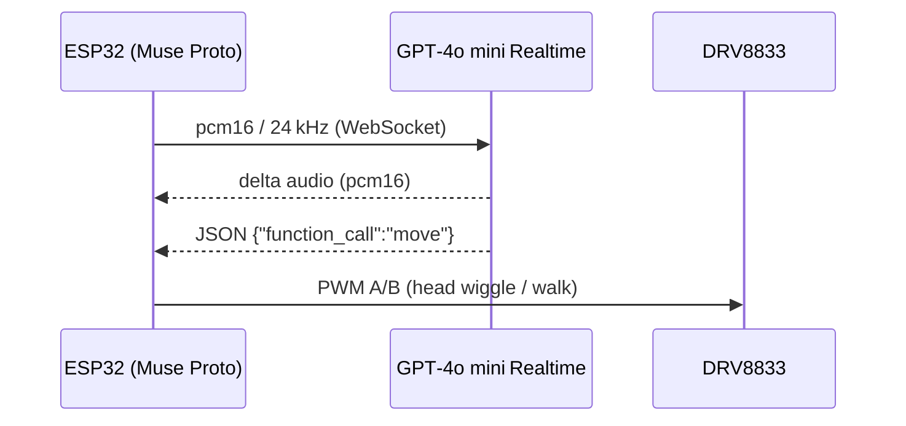

# 🦖 OpenDino — Real-Time Voice Assistant on ESP32 *(no companion server)*

> **TL;DR** — OpenDino lets a single **ESP32-WROVER** board chat with **GPT-4o mini Realtime** in ≈ 0.5 s round‑trip.  
> Audio flows over **raw WebSockets**—no WebRTC, no Raspberry Pi, no PC.

[](https://www.youtube.com/watch?v=aPcab4P5pzs)

---

## Why this recipe?

- **Bare‑metal WebSockets** — Existing Cookbook examples such as [**ElatoAI**](https://cookbook.openai.com/examples/voice_solutions/running_realtime_api_speech_on_esp32_arduino_edge_runtime_elatoai) rely on a desktop bridge. OpenDino proves that the ESP32 alone can handle authentication, streaming, and JSON‑Schema function calls.
- **WebSockets ≠ WebRTC** — WebSockets keep the transport stack tiny (no SDP, ICE, or DTLS) but leave buffering and Base64 chunking to you. OpenDino splits the workload across the ESP32’s two cores:  
  - **Core 0** — circular buffer + WebSocket dialogue with OpenAI.  
  - **Core 1** — I²S capture/playback + Base64 encode/decode.
- **Practical hardware choice** — The reference build uses the all‑in‑one **RaspiAudio Muse Proto** (audio codec, amp, mic, speaker, charger, pogo‑pins) for convenience. You can, however, port the firmware to any ESP32‑WROVER dev‑kit plus an I²S microphone and I²S amplifier; only pin definitions change.

---

## Key features

| Feature                        | Notes                                                                                                      |
| ------------------------------ | ---------------------------------------------------------------------------------------------------------- |
| Hardware‑only WebSocket stack  | No local server needed; everything runs on the ESP32.                                                      |
| Full‑duplex 24 kHz PCM16 audio | Streams up & down concurrently.                                                                            |
| Push‑to‑talk latency ≈ 400 ms  | Measured on 10 Mbps 802.11n Wi‑Fi.                                                                         |
| JSON‑Schema function calls     | `move(speed, duration)` → one motor *wiggles the head*; the other *walks the toy forward* via an H‑bridge. |
| Captive web portal             | Configure Wi‑Fi, (temporary) API key, and per‑child prompt (name, favourite stories).                      |
| Dual‑core workload split       | Core 0: WebSocket + circular buffer • Core 1: audio I/O + Base64 codec.                                    |
| Permissive licences            | MIT firmware & docs.                                                                                       |

---

## Architecture at a glance



---

## Bill of materials (prototype)

| Qty | Part                                | Purpose                           | Link                                                                                        |
| --- | ----------------------------------- | --------------------------------- | ------------------------------------------------------------------------------------------- |
| 1   | **RaspiAudio Muse Proto** dev‑board | ESP32‑WROVER, audio I/O, charger  | <https://raspiaudio.com/product/muse-proto/>                                                |
| 1   | **DRV8833** dual H‑bridge module    | Drives two DC motors (head, legs) | any maker/retailer                                                                          |
| 1   | 18650 Li‑ion cell + holder          | Portable power                    | —                                                                                           |
| 1   | Plush toy with two DC motors        | Enclosure + actuators             | —                                                                                           |

Approximate cost (mid‑2025 retail): **≤ 50 USD**

---

## Schematic wiring (reference build)

| Signal     | ESP32 pin | Destination  | Notes                                    |
| ---------- | --------- | ------------ | ---------------------------------------- |
| PTT button | GPIO 19   | Push button  | Active‑LOW push‑to‑talk                  |
| Motor IN1  | GPIO 32   | DRV8833 AIN1 | Head wiggle / walk forward (PWM)         |
| Motor IN2  | GPIO 15   | DRV8833 AIN2 | Reverse direction (keep LOW during boot) |
| 3 V7 rail  | VBAT      | DRV8833 VM   | Motors share Li‑ion rail                 |
| GND        | GND       | All modules  | Common ground                            |

---

## Quick‑start (Arduino IDE ≥ 2.3, ESP32 core **v3.1.0**)

```bash
# Clone the repo
git clone https://github.com/RASPIAUDIO/OpenDino.git
cd OpenDino/firmware
```

1. Install **ESP32 Arduino core v3.1.0** via **Boards Manager**.  
2. Open `OpenDino.ino`.  
3. Enter your `OPENAI_KEY`, `WIFI_SSID`, and `WIFI_PASS` (temporary API tokens supported).  
4. **Tools ▸ Partition Scheme** → **Huge App (3 MB No OTA)**. Enable **PSRAM**.  
5. Compile & flash; open Serial Monitor @ 921 600 baud.  
6. On first boot, connect to the **captive portal** to pick a prompt template (child’s name, bedtime stories…).  
7. Hold the **push‑to‑talk** button (GPIO 19), speak, release—Dino answers *and* physically reacts.

> **Tip:** If your Wi‑Fi bandwidth is limited, set both `input_audio_format` and `output_audio_format` to **16 kHz** to save ≈ 33 %.

---

## Licence

**Firmware & documentation** — MIT  
See `LICENSE` files in the repo for details.

---

## Further reading

- **OpenDino repository** — <https://github.com/RASPIAUDIO/OpenDino>  
- **RaspiAudio Muse Proto** — <https://raspiaudio.com/product/muse-proto/>

---
