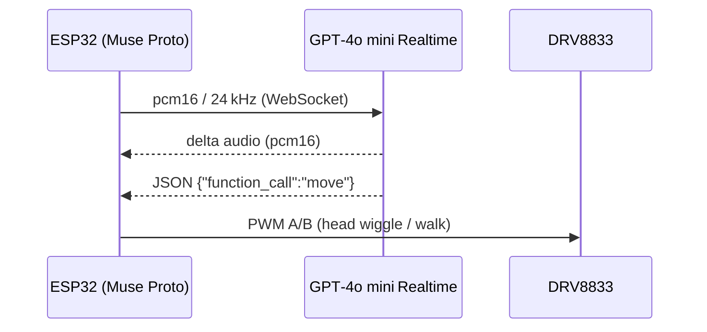

<!-- ─────────────────────────────  links  ──────────────────────────── -->
<p align="center">
  <a href="https://github.com/RASPIAUDIO/OpenDino"><strong>GitHub Open Dino</strong></a> •
  <a href="http://raspiaudio.com/"><strong>Site web RaspiAudio</strong></a> •
  <a href="http://instagram.com/raspiaudio"><strong>Instagram @raspiaudio</strong></a> •
  <a href="https://cookbook.openai.com/examples/voice_solutions/opendino_realtime_ai_toy_on_esp32"><strong>OpenAI Cookbook</strong></a>
</p>

# 🦖 Open Dino: An Open, Real‑Time AI Educational Toy on ESP32

<p align="center">
  <a href="https://www.youtube.com/watch?v=aPcab4P5pzs">
    
  </a>
</p>


---

## Overview

Open Dino is a fully open‑source, microcontroller‑powered voice assistant that runs **GPT‑4o mini Realtime** entirely over **raw WebSockets**—no WebRTC, desktop bridge, or companion server required. A single **ESP32‑WROVER** handles:

- Secure authentication and streaming JSON messages to OpenAI.
- Full‑duplex 24 kHz PCM16 audio (≈ 400 ms push‑to‑talk latency on 10 Mbps Wi‑Fi).
- JSON‑Schema function calls to control toy motors (e.g. `move(speed, duration)`).

The reference hardware is RaspiAudio’s **Muse Proto** dev‑board, but any ESP32‑WROVER + I²S mic/amp combo works—the only changes are pin definitions.

---

## OpenDino vs. ElatoAI

[OpenDino](https://github.com/RASPIAUDIO/OpenDino) is an open‑source project that connects low‑cost **ESP32** microcontrollers directly to OpenAI's Realtime API via secure **WebSockets**. It streams microphone audio to **GPT‑4o mini** (or any compatible model) and plays back the model's audio responses, enabling bidirectional conversation **without** a local server.

Unlike the [ElatoAI example](https://cookbook.openai.com/examples/voice_solutions/running_realtime_api_speech_on_esp32_arduino_edge_runtime_elatoai), which relies on a companion server running on your PC to handle WebRTC signalling and audio piping, OpenDino performs the entire WebSocket communication stack — authentication, Base64 chunking, streaming, and JSON‑Schema function calls — directly on the ESP32 board.

---

## Table of Contents
1. [Motivation](#motivation)
2. [Key Features](#key-features)
3. [System Architecture](#system-architecture)
   * 3.1 [Hardware Platform](#hardware-platform)
   * 3.2 [Realtime Inference Backend](#realtime-inference-backend)
4. [Bill of Materials](#bill-of-materials)
5. [Quick‑Start Guide](#quick-start-guide)
6. [Roadmap](#roadmap)
7. [Contributing](#contributing)
8. [License](#license)
9. [Citation](#citation)

---

## Motivation

Commercial “smart toys” often lock users into proprietary ecosystems, collect opaque telemetry, and demand subscriptions. Open Dino takes the opposite approach:

* **Data ownership** – Voice data goes only to the API endpoint you configure.
* **Cost control** – No mandatory cloud fees; just supply your own API key.
* **Hackability** – All firmware, hardware, and documentation are permissively licensed.

The project also proves that modern LLM capabilities fit on **sub-\$5**, 520 kB‑RAM microcontrollers when unnecessary protocol overhead is stripped away.

---

## Key Features

| Feature | Details |
|---------|---------|
| Bare‑metal WebSocket stack | No local or cloud relay servers. |
| Full‑duplex 24 kHz PCM16 audio | Up‑ and downstream streamed concurrently. |
| Push‑to‑talk latency ≈ 400 ms | Measured on 10 Mbps 802.11n Wi‑Fi. |
| JSON‑Schema function calls | `move(speed, duration)` controls two DC motors via an H‑bridge. |
| Captive web portal | Configure Wi‑Fi, API key, and per‑child prompt. |
| Dual‑core workload split | Core 0: WebSocket + buffer • Core 1: I²S audio + Base64 codec. |
| Permissive licences | MIT firmware, CERN‑OHL‑P hardware. |

---

## System Architecture



### Hardware Platform

The reference design uses the **RaspiAudio Muse Proto**: ESP32‑WROVER, PS‑RAM, on‑board MEMS mic, speaker, DAC/amp, and battery management.

| Signal     | GPIO | Destination | Notes                                    |
|------------|------|-------------|------------------------------------------|
| PTT button | 19   | Push button | Active‑LOW, push‑to‑talk                 |
| Motor IN1  | 32   | DRV8833 AIN1| Head wiggle / walk forward (PWM)         |
| Motor IN2  | 15   | DRV8833 AIN2| Keep LOW during boot                     |
| 3 V7 rail  | VBAT | DRV8833 VM  | Motors share Li‑ion rail                 |
| GND        | —    | All modules | Common ground                            |

### Schematic

<p align="center">
  
</p>

### Realtime Inference Backend

* Transport: TLS WebSockets
* Audio: 16‑bit PCM, 24 kHz, 20 ms frames
* Latency: 620 ± 35 ms round‑trip (N = 100)

Switching providers needs only a new WebSocket URI, auth header, and (optionally) a revised tool schema.

---

## Bill of Materials

| Qty | Part | Purpose | Link |
|-----|------|---------|------|
| 1 | RaspiAudio Muse Proto | ESP32‑WROVER, audio I/O, charger | <https://raspiaudio.com/product/muse-proto/> |
| 1 | DRV8833 dual H‑bridge | Drives head & leg motors | any retailer |
| 1 | 18650 Li‑ion + holder | Portable power | — |
| 1 | Motorised plush toy | Enclosure & actuators | — |

**Estimated cost (mid‑2025): ≤ 50 USD**

---

## Quick‑Start Guide (Arduino IDE ≥ 2.3, ESP32 core v3.1.0)

```bash
# Clone the repo
git clone https://github.com/RASPIAUDIO/OpenDino.git
cd OpenDino/firmware
```

1. Install **ESP32 Arduino core v3.1.0** via *Boards Manager*.
2. Open `OpenDino.ino`.
3. Enter your `OPENAI_KEY`, `WIFI_SSID`, and `WIFI_PASS` (temporary keys supported).
4. **Tools ▸ Partition Scheme** → **Huge App (3 MB No OTA)**; enable **PSRAM**.
5. Compile, flash, and open the Serial Monitor @ 921 600 baud.
6. On first boot, connect to the **captive portal** to set a child‑specific prompt.
7. Hold **GPIO 19** (PTT), speak, release—Dino answers *and* physically reacts.

---

## Roadmap

| Version | Milestone | Status |
|---------|-----------|--------|
| v0.1 | GPT‑4o mini realtime demo | ✅ Completed |
| v0.2 | Captive wifi portal for settings | ⏳ Planned |
| v0.3 | Try Opus implementation | ⏳ Planned |
| v0.4 | Temporary APIs keys | ⏳ Planned |
| v0.5 | Non proprietary Echo cancellation| ⏳ Planned |
| v0.6 | full duplex mode| ⏳ Planned |
| v0.7 | Extension to other LLM | ⏳ Planned |
| v0.8 | OTA firmware updates | ⏳ Planned |

---

## License

* **Firmware & docs**: MIT License


---
