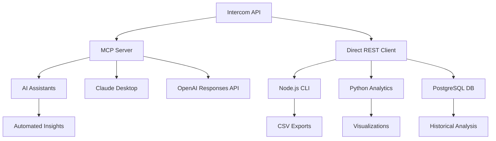

# 🚀 Intercom Analytics & Export Toolkit - Complete Guide

A comprehensive toolkit for exporting and analyzing Intercom conversation data, providing insights into customer support performance, response times, conversation volumes, and topic trends. This guide covers both **MCP (Model Context Protocol)** integration and **direct REST API** approaches.

## 📋 Table of Contents

1. [Overview](#overview)
2. [Architecture](#architecture)
3. [MCP Server (AI Integration)](#mcp-server-ai-integration)
4. [Direct REST API (CLI & Python)](#direct-rest-api-cli--python)
5. [Analytics & Visualization](#analytics--visualization)
6. [Installation & Setup](#installation--setup)
7. [Configuration](#configuration)
8. [Usage Examples](#usage-examples)
9. [Troubleshooting](#troubleshooting)
10. [Migration Guide](#migration-guide)

---

## 🎯 Overview

This toolkit provides **two complementary approaches** for working with Intercom data:

### **🔌 MCP Server (AI Integration)**
- **Purpose**: Direct AI assistant integration via Model Context Protocol
- **Best for**: AI-powered analysis, automated insights, conversational queries
- **Tools**: `export_intercom_conversations`, `get_intercom_conversation_stats`, `search_intercom_conversations`

### **🌐 Direct REST API (CLI & Python)**
- **Purpose**: Traditional command-line and programmatic access
- **Best for**: Batch processing, custom analytics, data pipeline integration
- **Tools**: `fast-export-intercom.js`, Python analytics scripts, database integration

---

## 🏗️ Architecture



---

## 🔌 MCP Server (AI Integration)

### **✨ Features**

- **🔥 High-Performance Export**: Fast, concurrent export of Intercom conversations
- **📊 Conversation Analytics**: Get insights and statistics without full data export
- **🔍 Advanced Search**: Search conversations by keywords, date ranges, and states
- **🔐 Secure Configuration**: Environment-based API token management
- **⚡ MCP Protocol**: Standard Model Context Protocol for seamless AI integration
- **🛡️ Robust Error Handling**: Automatic retries and rate limit management

### **🛠️ Available MCP Tools**

#### 1. `export_intercom_conversations`
Export Intercom conversations from a date range to CSV or JSON format.

**Parameters:**
- `from_date` (required): Start date in YYYY-MM-DD format
- `to_date` (optional): End date in YYYY-MM-DD format (defaults to today)
- `team_assignee_id` (optional): Team inbox ID (e.g. 2334166 = Primeros 90 días). Use for cycle-time focus.
- `output_format` (optional): "csv" or "json" (default: "csv")
- `limit` (optional): Maximum number of conversations to export
- `include_message_content` (optional): Include full message content (default: true)

**Example Usage:**
```json
{
  "from_date": "2025-06-01",
  "to_date": "2025-06-30",
  "output_format": "csv",
  "limit": 100,
  "include_message_content": true
}
```

#### 2. `get_intercom_conversation_stats`
Get statistics about conversations in a date range without full export.

**Parameters:**
- `from_date` (required): Start date in YYYY-MM-DD format
- `to_date` (optional): End date in YYYY-MM-DD format (defaults to today)
- `team_assignee_id` (optional): Team inbox ID (e.g. 2334166 = Primeros 90 días)

#### 3. `search_intercom_conversations`
Search for specific conversations based on criteria.

**Parameters:**
- `query` (optional): Search query or keywords
- `from_date` (optional): Start date in YYYY-MM-DD format
- `to_date` (optional): End date in YYYY-MM-DD format
- `state` (optional): Conversation state - "open", "closed", or "snoozed"
- `team_assignee_id` (optional): Team inbox ID (e.g. 2334166 = Primeros 90 días)
- `limit` (optional): Maximum number of results (default: 50, max: 150)

#### 4. `analyze_onboarding_first_invoice`
Analyze onboarding conversations (Primeros 90 días) for first-time-to-value (first invoice) questions, filtered by user type.

**Parameters:**
- `cache_path` (required): Path to Intercom cache JSON (with contact_email). E.g. `plugins/colppy-revops/skills/intercom-developer-api-research/cache/conversations_2026-02-01_2026-02-28_team2334166.json`
- `user_type` (optional): `accountant` (es_contador=true), `smb` (es_contador=false, business owners), or `all`. Default: `accountant`

**Prerequisites:** Run `export_cache_for_local_scan.mjs --team 2334166` first to create the cache.

**User type source:** Intercom user/contact level is synced with HubSpot contact level. The export fetches `es_contador` and `rol_wizard` from Intercom contact `custom_attributes` (no HubSpot API call). If the cache lacks these fields, the analysis falls back to HubSpot. Ensure your HubSpot–Intercom sync pushes `es_contador` to Intercom custom attributes for consistency.

#### 5. `scan_full_text` — Result limits

**`scan_full_text` returns all matches** — no cap. The cost is in fetching conversations; once fetched, all matches are returned. The `limit` parameter is deprecated and no longer used.

### **🔧 MCP Integration Examples**

#### Claude Desktop Configuration
```json
{
  "mcpServers": {
    "intercom": {
      "command": "node",
      "args": ["/path/to/mcp-intercom-server.js"],
      "env": {
        "INTERCOM_ACCESS_TOKEN": "your_token_here"
      }
    }
  }
}
```

#### OpenAI Responses API
```bash
curl https://api.openai.com/v1/responses \
  -H "Content-Type: application/json" \
  -H "Authorization: Bearer $OPENAI_API_KEY" \
  -d '{
    "model": "gpt-4.1",
    "tools": [
      {
        "type": "mcp",
        "server_label": "intercom",
        "server_url": "stdio://path/to/mcp-intercom-server.js",
        "require_approval": "never"
      }
    ],
    "input": "Export all conversations from June 2025 and analyze customer sentiment"
  }'
```

---

## 🌐 Direct REST API (CLI & Python)

### **✨ Features**

- **Fast, concurrent export** of all conversations in a date range
- **Detailed CSV output** with all key fields for analytics
- **Robust retry and error handling** for API rate limits and failures
- **Easy configuration** via `.env` file
- **Compatible with downstream analytics scripts** (Python, Jupyter, etc.)
- **Team Performance Analysis**: Measure admin and team performance with response times and CSAT scores
- **Colppy-Specific Analysis**: 
  - Identifies the most mentioned Colppy modules and features
  - Categorizes different types of customer issues
  - Extracts common phrases and questions from customer conversations
  - Performs topic modeling to identify main conversation themes
  - Analyzes sentiment indicators in customer messages

### **🛠️ Available CLI Tools**

#### 1. Fast Export Script (`fast-export-intercom.js`)

**Usage:**
```bash
node tools/scripts/intercom/fast-export-intercom.js --from YYYY-MM-DD --to YYYY-MM-DD --output intercom_reports/latest_export/conversations-YYYYMMDD.csv
```

**Options:**
- `--from <date>`: Start date (YYYY-MM-DD, required)
- `--to <date>`: End date (YYYY-MM-DD, defaults to today)
- `--output <filename>`: Output CSV file (default: intercom-conversations-abril.csv)
- `--batch-size <number>`: Batch size for API requests (default: 50)
- `--max-concurrent <number>`: Max concurrent requests (default: auto, based on CPU)
- `--chunk-size <number>`: Number of conversations to process before writing to disk (default: 500)

**Example:**
```bash
node tools/scripts/intercom/fast-export-intercom.js --from 2025-05-13 --to 2025-05-14 --output intercom_reports/latest_export/conversations-150.csv --batch-size 50 --chunk-size 150
```

#### 2. Python Analytics Scripts

**Convenience Shell Script:**
```bash
# Analyze last month's conversations
./analyze_intercom.sh last-month

# Analyze the last 7 days of conversations
./analyze_intercom.sh last-week --export-zip

# Analyze a specific date range
./analyze_intercom.sh date-range 2023-01-01 2023-01-31 --output-dir january_report
```

**Python Runner Script:**
```bash
# Analyze last month's conversations
python run_intercom_analysis.py --last-month

# Analyze the last 30 days
python run_intercom_analysis.py --days 30 --export-zip

# Analyze a specific date range
python run_intercom_analysis.py --date-range 2023-01-01 2023-01-31 --output-dir january_analysis
```

**Colppy-Specific Analysis:**
```bash
# Use run_intercom_analysis.py for date-range analysis
python tools/scripts/intercom/run_intercom_analysis.py --days 30 --export-zip

# Use intercom_analytics.py for comprehensive analytics
python tools/scripts/intercom/intercom_analytics.py

# Use intercom_conversation_taxonomy.py for conversation taxonomy analysis
python tools/scripts/intercom/intercom_conversation_taxonomy.py
```
> **Note:** `analyze_colppy_may_conversations.py` was removed. Use the scripts above for conversation analysis.

---

## 📊 Analytics & Visualization

### **Output Formats**

#### MCP Server Output
```json
{
  "success": true,
  "date_range": { "from": "2025-06-01", "to": "2025-06-30" },
  "total_conversations": 150,
  "total_messages": 450,
  "output_format": "csv",
  "include_message_content": true,
  "conversations_summary": [
    {
      "id": "12345",
      "created_at": 1717200000,
      "state": "closed",
      "message_count": 3
    }
  ],
  "data": "conversation_id,created_at,message_body...\n12345,2025-06-01T10:00:00Z,Hello..."
}
```

#### CLI Export Output
CSV file with columns:
- Conversation ID
- Created At
- Updated At
- Message ID
- Message Body
- Part Type
- Author Type
- Author ID
- Author Name
- Owner Name
- User ID
- Company ID
- State
- Read

#### Python Analytics Output
- **CSV files**: Raw data and metrics for further analysis
- **PNG files**: Visualizations of key metrics and trends
- **ZIP archive** (optional): All results bundled for easy sharing
- **Colppy Analysis**: Module-specific insights, topic modeling, sentiment analysis

---

## Tags vs Attributes (Intercom guidance)

For **user feedback and product input** (bugs, improvements), Intercom recommends:

- **Conversation data attributes** (not only tags): Predefined values (e.g. type: bug / feature request, priority: high / medium / low). Better for reporting, routing, and consistency. Can be collected from customers and used in Workflows and Inbox Views.
- **Tags**: Flexible, good for marking specific messages or ad-hoc needs (e.g. "Beta candidate"). Can be inconsistent across teammates (e.g. "billing query" vs "billing issue").
- **Topics**: Keyword-based, automated; good for trend reporting.

Use a **combination** of topics, attributes, and tags. Prefer **attributes** for structured feedback to product (e.g. "Feedback type" = Bug | Sugerencia de mejora | Otro).

**Tag sampling**: Use `intercom_tags_report.py --output-samples` (with a date range) to write tag -> sample conversation IDs JSON; then validate with MCP `get_conversation` that the tag matches the conversation content before defining an attribute taxonomy.

**Conversation taxonomy (content labelling)**: Use `intercom_conversation_taxonomy.py` to fetch conversations by ID, extract message content, and label with a taxonomy. Two methods: **semantic** (default) = ML zero-shot classification (Hugging Face; requires `pip install transformers torch`); **keyword** = deterministic keyword + tag mapping (no extra deps). Use `--labelling-method semantic` or `--labelling-method keyword`. Input: `--from-samples path/to/intercom_tag_samples_*.json`, `--from-ids-file path/to/intercom_conversation_ids_*.json` (from tags report `--output-ids`), or `--ids id1,id2,...`. Output: summary table, optional CSV/JSON. For the **full 2-day dataset**: run tags report with `--output-ids`, then taxonomy with `--from-ids-file` on that JSON to study taxonomy by reading all conversations in the range.

---

## Follow-up and Resolución tags (Colppy)

These tags are used for **follow-up workflows** and **resolution status**. Inferred from tag names and co-occurrence in the tags report (no internal workflow docs in repo).

| Tag | Likely meaning | Notes |
|-----|----------------|-------|
| **Workflow-D5** | Conversations in "Day 5" of a follow-up workflow | Highest volume in report; often appears with W5-P1-No-resuelto on the same conversation |
| **¿Resolviste tu pregunta?** | "Did you resolve your question?" | Likely an automated or manual follow-up prompt sent to the user |
| **W5-P0-No-resuelto** | Workflow 5, Priority 0, not resolved | Same workflow family as Workflow-D5; P0 = priority level |
| **W5-P1-No-resuelto** | Workflow 5, Priority 1, not resolved | Same conversation IDs as Workflow-D5 in sampled data — status tag on the same conv |
| **W5-P3-No-resuelto** | Workflow 5, Priority 3, not resolved | Same pattern |
| **W5-Ya-resuelto** | Workflow 5, already resolved | Resolution outcome |

**What’s inside (content):** Conversations with these tags are support threads that entered a **day-5 follow-up** (Workflow-D5). They are then tagged with resolution status (No-resuelto / Ya-resuelto) and priority (P0, P1, P3). The tag "¿Resolviste tu pregunta?" suggests a **closure check** (e.g. a message asking the customer if their issue was resolved). To inspect actual message content, open the conversation in Intercom or use MCP `get_conversation` with IDs from `intercom_tag_samples_*.json`.

---

## 🚀 Installation & Setup

### **Prerequisites**

- **Node.js 18+**: Required for MCP server and CLI tools
- **Python 3.8+**: Required for analytics scripts (optional)
- **Intercom API Access**: Valid Intercom access token with conversations:read permissions
- **PostgreSQL**: Required for database-based analysis (optional)

### **1. Clone and Install Dependencies**

```bash
# Clone the repository
git clone https://github.com/jonetto1978/openai-cookbook.git
cd openai-cookbook/tools/scripts/intercom

# Install MCP server dependencies
npm install --save @modelcontextprotocol/sdk axios dotenv

# Install CLI dependencies
npm install

# Make the server executable
chmod +x mcp-intercom-server.js
```

### **2. Python Environment (Optional)**

```bash
# Create and activate virtual environment
python -m venv .venv
source .venv/bin/activate  # On Windows: .venv\Scripts\activate

# Install Python dependencies
pip install -r requirements.txt
```

### **3. Database Setup (Optional)**

```bash
# Create the database schema
python create_db_schema.py

# Import conversation data
python import_conversations_to_db.py recent-conversations.csv
```

---

## ⚙️ Configuration

### **Environment Variables**

Create a `.env` file in the **project root directory** (not in tools/ or scripts/):

```env
INTERCOM_ACCESS_TOKEN=your_intercom_access_token_here
```

**Important:** The `.env` file must be at the root level of the codebase (`/Users/virulana/openai-cookbook/.env`) for all scripts and MCP servers to find it correctly.

### **Getting Your Intercom Access Token**

1. Go to your Intercom workspace settings
2. Navigate to "Developers" → "Developer Hub"
3. Create a new app or use an existing one
4. Generate an access token with `conversations:read` permissions

### **Performance Tuning**

#### MCP Server
- **Concurrent Processing**: Up to 10 concurrent API requests for MCP stability
- **Rate Limit Handling**: Automatic backoff and retry logic
- **Memory Management**: Batched processing to handle large datasets

#### CLI Tools
- **Concurrency**: Automatically tuned for your machine, but can be overridden
- **Batch Size**: Default 50, adjustable based on API limits
- **Chunk Size**: Default 500 conversations before writing to disk

---

## 💡 Usage Examples

### **MCP Server Examples**

#### Export Conversations via AI Assistant
```json
{
  "tool": "export_intercom_conversations",
  "arguments": {
    "from_date": "2025-06-01",
    "to_date": "2025-06-30",
    "output_format": "csv",
    "limit": 100
  }
}
```

#### Get Statistics
```json
{
  "tool": "get_intercom_conversation_stats",
  "arguments": {
    "from_date": "2025-06-01",
    "to_date": "2025-06-30"
  }
}
```

#### Search Conversations
```json
{
  "tool": "search_intercom_conversations",
  "arguments": {
    "query": "billing issue",
    "from_date": "2025-06-01",
    "state": "open",
    "limit": 25
  }
}
```

### **CLI Examples**

#### Basic Export
```bash
node tools/scripts/intercom/fast-export-intercom.js --from 2025-06-01 --to 2025-06-30
```

#### High-Performance Export
```bash
node tools/scripts/intercom/fast-export-intercom.js \
  --from 2025-06-01 \
  --to 2025-06-30 \
  --batch-size 100 \
  --max-concurrent 20 \
  --chunk-size 1000
```

#### Python Analytics
```python
from intercom_analytics import IntercomAnalytics

# Initialize the analytics object
analytics = IntercomAnalytics(INTERCOM_ACCESS_TOKEN, output_dir='my_analysis')

# Run a full analysis for a date range
results = analytics.run_full_analysis(
    start_date='2023-01-01', 
    end_date='2023-01-31',
    limit=1000
)

# Export results to a zip file
analytics.export_results_to_zip()
```

---

## 🐛 Troubleshooting

### **Common Issues**

#### 1. "INTERCOM_ACCESS_TOKEN not found"
- Ensure `.env` file exists in the project root directory
- Verify the token variable name is exactly `INTERCOM_ACCESS_TOKEN`
- Check that the token has proper permissions

#### 2. "Rate limit exceeded"
- MCP server automatically handles rate limits with exponential backoff
- CLI tools include robust retry logic for API rate limits (HTTP 429)
- For high-volume exports, consider using smaller date ranges

#### 3. "No conversations found"
- Verify the date range contains actual conversations
- Check that your Intercom account has data in the specified period
- Ensure your API token has access to the conversations

#### 4. MCP Connection Issues
- Verify Node.js version is 18+
- Check that all dependencies are installed correctly
- Test the server with direct JSON-RPC calls first

#### 5. Python Analytics Issues
- **API Rate Limiting**: The toolkit includes automatic rate limit handling
- **Missing Data**: Visualization methods handle missing data gracefully
- **Database Errors**: Check PostgreSQL connection and permissions
- **CSV File Detection**: Ensure there are Intercom conversation exports in the current directory
- **Date Filtering**: Check the date format (YYYY-MM-DD) and that dates are within the data range

### **Debug Mode**

#### MCP Server
```bash
DEBUG=1 node mcp-intercom-server.js
```

#### CLI Tools
```bash
# Test the MCP server locally
echo '{"jsonrpc": "2.0", "id": 1, "method": "tools/list"}' | node mcp-intercom-server.js
```

---

## 🔄 Migration Guide

### **From CLI to MCP**

#### Before (CLI):
```bash
node tools/scripts/intercom/fast-export-intercom.js --from 2025-06-01 --to 2025-06-30 --output conversations.csv
```

#### After (MCP):
```json
{
  "tool": "export_intercom_conversations",
  "arguments": {
    "from_date": "2025-06-01",
    "to_date": "2025-06-30",
    "output_format": "csv"
  }
}
```

### **Legacy Scripts**
- The old Python-based exporters have been removed
- Use the Node.js script for all new exports
- Analytics and visualization scripts remain available in Python for downstream analysis

---

## 📦 Publishing & Deployment

### **MCP Server Publishing**

#### Option 1: NPM Package
```bash
# Prepare for publishing
npm version patch
npm publish

# Install globally
npm install -g intercom-mcp-server
```

#### Option 2: Docker Container
```dockerfile
FROM node:18-alpine
COPY mcp-intercom-server.js /app/
COPY package-mcp.json /app/package.json
WORKDIR /app
RUN npm install
ENTRYPOINT ["node", "mcp-intercom-server.js"]
```

---

## 🤝 Contributing

1. Fork the repository
2. Create a feature branch: `git checkout -b feature/amazing-feature`
3. Commit changes: `git commit -m 'Add amazing feature'`
4. Push to branch: `git push origin feature/amazing-feature`
5. Open a Pull Request

---

## 📄 License

This project is licensed under the MIT License - see the [LICENSE](LICENSE) file for details.

---

## 🆘 Support

- **Documentation**: Check this README and inline code comments
- **Issues**: Report bugs or request features on GitHub Issues
- **Colppy Team**: Contact the analytics team for internal support

---

**Made with ❤️ by the Colppy Analytics Team for smarter customer insights**

